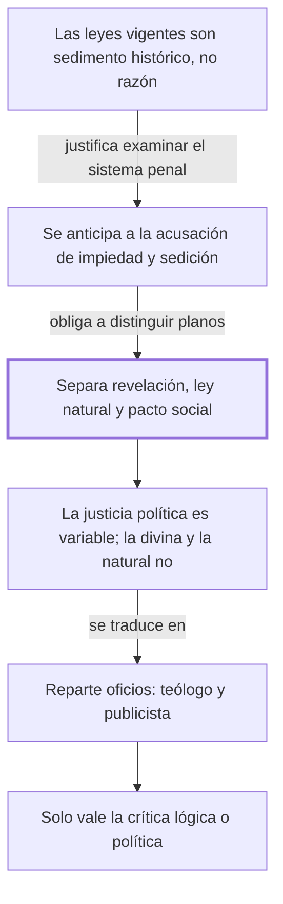

# Al lector

## 1. Idea principal

Se puede criticar el sistema penal examinándolo solo como acuerdo humano, sin negar la religión ni la ley natural; quien confunde esos tres planos no puede razonar sobre asuntos públicos.

Contesta una pregunta previa a todo el libro: ¿con qué derecho un particular se pone a juzgar las leyes penales de su tiempo? Acá Beccaria define el terreno en el que va a discutir durante 47 capítulos.

## 2. Lo esencial del capítulo

Lo primero es fijar el blanco. Lo que en gran parte de Europa se obedece como ley no es ley sino una acumulación desordenada: restos del derecho romano recopilados por orden de un emperador de Constantinopla doce siglos antes, mezclados con costumbres lombardas y sepultados bajo comentarios de intérpretes privados (cap. Al lector). El cargo es concreto: lo que se aplica es la opinión de un autor. Nombra tres de esos intérpretes; están en el original y conviene leerlos como lista, porque el efecto del pasaje depende de eso. Es como si el reglamento de un edificio fuera, en la práctica, lo que un vecino opinó hace cuarenta años y los demás repitieron sin leer el reglamento.

Beccaria escribe bajo censura, así que se adelanta a la acusación que sabe que va a recibir —que atacar las leyes penales es atacar la religión y el poder legítimo— y elogia al gobierno "suave e iluminado" bajo el que vive. Ese elogio no es adorno: es lo que le permite publicar. Y reencuadra: el fin de la obra, si se logra, aumentaría la autoridad legítima en vez de disminuirla.

Viene entonces la distinción más importante de la obra: los principios que rigen a los hombres vienen de tres orígenes —la revelación, la ley natural y los pactos que la sociedad establece— y ocuparse del tercero no excluye a los dos primeros. De ahí derivan tres clases de vicio y virtud, religiosa, natural y política, que no deben contradecirse pero no imponen las mismas obligaciones. El libro habla solo del tercer plano. Y para que no se le atribuya lo que no dice, enumera tres errores que rechaza; el más interesante aclara que su "estado de guerra" previo a la sociedad no es el de Hobbes —sin ninguna razón ni obligación anterior— sino un hecho nacido de la corrupción humana y de la falta de un acuerdo expreso.

La razón de esa separación es precisa: la justicia divina y la natural son constantes porque relacionan siempre los mismos dos objetos; la política es una relación entre una acción y el estado cambiante de la sociedad, así que varía según esa acción se vuelva necesaria o útil. La distancia entre dos ciudades no cambia, pero cuánto tarda el viaje depende del camino que haya ese año. Si esos principios se confunden, "no hay esperanza de raciocinar con fundamento en las materias públicas". De ahí un reparto de oficios: al teólogo le toca la malicia o bondad intrínseca del acto, al publicista el daño o el provecho para la sociedad. El cierre fija las reglas del debate: que no lo concluyan incrédulo o sedicioso, sino que lo convenzan "de mal lógico o de imprudente político".

## 3. Mapa

## 4. Qué releer del original

1. (cap. Al lector) "Tres son los manantiales" — es la bisagra de todo el libro: sin esta distinción, nada de lo que sigue se entiende como movimiento deliberado.
2. (cap. Al lector) "Sería, pues, un error atribuir" — son los tres errores que solo mencioné; cada uno desactiva una lectura hostil distinta.
3. (cap. Al lector) "Algunos restos de leyes de un antiguo pueblo conquistador" — es la enumeración de intérpretes y fuentes que no reproduje, y fija el blanco polémico del libro.

## 5. Vocabulario clave

- **Revelación** — lo que, según la fe, Dios comunica directamente a los hombres; inmutable y ajena a este libro.
- **Ley natural** — los principios que se desprenderían de la naturaleza humana, accesibles por la razón sin fe.
- **Pacto social** — el acuerdo, expreso o tácito, por el que las personas aceptan vivir en sociedad; el único plano que este libro examina.
- **Justicia política** — la relación entre una acción y el estado cambiante de la sociedad; por eso la llama "variable".
- **Publicista** — quien escribe sobre asuntos públicos y su daño o provecho para la sociedad; el oficio que Beccaria se atribuye.

## 6. Distinciones que se confunden

- **Justicia política vs. justicia natural** — la primera varía con el estado de la sociedad; la segunda es constante por esencia.
  - Se confunden porque: las dos se llaman "justicia" y las dos se invocan para decir que algo está mal.
  - Criterio para decidir: ¿la afirmación cambiaría si cambiara la sociedad? Si sí, es política.
  - Dónde se cae: se responde que para Beccaria la justicia es relativa y nada más, cuando dice que hay tres planos y solo uno varía.

- **Examinar el pacto social vs. negar la revelación** — ocuparse de un plano no implica rechazar los otros.
  - Se confunden porque: si alguien discute el castigo sin mencionar a Dios, parece que lo excluyera.
  - Criterio para decidir: ¿el autor afirma algo contra los otros dos planos, o simplemente no habla de ellos?
  - Dónde se cae: se sostiene que Beccaria es antirreligioso, que es exactamente la acusación que este capítulo desactiva.

## 7. Autoevaluación

1. Un funcionario propone endurecer una pena porque el acto castigado es intrínsecamente inmoral. Según el reparto de oficios del capítulo, ¿cómo está razonando y qué tendría que mostrar?
2. Beccaria pide que se lo refute mostrando que sus principios son inútiles o dañinos. ¿Es un criterio imparcial, o le da alguna ventaja?
3. El capítulo elogia al gobierno bajo el que vive y concede que la verdad política debe ceder ante la virtud divina. ¿Se puede saber si es convicción o prudencia?

--- No mires esto hasta responder ---

1. Razona como teólogo: apela a la malicia intrínseca del acto. Para convencer a Beccaria tendría que mostrar el daño o el provecho concreto para la sociedad, que es el plano del publicista y el único que el libro discute.
2. Le da cierta ventaja: al declarar fuera de juego la objeción religiosa se blinda contra la crítica más peligrosa en su época. Pero el criterio en sí es defendible, porque exige discutir proposiciones en vez de atribuir intenciones.
3. No con este texto. Da elementos para las dos lecturas —dice haber dado "un público testimonio" de su religión, y el elogio cumple una función evidente frente al censor— pero nada permite resolverlo. Corresponde señalarlo, no elegir.

## Flashcards

Los tres manantiales de los principios morales y políticos según Beccaria | La revelación, la ley natural y los pactos establecidos por la sociedad
De cuál de los tres planos se ocupa el tratado | Solo del tercero: las convenciones humanas o pacto social
Qué son las leyes europeas que Beccaria critica | Una tradición de opiniones de intérpretes privados obedecida como si fuera ley
Qué le corresponde al teólogo y qué al publicista | Al teólogo la malicia intrínseca del acto; al publicista el daño o provecho social
Por qué la justicia política es variable y la natural no | Porque relaciona una acción con el estado cambiante de la sociedad
Cuáles son las tres clases de vicio y virtud | Religiosa, natural y política
En qué sentido Beccaria NO usa la expresión estado de guerra | En el sentido hobbesiano de ausencia de toda razón u obligación anterior
Cómo pide Beccaria que se lo refute | Que lo convenzan de mal lógico o de imprudente político, no de incrédulo o sedicioso
