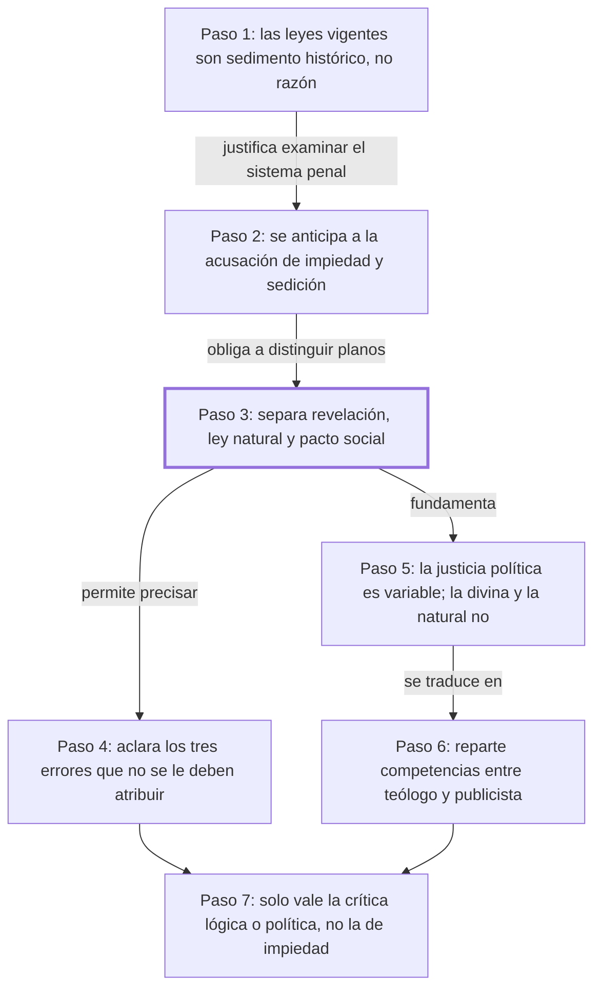

# Al lector

## 1. Idea principal

Se puede criticar el sistema penal vigente examinándolo solo como un acuerdo entre seres humanos, sin tocar ni negar la religión ni la ley natural, y quien confunde esos tres planos queda incapacitado para razonar sobre asuntos públicos.

Este capítulo viene a contestar una pregunta previa a todo el libro: ¿con qué derecho un particular se pone a juzgar las leyes penales de su tiempo? A un principiante le conviene entenderla porque acá Beccaria define el terreno en el que va a discutir durante 47 capítulos, y casi todos los malentendidos sobre su obra vienen de ignorar esta delimitación. Además, sostiene que criticar racionalmente el poder de castigar no debilita a la autoridad legítima: la refuerza.

## 2. Explicación paso a paso

### Paso 1 — Denuncia que lo que en Europa se llama "leyes" es un sedimento histórico

El texto abre con "Algunos restos de leyes de un antiguo pueblo conquistador" (cap. Al lector, primer párrafo). El movimiento es fijar el blanco: antes de proponer nada, Beccaria describe qué es lo que critica. Y lo describe como una acumulación desordenada —restos del derecho romano recopilados por orden de un emperador de Constantinopla doce siglos antes, mezclados con costumbres lombardas y sepultados bajo comentarios de intérpretes privados—. Su cargo es concreto: lo que se obedece como ley es en realidad la opinión de un autor. Nombra tres de esos intérpretes; están en el original, no los repito, porque el efecto del pasaje depende de leerlos como lista. La analogía cotidiana: es como si el reglamento de un edificio fuera, en la práctica, lo que un vecino opinó hace cuarenta años y los demás repitieron sin leer el reglamento. Importa porque instala la premisa que justifica todo el libro: si eso no es un sistema racional, entonces hay algo que reformar.

### Paso 2 — Anticipa la acusación de impiedad y sedición

Sigue en "Cualquiera que quisiere honrarme con su crítica" (cap. Al lector). Acá el movimiento es defensivo y estratégico: Beccaria se adelanta a la objeción que sabe que va a recibir —que atacar las leyes penales es atacar la religión y el poder legítimo— y la responde antes de que se formule. Conviene notar que escribe bajo censura, así que elogia al gobierno "suave e iluminado" bajo el que vive. Ese elogio no es un adorno: es lo que le permite publicar. Su jugada es reencuadrar: dice que el fin de la obra, si se logra, aumentaría la autoridad legítima en vez de disminuirla. Importa porque de este paso depende que el libro pueda existir; si la acusación de impiedad se sostiene, no hay discusión posible sobre el contenido.

### Paso 3 — Separa las tres fuentes de los principios: revelación, ley natural y pacto social

El párrafo "Tres son los manantiales" (cap. Al lector) es la bisagra del capítulo. El movimiento es una distinción, y es la más importante de toda la obra. Beccaria dice que los principios que rigen a los hombres vienen de tres orígenes: la revelación (lo que Dios comunica), la ley natural (lo que se desprende de la naturaleza humana) y los pactos que la sociedad establece. Y aclara de inmediato que ocuparse del tercero no excluye a los dos primeros. De ahí deriva tres clases de vicio y virtud: religiosa, natural y política. Su punto fino: las tres no deben contradecirse, pero no imponen las mismas obligaciones —no todo lo que pide la revelación lo pide la ley natural, ni todo lo que pide la ley natural lo pide la ley social—. Importa porque acá define de qué habla el libro: solo del tercer plano, el de las convenciones humanas.

### Paso 4 — Enumera los tres errores que no quiere que se le atribuyan

En "Sería, pues, un error atribuir a quien habla de convenciones sociales" (cap. Al lector) el movimiento es preventivo: dice explícitamente qué NO está afirmando. Son tres cosas, y conviene leerlas en el original porque cada una desactiva una lectura hostil distinta. La más interesante para un principiante es la segunda: cuando Beccaria habla de un "estado de guerra" anterior a la sociedad, aclara que no lo usa en el sentido de Hobbes —un estado sin ninguna razón ni obligación previa—, sino como un hecho nacido de la corrupción humana y de la falta de un acuerdo expreso. Importa porque sin este paso es fácil atribuirle tesis que rechaza, y de hecho es lo que hicieron sus críticos de la época.

### Paso 5 — Explica por qué la justicia política es variable y las otras no

El tramo "La justicia divina y la justicia natural son por su esencia inmutables" (cap. Al lector) hace el movimiento más técnico. Beccaria da una razón, no una afirmación suelta: la justicia divina y la natural son constantes porque relacionan siempre los mismos dos objetos; la justicia humana o política, en cambio, es una relación entre una acción y el estado cambiante de la sociedad, así que varía según esa acción se vuelva necesaria o útil para esa sociedad. La analogía: la distancia entre dos ciudades no cambia, pero cuánto tarda el viaje depende del camino que haya ese año. Y agrega la consecuencia que le importa: si estos principios se confunden, "no hay esperanza de raciocinar con fundamento en las materias públicas". Importa porque esta definición de la justicia política es la que el resto del libro va a usar sin volver a explicarla.

### Paso 6 — Reparte las competencias: el teólogo y el publicista

En el cierre del mismo párrafo, "A los teólogos pertenece establecer los confines de lo justo y de lo injusto" (cap. Al lector), el movimiento es institucional: convierte la distinción del paso 3 en un reparto de oficios. Al teólogo le corresponde la malicia o bondad intrínseca del acto; al publicista —el que escribe sobre asuntos públicos, el oficio que Beccaria se atribuye— le corresponde determinar el daño o el provecho para la sociedad. Y aclara que un objeto no perjudica al otro. Conviene ver que hace una concesión de jerarquía: dice que la verdad puramente política debe ceder ante la virtud que viene de Dios. Se puede leer como convicción o como prudencia frente al censor; el texto no permite decidirlo. Importa porque acá queda establecido con qué autoridad habla.

### Paso 7 — Redefine qué sería una crítica válida a su libro

El último párrafo, "Cualquiera, repito, que quisiere honrarme con su crítica" (cap. Al lector), cierra el círculo abierto en el paso 2. El movimiento es fijar las reglas del debate: pide que no se empiece suponiéndole principios destructores de la virtud o la religión, y que en lugar de concluir que es incrédulo o sedicioso, lo convenzan "de mal lógico o de imprudente político". Es decir: la crítica legítima tiene que mostrar que sus principios son inútiles o dañinos políticamente, o que razona mal, no que es impío. Menciona además que ya respondió a un escrito contra él y que no piensa responder a otros iguales. Importa porque establece el criterio con el que él mismo quiere ser juzgado, y es el criterio que conviene usar al leer el resto del libro.

## 3. Mapa

## 4. Vocabulario clave

- **Revelación** — lo que, según la fe, Dios comunica directamente a los hombres; para Beccaria es inmutable y ajena a este libro.
- **Ley natural** — el conjunto de principios que se desprenderían de la naturaleza humana, accesibles por la razón sin necesidad de fe.
- **Pacto social** — el acuerdo, expreso o tácito, por el cual las personas aceptan vivir en sociedad; es el único plano que este libro examina.
- **Justicia política** — para Beccaria, la relación entre una acción y el estado cambiante de la sociedad; por eso la llama "variable".
- **Publicista** — quien escribe sobre asuntos públicos y su daño o provecho para la sociedad; es el oficio que Beccaria se atribuye.
- **Teólogo** — quien establece los límites de lo justo y lo injusto en cuanto a la malicia o bondad intrínseca del acto.
- **Sistema criminal** — el conjunto de leyes, prácticas y castigos penales de su tiempo; es lo que el libro examina.
- **Estado de guerra** — la situación previa a la sociedad organizada; Beccaria advierte que no lo usa en sentido hobbesiano (el autor no lo define más allá de esa aclaración).
- **Intérpretes** — los juristas privados cuyos comentarios se obedecían como si fueran leyes; el texto los presenta como el problema, no como la solución.
- **Sedicioso** — quien incita a rebelarse contra la autoridad; es una de las dos acusaciones que Beccaria se adelanta a rechazar.

## 5. Distinciones que se confunden

- **Justicia política vs. justicia natural** — la primera varía con el estado de la sociedad; la segunda es constante por esencia.
  - Se confunden porque: las dos se llaman "justicia" y las dos se invocan para decir que algo está mal.
  - Criterio para decidir: ¿la afirmación cambiaría si cambiara la sociedad? Si sí, es política; si no, es natural o divina.
  - Dónde se cae: se responde que para Beccaria la justicia es relativa y nada más, cuando lo que dice es que hay tres planos y solo uno es variable.

- **Examinar el pacto social vs. negar la revelación** — ocuparse de un plano no implica rechazar los otros.
  - Se confunden porque: si alguien discute el castigo sin mencionar a Dios, parece que lo está excluyendo.
  - Criterio para decidir: ¿el autor afirma algo contra los otros dos planos, o simplemente no habla de ellos? Beccaria dice explícitamente que no tratarlos no es contradecirlos.
  - Dónde se cae: se sostiene que Beccaria es un autor antirreligioso, que es exactamente la acusación que este capítulo se dedica a desactivar.

- **Ley vs. opinión del intérprete** — la ley es la norma establecida; la opinión del intérprete es el comentario de un particular sobre ella.
  - Se confunden porque: en la práctica que Beccaria denuncia, la opinión se obedecía con la misma fuerza que la ley.
  - Criterio para decidir: ¿esto lo estableció quien tiene autoridad para legislar, o lo escribió un autor y se volvió costumbre?
  - Dónde se cae: se cree que Beccaria critica el contenido de las leyes romanas, cuando su cargo principal es que ni siquiera se aplican leyes, sino comentarios.

- **Crítica válida vs. acusación de impiedad** — la válida muestra un error de lógica o un daño político; la acusación descalifica al autor sin discutir sus razones.
  - Se confunden porque: las dos se presentan como refutaciones del libro.
  - Criterio para decidir: ¿la objeción ataca una proposición del libro o la persona y las intenciones del autor?
  - Dónde se cae: se lee el capítulo como una simple captatio benevolentiae —un halago al poder para caer bien— y se pierde que está fijando una regla de discusión.

- **El "estado de guerra" de Beccaria vs. el de Hobbes** — en Hobbes no hay razón ni obligación anterior al pacto; en Beccaria es un hecho producido por la corrupción humana y la falta de acuerdo expreso.
  - Se confunden porque: los dos usan la misma expresión y los dos ponen ese estado antes de la sociedad.
  - Criterio para decidir: ¿había obligaciones antes del pacto? Para Beccaria, sí las había; el problema era que no estaban establecidas expresamente.
  - Dónde se cae: se clasifica a Beccaria como hobbesiano, cuando el propio texto rechaza esa lectura por escrito.

## 6. Qué releer del original

1. (cap. Al lector) "Tres son los manantiales" — es la bisagra de todo el libro: si esta distinción no queda clara, nada de lo que sigue se entiende como movimiento deliberado.
2. (cap. Al lector) "Sería, pues, un error atribuir" — son los tres errores que el paso 4 mencionó sin desarrollar uno por uno; conviene leerlos completos porque cada uno desactiva una lectura hostil distinta.
3. (cap. Al lector) "pero la justicia humana, o sea política" — contiene la definición que el resto del tratado va a usar sin volver a explicar; la formulación exacta importa.
4. (cap. Al lector) "Algunos restos de leyes de un antiguo pueblo conquistador" — es la enumeración de intérpretes y de fuentes que el paso 1 deliberadamente no reprodujo, y fija el blanco polémico del libro.
5. (cap. Al lector) "convénzame de mal lógico o de imprudente político" — es el pasaje que más fácil se malentiende como adulación al poder, cuando en realidad establece el criterio de refutación.

## 7. Autoevaluación

1. ¿Cuáles son los tres orígenes de los principios morales y políticos que distingue Beccaria?
2. ¿Qué sostiene Beccaria que son, en realidad, las "leyes" que se obedecen en gran parte de Europa?
3. Según el texto, ¿qué le corresponde al teólogo y qué al publicista?
4. Explicá con tus palabras por qué Beccaria dice que la justicia política es variable y la natural no.
5. Reformulá el paso 2: ¿por qué le conviene a Beccaria anticipar la acusación de impiedad antes de exponer su argumento?
6. ¿Por qué es necesario el paso 3? ¿Qué le pasaría al libro si Beccaria no hubiera separado los tres planos?
7. Un funcionario propone endurecer una pena argumentando que el acto castigado es intrínsecamente inmoral. Según el reparto de competencias del capítulo, ¿está razonando como teólogo o como publicista, y qué tendría que mostrar para convencer a Beccaria?
8. Alguien afirma: "Beccaria dice que la justicia depende de la época, así que para él cualquier castigo puede ser justo si la sociedad lo acepta". Usando las distinciones del bloque 5, ¿qué parte de esa lectura es correcta y qué parte no?
9. Beccaria pide que se lo refute mostrando que sus principios son inútiles o dañinos. ¿Es un criterio de discusión imparcial, o le da alguna ventaja? Evaluá.
10. El capítulo elogia al gobierno bajo el cual vive y concede que la verdad política debe ceder ante la virtud divina. ¿Se puede saber, con lo que hay en el texto, si eso es convicción o prudencia frente a la censura? Justificá.

--- No mires esto hasta responder ---

1. La revelación, la ley natural y los pactos establecidos por la sociedad (cap. Al lector).
2. Que son una tradición de opiniones: restos del derecho romano recopilados en Constantinopla, mezclados con ritos lombardos y envueltos en comentarios de intérpretes privados, que se obedecen como si fueran leyes (cap. Al lector).
3. Al teólogo, establecer los confines de lo justo y lo injusto en cuanto a la malicia o bondad intrínseca del acto; al publicista, determinar el daño o provecho para la sociedad (cap. Al lector).
4. Porque la justicia divina y la natural relacionan siempre los mismos dos objetos, y esa relación no cambia; la política relaciona una acción con el estado de la sociedad, que sí cambia, así que varía según esa acción resulte necesaria o útil para esa sociedad (cap. Al lector).
5. Porque si la acusación se sostuviera, el contenido del libro no llegaría a discutirse: escribe bajo censura y la imputación de impiedad o sedición clausura el debate antes de empezarlo. Anticiparla le permite fijar que la discusión será sobre razones (cap. Al lector).
6. Sin esa separación, cualquier crítica al derecho de castigar podría leerse como una crítica a la religión o a la ley natural, y el libro quedaría indefendible. El paso 3 es lo que delimita el terreno donde su argumento es admisible.
7. Está razonando como teólogo: apela a la malicia intrínseca del acto. Para convencer a Beccaria tendría que mostrar el daño o el provecho concreto para la sociedad, que es el plano del publicista y el único que el libro discute.
8. Es correcto que para Beccaria la justicia política varía con el estado de la sociedad. No es correcto que de ahí se siga que cualquier castigo pueda ser justo: la variabilidad afecta a un solo plano de los tres, y los otros dos —que él declara inmutables— no quedan derogados. Además el libro busca justamente un criterio, no la aceptación social como medida.
9. Le da cierta ventaja: al declarar fuera de juego la objeción religiosa, se blinda contra el tipo de crítica más peligroso para él en su época. Pero el criterio en sí es defendible, porque exige discutir proposiciones en vez de atribuir intenciones. Respuesta discutible: se puede sostener que la exclusión es legítima porque él mismo delimitó de qué plano habla.
10. No se puede decidir con este texto. El capítulo da elementos para las dos lecturas —dice haber dado "un público testimonio" de su religión y de su sumisión al soberano, y a la vez el elogio cumple una función evidente frente al censor—, pero no hay en esta sección nada que permita resolverlo. Corresponde señalarlo, no elegir.

## Flashcards

Los tres manantiales de los principios morales y políticos según Beccaria | La revelación, la ley natural y los pactos establecidos por la sociedad
De cuál de los tres planos se ocupa el tratado | Solo del tercero: las convenciones humanas o pacto social
Qué son las leyes europeas que Beccaria critica | Una tradición de opiniones de intérpretes privados obedecida como si fuera ley
Qué le corresponde al teólogo según Beccaria | Los confines de lo justo y lo injusto en cuanto a la malicia o bondad intrínseca del acto
Qué le corresponde al publicista según Beccaria | Determinar las relaciones de lo justo o injusto político: el daño o provecho de la sociedad
Qué es un publicista en este texto | Quien escribe sobre asuntos públicos; es el oficio que Beccaria se atribuye
Por qué la justicia divina y la natural son inmutables | Porque la relación entre dos mismos objetos es siempre la misma
Por qué la justicia política es variable | Porque relaciona una acción con el estado cambiante de la sociedad
Cuáles son las tres clases de vicio y virtud | Religiosa, natural y política
Qué pasa si se confunden los tres planos de principios | No hay esperanza de razonar con fundamento en las materias públicas
En qué sentido Beccaria NO usa la expresión estado de guerra | En el sentido hobbesiano de ausencia de toda razón u obligación anterior
Cómo entiende Beccaria el estado de guerra previo a la sociedad | Como un hecho nacido de la corrupción humana y de la falta de un acuerdo expreso
Cómo pide Beccaria que se lo refute | Que lo convenzan de mal lógico o de imprudente político, no de incrédulo o sedicioso
Qué efecto tendría la crítica racional sobre la autoridad legítima, según el capítulo | La aumentaría, no la disminuiría, si en los hombres puede más la razón que la fuerza
Cómo distingo la justicia política de la natural | Preguntando si la afirmación cambiaría al cambiar la sociedad: si sí, es política
Cómo distingo examinar el pacto social de negar la revelación | Ocuparse de un plano no es afirmar nada contra los otros; Beccaria lo aclara expresamente
Cómo distingo una ley de la opinión de un intérprete | La ley la establece quien tiene autoridad para legislar; la opinión es el comentario de un particular
Cómo distingo una crítica válida de una acusación de impiedad | La válida ataca una proposición del libro; la acusación ataca a la persona y sus intenciones
Un crítico dice que el libro es impío. Qué respondería Beccaria | Que eso no refuta nada: que le muestre la inutilidad o el daño político de sus principios
Un juez castiga invocando solo la inmoralidad intrínseca del acto. En qué plano se apoya | En el del teólogo, no en el del publicista, que es el único que el tratado discute
