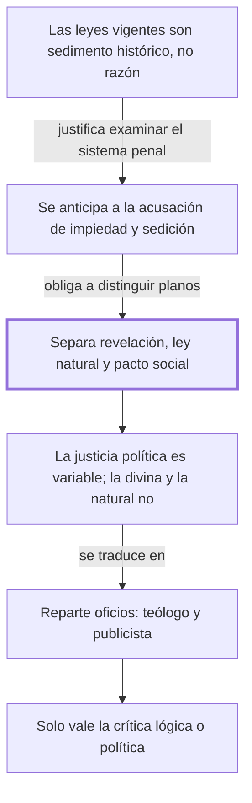

# Al lector

## 1. Idea principal

Se puede criticar el sistema penal examinándolo solo como acuerdo humano, sin negar la religión ni la ley natural; quien confunde esos tres planos no puede razonar sobre asuntos públicos.

Contesta una pregunta previa a todo el libro: ¿con qué derecho un particular se pone a juzgar las leyes penales de su tiempo? Acá Beccaria define el terreno en el que va a discutir durante 47 capítulos.

## 2. Lo esencial del capítulo

Lo que en gran parte de Europa se obedece como ley no es ley sino una acumulación desordenada: restos del derecho romano recopilados por orden de un emperador de Constantinopla doce siglos antes, mezclados con costumbres lombardas y sepultados bajo comentarios de intérpretes privados, de los que nombra tres —conviene leerlos como lista en el original, porque de eso depende el efecto del pasaje— (cap. Al lector). El cargo es concreto: lo que se aplica es la opinión de un autor. Beccaria escribe bajo censura y se adelanta a la acusación que sabe que va a recibir, la de que atacar las leyes penales es atacar la religión y el poder legítimo: elogia al gobierno "suave e iluminado" bajo el que vive, y reencuadra la obra diciendo que su fin, si se logra, aumentaría la autoridad legítima en vez de disminuirla.

De ahí la distinción central: los principios que rigen a los hombres vienen de tres orígenes —la revelación, la ley natural y los pactos que la sociedad establece—, ocuparse del tercero no excluye a los dos primeros, y de cada uno sale una clase de vicio y virtud, religiosa, natural y política, que no deben contradecirse pero no imponen las mismas obligaciones. Para que no se le atribuya lo que no dice enumera tres errores que rechaza, entre ellos que su "estado de guerra" previo a la sociedad sea el de Hobbes: no es la ausencia de toda razón u obligación anterior, sino un hecho nacido de la corrupción humana y de la falta de un acuerdo expreso. La razón de la separación es precisa: la justicia divina y la natural son constantes porque relacionan siempre los mismos dos objetos, mientras que la política relaciona una acción con el estado cambiante de la sociedad y varía con él. Si esos planos se confunden, "no hay esperanza de raciocinar con fundamento en las materias públicas": al teólogo le toca la malicia o bondad intrínseca del acto, al publicista el daño o el provecho para la sociedad. El cierre fija las reglas del debate: que no lo concluyan incrédulo o sedicioso, sino que lo convenzan "de mal lógico o de imprudente político" (cap. Al lector).

## 3. Mapa

## 4. Vocabulario clave

- **Revelación** — lo que, según la fe, Dios comunica directamente a los hombres; inmutable y ajena a este libro.
- **Ley natural** — los principios que se desprenderían de la naturaleza humana, accesibles por la razón sin fe.
- **Pacto social** — el acuerdo, expreso o tácito, por el que las personas aceptan vivir en sociedad; el único plano que este libro examina.
- **Justicia política** — la relación entre una acción y el estado cambiante de la sociedad; por eso la llama "variable".
- **Publicista** — quien escribe sobre asuntos públicos y su daño o provecho para la sociedad; el oficio que Beccaria se atribuye.

## 5. Distinciones que se confunden

- **Justicia política vs. justicia natural** — la primera varía con el estado de la sociedad; la segunda es constante por esencia.
  - Se confunden porque: las dos se llaman "justicia" y las dos se invocan para decir que algo está mal.
  - Criterio para decidir: ¿la afirmación cambiaría si cambiara la sociedad? Si sí, es política.
  - Dónde se cae: se responde que para Beccaria la justicia es relativa y nada más, cuando dice que hay tres planos y solo uno varía.

- **Examinar el pacto social vs. negar la revelación** — ocuparse de un plano no implica rechazar los otros.
  - Se confunden porque: si alguien discute el castigo sin mencionar a Dios, parece que lo excluyera.
  - Criterio para decidir: ¿el autor afirma algo contra los otros dos planos, o simplemente no habla de ellos?
  - Dónde se cae: se sostiene que Beccaria es antirreligioso, que es exactamente la acusación que este capítulo desactiva.

## 6. Autoevaluación

1. ¿Qué se entiende por los tres manantiales de los principios morales y políticos, y cuáles son las implicaciones de distinguirlos para quien quiere criticar las leyes penales?
2. Un funcionario propone endurecer una pena porque el acto castigado es intrínsecamente inmoral. Según el reparto de oficios del capítulo, ¿cómo está razonando y qué tendría que mostrar?

--- No mires esto hasta responder ---

1. Los principios que rigen a los hombres tienen tres orígenes: la revelación, la ley natural y los pactos que la sociedad establece; de ellos derivan tres clases de vicio y virtud —religiosa, natural y política— que no deben contradecirse pero no imponen las mismas obligaciones (cap. Al lector). La distinción se apoya en una diferencia de naturaleza: la justicia divina y la natural son constantes porque relacionan siempre los mismos dos objetos, mientras que la política relaciona una acción con el estado cambiante de la sociedad y varía con él. La implicación principal es de habilitación: examinar el tercer plano no niega los otros dos, así que la crítica del sistema penal puede hacerse como discusión de convenciones humanas sin tocar la fe. La segunda implicación es un reparto de oficios: al teólogo le toca la malicia o bondad intrínseca del acto, al publicista el daño o el provecho para la sociedad. Y la tercera es negativa: quien confunde los tres planos no tiene "esperanza de raciocinar con fundamento en las materias públicas".
2. Razona como teólogo: apela a la malicia intrínseca del acto, que es el plano religioso. Para convencer a Beccaria tendría que mostrar el daño o el provecho concreto para la sociedad, que es el plano del publicista y el único que el libro discute. No es que su razón sea falsa, es que pertenece a otro orden de obligaciones.

## Flashcards

Los tres manantiales de los principios morales y políticos según Beccaria | La revelación, la ley natural y los pactos establecidos por la sociedad
De cuál de los tres planos se ocupa el tratado | Solo del tercero: las convenciones humanas o pacto social
Qué le corresponde al teólogo y qué al publicista | Al teólogo la malicia intrínseca del acto; al publicista el daño o provecho social
Por qué la justicia política es variable y la natural no | Porque relaciona una acción con el estado cambiante de la sociedad, y la natural siempre los mismos dos objetos
