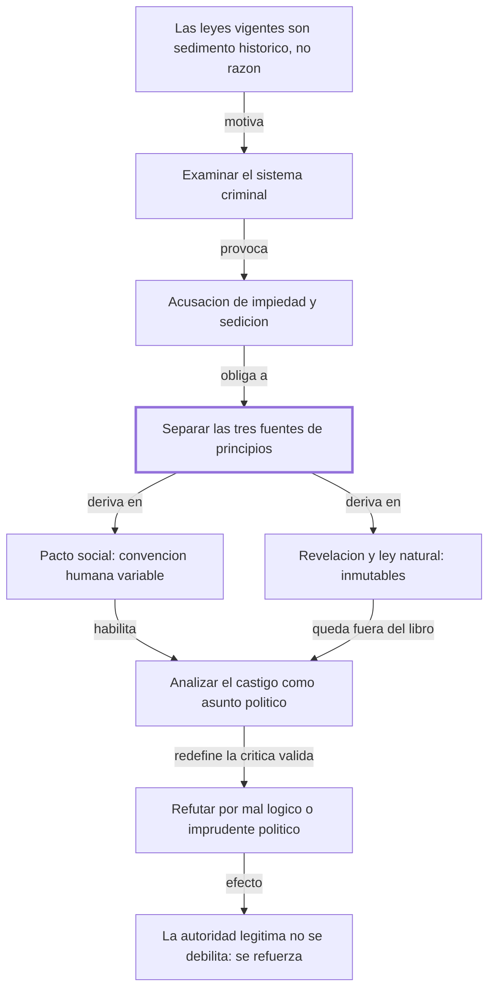
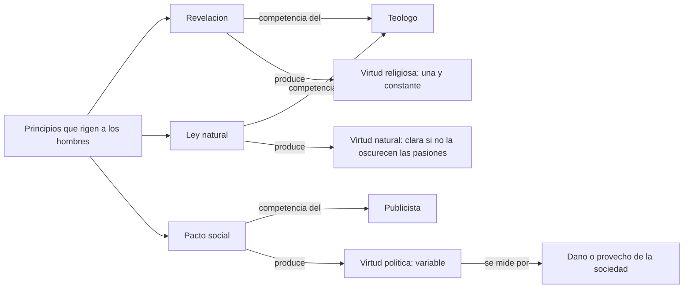

# Sección 1 — Nota sobre la edición y "Al lector"

## 1. Ubicación

Esta sección abre el libro: reúne los preliminares editoriales de la edición de la Universidad Carlos III (2015), el índice de los 47 capítulos y la advertencia *Al lector* que Beccaria escribió para la quinta edición (1766), la última que él revisó. No es todavía el argumento del tratado, sino su blindaje: antes de exponer su crítica al sistema penal, el autor responde a los ataques que ya había recibido y fija los límites de aquello sobre lo que va a hablar. La sigue la Introducción, donde sí empieza el argumento.

## 2. Tesis central en una frase

Beccaria sostiene que se puede examinar el derecho de castigar como pura convención humana —sin negar ni tocar la revelación ni la ley natural— y que confundir esos tres planos hace imposible razonar sobre asuntos públicos.

Tesis secundaria de la nota editorial: el texto que se lee aquí es la traducción de Juan Antonio de las Casas (1774), que procede de la quinta edición italiana, con la ortografía modernizada.

## 3. Mapa argumental

- Punto de partida: lo que en Europa se llama "leyes" no es un sistema racional, sino un sedimento histórico —restos justinianeos, ritos lombardos, comentarios de intérpretes privados— (Al lector, párrafo 1).
  - Consecuencia: quienes deciden sobre vidas y fortunas obedecen opiniones de autores (Carpzovio, Claro, Farinaccio) creyendo obedecer leyes (Al lector, párrafo 1).
- Objeción anticipada: examinar críticamente ese sistema equivale a atacar la religión y la autoridad.
  - Respuesta 1 — distinción de fuentes: hay tres orígenes de los principios que rigen a los hombres, revelación, ley natural y pacto social, y solo el tercero es materia de este libro (Al lector, párrafo 3).
  - Respuesta 2 — distinción de competencias: al teólogo le toca lo justo y lo injusto intrínseco; al publicista, el daño o provecho para la sociedad (Al lector, párrafo final del argumento).
  - Respuesta 3 — distinción de estatuto: la justicia divina y la natural son inmutables porque relacionan siempre los mismos objetos; la política es variable porque relaciona una acción con un estado cambiante de la sociedad (Al lector).
- Conclusión: criticar el libro es legítimo, pero el crítico debe probar que sus principios son inútiles o dañinos políticamente, no que su autor es impío. Beccaria pide que lo convenzan "de mal lógico o de imprudente político" (Al lector).
- Corolario político: la crítica no debilita la autoridad legítima, la aumenta, "si puede en los hombres más la razón que la fuerza" (Al lector).

## 4. Mapas visuales

### 4.1 Estructura del argumento

### 4.2 Relaciones entre conceptos

## 5. Conceptos clave

**Pacto social (o convenciones humanas)**
- Definición del autor: "los pactos establecidos por la sociedad" ("Al lector"), fuente de principios distinta de la revelación y de la ley natural.
- Definición reformulada: el conjunto de acuerdos —dichos o supuestos— por los que la gente acepta reglas comunes porque le conviene vivir junta.
- Ejemplo propio: el reglamento de un edificio de apartamentos. Nadie lo firmó ante Dios; obliga porque a todos les sirve que nadie ponga música a las tres de la mañana.
- Confusión frecuente: se lo mezcla con un contrato histórico real, un día en que la humanidad se sentó a firmar. Beccaria lo usa como criterio de legitimidad, no como dato de historia.

**Justicia política (o humana)**
- Definición del autor: "una relación entre la acción y el vario estado de la sociedad" ("Al lector").
- Definición reformulada: lo justo en sentido político no es una propiedad del acto en sí, sino de la relación entre ese acto y lo que la sociedad necesita en ese momento.
- Ejemplo propio: exceder los 60 km/h no es malo en sí; es peligroso frente a una escuela y trivial en una autopista vacía. La injusticia depende de la relación, no del gesto.
- Confusión frecuente: leerla como relativismo moral ("todo vale"). Beccaria no dice que no exista justicia inmutable; dice que la inmutable es otra y no es la que administran los tribunales.

**Justicia divina y justicia natural**
- Definición del autor: son "por su esencia inmutables y constantes" ("Al lector").
- Definición reformulada: las relaciones que no cambian porque sus términos no cambian; quedan fuera del objeto de este libro.
- Ejemplo propio: que 7 sea mayor que 3 no depende de la época ni del país. Beccaria reserva ese tipo de fijeza para lo divino y lo natural, no para el código penal.
- Confusión frecuente: suponer que, por ser superiores, deben fundar directamente las penas. Beccaria las declara superiores precisamente para sacarlas de la discusión penal.

**Publicista**
- Definición del autor: a él le toca determinar "las relaciones de lo justo o injusto político" ("Al lector").
- Definición reformulada: el que estudia el daño o el provecho que una acción causa a la sociedad; hoy diríamos teórico político o penalista, no periodista.
- Ejemplo propio: quien evalúa si subir la pena por hurto reduce los hurtos ocupa el lugar del publicista; quien discute si el hurto ofende a Dios, el del teólogo.
- Confusión frecuente: el sentido actual de la palabra ("publicista" como agente de publicidad) no tiene nada que ver.

**Intérpretes (Carpzovio, Claro, Farinaccio)**
- Definición del autor: "privados y oscuros intérpretes" cuyas opiniones "son las leyes obedecidas" ("Al lector").
- Definición reformulada: juristas de los siglos XVI y XVII cuyas obras doctrinales se aplicaban en la práctica como si fueran ley vigente.
- Ejemplo propio: que un manual de un profesor se cite en los juzgados con más fuerza que el código mismo.
- Confusión frecuente: no son legisladores ni jueces: son autores. Ese es exactamente el escándalo que Beccaria denuncia.

## 6. Ideas difíciles, en tres representaciones

**La justicia política es variable sin ser arbitraria**
- Explicación técnica: la justicia política es una relación entre una acción y el estado de la sociedad; cambiando uno de los términos, cambia la relación, sin que por eso desaparezca el criterio (la utilidad del conjunto).
- Analogía cotidiana: la dosis de un medicamento. Que varíe con el peso del paciente no significa que el médico recete al azar; la regla es fija, el resultado depende del caso.
- Contraejemplo o caso límite: si la variabilidad fuera total, un soberano podría declarar delito cualquier cosa alegando "circunstancias". El propio criterio de Beccaria —daño o provecho para la sociedad— es lo que impide ese deslizamiento; en esta sección lo afirma pero no lo demuestra.

**La separación de planos como estrategia, no solo como distinción**
- Explicación técnica: al declarar la revelación superior e intocable, Beccaria construye un espacio autónomo donde puede razonar sin ser acusado de herejía. La declaración de sumisión es lo que hace posible la crítica.
- Analogía cotidiana: quien empieza una auditoría diciendo "no cuestiono la misión de la empresa, solo reviso las cuentas". Ese cerco hace la revisión posible.
- Contraejemplo o caso límite: si un lector toma la sumisión como pura sinceridad, no ve la maniobra; si la toma como pura hipocresía, tampoco. En 1766, decir que la ley penal es convención humana y no mandato divino ya es una tesis fuerte, aunque venga envuelta en protestas de fe.

## 7. Preguntas socráticas para pensar mientras leo

1. Si la justicia política es una relación variable, ¿qué impide que un gobierno la haga variar a su favor? ¿Beccaria da un límite en esta sección, o solo lo promete?
2. ¿Por qué le conviene al argumento afirmar la superioridad de la justicia divina en vez de ignorarla?
3. Beccaria rechaza leer el estado de guerra "en el sentido hobbesiano". ¿Qué gana su argumento al separarse de Hobbes en este punto?
4. Si las opiniones de los intérpretes funcionaban como leyes, ¿el problema es quién manda o cómo está escrito lo que manda?
5. ¿Qué significa que la razón "aumente" la autoridad legítima en vez de disminuirla? ¿Es una tesis o una concesión al censor?
6. ¿Puede sostenerse que las tres clases de virtud "no deben jamás tener contradicción entre sí" si una es variable y las otras no?
7. ¿Qué cambia en la lectura del tratado si se sabe que el autor escribió esta advertencia *después* de las críticas, para una edición posterior?

## 8. Conexiones

- Con el resto del libro: la Introducción y el capítulo 2 ("Derecho de castigar") aplican esta separación de planos: el fundamento del castigo será la necesidad social, no el pecado. Sin esta advertencia previa, ese movimiento sería impugnable.
- Con otros autores: Montesquieu está citado como antecedente inmediato. Hobbes aparece por vía de rechazo. La distinción entre delito y pecado atraviesa toda la discusión posterior sobre secularización del derecho penal.
- Con problemas actuales: el debate sobre delitos "sin víctima" —consumo, moralidad sexual, blasfemia— reproduce exactamente esta pregunta: ¿se castiga el daño social o la falta moral?
- Advertencia: la nota editorial de M. M. N. es de 2015, no de Beccaria. Los datos de ediciones, Francioni y Andrés Ibáñez son del editor moderno.

## 9. Puntos oscuros o discutibles

- Beccaria afirma que los tres planos "no deben jamás tener contradicción entre sí", pero no explica qué hacer cuando la contradicción ocurre —cuando lo útil socialmente es un pecado, o al revés—. Es el punto más débil de la advertencia.
- La utilidad como criterio ("la utilidad del mayor número" aparece ya insinuada) se enuncia sin justificarse. Queda para el cuerpo del libro.
- La declaración de sumisión al soberano y a la religión admite dos lecturas —convicción o prudencia frente a la censura— y el texto no permite decidir entre ellas. Aquí el lector debe tomar posición.
- El primer párrafo mezcla hechos históricos comprimidos: "un antiguo pueblo conquistador" (Roma), "un príncipe que hace doce siglos reinaba en Constantinopla" (Justiniano), "ritos lombardos". No los explica; hay que reponerlos desde fuera del texto.
- El texto llega de una conversión automática del PDF: la portadilla, el ISBN y el índice que aparecen al comienzo de esta sección son ruido editorial, no contenido de Beccaria.

## 10. Test de comprensión (para hacer SIN mirar el resto)

1. ¿Cuáles son las tres fuentes de principios morales y políticos que enumera Beccaria?
2. ¿Quiénes son Carpzovio, Claro y Farinaccio en el argumento del prólogo, y por qué los nombra?
3. ¿A quién le corresponde, según el texto, determinar lo justo o injusto político?
4. Explicá con tus palabras por qué la justicia política es variable y la divina no.
5. ¿Qué le pide Beccaria a quien quiera criticarlo, y qué le prohíbe suponer?
6. ¿Por qué el texto aclara que no toma el estado de guerra "en el sentido hobbesiano"?
7. Un legislador quiere castigar una conducta porque la considera moralmente repugnante, aunque no daña a nadie. ¿Cómo evaluaría esa ley el criterio del prólogo?
8. Si mañana cambian las condiciones sociales que hacían dañina una conducta, ¿qué debería pasar con su pena según este esquema? ¿Es una consecuencia aceptable?
9. ¿La separación entre teólogo y publicista debilita o refuerza la autoridad? Reconstruí el argumento de Beccaria y evaluá si convence.
10. ¿La advertencia *Al lector* es una defensa sincera de la religión, una maniobra frente a la censura, o ambas? Sostené tu lectura con el texto.

--- No mires esto hasta responder ---

**Respuestas de referencia**

1. Revelación, ley natural y pactos establecidos por la sociedad.
2. Juristas cuyas opiniones doctrinales se obedecían como si fueran leyes; los nombra para mostrar que el derecho penal vigente descansa en autores privados, no en legislación racional.
3. Al publicista; al teólogo le corresponde la malicia o bondad intrínseca del acto.
4. Porque la divina y la natural relacionan siempre los mismos términos, mientras que la política relaciona una acción con el estado cambiante de la sociedad.
5. Le pide que conozca primero el fin de la obra y que lo refute como mal lógico o imprudente político; le prohíbe suponer en él principios destructores de la virtud o la religión.
6. Porque no quiere afirmar que antes de la sociedad no hubiera razón ni obligación alguna; lo entiende como un hecho nacido de la corrupción humana y de la falta de un acuerdo expreso, no como una tesis sobre la ausencia total de moral.
7. La evaluaría fuera de competencia: eso pertenece al plano religioso o natural, no al político, que solo mide daño o provecho social. Respuesta abierta en cuanto a si el propio Beccaria mantiene esa coherencia.
8. La pena debería desaparecer o modificarse, porque su justicia depende de la relación con el estado de la sociedad. Aceptable como principio; peligroso si el que juzga el cambio es el mismo que castiga. Respuesta abierta.
9. Beccaria sostiene que la refuerza, porque una autoridad fundada en razón resiste más que una fundada en fuerza. Es una afirmación, no una demostración: en esta sección no hay evidencia que la respalde. Respuesta abierta.
10. Respuesta abierta. Ambos elementos son sostenibles con el texto: la insistencia en la ortodoxia es funcional al argumento y a la vez no hay en el texto nada que la contradiga.

## 11. Prueba Feynman

*Escribí acá, con tus palabras, qué hace Beccaria en esta sección y por qué, como si se lo explicaras a alguien de 15 años.*

<!-- tu explicación -->

Checklist de auto-revisión:

- [ ] ¿Usé mis palabras o me copié frases del texto?
- [ ] ¿Hay términos técnicos que no supe definir?
- [ ] ¿Puse al menos un ejemplo propio?
- [ ] ¿Marqué las partes en las que dudo o me quedan preguntas?

## 12. Qué releer del texto original

1. El párrafo de las tres fuentes de principios ("Tres son los manantiales..."): es la clave de bóveda de toda la defensa. Si no queda claro, nada de lo que sigue en el libro se entiende como movimiento deliberado.
2. El párrafo sobre la justicia humana como relación variable: contiene la definición que el resto del tratado va a usar sin volver a explicar.
3. El primer párrafo, sobre el origen histórico de las leyes vigentes: fija el blanco polémico de todo el libro.
4. El párrafo de los tres errores ("Sería, pues, un error..."): ahí Beccaria dice explícitamente qué NO está afirmando; sirve para no atribuirle tesis que rechaza.
5. La nota editorial sobre las ediciones: conviene tenerla presente para saber que se lee la versión de 1766, con los capítulos *Del fisco* y *Del perdón* añadidos.

## Flashcards

Tres fuentes de principios morales y políticos según Beccaria | Revelación, ley natural y pactos establecidos por la sociedad
Plano del que se ocupa el tratado | El de las convenciones humanas o pacto social
Competencia del teólogo | Los confines de lo justo y lo injusto en cuanto a la malicia o bondad intrínseca del acto
Competencia del publicista | Las relaciones de lo justo o injusto político: daño o provecho de la sociedad
Por qué la justicia divina es inmutable | Porque la relación entre dos mismos objetos es siempre la misma
Por qué la justicia política es variable | Porque relaciona una acción con el estado cambiante de la sociedad
Las tres clases de vicio y virtud | Religiosa, natural y política
Qué son Carpzovio, Claro y Farinaccio | Intérpretes cuyas opiniones se obedecían como leyes en el sistema criminal europeo
Origen histórico de las leyes que critica Beccaria | Restos del derecho romano compilados por Justiniano, mezclados con ritos lombardos y comentarios de intérpretes
Qué le pide Beccaria a sus críticos | Que lo refuten como mal lógico o imprudente político, no como impío o sedicioso
En qué sentido NO usa "estado de guerra" | En el sentido hobbesiano de ausencia de toda razón u obligación previa
Cómo entiende el estado de guerra previo a la sociedad | Como hecho nacido de la corrupción de la naturaleza humana y de la falta de un acuerdo expreso
Efecto de la crítica racional sobre la autoridad legítima, según el prólogo | La aumenta, no la disminuye, si la razón pesa más que la fuerza
Edición que sigue este texto | La quinta italiana de 1766, última revisada por Beccaria, vía la traducción de De las Casas de 1774
Capítulos añadidos en la quinta edición | Del fisco y Del perdón
Número total de capítulos de la obra | Cuarenta y siete
Autor citado como antecedente inmediato en materia penal | Montesquieu
Qué significa que las virtudes no deban tener contradicción entre sí | Que los tres planos deben ser compatibles, aunque no impongan las mismas obligaciones
Error que Beccaria rechaza sobre su propia posición | Que hablar del pacto social implique negar la ley natural o la revelación
Función del prólogo Al lector en la obra | Delimitar el objeto y blindar el argumento frente a la acusación de impiedad
