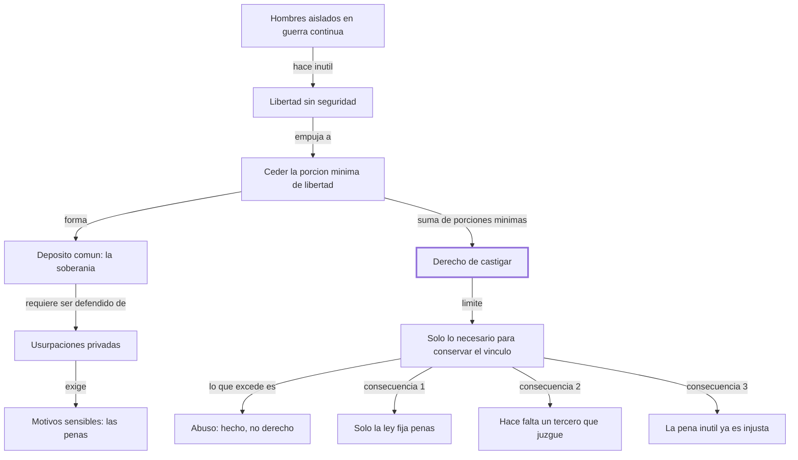
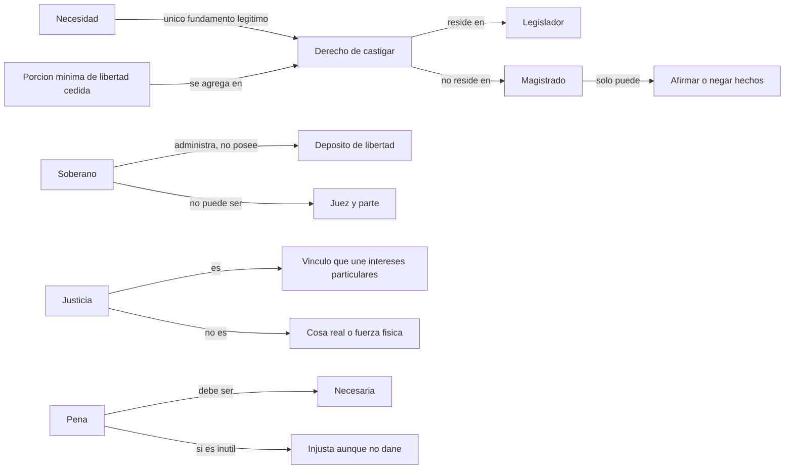

# Sección 2 — Introducción y capítulos 1 a 3

## 1. Ubicación

Aquí empieza el argumento. Después de la advertencia *Al lector*, donde Beccaria delimitó su terreno —el pacto social, no la revelación—, la Introducción explica por qué nadie había hecho antes esta crítica, y los capítulos 1 a 3 construyen los cimientos: de dónde vienen las penas (cap. 1), qué le da al soberano el derecho de imponerlas (cap. 2) y qué se sigue necesariamente de ese fundamento (cap. 3). Todo el resto del libro son aplicaciones de estas tres consecuencias a casos particulares: tortura, pena de muerte, prisión, prueba.

## 2. Tesis central en una frase

El derecho de castigar nace del agregado de las porciones mínimas de libertad que cada uno cedió para poder vivir seguro, y por lo tanto toda pena que exceda la necesidad de conservar ese vínculo es abuso y no justicia.

Segunda tesis: de ese fundamento se siguen tres consecuencias no negociables —solo la ley puede fijar penas, hace falta un tercero que juzgue, y la pena inútil es ilegítima aunque no sea dañina.

## 3. Mapa argumental

- Diagnóstico inicial: las leyes, que debieran ser pactos de hombres libres, fueron "partos casuales de una necesidad pasajera" e instrumento de las pasiones de pocos (Introducción).
  - Por eso la crítica del sistema criminal está pendiente mientras otros campos ya se ilustraron (Introducción).
- Premisa antropológica: los hombres aislados vivían en guerra continua y con una libertad inútil, porque no podían conservarla (cap. 1).
  - Movimiento: sacrifican una porción de libertad para gozar el resto con seguridad (cap. 1).
  - La suma de esas porciones forma la soberanía; el soberano es solo su depositario y administrador, no su dueño (cap. 1).
- Problema: el depósito no se defiende solo; cada uno tiende a retirar lo suyo y a usurpar lo ajeno (cap. 1).
  - Solución: motivos sensibles, es decir penas, porque las razones abstractas no sujetan a las pasiones (cap. 1).
- Criterio de legitimidad: todo acto de autoridad que no derive de absoluta necesidad es tiránico (cap. 2, siguiendo a Montesquieu).
  - Cada uno cedió la porción más pequeña posible; el agregado de esas porciones mínimas *es* el derecho de castigar (cap. 2).
  - Conclusión: lo que exceda ese agregado es "abuso y no justicia; es hecho, no derecho" (cap. 2).
- Aclaración sobre "justicia": no es una cosa real ni una fuerza física, sino "una simple manera de concebir de los hombres", el vínculo que mantiene unidos los intereses particulares (cap. 2).
- Consecuencias (cap. 3):
  - Primera: solo el legislador, que representa a la sociedad entera, puede decretar penas; ningún magistrado puede aumentarlas por celo o bien público.
  - Segunda: el contrato obliga a las dos partes; por eso el soberano no puede juzgar si hubo violación —sería juez y parte— y hace falta un tercero cuya sentencia se limite a afirmar o negar hechos.
  - Tercera: si la atrocidad de la pena fuera siquiera *inútil* para impedir delitos, ya sería contraria a la justicia y a la naturaleza del contrato social.

## 4. Mapas visuales

### 4.1 Estructura del argumento

### 4.2 Relaciones entre conceptos

## 5. Conceptos clave

**Depósito de libertad**
- Definición del autor: "El conjunto de todas estas porciones de libertad, sacrificadas al bien de cada uno" (cap. 1).
- Definición reformulada: un fondo común formado por el pedacito de libertad que cada persona resignó; la autoridad lo administra, no le pertenece.
- Ejemplo propio: la caja común de un grupo de excursionistas. El tesorero puede gastarla para el objetivo del viaje; si compra algo para sí, no deja de ser robo por ser él quien la guarda.
- Confusión frecuente: creer que el soberano *es* la soberanía. Beccaria dice que es su "administrador y legítimo depositario": el dueño es el conjunto.

**Motivos sensibles**
- Definición del autor: penas que "inmediatamente hieran en los sentidos" (cap. 1).
- Definición reformulada: consecuencias concretas y perceptibles, no argumentos: lo que frena de verdad a alguien tentado de romper la regla.
- Ejemplo propio: la multa fotografiada del semáforo frena más que una campaña que explique por qué el semáforo salva vidas.
- Confusión frecuente: leerlo como apología de la crueldad. "Sensible" significa perceptible y cierto, no atroz; el capítulo 3 ya empieza a excluir la atrocidad.

**Derecho de castigar**
- Definición del autor: "El agregado de todas estas pequeñas porciones de libertad posibles forma el derecho de castigar" (cap. 2).
- Definición reformulada: el poder penal no es un atributo originario del gobernante; es exactamente igual a la suma de lo que cada uno entregó, y ni un gramo más.
- Ejemplo propio: un administrador con poder firmado por los vecinos: puede lo que dice el poder. Si firma un préstamo por fuera, el papel no lo respalda.
- Confusión frecuente: confundir *tener* el poder con *tener derecho* al poder. Beccaria separa las dos cosas con la fórmula "es hecho, no derecho".

**Necesidad (como criterio)**
- Definición del autor: siguiendo a Montesquieu, "toda pena que no se deriva de la absoluta necesidad, es tiránica" (cap. 2), y Beccaria lo generaliza a todo acto de autoridad.
- Definición reformulada: la prueba a la que debe someterse cualquier ejercicio del poder: si sin él la convivencia se sostiene igual, ese poder es tiranía.
- Ejemplo propio: exigir tres firmas cuando una basta para el mismo control. El trámite sobrante no es solo ineficiente: es autoridad sin justificación.
- Confusión frecuente: se la lee como eficacia ("sirve para algo"). Es más exigente: no basta que sirva, tiene que ser imprescindible.

**Justicia**
- Definición del autor: "el vínculo necesario para tener unidos los intereses particulares" (cap. 2).
- Definición reformulada: no un objeto ni una virtud metafísica, sino la condición que impide que la sociedad se deshaga en intereses sueltos.
- Ejemplo propio: la justicia como el pegamento de una estructura: nadie puede señalarlo como pieza, y sin él se cae todo.
- Confusión frecuente: identificarla con la justicia divina. Beccaria lo excluye expresamente: no habla de la que "dimana de Dios".

**Reserva de ley penal (primera consecuencia)**
- Definición del autor: "sólo las leyes pueden decretar las penas de los delitos" (cap. 3).
- Definición reformulada: la pena tiene que estar escrita antes por quien representa a todos; el juez la aplica, no la inventa ni la agranda.
- Ejemplo propio: el árbitro puede expulsar según el reglamento; no puede decidir que este partido, por ser importante, la falta se paga con dos partidos más.
- Confusión frecuente: se la confunde con la independencia judicial. Es casi lo contrario: es un límite al juez, no una protección de su libertad.

**Necesidad del tercero imparcial (segunda consecuencia)**
- Definición del autor: "Es pues necesario que un tercero juzgue de la verdad del hecho" (cap. 3).
- Definición reformulada: como en el juicio la sociedad es una parte y el acusado la otra, quien decide no puede ser ninguna de las dos.
- Ejemplo propio: en una disputa entre el club y un socio, no puede resolver el presidente del club.
- Confusión frecuente: creer que el magistrado interpreta la ley. Beccaria le asigna un papel deliberadamente estrecho: afirmar o negar hechos. El capítulo 4 llevará esto al extremo.

## 6. Ideas difíciles, en tres representaciones

**La porción cedida es la *mínima* posible, y eso fija el techo del castigo**
- Explicación técnica: nadie cede libertad por generosidad —"esta quimera no existe sino en las novelas" (cap. 2)—; cada uno entrega solo lo indispensable para que los demás lo defiendan. Como el derecho de castigar es exactamente el agregado de esas porciones mínimas, su extensión queda determinada por el motivo más egoísta, no por el más noble.
- Analogía cotidiana: una vaquita para contratar un vigilante. Cada vecino pone lo mínimo; con esa plata se paga un vigilante, no una fiesta. El presupuesto lo fija lo que se juntó, no lo que sería lindo hacer.
- Contraejemplo o caso límite: un Estado que castiga para "educar moralmente" al ciudadano gasta un poder que nadie le entregó. Beccaria no lo dice todavía con estas palabras, pero la deducción ya está disponible en el capítulo 2.

**La pena inútil es injusta, no solo ineficaz**
- Explicación técnica: la tercera consecuencia no dice que la pena atroz sea contraproducente; dice que si fuese *apenas inútil* ya contradice el contrato social, porque todo lo que excede lo necesario nunca fue cedido.
- Analogía cotidiana: un cirujano que extirpa un órgano sano "por las dudas". No hay que probar que empeoró al paciente: la intervención innecesaria ya es una agresión.
- Contraejemplo o caso límite: la pena ejemplar que efectivamente disuade pero castiga más de lo necesario. Aquí el criterio de utilidad y el de necesidad pueden separarse, y Beccaria no resuelve en esta sección cuál manda.

**"Derecho" y "fuerza" no son opuestos**
- Explicación técnica: "la palabra derecho no es contradictoria de la palabra fuerza; antes bien aquélla es una modificación de ésta" (cap. 2), y lo que la modifica es la regla de la utilidad del mayor número.
- Analogía cotidiana: la corriente eléctrica de la casa es la misma que la de un rayo; la diferencia es que está canalizada y limitada. El derecho es fuerza cableada.
- Contraejemplo o caso límite: si el derecho es fuerza modificada por la utilidad del mayor número, ¿qué protege a una minoría cuya opresión resultara útil a la mayoría? Es la grieta más seria del planteo, y esta sección no la cierra.

## 7. Preguntas socráticas para pensar mientras leo

1. Si cada uno cedió "la porción más pequeña que sea posible", ¿cómo se mide esa porción? ¿Quién decide cuánto era lo mínimo?
2. ¿Por qué Beccaria necesita afirmar que nadie cede libertad por el bien público? ¿Qué se le caería del argumento si la gente fuera altruista?
3. La regla de la utilidad del mayor número, ¿protege o expone al individuo? ¿Puede una mayoría hacer justo lo que es útil solo para ella?
4. Si el soberano no puede juzgar porque sería juez y parte, ¿por qué sí puede legislar sobre el mismo asunto?
5. ¿Qué pasa con el argumento si el "estado de guerra" previo a la sociedad nunca existió como hecho histórico?
6. La tercera consecuencia condena la pena inútil. ¿Cómo se prueba que una pena es inútil, y quién carga con esa prueba?
7. Si las penas son "motivos sensibles" porque las razones no bastan, ¿qué le queda a la educación? (Beccaria le dedicará el capítulo 45; acá parece cerrarle la puerta.)

## 8. Conexiones

- Con la sección anterior: la advertencia *Al lector* separó el pacto social de la revelación y de la ley natural; recién por eso el capítulo 2 puede fundar el castigo en la necesidad social sin discutir el pecado. La deuda es directa.
- Con el resto del libro: la primera consecuencia anticipa los capítulos 4 y 5 (interpretación y oscuridad de las leyes); la tercera es el germen del capítulo 16 (tortura) y del 28 (pena de muerte). Cuando Beccaria escriba "la pena de muerte no es útil", estará cobrando lo prometido acá.
- Con otros autores: Montesquieu está citado explícitamente. La estructura contractualista dialoga con Hobbes —del que se distanció en el prólogo— y con Rousseau. La fórmula "la felicidad mayor colocada en el mayor número" (Introducción) es la que Bentham convertirá en principio de utilidad.
- Con problemas actuales: el principio de legalidad penal, la prohibición de penas que exceden lo necesario (proporcionalidad) y la imparcialidad del juez son hoy derecho constitucional en casi todo Occidente. Esta sección es su formulación temprana.

## 9. Puntos oscuros o discutibles

- La regla de "la utilidad del mayor número" queda sin límite explícito. Si el derecho es fuerza modificada por esa regla, nada en el texto impide sacrificar a una minoría cuando la cuenta dé positiva.
- El estado previo a la sociedad se usa como premisa sin ninguna evidencia; el propio Beccaria lo aclaró en el prólogo como hecho de la corrupción humana, pero sigue siendo un supuesto, no un dato.
- "Absoluta necesidad" nunca se define. Todo el edificio se apoya en un criterio que el texto usa como si fuera evidente.
- La segunda consecuencia limita al magistrado a "meras aserciones o negativas de hechos particulares". Que un juez pueda decidir sin interpretar es dudoso, y el propio texto no explica cómo sería posible.
- Beccaria sostiene a la vez que la justicia no es "alguna cosa real" y que hay penas injustas por naturaleza. Sostener las dos cosas a la vez requiere un trabajo que esta sección no hace.
- La nota al pie sobre la palabra "obligación" (cap. 3) es una digresión nominalista fuerte —una palabra que abrevia un razonamiento, no una idea— pero queda suelta, sin conectarse con el argumento.
- La conversión del PDF dejó el capítulo 1 titulado "Origen de la penas": es errata de la extracción, no del original.

## 10. Test de comprensión (para hacer SIN mirar el resto)

1. ¿Qué forma, según el capítulo 1, la soberanía de una nación?
2. ¿Qué son los "motivos sensibles" y por qué hacen falta?
3. ¿Cuál es la proposición de Montesquieu que Beccaria generaliza, y cómo la generaliza?
4. Explicá con tus palabras por qué el derecho de castigar tiene un tamaño fijo y cuál es.
5. ¿Qué quiere decir Beccaria con que el derecho es una "modificación" de la fuerza?
6. Enunciá las tres consecuencias del capítulo 3 con tus palabras.
7. Un juez considera que la pena prevista es demasiado leve para un crimen atroz y la aumenta invocando el bien público. ¿Qué principio viola y por qué?
8. Un Estado prohíbe una conducta inofensiva y prueba que la prohibición no reduce nada. Según la tercera consecuencia, ¿alcanza con decir que es ineficaz? ¿Qué diría Beccaria?
9. ¿El argumento del "depósito" prueba que el poder de castigar existe, o solo cuánto puede valer? Evaluá si Beccaria demuestra las dos cosas.
10. Compará el criterio de necesidad con el de utilidad del mayor número: ¿son lo mismo? Construí un caso donde se separen.

--- No mires esto hasta responder ---

**Respuestas de referencia**

1. El conjunto de las porciones de libertad que cada uno sacrificó; el soberano solo las administra y custodia.
2. Penas que golpean directamente los sentidos; hacen falta porque las verdades y la elocuencia no alcanzan para sujetar las pasiones frente a los objetos presentes.
3. Que toda pena no derivada de la absoluta necesidad es tiránica; Beccaria la extiende a todo acto de autoridad de hombre a hombre.
4. Es igual al agregado de las porciones mínimas de libertad que cada uno cedió; como nadie cedió más de lo indispensable, todo castigo que exceda eso carece de título.
5. Que el derecho no se opone a la fuerza sino que es fuerza limitada por una regla: la utilidad del mayor número.
6. Solo la ley puede fijar penas y ningún magistrado puede aumentarlas; hace falta un tercero que juzgue el hecho, porque el soberano sería juez y parte; una pena atroz que fuese siquiera inútil ya contradice la justicia y el contrato social.
7. La primera consecuencia: la pena que excede el límite legal contiene una pena adicional que ninguna ley autorizó.
8. No alcanza con llamarla ineficaz: para Beccaria la inutilidad ya la vuelve injusta, porque nadie cedió libertad para sostener un castigo que no hace falta.
9. Respuesta abierta. El argumento explica el origen y fija un techo, pero da por sentado el hecho del pacto; la fuerza del planteo está en el límite más que en la fundación.
10. Respuesta abierta. Un caso posible: una pena desproporcionada que sí disuade —útil para la mayoría— pero excede lo necesario para mantener el vínculo. Ahí utilidad y necesidad se separan, y el texto no dice cuál prevalece.

## 11. Prueba Feynman

*Escribí acá, con tus palabras, de dónde sale el derecho a castigar y qué límite tiene, como si se lo explicaras a alguien de 15 años.*

<!-- tu explicación -->

Checklist de auto-revisión:

- [ ] ¿Usé mis palabras o me copié frases del texto?
- [ ] ¿Hay términos técnicos que no supe definir?
- [ ] ¿Puse al menos un ejemplo propio?
- [ ] ¿Marqué las partes en las que dudo o me quedan preguntas?

## 12. Qué releer del texto original

1. El capítulo 1 completo: son pocas líneas y contienen toda la teoría del depósito. Es el párrafo más citado del libro por algo.
2. El pasaje "El agregado de todas estas pequeñas porciones... es hecho, no derecho" (cap. 2): la distinción entre poder y derecho está condensada ahí y no se repite.
3. La aclaración sobre "justicia" al final del capítulo 2: define el término que el libro va a usar 47 capítulos seguidos.
4. La segunda consecuencia (cap. 3): el argumento de por qué el soberano no puede juzgar es de una economía notable y funda la imparcialidad judicial.
5. La nota al pie sobre la palabra "obligación": una línea que revela cómo piensa Beccaria el lenguaje moral, y que no vuelve a aparecer.

## Flashcards

Qué forma la soberanía de una nación | El conjunto de porciones de libertad que cada uno sacrificó
Rol del soberano respecto de la soberanía | Administrador y legítimo depositario, no dueño
Por qué los hombres salieron del estado de guerra | Porque una libertad que no podían conservar les resultaba inútil
Qué son los motivos sensibles | Penas que hieren inmediatamente los sentidos, porque las razones no sujetan las pasiones
Proposición de Montesquieu que cita el capítulo 2 | Toda pena que no deriva de la absoluta necesidad es tiránica
Cómo la generaliza Beccaria | Todo acto de autoridad de hombre a hombre que no derive de absoluta necesidad es tiránico
Qué es el derecho de castigar | El agregado de las porciones mínimas de libertad cedidas por cada uno
Qué es lo que excede ese agregado | Abuso y no justicia: hecho, no derecho
Relación entre derecho y fuerza | El derecho es una modificación de la fuerza, cuya regla es la utilidad del mayor número
Definición de justicia en el capítulo 2 | El vínculo necesario para tener unidos los intereses particulares
Qué NO es la justicia según Beccaria | Una cosa real, una fuerza física o un ser existente
Primera consecuencia | Solo las leyes pueden decretar penas y ningún magistrado puede aumentarlas
Segunda consecuencia | Hace falta un tercero que juzgue el hecho, porque el soberano sería juez y parte
Tercera consecuencia | Una pena atroz que fuese siquiera inútil ya sería contraria a la justicia y al contrato social
A qué se limita el magistrado según el capítulo 3 | A afirmar o negar hechos particulares mediante sentencias inapelables
Por qué nadie cede libertad gratuitamente | Porque el desinterés puro es una quimera que solo existe en las novelas
Cuánta libertad cede cada uno | La porción más pequeña posible, la que baste para que los demás lo defiendan
Fórmula utilitarista de la Introducción | La felicidad mayor colocada en el mayor número
Crítica histórica a las leyes en la Introducción | Debiendo ser pactos de hombres libres fueron partos casuales de una necesidad pasajera
Qué dice la nota al pie sobre la palabra obligación | Que es un signo abreviado de un razonamiento, no de una idea
