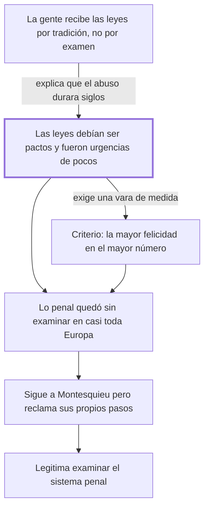

# Introducción

## 1. Idea principal

Las leyes debían ser pactos entre hombres libres y fueron improvisaciones útiles a pocos; el criterio para corregirlas es la mayor felicidad repartida entre el mayor número.

Contesta por qué hace falta escribir el libro: no porque falten leyes, sino porque las que hay nacieron mal y nadie las examinó. Acá aparece la vara con la que va a medir cada institución penal.

## 2. Lo esencial del capítulo

Un abuso puede durar siglos sin que nadie lo discuta, y Beccaria da dos razones encadenadas (cap. Introducción). La primera es de interés: quienes se oponen a las leyes previsoras lo hacen porque les conviene, y así en unos queda "todo el poder y la felicidad" y en otros "toda la flaqueza y la miseria". La segunda es de hábito mental: las verdades más palpables desaparecen por su propia simplicidad, porque la gente recibe las impresiones "por tradición, no por examen", y solo reacciona después de mil errores y de males sin número. Sobre ese fondo va el contraste que sostiene toda la obra: las leyes debían ser pactos deliberados entre hombres libres y fueron "partos casuales de una necesidad pasajera"; debían venir de quien examinara la naturaleza humana sin pasión y fueron "instrumento de las pasiones de pocos". El reproche no es al contenido sino al origen, y de ahí saca la legitimidad de criticarlas.

Fija después el patrón de medida que el resto del libro usa sin volver a justificar: "La felicidad mayor colocada en el mayor número, debiera ser el punto a cuyo centro se dirigiesen las acciones de la muchedumbre". Lo enuncia como un deber ser y no lo demuestra: es la unidad de medida que declara antes de empezar a medir. Concede que su siglo ya avanzó —las relaciones entre soberano y súbditos, entre naciones, el comercio animado por la imprenta, que llama "una tácita guerra de industria"— y contra ese fondo marca el hueco: muy pocos examinaron "la crueldad de las penas y la irregularidad de los procedimientos criminales", parte de la legislación "tan principal y tan descuidada en casi toda Europa". Enumera enseguida los horrores concretos, que conviene leer en el original porque el efecto depende de la acumulación. El cierre lo sitúa respecto de Montesquieu: reconoce seguir "las trazas luminosas de este grande hombre" pero pide que se sepan "distinguir mis pasos de los suyos", y apela no a la razón sino a la "dulce conmoción" de las almas sensibles.

## 3. Mapa

## 4. Vocabulario clave

- **Leyes próvidas** — leyes previsoras, que anticipan el daño en vez de reaccionar a él (el autor usa el término sin definirlo).
- **Procedimientos criminales** — las reglas sobre cómo se investiga y se juzga un delito, distintas de las que fijan las penas.
- **La mayor felicidad en el mayor número** — el criterio para juzgar leyes: cuánto bien producen y entre cuántos se reparte.
- **Guerra de industria** — la expresión de Beccaria para la competencia comercial pacífica entre naciones.

## 5. Distinciones que se confunden

- **El origen de una ley vs. su contenido** — Beccaria critica cómo nacieron las leyes penales, no solo qué dicen.
  - Se confunden porque: las dos críticas llevan a la misma conclusión práctica, que hay que reformarlas.
  - Criterio para decidir: ¿el reproche es que la regla es injusta, o que fue dictada por urgencia y por interés de pocos? Acá es lo segundo.
  - Dónde se cae: se resume la Introducción como una denuncia de penas crueles, y se pierde el argumento de legitimidad.

- **La mayor felicidad del mayor número vs. la felicidad de la mayoría** — el criterio pide maximizar el bien y también su reparto, no contentar al bando más grande.
  - Se confunden porque: "mayor número" suena a mayoría, y la fórmula se cita suelta.
  - Criterio para decidir: ¿la medida aumenta el bien total y llega a más gente, o satisface a un grupo a costa de otro?
  - Dónde se cae: se justifica un castigo cruel diciendo que la mayoría lo aprueba, que es lo que el criterio no habilita.

## 6. Autoevaluación

1. ¿Qué se entiende por "la mayor felicidad colocada en el mayor número"? Explique qué mide ese criterio y cuáles son sus implicaciones para juzgar una ley penal.
2. Un gobierno propone endurecer una pena porque las encuestas muestran que la población lo pide. ¿Ese argumento satisface el criterio de Beccaria?

--- No mires esto hasta responder ---

1. Es el patrón de medida que Beccaria declara en la Introducción: "La felicidad mayor colocada en el mayor número, debiera ser el punto a cuyo centro se dirigiesen las acciones de la muchedumbre" (cap. Introducción). Mide dos cosas a la vez y por eso no equivale a la voluntad de la mayoría: cuánto bien produce una ley y entre cuántos se reparte. Se apoya en el diagnóstico previo del capítulo, según el cual las leyes vigentes debían ser pactos deliberados entre hombres libres y fueron "partos casuales de una necesidad pasajera" e "instrumento de las pasiones de pocos": el reproche es al origen, y el criterio es la vara con la que se lo corrige. Su implicación práctica es que toda institución penal queda sujeta a una pregunta de utilidad y reparto, y no de tradición ni de indignación. Conviene retener que Beccaria lo enuncia como un deber ser y no lo demuestra, así que todo el libro descansa en un principio declarado, no probado.
2. No: que una mayoría lo pida no muestra que aumente el bien general ni que se reparta mejor. El criterio mide utilidad y reparto, no aprobación popular, y satisfacer al bando más grande a costa de otro es justamente lo que no habilita. Además choca con el diagnóstico del capítulo, donde la opinión recibida "por tradición, no por examen" es el obstáculo y no la fuente de la ley.

## Flashcards

Cuál es el criterio que propone la Introducción | La mayor felicidad colocada en el mayor número
Qué debían ser las leyes y qué fueron según Beccaria | Debían ser pactos deliberados entre hombres libres; fueron partos casuales de una necesidad pasajera e instrumento de las pasiones de pocos
Por qué desaparecen las verdades más palpables | Por su simplicidad: la gente recibe las impresiones por tradición y no por examen
