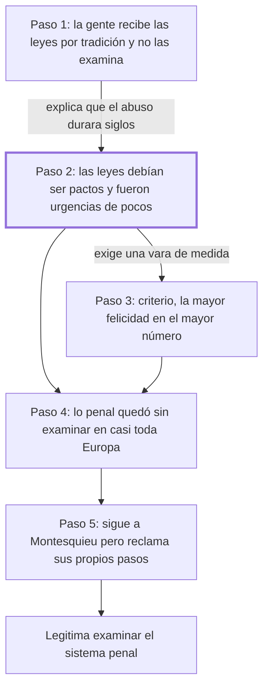

# Introducción

## 1. Idea principal

Las leyes deberían ser pactos acordados entre hombres libres y en la práctica fueron improvisaciones nacidas de urgencias, útiles a unos pocos, y el criterio para corregirlas es la mayor felicidad repartida entre el mayor número.

Esta introducción contesta por qué hace falta escribir el libro: no porque falten leyes, sino porque las que hay nacieron mal y nadie las examinó. A un principiante le conviene entenderla porque acá aparece la vara con la que Beccaria va a medir cada institución penal en los 47 capítulos siguientes. Además, sostiene una tesis incómoda sobre por qué el abuso duró siglos: la gente no razona sobre lo que recibe por tradición, y solo reacciona cuando el daño se hizo insoportable.

## 2. Explicación paso a paso

### Paso 1 — Explica por qué las verdades simples no se ven

El texto abre con "Abandonan los hombres casi siempre las reglas más importantes a la prudencia de un momento" (cap. Introducción). El movimiento es diagnóstico y psicológico antes que jurídico: Beccaria explica por qué un abuso puede durar siglos sin que nadie lo discuta. Da dos razones encadenadas. La primera es de interés: quienes se oponen a las leyes previsoras lo hacen porque les conviene, y así en unos queda "todo el poder y la felicidad" y en otros "toda la flaqueza y la miseria". La segunda es de hábito mental: las verdades más palpables desaparecen por su propia simplicidad, porque la gente recibe las impresiones "por tradición, no por examen". La analogía cotidiana: nadie revisa el contrato que firmó hace veinte años hasta que le cortan el servicio. Importa porque fija el obstáculo que el libro entero intenta vencer, y por eso el estilo de Beccaria será insistente y didáctico.

### Paso 2 — Contrasta lo que las leyes debían ser con lo que fueron

Sigue en "Las historias nos enseñan que debiendo ser las leyes pactos considerados de hombres libres" (cap. Introducción). El movimiento es una comparación en dos columnas, y conviene retenerla porque es el esqueleto de toda la obra. Las leyes debían ser pactos deliberados entre hombres libres y fueron "partos casuales de una necesidad pasajera"; debían ser dictadas por alguien que examinara la naturaleza humana sin pasión y fueron "instrumento de las pasiones de pocos". No dice que las leyes sean malas por su contenido: dice que su origen fue defectuoso. Importa porque de este contraste sale la legitimidad de su crítica: si las leyes hubieran nacido de un pacto razonado, criticarlas sería atacar la voluntad de todos; como nacieron de la urgencia y del interés, examinarlas es repararlas.

### Paso 3 — Fija el criterio: la mayor felicidad en el mayor número

En la misma página aparece la frase que el resto del libro va a usar sin volver a justificar: "La felicidad mayor colocada en el mayor número, debiera ser el punto a cuyo centro se dirigiesen las acciones de la muchedumbre" (cap. Introducción). El movimiento es establecer un patrón de medida. Notar que lo enuncia como un deber ser —"debiera ser"— y no lo demuestra: es el punto de partida que asume. La analogía: es como fijar en qué unidad se va a medir antes de empezar a medir; la elección de la unidad no se prueba, se declara. Y elogia a las pocas naciones que adelantaron con buenas leyes el camino en vez de esperar que el mal se volviera intolerable. Importa porque cada vez que en los capítulos siguientes Beccaria diga que una pena es inútil o excesiva, la medirá con esta regla.

### Paso 4 — Señala qué quedó sin examinar: la materia penal

El párrafo "Conocemos ya las verdaderas relaciones entre el soberano y los súbditos" (cap. Introducción) hace el movimiento de recorte del tema. Beccaria concede que su siglo ya avanzó en varias cosas —las relaciones entre soberano y súbditos, las relaciones entre naciones, el comercio animado por la imprenta— y a esa competencia comercial entre países la llama "una tácita guerra de industria, la más humana y más digna de hombres racionales". Y contra ese fondo de progreso marca el hueco: muy pocos examinaron "la crueldad de las penas y la irregularidad de los procedimientos criminales", que llama parte de la legislación "tan principal y tan descuidada en casi toda Europa". Después enumera los horrores concretos —tormentos, prisiones, la incertidumbre de la propia suerte—; están en el original, leelos ahí, porque el efecto depende de la acumulación y no lo reproduzco. Importa porque acá el libro define su objeto: no la ley en general, sino la penal.

### Paso 5 — Se sitúa respecto de Montesquieu

El cierre, "El inmortal presidente de Montesquieu ha pasado rápidamente sobre esta materia" (cap. Introducción), es un movimiento de posicionamiento. Beccaria reconoce una deuda y a la vez reclama originalidad: dice que la verdad indivisible lo obliga a seguir "las trazas luminosas de este grande hombre", pero pide que los lectores atentos sepan "distinguir mis pasos de los suyos". Conviene leer las dos cosas juntas: la modestia protege —invocar a una autoridad reconocida ampara un libro peligroso— y la reserva reclama lo propio. Y cierra apelando no a la razón sino al sentimiento: quiere inspirar "aquella dulce conmoción con que las almas sensibles responden a quien sostiene los intereses de la humanidad". Importa porque muestra que el libro está escrito para persuadir a un público, no solo para demostrar a especialistas.

## 3. Mapa

## 4. Vocabulario clave

- **Pacto** — acuerdo deliberado entre personas libres; para Beccaria es lo que las leyes debían ser y no fueron.
- **Soberano** — quien tiene el poder de dictar y hacer cumplir las leyes; el depositario de la autoridad pública.
- **Súbdito** — quien está sometido a ese poder; el término supone una relación desigual que Beccaria da por conocida.
- **Leyes próvidas** — leyes previsoras, que anticipan el daño en vez de reaccionar a él (el autor usa el término sin definirlo).
- **Procedimientos criminales** — las reglas sobre cómo se investiga y se juzga un delito, distintas de las que fijan las penas.
- **Magistrado** — el funcionario con autoridad para juzgar o para dictar decisiones públicas.
- **La mayor felicidad en el mayor número** — el criterio para juzgar leyes: cuánto bien producen y entre cuántos se reparte.
- **Guerra de industria** — la expresión de Beccaria para la competencia comercial pacífica entre naciones (cap. Introducción).
- **Verdades útiles** — las que sirven para mejorar la vida común; las que el filósofo arroja "entre la muchedumbre".
- **Naturaleza humana** — el conjunto de rasgos e inclinaciones del ser humano que, según Beccaria, un buen legislador debería examinar sin pasión.

## 5. Distinciones que se confunden

- **El origen de una ley vs. su contenido** — Beccaria critica cómo nacieron las leyes penales, no solo qué dicen.
  - Se confunden porque: las dos críticas llevan a la misma conclusión práctica, que hay que reformarlas.
  - Criterio para decidir: ¿el reproche es que la regla es injusta, o que fue dictada por urgencia y por interés de pocos? En la Introducción es lo segundo.
  - Dónde se cae: se resume la Introducción como una denuncia de penas crueles, y se pierde el argumento de legitimidad que le permite criticarlas sin atacar la autoridad.

- **La mayor felicidad del mayor número vs. la felicidad de la mayoría** — el criterio pide maximizar el bien y también su reparto, no contentar al bando más grande.
  - Se confunden porque: "mayor número" suena a mayoría, y la fórmula se cita suelta.
  - Criterio para decidir: ¿la medida aumenta el bien total y llega a más gente, o solo satisface a un grupo mayoritario a costa de otro? Beccaria mide lo primero.
  - Dónde se cae: se justifica un castigo cruel diciendo que la mayoría lo aprueba, que es precisamente el tipo de razonamiento que su criterio no habilita.

- **Penas vs. procedimientos criminales** — las penas son el castigo; los procedimientos son las reglas para llegar a él.
  - Se confunden porque: Beccaria los nombra en la misma frase y los critica juntos.
  - Criterio para decidir: ¿la objeción es sobre cuánto se castiga o sobre cómo se prueba y se juzga? Lo segundo es procedimiento.
  - Dónde se cae: se contesta que el libro trata sobre las penas, cuando desde la Introducción anuncia las dos materias, y buena parte de los capítulos tratan de la prueba y del proceso.

- **Seguir a un autor vs. repetirlo** — Beccaria reconoce a Montesquieu y a la vez pide que se distingan sus pasos de los de él.
  - Se confunden porque: el elogio es tan enfático que parece pura discipulado.
  - Criterio para decidir: ¿el autor se limita a citar la autoridad, o le marca un límite? Acá dice que Montesquieu pasó "rápidamente" sobre la materia.
  - Dónde se cae: se describe el tratado como una aplicación de Montesquieu al derecho penal, cuando el propio texto reclama distancia.

## 6. Qué releer del original

1. (cap. Introducción) "debiendo ser las leyes pactos considerados de hombres libres" — es la bisagra de la Introducción y la formulación exacta importa: ahí está el contraste entre lo que la ley debía ser y lo que fue.
2. (cap. Introducción) "La felicidad mayor colocada en el mayor número" — es la vara de medida que el resto del libro usa sin volver a justificar; conviene tenerla literal.
3. (cap. Introducción) "Y aun los gemidos de los infelices sacrificados a la cruel ignorancia" — es la enumeración de horrores que el paso 4 deliberadamente no reprodujo, y su efecto depende de leerla completa.
4. (cap. Introducción) "por tradición, no por examen" — es el pasaje que más fácil se malentiende, porque parece un adorno retórico y es en realidad la explicación de por qué el abuso duró siglos.
5. (cap. Introducción) "sabrán distinguir mis pasos de los suyos" — conviene leerlo notando la doble función: reconoce la deuda con Montesquieu y a la vez reclama originalidad.

## 7. Autoevaluación

1. Según Beccaria, ¿qué debían ser las leyes y qué fueron en la práctica?
2. ¿Qué criterio propone para orientar las acciones de la comunidad?
3. ¿Qué parte de la legislación europea considera principal y descuidada?
4. Explicá con tus palabras por qué dice que las verdades más palpables desaparecen por su simplicidad.
5. Reformulá el paso 1: ¿qué dos causas da Beccaria para que un abuso legal se mantenga durante siglos?
6. ¿Por qué es necesario el paso 2? ¿Qué le faltaría al libro si Beccaria no distinguiera el origen de las leyes de su contenido?
7. Un gobierno propone endurecer una pena porque las encuestas muestran que la población lo pide. Usando la distinción del bloque 5, ¿ese argumento satisface el criterio de Beccaria?
8. Alguien afirma que el tratado es una aplicación de las ideas de Montesquieu al derecho penal. ¿Qué parte de esa lectura respalda el texto y qué parte contradice?
9. Beccaria enuncia el criterio de la mayor felicidad del mayor número como un "debiera ser". ¿Lo demuestra en la Introducción? ¿Qué consecuencia tiene eso para el resto del libro?
10. Evaluá el cierre: Beccaria apela a la "dulce conmoción" de las almas sensibles. ¿Es coherente con un libro que se presenta como un examen racional del sistema penal?

--- No mires esto hasta responder ---

1. Debían ser pactos deliberados entre hombres libres, dictados por alguien que examinara la naturaleza humana sin pasión; fueron partos casuales de una necesidad pasajera e instrumento de las pasiones de pocos (cap. Introducción).
2. Que la mayor felicidad esté colocada en el mayor número, como punto hacia el cual se dirijan las acciones de la muchedumbre (cap. Introducción).
3. La que trata de la crueldad de las penas y la irregularidad de los procedimientos criminales, descuidada en casi toda Europa (cap. Introducción).
4. Porque la gente no está acostumbrada a razonar sobre las cosas: recibe las impresiones de una vez y por tradición, no por examen, así que una verdad evidente pasa desapercibida justamente por no exigir esfuerzo (cap. Introducción).
5. Primero, el interés: a quienes les conviene se oponen a las leyes previsoras, y el poder queda en unos y la miseria en otros. Segundo, el hábito: la gente recibe las reglas por tradición y solo reacciona después de mil errores y de males sin número (cap. Introducción).
6. Sin esa distinción, criticar las leyes equivaldría a criticar la voluntad de la comunidad que las dictó. El paso 2 es el que le permite presentar su examen como una reparación de un origen defectuoso y no como un ataque a la autoridad.
7. No: que una mayoría lo pida no muestra que aumente el bien general ni que se reparta mejor. El criterio de Beccaria mide utilidad y reparto, no aprobación popular.
8. El texto respalda que Beccaria sigue las trazas de Montesquieu y lo reconoce como autoridad. Contradice la lectura de que sea una simple aplicación: dice que Montesquieu pasó rápidamente sobre la materia y pide que se distingan sus propios pasos de los de él.
9. No lo demuestra: lo enuncia como un deber ser y lo asume como punto de partida. La consecuencia es que todo el edificio del libro descansa en un criterio no probado, así que quien no lo acepte no queda obligado por las conclusiones. Respuesta discutible: puede sostenerse que en su época era un principio compartido que no requería defensa.
10. Es coherente si se atiende a quién quiere convencer: la Introducción explica que el obstáculo no es la falta de argumentos sino el hábito de no examinar, y contra un hábito la razón sola rinde poco. La apelación al sentimiento es un medio para que el examen llegue a producirse, no un reemplazo del examen. Respuesta discutible: también puede leerse como una concesión retórica que debilita su pretensión de rigor.

## Flashcards

Qué debían ser las leyes según Beccaria | Pactos deliberados entre hombres libres
Qué fueron las leyes en la práctica según Beccaria | Partos casuales de una necesidad pasajera e instrumento de las pasiones de pocos
Cuál es el criterio que propone la Introducción | La mayor felicidad colocada en el mayor número
Demuestra Beccaria ese criterio en la Introducción | No: lo enuncia como un deber ser y lo asume como punto de partida
Por qué desaparecen las verdades más palpables, según Beccaria | Por su propia simplicidad, porque la gente recibe las impresiones por tradición y no por examen
Cuáles son las dos causas de que un abuso legal dure siglos | El interés de quienes se benefician y el hábito de no examinar lo recibido
Qué parte de la legislación europea considera principal y descuidada | La crueldad de las penas y la irregularidad de los procedimientos criminales
Cómo llama Beccaria a la competencia comercial entre naciones | Una tácita guerra de industria
Qué avances de su siglo reconoce Beccaria | Las relaciones entre soberano y súbditos, entre naciones, y el comercio animado por la imprenta
Qué dice Beccaria sobre Montesquieu | Que pasó rápidamente sobre esta materia y que hay que distinguir sus pasos de los propios
Cómo distingo el origen de una ley de su contenido | El origen es cómo se dictó; el contenido es qué manda. Beccaria critica primero el origen
Cómo distingo la mayor felicidad del mayor número de la voluntad de la mayoría | El criterio mide bien producido y su reparto, no cuánta gente aprueba la medida
Cómo distingo penas de procedimientos criminales | Las penas son el castigo; los procedimientos, las reglas para probar y juzgar
Cómo distingo seguir a un autor de repetirlo | Seguirlo admite marcarle límites; Beccaria dice que Montesquieu trató la materia rápidamente
Satisface el criterio de Beccaria endurecer una pena porque la población la pide | No: la aprobación popular no prueba que aumente el bien general ni que se reparta
Qué es una ley próvida | Una ley previsora, que anticipa el daño en vez de reaccionar a él
A quién elogia Beccaria por arrojar las primeras simientes de las verdades útiles | Al filósofo que escribe desde lo oscuro y despreciado de su aposento
A qué apela Beccaria en el cierre de la Introducción | A la dulce conmoción de las almas sensibles, no solo a la razón
Qué reparto describe Beccaria cuando las leyes sirven a pocos | En unos todo el poder y la felicidad, en otros toda la flaqueza y la miseria
Qué materia recorta la Introducción como objeto del libro | La penal: las penas y los procedimientos criminales, no la ley en general
