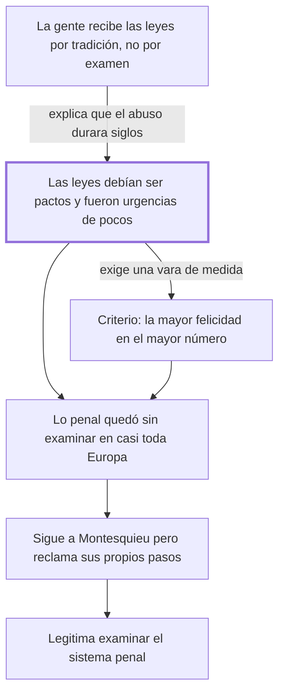

# Introducción

## 1. Idea principal

Las leyes debían ser pactos entre hombres libres y fueron improvisaciones útiles a pocos; el criterio para corregirlas es la mayor felicidad repartida entre el mayor número.

Contesta por qué hace falta escribir el libro: no porque falten leyes, sino porque las que hay nacieron mal y nadie las examinó. Acá aparece la vara con la que va a medir cada institución penal.

## 2. Lo esencial del capítulo

Beccaria empieza explicando por qué un abuso puede durar siglos sin que nadie lo discuta, y da dos razones encadenadas (cap. Introducción). La primera es de interés: quienes se oponen a las leyes previsoras lo hacen porque les conviene, y así en unos queda "todo el poder y la felicidad" y en otros "toda la flaqueza y la miseria". La segunda es de hábito mental: las verdades más palpables desaparecen por su propia simplicidad, porque la gente recibe las impresiones "por tradición, no por examen", y solo reacciona después de mil errores y de males sin número. Nadie revisa el contrato que firmó hace veinte años hasta que le cortan el servicio. Ese es el obstáculo que el libro entero intenta vencer, y explica por qué su estilo va a ser insistente.

Sigue el contraste que es el esqueleto de toda la obra: las leyes debían ser pactos deliberados entre hombres libres y fueron "partos casuales de una necesidad pasajera"; debían ser dictadas por alguien que examinara la naturaleza humana sin pasión y fueron "instrumento de las pasiones de pocos". No dice que las leyes sean malas por su contenido: dice que su origen fue defectuoso. De ahí sale la legitimidad de su crítica, porque si las leyes hubieran nacido de un pacto razonado, criticarlas sería atacar la voluntad de todos.

Acto seguido fija el patrón de medida que el resto del libro usa sin volver a justificar: "La felicidad mayor colocada en el mayor número, debiera ser el punto a cuyo centro se dirigiesen las acciones de la muchedumbre". Conviene notar que lo enuncia como un deber ser y no lo demuestra: es la unidad de medida que declara antes de empezar a medir. Y elogia a las pocas naciones que adelantaron con buenas leyes en vez de esperar que el mal se volviera intolerable.

Después recorta el tema. Concede que su siglo ya avanzó —las relaciones entre soberano y súbditos, entre naciones, el comercio animado por la imprenta, que llama "una tácita guerra de industria"— y contra ese fondo marca el hueco: muy pocos examinaron "la crueldad de las penas y la irregularidad de los procedimientos criminales", parte de la legislación "tan principal y tan descuidada en casi toda Europa". Enumera después los horrores concretos; leelos en el original, porque el efecto depende de la acumulación. El cierre lo sitúa respecto de Montesquieu: reconoce seguir "las trazas luminosas de este grande hombre" pero pide que se sepan "distinguir mis pasos de los suyos", y apela no a la razón sino a la "dulce conmoción" de las almas sensibles.

## 3. Mapa

## 4. Vocabulario clave

- **Leyes próvidas** — leyes previsoras, que anticipan el daño en vez de reaccionar a él (el autor usa el término sin definirlo).
- **Procedimientos criminales** — las reglas sobre cómo se investiga y se juzga un delito, distintas de las que fijan las penas.
- **La mayor felicidad en el mayor número** — el criterio para juzgar leyes: cuánto bien producen y entre cuántos se reparte.
- **Guerra de industria** — la expresión de Beccaria para la competencia comercial pacífica entre naciones.

## 5. Distinciones que se confunden

- **El origen de una ley vs. su contenido** — Beccaria critica cómo nacieron las leyes penales, no solo qué dicen.
  - Se confunden porque: las dos críticas llevan a la misma conclusión práctica, que hay que reformarlas.
  - Criterio para decidir: ¿el reproche es que la regla es injusta, o que fue dictada por urgencia y por interés de pocos? Acá es lo segundo.
  - Dónde se cae: se resume la Introducción como una denuncia de penas crueles, y se pierde el argumento de legitimidad.

- **La mayor felicidad del mayor número vs. la felicidad de la mayoría** — el criterio pide maximizar el bien y también su reparto, no contentar al bando más grande.
  - Se confunden porque: "mayor número" suena a mayoría, y la fórmula se cita suelta.
  - Criterio para decidir: ¿la medida aumenta el bien total y llega a más gente, o satisface a un grupo a costa de otro?
  - Dónde se cae: se justifica un castigo cruel diciendo que la mayoría lo aprueba, que es lo que el criterio no habilita.

## 6. Autoevaluación

1. Un gobierno propone endurecer una pena porque las encuestas muestran que la población lo pide. ¿Ese argumento satisface el criterio de Beccaria?
2. Alguien afirma que el tratado es una aplicación de las ideas de Montesquieu al derecho penal. ¿Qué respalda el texto y qué contradice?
3. Beccaria enuncia su criterio como un "debiera ser". ¿Lo demuestra? ¿Qué consecuencia tiene eso para el resto del libro?
4. El cierre apela a la "dulce conmoción" de las almas sensibles. ¿Es coherente con un libro que se presenta como un examen racional?

--- No mires esto hasta responder ---

1. No: que una mayoría lo pida no muestra que aumente el bien general ni que se reparta mejor. El criterio mide utilidad y reparto, no aprobación popular.
2. Respalda que sigue las trazas de Montesquieu y lo reconoce como autoridad. Contradice que sea una simple aplicación: dice que Montesquieu pasó "rápidamente" sobre la materia y pide distinguir sus propios pasos.
3. No lo demuestra: lo asume como punto de partida. La consecuencia es que todo el edificio descansa en un criterio no probado, así que quien no lo acepte no queda obligado por las conclusiones. Discutible: en su época era un principio compartido.
4. Es coherente si se atiende a quién quiere convencer: el obstáculo que describió no es la falta de argumentos sino el hábito de no examinar, y contra un hábito la razón sola rinde poco. Discutible: también puede leerse como una concesión retórica.

## Flashcards

Qué debían ser las leyes según Beccaria | Pactos deliberados entre hombres libres
Qué fueron las leyes en la práctica según Beccaria | Partos casuales de una necesidad pasajera e instrumento de las pasiones de pocos
Cuál es el criterio que propone la Introducción | La mayor felicidad colocada en el mayor número
Por qué desaparecen las verdades más palpables | Por su simplicidad: la gente recibe las impresiones por tradición y no por examen
Qué parte de la legislación europea considera principal y descuidada | La crueldad de las penas y la irregularidad de los procedimientos criminales
Cómo llama Beccaria a la competencia comercial entre naciones | Una tácita guerra de industria
Qué dice Beccaria sobre Montesquieu | Que pasó rápidamente sobre esta materia y que hay que distinguir sus pasos de los propios
Cómo distingo el origen de una ley de su contenido | El origen es cómo se dictó; el contenido es qué manda. Beccaria critica primero el origen
