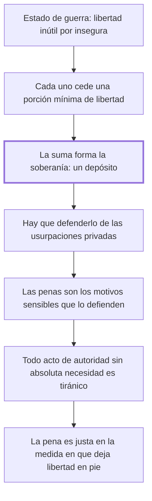

# 1. Origen de la penas + 2. Derecho de castigar

## 1. Idea principal

La soberanía es la suma de las porciones mínimas de libertad que cada uno cedió para vivir seguro, y toda pena que exceda esa necesidad es abuso, no justicia.

Contestan de dónde saca el Estado el derecho a castigar. Son los dos capítulos fundacionales del libro: todo lo que sigue son consecuencias de este par de páginas.

## 2. Lo esencial del capítulo

Las leyes son las condiciones con que hombres independientes y aislados se unieron en sociedad, cansados de un continuo estado de guerra y de una libertad que la incertidumbre volvía inútil (cap. 1). Cada uno sacrificó **una parte** de ella para gozar el resto en tranquilidad, y el conjunto de esas porciones sacrificadas forma la soberanía de una nación, de la que el soberano es "administrador y legítimo depositario", no dueño. Formar el depósito no bastaba: había que defenderlo de las usurpaciones privadas, porque todos procuran no solo retirar su porción sino apoderarse de las ajenas, y para eso hacían falta "motivos sensibles", que son las penas. La razón del nombre es psicológica antes que jurídica: la multitud no adopta principios estables de conducta salvo con motivos que hieran inmediatamente los sentidos, porque ni la elocuencia ni las verdades sublimes sujetan las pasiones que excitan los objetos presentes. La pena no persuade, impresiona.

El segundo capítulo parte de una proposición de Montesquieu —toda pena que no se derive de la absoluta necesidad es tiránica— y la generaliza: **todo acto de autoridad de hombre a hombre** que no se derive de la absoluta necesidad es tiránico (cap. 2). Con eso el fundamento del derecho de castigar queda fijado y a la vez limitado: es la necesidad de defender el depósito de la salud pública de las usurpaciones particulares, y nada más. De ahí la fórmula que gobierna el resto del libro: las penas son tanto más justas cuanto más sagrada e inviolable sea la seguridad y mayor la libertad que el soberano conserva a los súbditos, o sea que la justicia de una pena se mide por cuánta libertad deja en pie y no por cuánto castiga. El cierre agrega un criterio distinto, de eficacia: no puede esperarse ventaja durable de una política moral que no esté fundada en los sentimientos indelebles del hombre, y la ley que se aparte de ellos encontrará una resistencia que al fin la vence. Quedan así dos argumentos superpuestos, uno de legitimidad y otro de eficacia.

## 3. Mapa

## 4. Vocabulario clave

- **Soberanía** — el conjunto de las porciones de libertad que cada uno sacrificó al bien común.
- **Soberano** — quien administra ese depósito; el autor lo llama "administrador y legítimo depositario", no dueño.
- **Motivos sensibles** — las penas, llamadas así porque deben herir los sentidos para contener las pasiones.
- **Derecho de castigar** — la facultad de penar, fundada en la necesidad de defender el depósito de la salud pública.
- **Tiránico** — todo acto de autoridad que no derive de la absoluta necesidad, según la fórmula generalizada de Montesquieu.

## 5. Distinciones que se confunden

- **Ceder una porción vs. entregar la libertad** — el pacto sacrifica el mínimo indispensable, no el todo.
  - Se confunden porque: las dos se describen como someterse a la autoridad para vivir en sociedad.
  - Criterio para decidir: ¿lo que se cedió era necesario para la seguridad? Lo que exceda eso no fue cedido, y el soberano no lo tiene en depósito.
  - Dónde se cae: se atribuye a Beccaria una entrega total al soberano, cuando el mínimo cedido es justamente lo que limita su poder.

- **Que la pena sea necesaria vs. que sea severa** — el fundamento es la necesidad, y la severidad no lo aumenta.
  - Se confunden porque: las dos parecen medir cuán en serio se toma un delito.
  - Criterio para decidir: ¿sin esta pena se derrumba el depósito? Si no, el exceso es tiránico aunque el delito sea grave.
  - Dónde se cae: se justifica agravar una pena por la gravedad del delito, cuando la vara es la necesidad de defender la seguridad común.

## 6. Autoevaluación

1. ¿Cómo funda Beccaria el derecho de castigar? Explique de dónde lo hace nacer y cuáles son sus implicaciones para el límite de la pena.
2. Alguien sostiene que para Beccaria los individuos entregaron su libertad al Estado a cambio de protección. ¿Qué le corregirías?

--- No mires esto hasta responder ---

1. El derecho de castigar nace del pacto social: hombres independientes y aislados, cansados de un continuo estado de guerra y de una libertad que la incertidumbre volvía inútil, sacrificaron cada uno una porción mínima de ella, y la suma de esas porciones forma la soberanía, de la que el soberano es administrador y legítimo depositario, no dueño (cap. 1). Como todos procuran retirar su porción y apoderarse de las ajenas, ese depósito hay que defenderlo, y las penas son los "motivos sensibles" que lo hacen. Su fundamento es entonces la necesidad de defender el depósito de la salud pública, y nada más: siguiendo y generalizando a Montesquieu, todo acto de autoridad de hombre a hombre que no derive de la absoluta necesidad es tiránico (cap. 2). La implicación es que el mismo fundamento sirve de límite: las penas son tanto más justas cuanto más sagrada sea la seguridad y mayor la libertad que el soberano conserva a los súbditos, de modo que se miden por cuánta libertad dejan en pie y no por cuánto castigan.
2. Que cedieron solo una parte, la mínima para vivir seguros, y que el soberano no es dueño sino administrador y depositario de esa suma. El resto de la libertad nunca entró en el pacto, y por eso el mínimo cedido es justamente lo que limita el poder de castigar (cap. 1). Atribuirle una entrega total invierte la tesis: convierte en fuente de poder ilimitado lo que Beccaria construyó como freno.

## Flashcards

Qué es la soberanía según Beccaria | El conjunto de las porciones de libertad que cada uno sacrificó al bien común
Qué papel tiene el soberano respecto de esa soberanía | Es su administrador y legítimo depositario, no su dueño
Qué son los motivos sensibles y por qué hacen falta | Las penas; porque la multitud no adopta principios estables salvo con motivos que hieran los sentidos
Cómo generaliza Beccaria la proposición de Montesquieu | Todo acto de autoridad de hombre a hombre sin absoluta necesidad es tiránico
