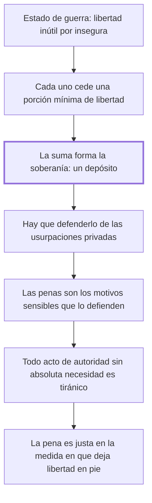

# 1. Origen de la penas + 2. Derecho de castigar

## 1. Idea principal

La soberanía es la suma de las porciones mínimas de libertad que cada uno cedió para vivir seguro, y toda pena que exceda esa necesidad es abuso, no justicia.

Contestan de dónde saca el Estado el derecho a castigar. Son los dos capítulos fundacionales del libro: todo lo que sigue son consecuencias de este par de páginas.

## 2. Lo esencial del capítulo

Las leyes son las condiciones con que hombres independientes y aislados se unieron en sociedad, cansados de un continuo estado de guerra y de una libertad que la incertidumbre volvía inútil (cap. 1). Cada uno sacrificó **una parte** de ella para gozar el resto en tranquilidad, y el conjunto de esas porciones sacrificadas forma la soberanía de una nación. Notar quién es el soberano en esta construcción: su "administrador y legítimo depositario", no su dueño. La libertad cedida está en depósito, y quien la administra responde por ella.

Pero formar el depósito no bastaba: había que defenderlo de las usurpaciones privadas, porque todos procuran no solo retirar su porción sino apoderarse de las ajenas. Para eso hacían falta "motivos sensibles", y las penas son eso. El autor explica por qué los llama así y la razón es psicológica antes que jurídica: la experiencia muestra que la multitud no adopta principios estables de conducta salvo con motivos que hieran inmediatamente los sentidos, porque ni la elocuencia ni las verdades sublimes alcanzan para sujetar las pasiones que excitan los objetos presentes. La pena no persuade, impresiona.

El segundo capítulo saca la consecuencia. Parte de una proposición de Montesquieu —toda pena que no se derive de la absoluta necesidad es tiránica— y la generaliza: **todo acto de autoridad de hombre a hombre** que no se derive de la absoluta necesidad es tiránico (cap. 2). Con eso el fundamento del derecho de castigar queda fijado y a la vez limitado: es la necesidad de defender el depósito de la salud pública de las usurpaciones particulares, y nada más. De ahí la fórmula que gobierna el resto del libro: las penas son tanto más justas cuanto más sagrada e inviolable sea la seguridad y mayor la libertad que el soberano conserva a los súbditos. Es decir que la justicia de una pena se mide por cuánta libertad deja en pie, no por cuánto castiga.

El cierre agrega un criterio de eficacia. Hay que consultar el corazón humano, porque no puede esperarse ventaja durable de una política moral que no esté fundada en los sentimientos indelebles del hombre; cualquier ley que se aparte de ellos encontrará una resistencia que al fin la vence, como una fuerza pequeña pero continua vence a un impulso violento. Conviene ver que ahí se juntan dos argumentos distintos: uno de legitimidad —la pena excesiva es tiránica— y otro de eficacia —además no funciona—.

## 3. Mapa

## 4. Qué releer del original

1. (cap. 1) "El conjunto de todas estas porciones de libertad" — es la definición de soberanía de la que depende todo el libro, y la formulación exacta importa.
2. (cap. 2) "todo acto de autoridad de hombre a hombre que no se derive de la absoluta necesidad, es tiránico" — la generalización de Montesquieu, que es la vara con que se mide cada institución del resto del tratado.
3. (cap. 1) "Llámolos motivos sensibles porque" — es el pasaje que más fácil se pasa por alto: explica por qué el castigo tiene que impresionar y no solo persuadir.

## 5. Vocabulario clave

- **Soberanía** — el conjunto de las porciones de libertad que cada uno sacrificó al bien común.
- **Soberano** — quien administra ese depósito; el autor lo llama "administrador y legítimo depositario", no dueño.
- **Motivos sensibles** — las penas, llamadas así porque deben herir los sentidos para contener las pasiones.
- **Derecho de castigar** — la facultad de penar, fundada en la necesidad de defender el depósito de la salud pública.
- **Tiránico** — todo acto de autoridad que no derive de la absoluta necesidad, según la fórmula generalizada de Montesquieu.

## 6. Distinciones que se confunden

- **Ceder una porción vs. entregar la libertad** — el pacto sacrifica el mínimo indispensable, no el todo.
  - Se confunden porque: las dos se describen como someterse a la autoridad para vivir en sociedad.
  - Criterio para decidir: ¿lo que se cedió era necesario para la seguridad? Lo que exceda eso no fue cedido, y el soberano no lo tiene en depósito.
  - Dónde se cae: se atribuye a Beccaria una entrega total al soberano, cuando el mínimo cedido es justamente lo que limita su poder.

- **Que la pena sea necesaria vs. que sea severa** — el fundamento es la necesidad, y la severidad no lo aumenta.
  - Se confunden porque: las dos parecen medir cuán en serio se toma un delito.
  - Criterio para decidir: ¿sin esta pena se derrumba el depósito? Si no, el exceso es tiránico aunque el delito sea grave.
  - Dónde se cae: se justifica agravar una pena por la gravedad del delito, cuando la vara es la necesidad de defender la seguridad común.

## 7. Autoevaluación

1. Un gobierno agrava una pena argumentando que el delito indigna a la población. Según el cap. 2, ¿alcanza ese argumento?
2. Alguien sostiene que para Beccaria los individuos entregaron su libertad al Estado a cambio de protección. ¿Qué le corregirías?
3. Beccaria dice que la pena debe herir los sentidos porque las verdades sublimes no bastan. ¿Es un argumento sobre lo que la pena debe ser o sobre lo que la gente es?
4. Al final del cap. 2 junta legitimidad y eficacia: la ley que se aparta de los sentimientos humanos es injusta y además fracasa. ¿Le conviene mezclarlas?

--- No mires esto hasta responder ---

1. No. La vara no es la indignación sino la absoluta necesidad de defender el depósito de la salud pública: todo acto de autoridad que no derive de ella es tiránico (cap. 2).
2. Que cedieron solo una parte, la mínima para vivir seguros, y que el soberano no es dueño sino administrador y depositario de esa suma. El resto de la libertad nunca entró en el pacto (cap. 1).
3. Sobre lo que la gente es: es una observación psicológica: la multitud no adopta principios estables salvo con motivos que hieran los sentidos. De ahí deriva cómo debe ser la pena, pero la premisa es descriptiva.
4. Le conviene, porque le da dos frenos independientes: aunque alguien no acepte el argumento de legitimidad, queda el de eficacia. El riesgo es que si una pena cruel resultara eficaz, el segundo argumento no la detendría. Discutible: para Beccaria las dos van juntas porque la crueldad genera resistencia.

## Flashcards

Qué es la soberanía según Beccaria | El conjunto de las porciones de libertad que cada uno sacrificó al bien común
Qué papel tiene el soberano respecto de esa soberanía | Es su administrador y legítimo depositario, no su dueño
Por qué los hombres salieron del estado de guerra | Porque la libertad les era inútil en la incertidumbre de conservarla
Qué son los motivos sensibles | Las penas, llamadas así porque deben herir los sentidos para contener las pasiones
Por qué no bastan la elocuencia y las verdades sublimes | Porque no sujetan por mucho tiempo las pasiones que excitan los objetos presentes
Cuál es la proposición de Montesquieu que Beccaria generaliza | Que toda pena que no derive de la absoluta necesidad es tiránica
Cómo generaliza Beccaria esa proposición | Todo acto de autoridad de hombre a hombre sin absoluta necesidad es tiránico
Cuándo son más justas las penas según el cap. 2 | Cuanto más sagrada sea la seguridad y mayor la libertad que el soberano conserva
