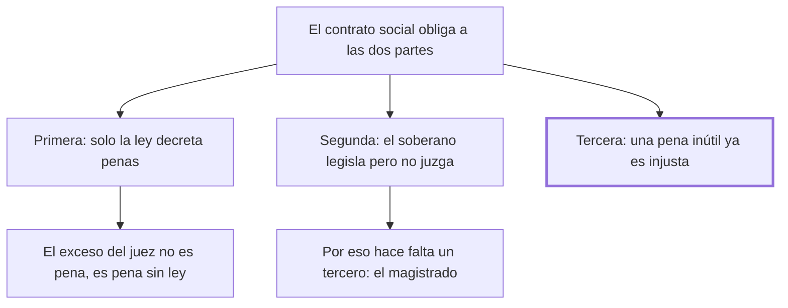

# 3. Consecuencias

## 1. Idea principal

Del pacto se siguen tres consecuencias: solo el legislador fija penas, el juez no puede agravarlas, y una pena inútil ya es por eso injusta.

Contesta qué se deduce de los dos capítulos anteriores. Es el capítulo más corto y el más denso en reglas: casi todo el derecho penal moderno cabe en estas tres.

## 2. Lo esencial del capítulo

La primera consecuencia es que **solo las leyes pueden decretar las penas**, y esa autoridad reside únicamente en el legislador, que representa a toda la sociedad unida por el contrato social; ningún magistrado, que es parte de esa sociedad, puede con justicia decretar penas a su voluntad contra otro miembro. El corolario conviene retenerlo aparte: una pena que sobrepase el límite fijado por la ley contiene la pena justa **más otra adicional**, así que ni con el pretexto del celo o del bien público puede el juez aumentarla (cap. 3). El exceso no es una pena más severa: es una pena sin ley. La segunda consecuencia invierte la dirección del vínculo: si cada miembro está ligado a la sociedad, la sociedad está igualmente ligada con cada miembro por un contrato que "por su naturaleza obliga a las dos partes", desde el trono hasta las chozas más humildes, y violar un pacto útil al mayor número "empieza a autorizar la anarquía".

De la misma consecuencia deduce una regla de organización: el soberano puede formar leyes generales pero **no puede juzgar**, porque la nación se partiría en dos, una representada por el soberano que afirma la violación y otra por el acusado que la niega; hace falta un tercero, y esa es la necesidad del magistrado, cuyas sentencias deben ser inapelables y consistir en meras afirmaciones o negativas de hechos particulares (cap. 3). La tercera consecuencia es la que el resto del libro explota: si se probase que la atrocidad de las penas, aunque no fuera inmediatamente contraria al bien público y al fin de impedir los delitos, **fuese a lo menos inútil**, ya por eso sería contraria a la justicia y a la naturaleza del contrato social. No hace falta demostrar que una pena cruel hace daño: alcanza con mostrar que no sirve, y además se opondría a "una razón iluminada, que prefiere mandar a hombres felices más que a una tropa de esclavos". Advertencia sobre el texto: la conversión intercaló una nota al pie justo en medio de esa tercera consecuencia y partió la frase; está completa, pero desordenada ahí.

## 3. Mapa

## 4. Vocabulario clave

- **Legislador** — quien representa a toda la sociedad unida por el contrato y el único que puede decretar penas.
- **Magistrado** — el tercero que juzga si un hecho ocurrió; es parte de la sociedad y no puede fijar penas.
- **Anarquía** — el estado que empieza a autorizarse cuando se viola un pacto útil al mayor número.

## 5. Distinciones que se confunden

- **Pena excesiva vs. pena sin ley** — para Beccaria un juez que agrava aplica dos cosas: la pena justa y otra adicional que nadie decretó.
  - Se confunden porque: desde afuera se ve una sola sentencia, más dura.
  - Criterio para decidir: ¿hay ley que autorice ese tramo de más? Si no, ese tramo no es pena sino acto de autoridad sin título.
  - Dónde se cae: se discute si el agravamiento fue proporcionado, cuando para Beccaria la cuestión previa es que el juez no tenía facultad.

- **Pena dañina vs. pena inútil** — la tercera consecuencia declara injusta también a la que simplemente no sirve.
  - Se confunden porque: se supone que para condenar una pena hay que mostrar el mal que produce.
  - Criterio para decidir: ¿evita delitos? Si no, sobra, y lo que sobra no fue cedido en el pacto.
  - Dónde se cae: se defiende una pena severa diciendo que al menos no empeora nada, que es exactamente lo que este capítulo no acepta.

## 6. Autoevaluación

1. ¿Qué se entiende por las tres consecuencias que Beccaria deriva del contrato social? Expóngalas y explique sus implicaciones para el reparto de poderes.
2. Un legislador defiende una pena severa diciendo que no está probado que cause daño. ¿Le alcanza según este capítulo?

--- No mires esto hasta responder ---

1. Son las tres reglas que Beccaria deduce del pacto, no las supone (cap. 3). La primera: solo las leyes pueden decretar penas, y esa autoridad reside únicamente en el legislador, que representa a toda la sociedad; el juez que agrava aplica la pena justa más otra adicional que nadie decretó, y ni el celo ni el bien público lo autorizan. La segunda: si cada miembro está ligado a la sociedad, la sociedad está ligada con cada miembro por un contrato que obliga a las dos partes, desde el trono hasta las chozas, y violar un pacto útil al mayor número empieza a autorizar la anarquía. La tercera: una pena que sea a lo menos inútil ya es por eso contraria a la justicia y a la naturaleza del contrato social. Para el reparto de poderes la implicación es doble: el soberano legisla pero no juzga, porque sería juez y parte y la nación quedaría partida en dos, y el magistrado interviene como tercero, con sentencias inapelables que se limitan a afirmar o negar hechos particulares.
2. No. La tercera consecuencia invierte la carga: basta con que la pena sea inútil para que sea contraria a la justicia y al contrato social. No hay que probar el daño; hay que poder probar la utilidad, porque lo que sobra no fue cedido en el pacto.

## Flashcards

Cuáles son las tres consecuencias del contrato social en el cap. 3 | Solo la ley decreta penas; la sociedad está ligada a cada miembro por un contrato que obliga a las dos partes; una pena inútil ya es injusta
Qué aplica un juez que agrava la pena prevista | La pena justa más otra adicional que ninguna ley decretó
Por qué el soberano no puede juzgar | Porque sería juez y parte, y la nación quedaría partida en dos: hace falta un tercero
Cómo distingo una pena dañina de una pena inútil | La dañina produce un mal; la inútil solo no sirve, y para Beccaria eso ya basta para condenarla
