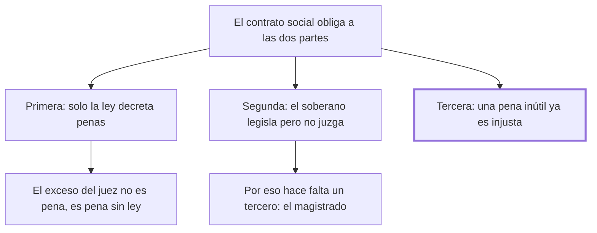

# 3. Consecuencias

## 1. Idea principal

Del pacto se siguen tres consecuencias: solo el legislador fija penas, el juez no puede agravarlas, y una pena inútil ya es por eso injusta.

Contesta qué se deduce de los dos capítulos anteriores. Es el capítulo más corto y el más denso en reglas: casi todo el derecho penal moderno cabe en estas tres.

## 2. Lo esencial del capítulo

La primera consecuencia es que **solo las leyes pueden decretar las penas**, y esa autoridad reside únicamente en el legislador, que representa a toda la sociedad unida por el contrato social. Ningún magistrado —que es parte de esa sociedad— puede con justicia decretar penas a su voluntad contra otro miembro. Y hay un corolario que conviene retener aparte: una pena que sobrepase el límite fijado por la ley contiene la pena justa **más otra adicional**, así que ningún magistrado, ni siquiera con el pretexto del celo o del bien público, puede aumentarla (cap. 3). El exceso no es una pena más severa: es una pena sin ley.

La segunda consecuencia invierte la dirección del vínculo. Si cada miembro está ligado a la sociedad, la sociedad está igualmente ligada con cada miembro por un contrato que "por su naturaleza obliga a las dos partes". Esa obligación desciende desde el trono hasta las chozas más humildes y liga por igual al más grande y al más miserable, y significa que el interés de todos está en la observancia de los pactos útiles al mayor número: violar cualquiera de ellos "empieza a autorizar la anarquía". De ahí sale además una regla de organización que Beccaria deduce, no supone: el soberano puede formar leyes generales pero **no puede juzgar**, porque entonces la nación se partiría en dos, una representada por el soberano que afirma la violación y otra por el acusado que la niega. Hace falta un tercero, y esa es la necesidad del magistrado, cuyas sentencias deben ser inapelables y consistir en meras afirmaciones o negativas de hechos particulares.

La tercera consecuencia es la más filosa y la que el resto del libro va a explotar: si se probase que la atrocidad de las penas, aunque no fuera inmediatamente contraria al bien público y al fin de impedir los delitos, **fuese a lo menos inútil**, ya por eso sería contraria a la justicia y a la naturaleza del contrato social. Es decir que no hace falta demostrar que una pena cruel hace daño: alcanza con mostrar que no sirve. Beccaria agrega que también se opondría a las virtudes de "una razón iluminada, que prefiere mandar a hombres felices más que a una tropa de esclavos".

Conviene advertir que la conversión del escaneo intercaló acá una nota al pie —la que discute la palabra "obligación"— justo en medio de esa tercera consecuencia, partiendo la frase entre "la atrocidad de las" y "penas, si no inmediatamente opuesta". El texto está completo, pero desordenado en ese punto.

## 3. Mapa

## 4. Vocabulario clave

- **Legislador** — quien representa a toda la sociedad unida por el contrato y el único que puede decretar penas.
- **Magistrado** — el tercero que juzga si un hecho ocurrió; es parte de la sociedad y no puede fijar penas.
- **Anarquía** — el estado que empieza a autorizarse cuando se viola un pacto útil al mayor número.

## 5. Distinciones que se confunden

- **Pena excesiva vs. pena sin ley** — para Beccaria un juez que agrava aplica dos cosas: la pena justa y otra adicional que nadie decretó.
  - Se confunden porque: desde afuera se ve una sola sentencia, más dura.
  - Criterio para decidir: ¿hay ley que autorice ese tramo de más? Si no, ese tramo no es pena sino acto de autoridad sin título.
  - Dónde se cae: se discute si el agravamiento fue proporcionado, cuando para Beccaria la cuestión previa es que el juez no tenía facultad.

- **Pena dañina vs. pena inútil** — la tercera consecuencia declara injusta también a la que simplemente no sirve.
  - Se confunden porque: se supone que para condenar una pena hay que mostrar el mal que produce.
  - Criterio para decidir: ¿evita delitos? Si no, sobra, y lo que sobra no fue cedido en el pacto.
  - Dónde se cae: se defiende una pena severa diciendo que al menos no empeora nada, que es exactamente lo que este capítulo no acepta.

## 6. Autoevaluación

1. Un juez, invocando el bien público, impone una pena mayor que la prevista por la ley. Según la primera consecuencia, ¿qué está haciendo exactamente?
2. Un legislador defiende una pena severa diciendo que no está probado que cause daño. ¿Le alcanza según este capítulo?
3. Beccaria deduce la figura del juez del hecho de que el soberano sería juez y parte. ¿Es una razón de justicia o de estructura?
4. Dice que el contrato liga por igual "al más grande y al más miserable". ¿Qué consecuencia práctica tiene esa simetría?

--- No mires esto hasta responder ---

1. Está aplicando la pena justa más otra adicional que ninguna ley decretó. No es una pena más severa: el tramo de exceso carece de título, y ni el celo ni el bien público lo autorizan (cap. 3).
2. No. La tercera consecuencia invierte la carga: basta con que la pena sea inútil para que sea contraria a la justicia y al contrato social. No hay que probar el daño; hay que poder probar la utilidad.
3. De estructura, y por eso es más fuerte. No dice que el soberano sería injusto, sino que la nación quedaría partida en dos partes que afirman y niegan el mismo hecho. Hace falta un tercero por razones lógicas, antes que morales.
4. Que la obligación del soberano no es graciosa sino contractual: si viola un pacto útil al mayor número, empieza a autorizar la anarquía. La simetría convierte el incumplimiento del poder en un problema del mismo orden que el delito.

## Flashcards

Cuál es la primera consecuencia del contrato social según el cap. 3 | Que solo las leyes pueden decretar penas, y solo el legislador tiene esa autoridad
Qué aplica un juez que agrava la pena prevista | La pena justa más otra adicional que ninguna ley decretó
Cuál es la segunda consecuencia | Que la sociedad está ligada a cada miembro por un contrato que obliga a las dos partes
Por qué el soberano no puede juzgar | Porque sería juez y parte, y la nación quedaría partida en dos
Para qué hace falta un magistrado según Beccaria | Para que un tercero juzgue la verdad del hecho
Cómo deben ser las sentencias del magistrado | Inapelables y consistentes en meras afirmaciones o negativas de hechos particulares
Cuál es la tercera consecuencia | Que una pena inútil ya es por eso contraria a la justicia y al contrato social
A quiénes liga el contrato social según el cap. 3 | Por igual al más grande y al más miserable, desde el trono hasta las chozas
