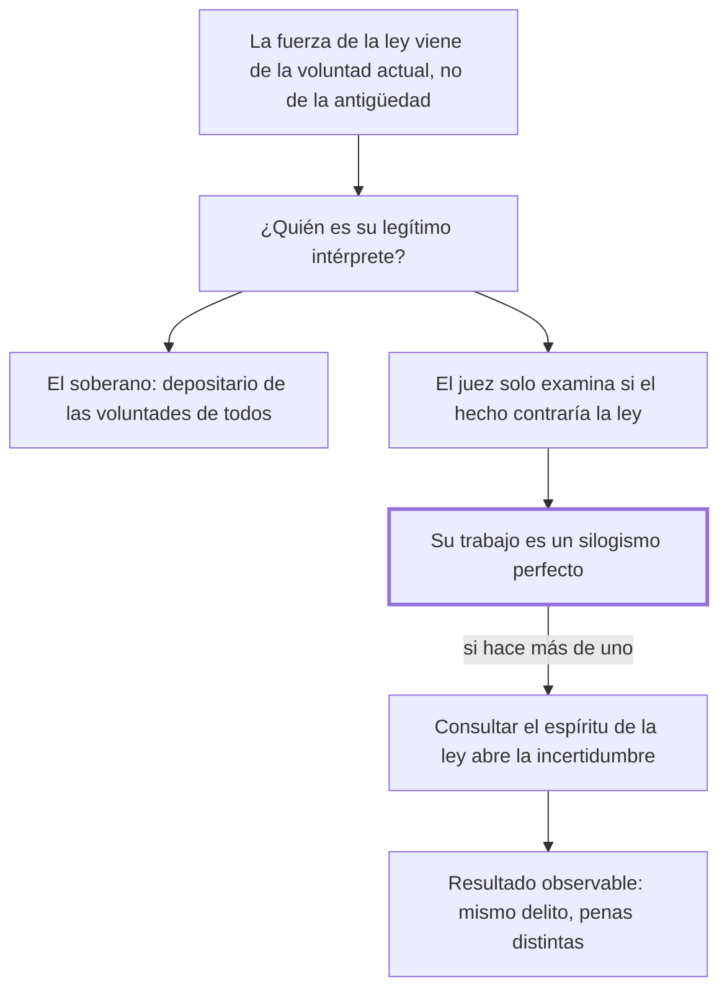

# 4. Interpretación de las leyes

## 1. Idea principal

El juez no puede interpretar la ley penal: debe hacer un silogismo, porque consultar "el espíritu de la ley" entrega la suerte del ciudadano al humor del que juzga.

Contesta quién decide qué dice la ley. Es la cuarta consecuencia del pacto y el capítulo del que sale el principio de legalidad tal como hoy se enseña.

## 2. Lo esencial del capítulo

La autoridad de interpretar las leyes penales no puede residir en los jueces, por la misma razón por la que no pueden dictarlas: no son legisladores (cap. 4). Los jueces no reciben las leyes como una tradición doméstica ni como un testamento de los antiguos padres, porque un juramento antiguo sería nulo —ligaba voluntades que ya no existen— e inicuo —devolvería a los hombres de la sociedad a la barbarie—. Las reciben de la sociedad viviente o del soberano que la representa, como efecto de un juramento tácito o expreso de las voluntades reunidas de los súbditos vivos. Esa es "la física y real autoridad de las leyes": no la antigüedad, sino la voluntad actual.

De ahí la pregunta y la respuesta. Si el legítimo intérprete tiene que ser el depositario de las voluntades actuales de todos, no puede serlo el juez, cuyo oficio es solo examinar si tal hombre hizo o no una acción contraria a la ley. Y a eso se reduce su trabajo, con una fórmula que quedó célebre: en todo delito el juez debe hacer **un silogismo perfecto**, donde la premisa mayor es la ley general, la menor es la acción conforme o no a la ley, y la consecuencia es la libertad o la pena. Cuando el juez, por fuerza o por voluntad, quiere hacer más de un silogismo, "se abre la puerta a la incertidumbre".

El resto del capítulo ataca el axioma de consultar el espíritu de la ley, que llama "un dique roto al torrente de las opiniones". Y el argumento no es formalista sino psicológico, que es lo que lo vuelve incómodo: nuestras ideas tienen conexiones recíprocas y cada hombre tiene su punto de vista, e incluso uno distinto en momentos distintos. Así que el espíritu de la ley sería la resulta de la buena o mala lógica de un juez, de su buena o mala digestión, de la violencia de sus pasiones, de la flaqueza del que sufre, de su relación con el ofendido. Beccaria lo confirma con un hecho observable: la suerte de un ciudadano cambia al pasar por distintos tribunales, y los mismos delitos se castigan de modo diverso por los mismos tribunales en tiempos diversos, porque se consultó "la errante inestabilidad de las interpretaciones" en vez de la voz constante y fija de la ley.

Notar que el argumento no es que interpretar esté mal en abstracto, sino que la interpretación introduce una variable —el estado del juez— que el condenado no eligió y no puede prever. El costo de esta posición, que el capítulo no discute, es qué hacer cuando la ley no prevé el caso.

## 3. Mapa

## 4. Vocabulario clave

- **Interpretación de la ley** — determinar qué dice la ley más allá de su letra; para Beccaria es facultad del soberano, no del juez.
- **Silogismo perfecto** — el razonamiento en tres pasos al que se reduce el oficio del juez: ley, hecho, consecuencia.
- **Espíritu de la ley** — la intención o el sentido que se le atribuye más allá del texto; Beccaria lo llama un dique roto.
- **Voluntades reunidas de los súbditos vivientes** — el fundamento actual de la ley, frente al juramento de generaciones pasadas.

## 5. Distinciones que se confunden

- **Interpretar la ley vs. subsumir el hecho** — lo primero fija qué dice la norma; lo segundo decide si un hecho encaja en ella.
  - Se confunden porque: las dos operaciones ocurren en la misma sentencia y las hace la misma persona.
  - Criterio para decidir: ¿la duda es sobre el alcance de la norma o sobre lo que pasó? Solo la segunda es tarea del juez.
  - Dónde se cae: se responde que Beccaria le prohíbe al juez razonar, cuando le exige un razonamiento preciso y uno solo.

- **La ley obliga por antigua vs. por actual** — el capítulo funda su fuerza en la voluntad viva y descarta el juramento heredado.
  - Se confunden porque: las leyes suelen ser viejas y su prestigio parece venir de ahí.
  - Criterio para decidir: ¿por qué me obliga a mí? Para Beccaria, porque las voluntades reunidas actuales lo sostienen, no porque lo juraran los antepasados.
  - Dónde se cae: se defiende una ley por tradición, y el capítulo llama a ese juramento nulo e inicuo.

## 6. Autoevaluación

1. Un tribunal absuelve invocando el espíritu de la ley, en un caso donde la letra condenaba. Según este capítulo, ¿qué está mal aunque el resultado sea benigno?
2. Beccaria observa que los mismos tribunales castigan igual delito de modo distinto en tiempos distintos. ¿Ese dato prueba su tesis o solo la ilustra?
3. Si el juez solo puede hacer un silogismo, ¿qué pasa cuando la ley no prevé el caso? El capítulo no lo trata: ¿qué se sigue de su posición?
4. El rechazo a la tradición como fuente de obligatoriedad, ¿es coherente con un libro que critica leyes por ser un sedimento de siglos?

--- No mires esto hasta responder ---

1. Que el juez hizo más de un silogismo y con eso abrió la puerta a la incertidumbre. El problema no es el resultado sino que la suerte del ciudadano pasó a depender del criterio del tribunal, y mañana otro puede usar la misma facultad en contra (cap. 4).
2. La ilustra y la apoya, pero no la prueba: la disparidad podría tener otras causas, como leyes distintas o hechos distintos. Es evidencia consistente con la tesis, ofrecida como observación común más que como demostración.
3. Se sigue que debe absolver o que el legislador debe llenar el vacío, nunca que el juez lo complete: completar sería un segundo silogismo. El capítulo no lo dice, y ese silencio es su punto débil, porque ninguna ley prevé todos los casos.
4. Sí, y son la misma tesis vista de los dos lados. Critica esas leyes justamente por regir sin voluntad actual que las sostenga: son opiniones de intérpretes muertos. Fundar la obligatoriedad en la voluntad viva es lo que le permite criticarlas sin atacar a la autoridad presente.

## Flashcards

Por qué no puede el juez interpretar las leyes penales | Por la misma razón por la que no puede dictarlas: no es legislador
De dónde viene la autoridad de las leyes según el cap. 4 | De las voluntades reunidas de los súbditos vivientes, no de un juramento antiguo
Cuáles son las tres partes del silogismo del juez | La ley general, la acción conforme o no a la ley, y la libertad o la pena
Qué pasa cuando el juez hace más de un silogismo | Se abre la puerta a la incertidumbre
Cómo llama Beccaria al axioma de consultar el espíritu de la ley | Un dique roto al torrente de las opiniones
De qué depende el espíritu de la ley según el capítulo | De la lógica, las pasiones y hasta la digestión del juez
Qué hecho observable ofrece como prueba | Que los mismos tribunales castigan el mismo delito de modo diverso en tiempos diversos
Por qué sería nulo el juramento de los antiguos padres | Porque ligaba voluntades que ya no existen
