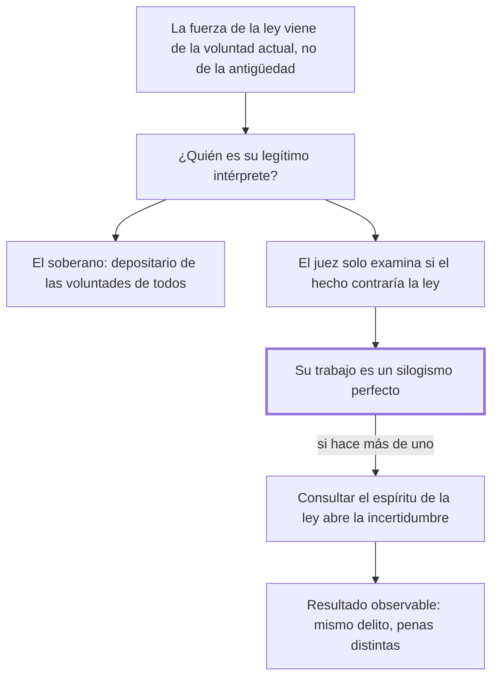

# 4. Interpretación de las leyes

## 1. Idea principal

El juez no puede interpretar la ley penal: debe hacer un silogismo, porque consultar "el espíritu de la ley" entrega la suerte del ciudadano al humor del que juzga.

Contesta quién decide qué dice la ley. Es la cuarta consecuencia del pacto y el capítulo del que sale el principio de legalidad tal como hoy se enseña.

## 2. Lo esencial del capítulo

La autoridad de interpretar las leyes penales no puede residir en los jueces, por la misma razón por la que no pueden dictarlas: no son legisladores (cap. 4). No reciben las leyes como un testamento de los antiguos padres, porque un juramento antiguo sería nulo —ligaba voluntades que ya no existen— e inicuo; las reciben de la sociedad viviente o del soberano que la representa, como efecto de un juramento tácito o expreso de las voluntades reunidas de los súbditos vivos. Esa es "la física y real autoridad de las leyes": no la antigüedad, sino la voluntad actual. Si el legítimo intérprete tiene que ser el depositario de esas voluntades, no puede serlo el juez, cuyo oficio es solo examinar si tal hombre hizo o no una acción contraria a la ley: en todo delito debe hacer **un silogismo perfecto**, con la ley general por premisa mayor, la acción conforme o no a ella por menor, y la libertad o la pena por consecuencia. Cuando quiere hacer más de un silogismo, "se abre la puerta a la incertidumbre".

Contra el axioma de consultar el espíritu de la ley —"un dique roto al torrente de las opiniones"— el argumento no es formalista sino psicológico: cada hombre tiene su punto de vista, e incluso uno distinto en momentos distintos, de modo que ese espíritu resultaría de la buena o mala lógica del juez, de su digestión, de la violencia de sus pasiones, de su relación con el ofendido (cap. 4). Lo confirma con un hecho observable: los mismos delitos se castigan de modo diverso por los mismos tribunales en tiempos diversos, porque se consultó "la errante inestabilidad de las interpretaciones" en vez de la voz constante y fija de la ley. La objeción no es que interpretar esté mal en abstracto, sino que introduce una variable —el estado del juez— que el condenado no eligió y no puede prever. Qué hacer cuando la ley no prevé el caso es el costo de esta posición, y el capítulo no lo discute.

## 3. Mapa

## 4. Vocabulario clave

- **Interpretación de la ley** — determinar qué dice la ley más allá de su letra; para Beccaria es facultad del soberano, no del juez.
- **Silogismo perfecto** — el razonamiento en tres pasos al que se reduce el oficio del juez: ley, hecho, consecuencia.
- **Espíritu de la ley** — la intención o el sentido que se le atribuye más allá del texto; Beccaria lo llama un dique roto.
- **Voluntades reunidas de los súbditos vivientes** — el fundamento actual de la ley, frente al juramento de generaciones pasadas.

## 5. Distinciones que se confunden

- **Interpretar la ley vs. subsumir el hecho** — lo primero fija qué dice la norma; lo segundo decide si un hecho encaja en ella.
  - Se confunden porque: las dos operaciones ocurren en la misma sentencia y las hace la misma persona.
  - Criterio para decidir: ¿la duda es sobre el alcance de la norma o sobre lo que pasó? Solo la segunda es tarea del juez.
  - Dónde se cae: se responde que Beccaria le prohíbe al juez razonar, cuando le exige un razonamiento preciso y uno solo.

- **La ley obliga por antigua vs. por actual** — el capítulo funda su fuerza en la voluntad viva y descarta el juramento heredado.
  - Se confunden porque: las leyes suelen ser viejas y su prestigio parece venir de ahí.
  - Criterio para decidir: ¿por qué me obliga a mí? Para Beccaria, porque las voluntades reunidas actuales lo sostienen, no porque lo juraran los antepasados.
  - Dónde se cae: se defiende una ley por tradición, y el capítulo llama a ese juramento nulo e inicuo.

## 6. Autoevaluación

1. ¿Qué entender por la prohibición de interpretar las leyes penales? Explique en qué consiste el oficio que Beccaria le deja al juez y cuáles son sus implicaciones.
2. Un tribunal absuelve invocando el espíritu de la ley, en un caso donde la letra condenaba. Según este capítulo, ¿qué está mal aunque el resultado sea benigno?

--- No mires esto hasta responder ---

1. La autoridad de interpretar las leyes penales no reside en los jueces, por la misma razón por la que no pueden dictarlas: no son legisladores, y el legítimo intérprete tiene que ser el depositario de las voluntades actuales de todos, es decir el soberano (cap. 4). Detrás hay una tesis sobre de dónde viene la fuerza de la ley: no de la antigüedad ni de un juramento de los antiguos padres, que sería nulo porque ligaba voluntades que ya no existen, sino de las voluntades reunidas de los súbditos vivientes. Al juez le queda un solo oficio, examinar si tal hombre hizo o no una acción contraria a la ley, y para eso debe hacer un silogismo perfecto: la ley general como premisa mayor, la acción como menor, la libertad o la pena como consecuencia. La implicación es que consultar "el espíritu de la ley" abre la puerta a la incertidumbre, porque ese espíritu resulta de la lógica, las pasiones y hasta la digestión del juez, y de ahí que los mismos tribunales castiguen igual delito de modo diverso en tiempos diversos.
2. Que el juez hizo más de un silogismo y con eso abrió la puerta a la incertidumbre. El problema no es el resultado sino que la suerte del ciudadano pasó a depender del criterio del tribunal, y mañana otro puede usar la misma facultad en contra (cap. 4). La discusión sobre si absolver era justo llega tarde: la cuestión previa es que el juez no tenía esa facultad.

## Flashcards

Por qué no puede el juez interpretar las leyes penales | Por la misma razón por la que no puede dictarlas: no es legislador, y el intérprete legítimo es el depositario de las voluntades actuales
De dónde viene la autoridad de las leyes según el cap. 4 | De las voluntades reunidas de los súbditos vivientes, no de un juramento antiguo
Cuáles son las tres partes del silogismo perfecto del juez | La ley general, la acción conforme o no a la ley, y la libertad o la pena
