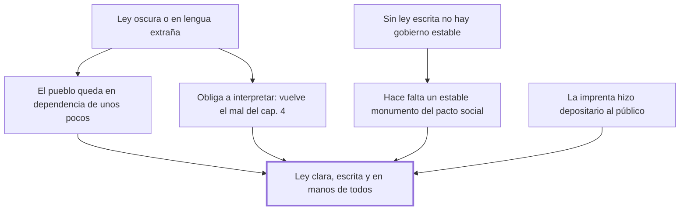

# 5. Oscuridad de las leyes

## 1. Idea principal

Una ley que el pueblo no entiende obliga a interpretarla, y por eso la oscuridad —y sobre todo escribirla en lengua extraña— convierte un libro público en uno privado.

Contesta por qué la ley tiene que ser clara, escrita y accesible. Es el complemento práctico del capítulo anterior: ahí se prohibió interpretar, acá se quita la excusa para hacerlo.

## 2. Lo esencial del capítulo

Si la interpretación es un mal, la oscuridad es otro, y peor, porque "arrastra consigo necesariamente la interpretación" (cap. 5). El caso extremo es la ley escrita en una lengua extraña para el pueblo: pone al ciudadano en la dependencia de unos pocos, ya que no puede juzgar por sí mismo cuál será la suerte de su libertad o de sus miembros. La imagen que resume el daño es que esa lengua "forma de un libro público y solemne uno casi privado y doméstico". Beccaria señala además que la costumbre estaba viva en buena parte de la Europa culta, lo que le sirve para mostrar que no discute una hipótesis. De ahí sale la regla positiva: cuantos más sean los que entiendan y tengan entre las manos el código de las leyes, menos frecuentes serán los delitos, porque la ignorancia y la incertidumbre de las penas "ayudan la elocuencia de las pasiones".

La segunda parte deduce de eso la necesidad de la ley escrita. Sin leyes escritas una sociedad no tendrá jamás una forma estable de gobierno, donde la fuerza sea efecto del todo y no de las partes, y donde las leyes —inalterables salvo por la voluntad general— no se corrompan pasando por el tropel de los intereses particulares. El argumento es empírico: la experiencia y la razón muestran que la probabilidad y la certeza de las tradiciones humanas se disminuyen a medida que se apartan de su origen. Si no hay "un estable monumento del pacto social", la ley no resiste ni al tiempo ni a las pasiones. Notar que la escritura no aparece acá como una formalidad sino como la única prueba disponible de qué se pactó.

El cierre es un elogio de la imprenta que vale leer como parte del argumento y no como adorno. La imprenta hizo depositario de las leyes al público y no a algunos particulares, y con eso disipó "aquel espíritu de astucia y de trama" que desaparece con la luz de las ciencias. A eso atribuye Beccaria que en Europa haya disminuido la atrocidad de los delitos. Y aprovecha para invertir un lugar común: la llamada antigua simplicidad y buena fe fue en realidad la época de la superstición, de la sangre en los depósitos del oro, de cada noble hecho un tirano de la plebe; las virtudes dulces —humanidad, beneficencia, tolerancia de los errores— nacieron en el siglo que algunos llaman corrupto. Es su respuesta al conservadurismo que idealiza el pasado.

## 3. Mapa

## 4. Qué releer del original

1. (cap. 5) "forma de un libro público y solemne uno casi privado y doméstico" — es la definición del daño en una sola imagen, y conviene tenerla textual.
2. (cap. 5) "la ignorancia y la incertidumbre de las penas ayudan la elocuencia de las pasiones" — une claridad y prevención en una frase; es el nexo con el cap. 6.
3. (cap. 5) El párrafo final sobre la "antigua simplicidad y buena fe" — es una inversión histórica completa que resumí en dos líneas y que vale leer entera.

## 5. Vocabulario clave

- **Oscuridad de las leyes** — que la ley sea inaccesible por su lengua o su redacción; para Beccaria, causa forzosa de la interpretación.
- **Voluntad general** — la única que puede alterar las leyes, frente a los intereses particulares que las corrompen.
- **Estable monumento del pacto social** — la ley escrita, entendida como la prueba permanente de lo que se pactó.

## 6. Distinciones que se confunden

- **Ley oscura vs. ley injusta** — la oscuridad es un vicio de forma que produce injusticia aunque el contenido sea correcto.
  - Se confunden porque: las dos terminan en una condena que el ciudadano no esperaba.
  - Criterio para decidir: ¿podía saber el ciudadano, antes de actuar, qué le esperaba? Si no, sobra discutir el contenido.
  - Dónde se cae: se defiende una ley oscura diciendo que su solución de fondo es razonable, que es lo que este capítulo no acepta.

- **Publicidad de la ley vs. su mera existencia** — que la ley esté dictada no basta si el pueblo no la tiene entre las manos.
  - Se confunden porque: en los dos casos hay una norma vigente y un texto oficial.
  - Criterio para decidir: ¿cuántos pueden leerla y entenderla? De ese número, dice Beccaria, depende la frecuencia de los delitos.
  - Dónde se cae: se da por publicada una ley que está en latín o en jerga, cuando para el capítulo eso es exactamente la lengua extraña.

## 7. Autoevaluación

1. Un jurista defiende redactar la ley penal en lenguaje técnico para que sea precisa. ¿Cómo respondería este capítulo?
2. Beccaria dice que a más gente que entienda las leyes, menos delitos. ¿Qué supone ese razonamiento sobre quien delinque?
3. ¿Por qué la ley escrita no es para él una formalidad sino una condición de la estabilidad del gobierno?
4. Atribuye a la imprenta la disminución de la atrocidad de los delitos. ¿Es una explicación suficiente?

--- No mires esto hasta responder ---

1. Que la precisión que nadie puede leer no sirve: la ley pasa a ser un libro privado y doméstico y el ciudadano queda en dependencia de unos pocos. La respuesta de Beccaria no es contra el rigor sino contra el rigor inaccesible (cap. 5).
2. Que calcula. Si la ignorancia y la incertidumbre de las penas ayudan la elocuencia de las pasiones, entonces saber con exactitud qué le espera funciona como freno. Es el mismo supuesto de los motivos sensibles del cap. 1.
3. Porque sin un estable monumento del pacto social las leyes se corrompen pasando por el tropel de los intereses particulares, y la certeza de las tradiciones se disminuye al apartarse de su origen. El texto es la prueba de qué se pactó.
4. Es parcial y él mismo la ofrece como observación, no como demostración. La imprenta explica la difusión, pero no por sí sola el cambio de costumbres; el capítulo mezcla el argumento con una tesis más amplia sobre el progreso de las ciencias. Discutible: para Beccaria las dos cosas son la misma, porque la publicidad es lo que disipa la astucia.

## Flashcards

Por qué la oscuridad de la ley es peor que la interpretación | Porque arrastra necesariamente consigo la interpretación
Qué efecto tiene escribir la ley en lengua extraña al pueblo | Convierte un libro público y solemne en uno casi privado y doméstico
Qué relación establece Beccaria entre comprensión de la ley y delitos | Cuantos más entiendan el código de las leyes, menos frecuentes serán los delitos
Qué ayudan la ignorancia y la incertidumbre de las penas | La elocuencia de las pasiones
Por qué hace falta que las leyes estén escritas | Porque sin un estable monumento del pacto social no hay forma estable de gobierno
Qué se disminuye al apartarse de su origen según el cap. 5 | La probabilidad y certeza de las tradiciones humanas
Qué utilidad le reconoce Beccaria a la imprenta | Hizo depositario de las leyes al público y no a algunos particulares
Qué dice del elogio a la antigua simplicidad y buena fe | Que fue la época de la superstición y la sangre, no de las virtudes dulces
