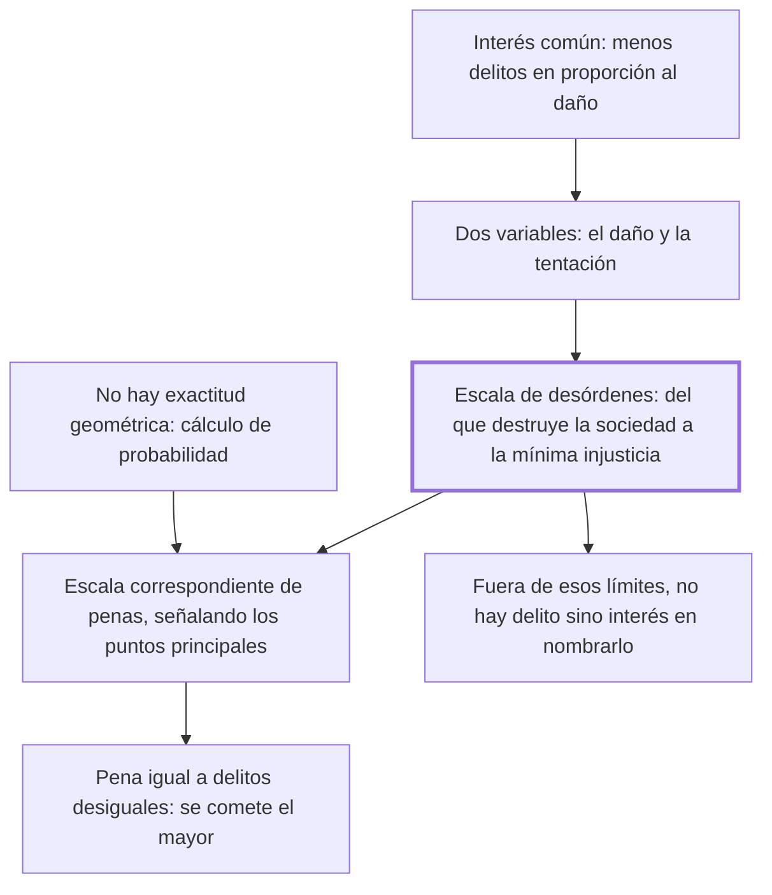

# 6. Proporción entre los delitos y las penas

## 1. Idea principal

Los delitos forman una escala continua según el daño que hacen a la sociedad, y las penas deben seguir esa escala: no hace falta exactitud geométrica, pero sí no castigar el primer grado con la pena del último.

Contesta cómo se decide cuánto castigar. Es el capítulo que da la vara de medida que el resto del libro aplica caso por caso.

## 2. Lo esencial del capítulo

El interés común no es solo que no se cometan delitos, sino que sean menos frecuentes **en proporción al mal que causan** (cap. 6). De ahí la regla: los motivos que retraen del delito deben ser más fuertes a medida que la acción es más contraria al bien público y a medida de los estímulos que inducen a cometerla. Notar que la proporción tiene dos variables, no una: el daño y la tentación. Advierte enseguida que prevenir todos los desórdenes es imposible en el combate universal de las pasiones, así que "en la aritmética política" hay que sustituir la exactitud matemática por el cálculo de probabilidad.

Sigue la imagen que explica qué hace una pena. Hay una fuerza semejante a un cuerpo grave que empuja hacia nuestro bienestar y que solo se detiene a medida de los estorbos que se le oponen; las penas son esos **estorbos políticos**: impiden el mal efecto sin destruir la causa impelente, que es la sensibilidad misma, inseparable del hombre. Por eso el legislador hace como el hábil arquitecto, que se opone a las direcciones ruinosas de la gravedad y mantiene las que sostienen el edificio. No se busca suprimir el interés propio, sino redirigirlo.

De ahí sale la **escala de desórdenes**. Su primer grado son las acciones que destruyen inmediatamente la sociedad; el último, la más pequeña injusticia posible contra un miembro particular. Entre esos dos extremos caben todos los delitos, que van aminorándose "por grados insensibles". Si la geometría fuera adaptable a las acciones humanas debería haber una escala de penas exactamente correspondiente, pero basta con que el sabio legislador señale los puntos principales sin turbar el orden, es decir sin decretar contra los delitos del primer grado las penas del último. Y Beccaria agrega una consecuencia que va más allá del derecho penal: una escala exacta daría una medida común y probable de los grados de tiranía y de libertad de cada nación.

El último tramo saca la conclusión negativa. Cualquier acción fuera de esos dos límites no puede llamarse delito salvo por quien encuentra su interés en darle ese nombre. La incertidumbre de los límites produjo una moral que contradice a la legislación y una multitud de normas que exponen al hombre de bien a penas rigurosas. Leyendo los códigos con ojos de filósofo se ve que los nombres de vicio y virtud cambian con los siglos según las pasiones y errores de los legisladores: las pasiones de un siglo son la base de la moral del siguiente. El cierre es el argumento práctico: si se destina una pena igual a dos delitos que ofenden desigualmente, los hombres no encontrarán estorbo para cometer el mayor cuando hallen en él mayor ventaja.

## 3. Mapa

## 4. Qué releer del original

1. (cap. 6) El párrafo de la escala de desórdenes — es el corazón del capítulo, y la formulación de los dos extremos conviene tenerla literal.
2. (cap. 6) "el legislador hace como el hábil arquitecto" — explica en una imagen por qué la pena no combate la sensibilidad sino su dirección.
3. (cap. 6) El pasaje sobre los nombres de vicio y virtud que cambian con los siglos — es historia y crítica a la vez, y su fuerza depende de la enumeración completa.

## 5. Vocabulario clave

- **Proporción entre delitos y penas** — la correspondencia entre el daño social de la acción y la severidad del castigo.
- **Escala de desórdenes** — la serie continua de delitos, del que destruye la sociedad al de la mínima injusticia particular.
- **Estorbos políticos** — nombre que Beccaria da a las penas: impiden el efecto dañino sin destruir la sensibilidad que lo impulsa.
- **Aritmética política** — el cálculo de probabilidades con que hay que gobernar, en reemplazo de la exactitud matemática.

## 6. Distinciones que se confunden

- **Gravedad del delito vs. maldad del que lo comete** — la escala mide el daño a la sociedad, no la culpa moral del autor.
  - Se confunden porque: se supone que se castiga más al peor, y "peor" suena a moral.
  - Criterio para decidir: ¿cuánto se aparta la acción del bien público? Esa es la posición en la escala; la intención del autor no la mueve.
  - Dónde se cae: se gradúa la pena por lo repugnante del delito, cuando el capítulo la gradúa por el daño y la tentación.

- **Escala exacta vs. puntos principales** — Beccaria niega que la geometría sea aplicable y pide solo no invertir el orden.
  - Se confunden porque: hablar de escala sugiere una tabla precisa de correspondencias.
  - Criterio para decidir: ¿se está castigando un delito del primer grado con la pena del último? Ese es el error que hay que evitar; lo demás es aproximación.
  - Dónde se cae: se le atribuye una pretensión de exactitud matemática que el texto rechaza expresamente.

## 7. Autoevaluación

1. Dos delitos de daño muy distinto reciben la misma pena. Según el cierre del capítulo, ¿qué efecto práctico tiene?
2. La proporción se mide por el daño y también por los estímulos que inducen al delito. ¿Por qué agrega esa segunda variable?
3. Beccaria dice que los nombres de vicio y virtud cambian con las revoluciones de los siglos. ¿Eso lo vuelve relativista?
4. Sostiene que una escala exacta daría la medida de la tiranía y la libertad de una nación. ¿Qué está afirmando ahí?

--- No mires esto hasta responder ---

1. Que los hombres no encontrarán un estorbo fuerte para cometer el mayor, si en él hallan unida mayor ventaja. La desproporción no solo es injusta: es contraproducente, porque iguala el precio de acciones de precio distinto (cap. 6).
2. Porque la pena tiene que competir con el atractivo del delito. Un delito muy tentador necesita más estorbo para producir el mismo efecto disuasivo, aunque su daño sea igual al de otro menos tentador. La proporción es con el daño, pero calibrada por la resistencia que hay que vencer.
3. No: es lo contrario. Denuncia esa variación como prueba de que los legisladores siguieron sus pasiones y no el interés común. Su vara —el daño a la sociedad, entre los dos límites de la escala— pretende ser justamente lo que no cambia con los siglos ni con los ríos y las montañas.
4. Que el derecho penal de un país es un indicador medible de su régimen político. Si las penas siguen la escala del daño, hay libertad; si castigan lo inofensivo o igualan lo desigual, hay tiranía. Es lo que convierte al libro en crítica política y no solo técnica.

## Flashcards

Cuáles son las dos variables de la proporción según el cap. 6 | El mal que el delito causa a la sociedad y los estímulos que inducen a cometerlo
Qué hay que sustituir a la exactitud matemática en la aritmética política | El cálculo de la probabilidad
Cómo llama Beccaria a las penas en la imagen de la fuerza y los estorbos | Estorbos políticos
Qué no destruye la pena según esa imagen | La causa impelente, que es la sensibilidad misma inseparable del hombre
A qué compara al legislador | Al hábil arquitecto que se opone a las direcciones ruinosas de la gravedad
Cuál es el primer grado de la escala de desórdenes | Las acciones que destruyen inmediatamente la sociedad
Cuál es el último grado | La más pequeña injusticia posible contra un miembro particular
Qué pasa si dos delitos desiguales reciben pena igual | Los hombres cometerán el mayor si hallan en él mayor ventaja
