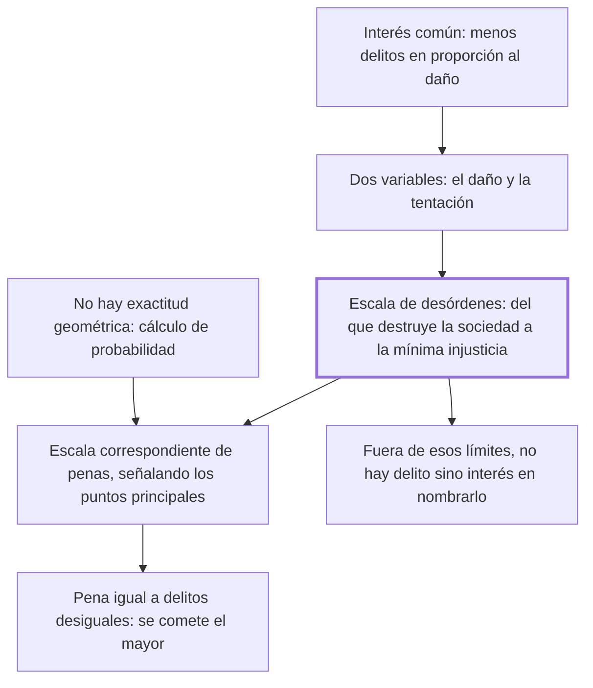

# 6. Proporción entre los delitos y las penas

## 1. Idea principal

Los delitos forman una escala continua según el daño que hacen a la sociedad, y las penas deben seguir esa escala: no hace falta exactitud geométrica, pero sí no castigar el primer grado con la pena del último.

Contesta cómo se decide cuánto castigar. Es el capítulo que da la vara de medida que el resto del libro aplica caso por caso.

## 2. Lo esencial del capítulo

El interés común no es solo que no se cometan delitos, sino que sean menos frecuentes **en proporción al mal que causan** (cap. 6): los motivos que retraen del delito deben ser más fuertes a medida que la acción es más contraria al bien público y a medida de los estímulos que inducen a cometerla. La proporción tiene entonces dos variables y no una, el daño y la tentación. Como prevenir todos los desórdenes es imposible en el combate universal de las pasiones, "en la aritmética política" hay que sustituir la exactitud matemática por el cálculo de probabilidad. La imagen que sigue explica qué hace una pena: hay una fuerza semejante a un cuerpo grave que empuja hacia el bienestar propio y solo se detiene a medida de los estorbos que se le oponen, y las penas son esos **estorbos políticos**, que impiden el mal efecto sin destruir la causa impelente, la sensibilidad misma, inseparable del hombre.

De ahí sale la **escala de desórdenes**: su primer grado son las acciones que destruyen inmediatamente la sociedad y el último la más pequeña injusticia posible contra un miembro particular, y entre esos extremos caben todos los delitos, aminorándose "por grados insensibles" (cap. 6). No hace falta la correspondencia exacta que daría la geometría; basta con que el sabio legislador señale los puntos principales sin turbar el orden, es decir sin decretar contra los delitos del primer grado las penas del último. Beccaria agrega que una escala exacta daría además la medida común de los grados de tiranía y de libertad de cada nación, y que fuera de esos dos límites no hay delito salvo para quien encuentra su interés en darle ese nombre —de ahí que los nombres de vicio y virtud cambien con los siglos según las pasiones de los legisladores—. El cierre es el argumento práctico: si dos delitos que ofenden desigualmente reciben pena igual, los hombres no encontrarán estorbo para cometer el mayor cuando hallen en él mayor ventaja.

## 3. Mapa

## 4. Vocabulario clave

- **Proporción entre delitos y penas** — la correspondencia entre el daño social de la acción y la severidad del castigo.
- **Escala de desórdenes** — la serie continua de delitos, del que destruye la sociedad al de la mínima injusticia particular.
- **Estorbos políticos** — nombre que Beccaria da a las penas: impiden el efecto dañino sin destruir la sensibilidad que lo impulsa.
- **Aritmética política** — el cálculo de probabilidades con que hay que gobernar, en reemplazo de la exactitud matemática.

## 5. Distinciones que se confunden

- **Gravedad del delito vs. maldad del que lo comete** — la escala mide el daño a la sociedad, no la culpa moral del autor.
  - Se confunden porque: se supone que se castiga más al peor, y "peor" suena a moral.
  - Criterio para decidir: ¿cuánto se aparta la acción del bien público? Esa es la posición en la escala; la intención del autor no la mueve.
  - Dónde se cae: se gradúa la pena por lo repugnante del delito, cuando el capítulo la gradúa por el daño y la tentación.

- **Escala exacta vs. puntos principales** — Beccaria niega que la geometría sea aplicable y pide solo no invertir el orden.
  - Se confunden porque: hablar de escala sugiere una tabla precisa de correspondencias.
  - Criterio para decidir: ¿se está castigando un delito del primer grado con la pena del último? Ese es el error que hay que evitar; lo demás es aproximación.
  - Dónde se cae: se le atribuye una pretensión de exactitud matemática que el texto rechaza expresamente.

## 6. Autoevaluación

1. ¿Qué se entiende por proporción entre los delitos y las penas? Explique en qué consiste la escala de desórdenes y cuáles son sus implicaciones.
2. Dos delitos de daño muy distinto reciben la misma pena. Según el cierre del capítulo, ¿qué efecto práctico tiene?

--- No mires esto hasta responder ---

1. La proporción es la correspondencia entre el daño que el delito hace a la sociedad y la fuerza de la pena: los motivos que retraen del delito deben ser más fuertes a medida que la acción es más contraria al bien público y a medida de los estímulos que inducen a cometerla, de modo que la vara tiene dos variables, el daño y la tentación (cap. 6). Su forma es una escala de desórdenes que va desde las acciones que destruyen inmediatamente la sociedad hasta la más pequeña injusticia posible contra un particular, con todos los delitos aminorándose entre esos dos límites por grados insensibles. No exige exactitud geométrica —en la aritmética política se sustituye la exactitud matemática por el cálculo de probabilidad—, sino que el legislador señale los puntos principales sin decretar contra los delitos del primer grado las penas del último. Sus implicaciones son tres: fuera de esos límites no hay delito sino interés en llamarlo así; una escala exacta daría la medida de la tiranía y la libertad de cada nación; y penas iguales para delitos desiguales invitan a cometer el mayor.
2. Que los hombres no encontrarán un estorbo fuerte para cometer el mayor, si en él hallan unida mayor ventaja. La desproporción no solo es injusta: es contraproducente, porque iguala el precio de acciones de precio distinto (cap. 6). Es el argumento con que Beccaria muestra que la severidad indiscriminada trabaja contra su propio fin.

## Flashcards

Cuáles son las dos variables de la proporción según el cap. 6 | El mal que el delito causa a la sociedad y los estímulos que inducen a cometerlo
Cuáles son los dos extremos de la escala de desórdenes | Las acciones que destruyen inmediatamente la sociedad y la más pequeña injusticia posible contra un particular
Cómo llama Beccaria a las penas en la imagen de la fuerza y los estorbos | Estorbos políticos, que impiden el mal efecto sin destruir la sensibilidad del hombre
Qué pasa si dos delitos desiguales reciben pena igual | Los hombres cometerán el mayor si hallan en él mayor ventaja
