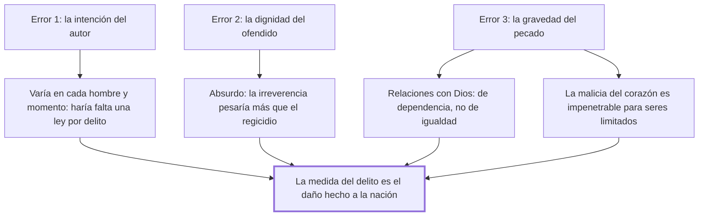

# 7. Errores en la graduación de las penas

## 1. Idea principal

La única medida del delito es el daño hecho a la nación: ni la intención del autor, ni la dignidad del ofendido, ni la gravedad del pecado sirven para graduar la pena.

Contesta con qué **no** se mide un delito. Es el reverso del capítulo anterior: fija la vara descartando las tres alternativas que la tradición usaba.

## 2. Lo esencial del capítulo

La única medida del delito es el daño hecho a la nación, y el capítulo lo establece descartando tres varas. La primera es la **intención**, rechazada por una razón operativa antes que moral: depende de la impresión actual de los objetos y de la disposición previa de la mente, y esas varían en todos los hombres y en cada uno con la velocísima sucesión de las ideas, las pasiones y las circunstancias, de modo que tomarla como medida exigiría no ya un código particular para cada ciudadano sino "una nueva ley para cada delito" (cap. 7); a eso suma el argumento de resultado, porque a veces con la mejor intención se causa el mayor mal. No dice que la intención sea irrelevante para juzgar a una persona, sino que no puede fundar una escala general. La segunda vara es la **dignidad de la persona ofendida**, refutada por reducción al absurdo: si fuera esa, una irreverencia contra el Ser supremo pesaría más que el asesinato de un monarca.

El tercer error, al que dedica más espacio, es medir por la **gravedad del pecado**, y ahí el argumento se apoya en distinguir dos tipos de relación. Entre hombres las relaciones son de igualdad, y del choque de las pasiones y la oposición de los intereses nació la idea de utilidad común, base de la justicia humana; con Dios son de dependencia respecto de un Ser perfecto que "se ha reservado a sí solo el derecho de ser a un mismo tiempo legislador y juez" (cap. 7), de manera que si ya estableció penas eternas nadie puede vindicar a quien se basta a sí mismo. El cierre es epistemológico y es la parte más filosa: la gravedad del pecado depende de "la impenetrable malicia del corazón", que unos seres limitados no pueden conocer sin revelación, y tomarla por norma llevaría a castigar cuando Dios perdona y a perdonar cuando castiga. Beccaria no niega el pecado ni discute teología: separa jurisdicciones y muestra que el juez humano no tiene el dato que necesitaría.

## 3. Mapa

## 4. Vocabulario clave

- **Daño hecho a la nación** — la única medida legítima del delito según este capítulo.
- **Utilidad común** — la base de la justicia humana, nacida del choque de las pasiones entre iguales.
- **Delito y pecado** — el primero se mide por el daño social; el segundo, por una malicia del corazón que no es accesible al juez.

## 5. Distinciones que se confunden

- **Delito vs. pecado** — el delito es una ofensa medible al bien público; el pecado, una relación de dependencia con Dios cuya gravedad el hombre no puede conocer.
  - Se confunden porque: muchas acciones son las dos cosas a la vez y las dos se describen como culpa.
  - Criterio para decidir: ¿qué daño social produjo el hecho? Esa es la pregunta del juez; la malicia interior no la puede responder.
  - Dónde se cae: se agrava una pena por lo pecaminoso de la conducta, que es exactamente el tercer error del capítulo.

- **Relación de igualdad vs. de dependencia** — entre hombres rige la utilidad común; con Dios, una jurisdicción reservada.
  - Se confunden porque: en las dos se habla de ley, de juicio y de pena.
  - Criterio para decidir: ¿quién es legislador y juez? En la primera, la sociedad; en la segunda, un Ser que se reservó los dos papeles.
  - Dónde se cae: se justifica el castigo civil como vindicación de Dios, y Beccaria responde que Dios se basta a sí mismo.

## 6. Autoevaluación

1. ¿Qué se entiende por la verdadera medida de los delitos? Explique con qué tres criterios se los ha querido graduar y por qué el capítulo los descarta.
2. Descartar la intención parece llevar a castigar igual al que mata queriendo y al que mata por accidente. ¿Es esa la consecuencia?

--- No mires esto hasta responder ---

1. La verdadera medida de los delitos es el daño hecho a la nación, y no la intención del autor, la dignidad del ofendido ni la gravedad del pecado (cap. 7). La intención no sirve porque depende de la impresión de los objetos y de la disposición de la mente, que varían en cada hombre y en cada momento, así que exigiría una nueva ley para cada delito, y porque a veces la mejor intención causa el mayor mal. La dignidad del ofendido tampoco, y lo muestra por reducción al absurdo: si la medida fuera la superioridad de quien recibe la ofensa, una irreverencia contra el Ser supremo debería castigarse más atrozmente que el asesinato de un monarca. Y la gravedad del pecado queda fuera por dos razones: las relaciones con Dios son de dependencia frente a un Ser que se reservó ser legislador y juez a la vez, y esa gravedad depende de la impenetrable malicia del corazón, que unos seres limitados no pueden conocer sin revelación. La implicación es que el juez humano solo puede medir lo que está a su alcance, el daño social del hecho.
2. No exactamente. Lo que rechaza es que la intención sea la **medida** de la escala general de delitos, porque es inestable y exigiría una ley por caso. La conducta imprudente y la deliberada producen además daños sociales distintos —la segunda es más previsible y más disuadible—, así que la vara del daño no las iguala. Aun así, el capítulo no desarrolla ese punto y ahí queda flojo.

## Flashcards

Cuál es la verdadera medida de los delitos según el cap. 7 | El daño hecho a la nación
Cuáles son los tres criterios que descarta para graduar la pena | La intención del autor, la dignidad del ofendido y la gravedad del pecado
Por qué no sirve la intención como medida | Porque varía con las ideas, pasiones y circunstancias de cada hombre y momento, y exigiría una nueva ley para cada delito
Cómo distingo el delito del pecado | El delito se mide por el daño social; el pecado, por una malicia del corazón que el juez no puede conocer
