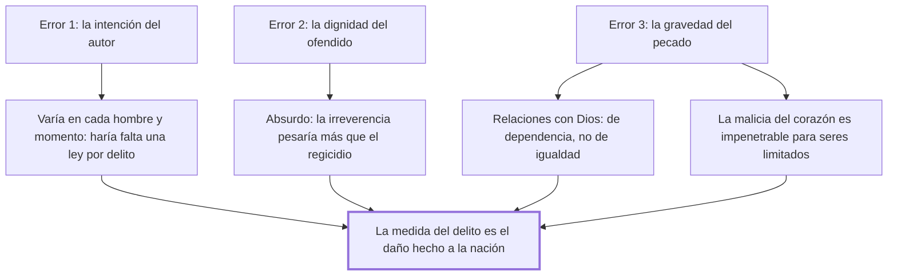

# 7. Errores en la graduación de las penas

## 1. Idea principal

La única medida del delito es el daño hecho a la nación: ni la intención del autor, ni la dignidad del ofendido, ni la gravedad del pecado sirven para graduar la pena.

Contesta con qué **no** se mide un delito. Es el reverso del capítulo anterior: fija la vara descartando las tres alternativas que la tradición usaba.

## 2. Lo esencial del capítulo

El primer error es medir por la **intención**. Beccaria la descarta por una razón operativa antes que moral: la intención depende de la impresión actual de los objetos y de la disposición previa de la mente, y esas varían en todos los hombres y en cada uno con la velocísima sucesión de las ideas, las pasiones y las circunstancias. Si se la tomara como medida haría falta no ya un código particular para cada ciudadano sino "una nueva ley para cada delito" (cap. 7). Y agrega el argumento de resultado: a veces los hombres con la mejor intención causan el mayor mal, y con la peor voluntad hacen el mayor bien. Notar que no dice que la intención sea irrelevante para juzgar a una persona, sino que no puede fundar una escala general.

El segundo error es medir por la **dignidad de la persona ofendida** en vez de por la importancia del hecho respecto del bien público. Lo refuta con una reducción al absurdo: si esa fuera la medida, una irreverencia contra el Ser supremo debería castigarse más atrozmente que el asesinato de un monarca, porque la diferencia de naturaleza es infinita. El absurdo es lo que muestra que el criterio no escala.

El tercer error, y al que dedica más espacio, es medir por la **gravedad del pecado**. Acá el argumento se apoya en distinguir dos tipos de relación. Las relaciones entre hombres son de igualdad, y de la necesidad, del choque de las pasiones y de la oposición de los intereses nació la idea de utilidad común, que es la base de la justicia humana. Las relaciones entre los hombres y Dios son de dependencia respecto de un Ser perfecto que "se ha reservado a sí solo el derecho de ser a un mismo tiempo legislador y juez", porque solo él puede serlo sin inconveniente. De ahí la pregunta retórica: si ya estableció penas eternas, quién será el necio que ose suplir a la divina justicia y vindicar a un Ser que se basta a sí mismo y que obra sin relación.

El cierre es epistemológico y es la parte más filosa. La gravedad del pecado depende de "la impenetrable malicia del corazón", que unos seres limitados no pueden conocer sin revelación; tomarla por norma llevaría a que los hombres castiguen cuando Dios perdona y perdonen cuando castiga. Conviene ver la estrategia: Beccaria no niega el pecado ni discute teología, sino que separa jurisdicciones y muestra que el juez humano no tiene el dato que necesitaría. Es el mismo movimiento del cap. 4 —la incertidumbre del criterio descalifica al criterio— aplicado ahora a la moral religiosa.

## 3. Mapa

## 4. Qué releer del original

1. (cap. 7) "sería, pues, necesario formar no un solo código particular para cada ciudadano, sino una nueva ley para cada delito" — es la refutación de la intención en una frase.
2. (cap. 7) El párrafo sobre las dos clases de relaciones — es el núcleo argumental del capítulo y donde se juega la separación entre delito y pecado.
3. (cap. 7) "podrán los hombres en este caso castigar cuando Dios perdona" — el cierre condensa el argumento epistemológico y conviene tenerlo textual.

## 5. Vocabulario clave

- **Daño hecho a la nación** — la única medida legítima del delito según este capítulo.
- **Utilidad común** — la base de la justicia humana, nacida del choque de las pasiones entre iguales.
- **Delito y pecado** — el primero se mide por el daño social; el segundo, por una malicia del corazón que no es accesible al juez.

## 6. Distinciones que se confunden

- **Delito vs. pecado** — el delito es una ofensa medible al bien público; el pecado, una relación de dependencia con Dios cuya gravedad el hombre no puede conocer.
  - Se confunden porque: muchas acciones son las dos cosas a la vez y las dos se describen como culpa.
  - Criterio para decidir: ¿qué daño social produjo el hecho? Esa es la pregunta del juez; la malicia interior no la puede responder.
  - Dónde se cae: se agrava una pena por lo pecaminoso de la conducta, que es exactamente el tercer error del capítulo.

- **Relación de igualdad vs. de dependencia** — entre hombres rige la utilidad común; con Dios, una jurisdicción reservada.
  - Se confunden porque: en las dos se habla de ley, de juicio y de pena.
  - Criterio para decidir: ¿quién es legislador y juez? En la primera, la sociedad; en la segunda, un Ser que se reservó los dos papeles.
  - Dónde se cae: se justifica el castigo civil como vindicación de Dios, y Beccaria responde que Dios se basta a sí mismo.

## 7. Autoevaluación

1. Un tribunal agrava la pena porque el reo actuó con especial malicia interior. ¿Qué le objetaría este capítulo?
2. Beccaria refuta la dignidad del ofendido con la comparación entre la irreverencia y el regicidio. ¿Por qué funciona ese argumento?
3. Su rechazo a medir por el pecado, ¿es una posición antirreligiosa?
4. Descartar la intención parece llevar a castigar igual al que mata queriendo y al que mata por accidente. ¿Es esa la consecuencia?

--- No mires esto hasta responder ---

1. Que la gravedad del pecado depende de la impenetrable malicia del corazón, que unos seres limitados no pueden conocer sin revelación. El tribunal está usando como norma un dato que no tiene, y así puede castigar cuando Dios perdona (cap. 7).
2. Porque toma el criterio del adversario y lo lleva hasta el final: si la medida es la superioridad del ofendido, la diferencia infinita entre Dios y un rey obliga a una conclusión que nadie sostiene. Un criterio que produce ese resultado no puede ser la medida.
3. No, y está construido para no serlo. Reconoce las penas eternas y la jurisdicción divina; lo que niega es que el juez humano pueda suplirla. Separa competencias en vez de negar una de ellas, y eso le permite atacar el uso penal del pecado sin discutir teología.
4. No exactamente. Lo que rechaza es que la intención sea la **medida** de la escala general de delitos, porque es inestable y exigiría una ley por caso. La conducta imprudente y la deliberada producen además daños sociales distintos —la segunda es más previsible y más disuadible—, así que la vara del daño no las iguala. Aun así, el capítulo no desarrolla ese punto y ahí queda flojo.

## Flashcards

Cuál es la verdadera medida de los delitos según el cap. 7 | El daño hecho a la nación
Por qué no sirve la intención como medida | Porque varía con las ideas, pasiones y circunstancias de cada hombre y momento
Qué haría falta si se midiera por la intención | No un código para cada ciudadano, sino una nueva ley para cada delito
Con qué ejemplo refuta medir por la dignidad del ofendido | Que la irreverencia contra el Ser supremo pesaría más que el asesinato de un monarca
Cómo son las relaciones entre los hombres según este capítulo | De igualdad, con la utilidad común como base de la justicia humana
Cómo son las relaciones entre los hombres y Dios | De dependencia de un Ser que se reservó ser legislador y juez a la vez
De qué depende la gravedad del pecado | De la impenetrable malicia del corazón
Qué riesgo hay en castigar según el pecado | Castigar cuando Dios perdona y perdonar cuando castiga
