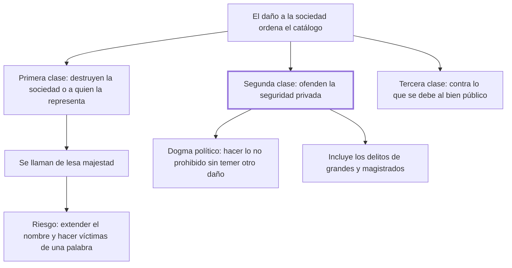

# 8. División de los delitos

## 1. Idea principal

Los delitos se dividen en tres clases según a qué ataquen: los que destruyen la sociedad misma, los que ofenden la seguridad privada y los que contravienen lo que cada uno debe al bien público.

Contesta cómo se ordena el catálogo de delitos una vez fijada la vara del daño. Es el capítulo donde el libro pasa de la teoría a la clasificación, y donde aparece el "dogma político" de la seguridad.

## 2. Lo esencial del capítulo

Beccaria arranca reconociendo que el daño hecho a la sociedad es una verdad palpable, que no necesita "cuadrantes ni telescopios" y que sin embargo solo conocieron unos pocos hombres contemplativos de cada siglo (cap. 8). También aclara el alcance del capítulo: examinar todas las clases de delitos daría un plan inmenso y desagradable, así que se limita a los principios más generales y los errores más comunes, para desengañar tanto a quienes por mal entendido amor de libertad querrían la anarquía como a quienes querrían reducir a los hombres "a una regularidad claustral". El libro no aspira a ser un código.

La división tiene tres clases. Los **primeros** destruyen inmediatamente la sociedad o a quien la representa, y son los mayores: se llaman de lesa majestad. Y acá viene la advertencia que da sentido al capítulo: solo la tiranía y la ignorancia, que confunden vocablos e ideas, pueden dar ese nombre —y por consecuencia la pena mayor— a delitos de naturaleza diferente, haciendo a los hombres "víctimas de una palabra". El argumento de fondo es que cualquier delito ofende a la sociedad, pero no todo delito procura su destrucción inmediata: las acciones morales, como las físicas, tienen su esfera limitada de actividad, circunscrita por el tiempo y el espacio. Confundir esas esferas es obra de la interpretación sofística, "que es ordinariamente la filosofía de la esclavitud".

Los **segundos** son los contrarios a la seguridad de cada particular —vida, bienes u honor—, y como la seguridad es el fin primario de toda sociedad legítima, deben llevar alguna de las penas más considerables. Acá el capítulo se detiene en lo que llama un dogma político: que cada ciudadano pueda hacer todo lo que no es contrario a las leyes sin temer otro inconveniente que el que nazca de la acción misma. Ese dogma es sagrado, sin él no hay sociedad legítima, y es la recompensa justa de la porción de libertad que los hombres sacrificaron. Su efecto no es solo jurídico: forma almas libres y vigorosas y entendimientos despejados, y produce una virtud que sabe resistir al temor, no la "abatida prudencia" del que sufre una existencia precaria.

De ahí sale la consecuencia que Beccaria subraya: bajo esta clase entran no solo los asesinatos y hurtos de los plebeyos sino también los cometidos por los grandes y los magistrados, que son peores porque su influencia se extiende más lejos y con más vigor, destruye en los súbditos las ideas de justicia y obligación y sustituye la justicia por el derecho del más fuerte, en el que terminan peligrando por igual el que lo ejerce y el que lo sufre. La tercera clase queda solo enunciada en este capítulo.

## 3. Mapa

## 4. Qué releer del original

1. (cap. 8) El párrafo de las tres clases — es la clasificación completa y conviene tener la formulación exacta de cada una.
2. (cap. 8) El pasaje del dogma político — resumí su efecto en dos líneas, pero el original desarrolla qué tipo de ciudadano produce, y eso es lo más citado del capítulo.
3. (cap. 8) "la interpretación sofística, que es ordinariamente la filosofía de la esclavitud" — conecta este capítulo con el cap. 4 y explica cómo se estira la lesa majestad.

## 5. Vocabulario clave

- **Lesa majestad** — nombre de los delitos que destruyen inmediatamente la sociedad o a quien la representa; Beccaria advierte contra extenderlo.
- **Seguridad privada** — el derecho de cada ciudadano sobre su vida, sus bienes y su honor; fin primario de toda sociedad legítima.
- **Dogma político** — que cada uno pueda hacer lo no prohibido sin temer más consecuencia que la de la acción misma.
- **Interpretación sofística** — la que confunde esferas de daño distintas; el autor la llama filosofía de la esclavitud.

## 6. Distinciones que se confunden

- **Ofender a la sociedad vs. destruirla inmediatamente** — todo delito hace lo primero; solo la primera clase hace lo segundo.
  - Se confunden porque: se razona que si todo delito daña al conjunto, todo delito atenta contra el Estado.
  - Criterio para decidir: ¿cuál es la esfera de actividad de la acción, en tiempo y espacio? La del hurto no alcanza a la sociedad entera.
  - Dónde se cae: se califica de lesa majestad un delito común, que es cómo la tiranía consigue la pena mayor para cualquier cosa.

- **Delito del particular vs. del magistrado** — el capítulo pone los dos en la misma clase, pero el segundo hace más daño.
  - Se confunden porque: se supone que el abuso de autoridad es una falta administrativa y no un delito contra la seguridad.
  - Criterio para decidir: ¿hasta dónde llega la influencia del autor? La del magistrado destruye en los súbditos las ideas de justicia y obligación.
  - Dónde se cae: se trata el atropello oficial como cuestión de disciplina interna, cuando acá es uno de los mayores delitos.

## 7. Autoevaluación

1. Un gobierno califica de lesa majestad un delito común para aplicarle la pena mayor. Según el capítulo, ¿cuál es el mecanismo del abuso?
2. Beccaria dice que la seguridad forma "almas libres y vigorosas". ¿Por qué le importa el efecto psicológico de una garantía jurídica?
3. ¿Por qué considera peores los delitos de los magistrados que los de los plebeyos?
4. Declara que no va a examinar todas las clases de delitos porque el plan sería inmenso y desagradable. ¿Es una limitación o una decisión de método?

--- No mires esto hasta responder ---

1. Confundir vocablos e ideas: se estira un nombre hasta cubrir delitos de naturaleza diferente, y con el nombre viene la pena. Por eso dice que los hombres son hechos víctimas de una palabra, y llama al procedimiento interpretación sofística (cap. 8).
2. Porque la seguridad no es solo una protección sino la condición de un tipo de ciudadano. Quien teme consecuencias imprevisibles adopta una abatida prudencia; quien sabe que solo responde por lo prohibido puede tener una virtud que resiste al temor. El derecho penal forma carácter, no solo previene.
3. Porque su influencia se extiende a mayor distancia y con mayor vigor: destruye en los súbditos las ideas de justicia y obligación y las reemplaza por el derecho del más fuerte, bajo el cual peligra también quien lo ejerce.
4. De método, y coherente con todo el libro: se propone dar principios generales y denunciar errores comunes, no redactar un código. Es también una defensa preventiva, porque le permite responder a la vez a quienes lo acusan de anarquista y a quienes querrían una regularidad claustral. El costo es que la tercera clase queda apenas enunciada.

## Flashcards

Cuáles son las tres clases de delitos del cap. 8 | Los que destruyen la sociedad, los que ofenden la seguridad privada y los contrarios al bien público
Cómo se llaman los delitos de la primera clase | De lesa majestad
Qué advertencia hace Beccaria sobre ese nombre | Que la tiranía y la ignorancia lo extienden a delitos de otra naturaleza
Qué frase usa para el abuso de las palabras en materia penal | Que hace a los hombres víctimas de una palabra
Cuál es el fin primario de toda sociedad legítima | La seguridad de cada particular en su vida, bienes y honor
En qué consiste el dogma político del cap. 8 | En poder hacer todo lo no contrario a las leyes sin temer otro daño que el de la acción misma
Qué clase de virtud produce ese dogma | Una virtud que sabe resistir al temor, no la abatida prudencia
Por qué son peores los delitos de los grandes y magistrados | Porque destruyen las ideas de justicia y obligación y las sustituyen por el derecho del más fuerte
