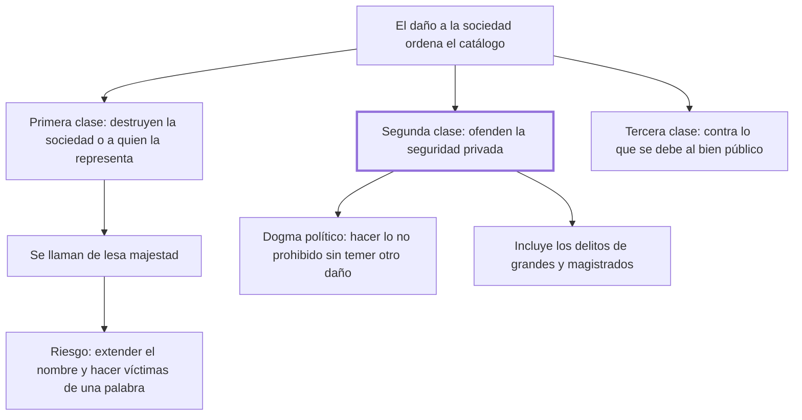

# 8. División de los delitos

## 1. Idea principal

Los delitos se dividen en tres clases según a qué ataquen: los que destruyen la sociedad misma, los que ofenden la seguridad privada y los que contravienen lo que cada uno debe al bien público.

Contesta cómo se ordena el catálogo de delitos una vez fijada la vara del daño. Es el capítulo donde el libro pasa de la teoría a la clasificación, y donde aparece el "dogma político" de la seguridad.

## 2. Lo esencial del capítulo

Beccaria aclara primero el alcance: examinar todas las clases de delitos daría un plan inmenso y desagradable, así que se limita a los principios más generales y los errores más comunes, para desengañar tanto a quienes por mal entendido amor de libertad querrían la anarquía como a quienes reducirían a los hombres "a una regularidad claustral" (cap. 8). El libro no aspira a ser un código. La **primera clase** la forman los delitos que destruyen inmediatamente la sociedad o a quien la representa, llamados de lesa majestad, y ahí va la advertencia que da sentido al capítulo: solo la tiranía y la ignorancia, que confunden vocablos e ideas, dan ese nombre —y con él la pena mayor— a delitos de naturaleza diferente, haciendo a los hombres "víctimas de una palabra". Todo delito ofende a la sociedad, pero no todo procura su destrucción inmediata, porque las acciones morales, como las físicas, tienen su esfera limitada de actividad; confundir esas esferas es obra de la interpretación sofística, "que es ordinariamente la filosofía de la esclavitud".

Los **segundos** son los contrarios a la seguridad de cada particular en su vida, bienes u honor, y como la seguridad es el fin primario de toda sociedad legítima deben llevar alguna de las penas más considerables. Ahí el capítulo se detiene en lo que llama un dogma político: que cada ciudadano pueda hacer todo lo que no es contrario a las leyes sin temer otro inconveniente que el que nazca de la acción misma, dogma sagrado sin el cual no hay sociedad legítima y recompensa justa de la porción de libertad sacrificada; su efecto no es solo jurídico, porque forma almas libres y vigorosas y produce una virtud que sabe resistir al temor, no la "abatida prudencia" del que sufre una existencia precaria (cap. 8). Bajo esta clase entran también los asesinatos y hurtos de los grandes y los magistrados, peores porque su influencia se extiende más lejos y con más vigor, destruye en los súbditos las ideas de justicia y obligación y sustituye la justicia por el derecho del más fuerte. La tercera clase queda solo enunciada.

## 3. Mapa

## 4. Vocabulario clave

- **Lesa majestad** — nombre de los delitos que destruyen inmediatamente la sociedad o a quien la representa; Beccaria advierte contra extenderlo.
- **Seguridad privada** — el derecho de cada ciudadano sobre su vida, sus bienes y su honor; fin primario de toda sociedad legítima.
- **Dogma político** — que cada uno pueda hacer lo no prohibido sin temer más consecuencia que la de la acción misma.
- **Interpretación sofística** — la que confunde esferas de daño distintas; el autor la llama filosofía de la esclavitud.

## 5. Distinciones que se confunden

- **Ofender a la sociedad vs. destruirla inmediatamente** — todo delito hace lo primero; solo la primera clase hace lo segundo.
  - Se confunden porque: se razona que si todo delito daña al conjunto, todo delito atenta contra el Estado.
  - Criterio para decidir: ¿cuál es la esfera de actividad de la acción, en tiempo y espacio? La del hurto no alcanza a la sociedad entera.
  - Dónde se cae: se califica de lesa majestad un delito común, que es cómo la tiranía consigue la pena mayor para cualquier cosa.

- **Delito del particular vs. del magistrado** — el capítulo pone los dos en la misma clase, pero el segundo hace más daño.
  - Se confunden porque: se supone que el abuso de autoridad es una falta administrativa y no un delito contra la seguridad.
  - Criterio para decidir: ¿hasta dónde llega la influencia del autor? La del magistrado destruye en los súbditos las ideas de justicia y obligación.
  - Dónde se cae: se trata el atropello oficial como cuestión de disciplina interna, cuando acá es uno de los mayores delitos.

## 6. Autoevaluación

1. ¿Cómo divide Beccaria los delitos? Ubique cada clase y explique qué implica esa división para la graduación de las penas.
2. Un gobierno califica de lesa majestad un delito común para aplicarle la pena mayor. Según el capítulo, ¿cuál es el mecanismo del abuso?

--- No mires esto hasta responder ---

1. Los delitos se dividen en tres clases según a qué ataquen (cap. 8). La primera la forman los que destruyen inmediatamente la sociedad o a quien la representa, llamados de lesa majestad, y son los mayores. La segunda, los contrarios a la seguridad de cada particular en su vida, bienes u honor; como la seguridad es el fin primario de toda sociedad legítima, deben llevar alguna de las penas más considerables, y en ella entran también los delitos de los grandes y los magistrados, peores porque su influencia destruye en los súbditos las ideas de justicia y obligación y las sustituye por el derecho del más fuerte. La tercera reúne lo que contraviene aquello que cada ciudadano debe al bien público, y el capítulo apenas la enuncia. La implicación es que la pena sigue la clase y no el nombre: extender el rótulo de lesa majestad a delitos de otra naturaleza es el modo en que la tiranía consigue la pena mayor para cualquier cosa.
2. Confundir vocablos e ideas: se estira un nombre hasta cubrir delitos de naturaleza diferente, y con el nombre viene la pena. Por eso dice que los hombres son hechos víctimas de una palabra, y llama al procedimiento interpretación sofística (cap. 8). Lo que desarma el abuso es la esfera de actividad de la acción: la del delito común, limitada por el tiempo y el espacio, no alcanza a la sociedad entera.

## Flashcards

Cuáles son las tres clases de delitos del cap. 8 | Los que destruyen la sociedad, los que ofenden la seguridad privada y los contrarios al bien público
Cómo se llaman los delitos de la primera clase y qué advertencia hace Beccaria | De lesa majestad; que la tiranía y la ignorancia extienden el nombre a delitos de otra naturaleza
Cuál es el fin primario de toda sociedad legítima | La seguridad de cada particular en su vida, bienes y honor
En qué consiste el dogma político del cap. 8 | En poder hacer todo lo no contrario a las leyes sin temer otro daño que el de la acción misma
