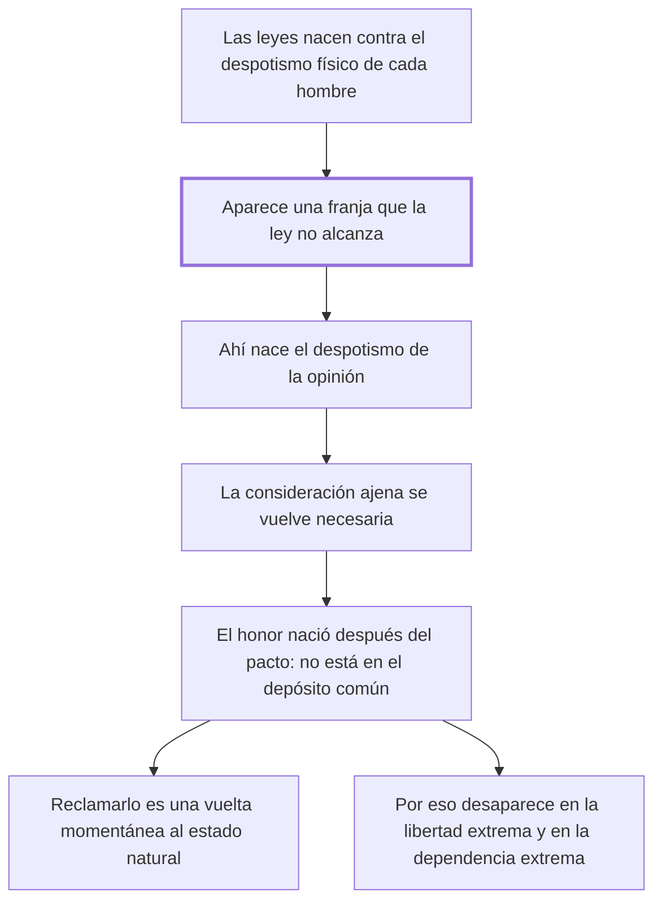

# 9. Del honor

## 1. Idea principal

El honor nació después del pacto, cuando las leyes ya no alcanzaron a proteger todo, así que no está en el depósito común: es una vuelta momentánea al estado natural y por eso choca con las leyes civiles.

Contesta por qué existe un código de honor que compite con la ley. Es el capítulo más conceptual del libro y la clave para entender los dos siguientes, sobre duelos y tranquilidad pública.

## 2. Lo esencial del capítulo

El punto de partida es una contradicción observable: las leyes civiles vigilan celosamente el cuerpo y los bienes de cada ciudadano, y las leyes del honor dan preferencia a la opinión (cap. 9). Y "honor" es una de esas palabras que sostuvieron razonamientos brillantes sin tener significado estable. Beccaria explica por qué las nociones morales son más confusas que las astronómicas con una comparación que conviene retener: como los objetos muy cercanos a los ojos se confunden, la mucha inmediación de las ideas morales hace que se mezclen las ideas simples que las componen. No es que la moral sea oscura por naturaleza: la tenemos demasiado cerca para verla.

Para hallar el "común divisor" de las varias ideas de honor hay que mirar cómo se formaron las sociedades, y ahí está el argumento central. Las primeras leyes nacieron para reparar los desórdenes del **despotismo físico** de cada hombre, y ese sigue siendo el fin declarado de todos los códigos, incluso de los que lo destruyen. Pero el acercamiento de los hombres y el progreso de sus conocimientos generaron una serie infinita de acciones y necesidades recíprocas "siempre superiores a la providencia de las leyes e inferiores al actual poder de cada uno". Esa franja intermedia —lo que la ley no alcanza a regular y el individuo tampoco puede imponer por su fuerza— es donde nace el **despotismo de la opinión**: el único medio de obtener de los demás bienes que la ley no garantiza.

De ahí el retrato de la opinión: atormenta al sabio y al ignorante, da crédito a la apariencia de la virtud más que a la virtud misma y hace parecer misionero al más malvado. La consideración ajena se volvió no solo útil sino necesaria para no quedar por debajo del nivel común; por eso el ambicioso la conquista, el vano la mendiga y el hombre honesto la procura. Y viene la tesis decisiva: como el honor **nació después de la formación de la sociedad, no pudo ser puesto en el depósito común**, y por eso reclamarlo es una vuelta instantánea al estado natural, una sustracción momentánea de la propia persona respecto de unas leyes que en ese caso no la defienden.

El cierre confirma la tesis por los extremos. En la libertad política extrema y en la dependencia extrema las ideas de honor desaparecen: en la primera porque el despotismo de las leyes hace inútil buscar la consideración ajena, y en la segunda porque el despotismo de los hombres anula la existencia civil. El honor es entonces un principio de las monarquías, que son "un despotismo disminuido", y funciona ahí como las revoluciones en los Estados despóticos: un recuerdo al señor de la igualdad antigua.

## 3. Mapa

## 4. Vocabulario clave

- **Honor** — la consideración ajena buscada como necesaria; una idea compleja sin significado estable y nacida después del pacto.
- **Despotismo físico** — el poder de hecho de cada hombre sobre los demás, que las primeras leyes vinieron a reparar.
- **Despotismo de la opinión** — el poder que ejerce el juicio ajeno donde la ley no llega.
- **Despotismo disminuido** — la monarquía, régimen intermedio donde el honor funciona como principio.

## 5. Distinciones que se confunden

- **Honor vs. seguridad** — la seguridad entró en el depósito común al formarse la sociedad; el honor nació después y quedó afuera.
  - Se confunden porque: las dos se defienden como algo propio que otros pueden atacar.
  - Criterio para decidir: ¿estaba eso entre lo que las partes cedieron y garantizaron al pactar? El honor no, y por eso la ley no lo protege.
  - Dónde se cae: se exige a la ley que defienda el honor como defiende la vida, cuando para el capítulo esa exigencia es lo que devuelve al estado natural.

- **Virtud vs. apariencia de virtud** — la opinión premia la segunda y por eso hace parecer misionero al más malvado.
  - Se confunden porque: en el trato social las dos producen el mismo efecto: la consideración ajena.
  - Criterio para decidir: ¿quién es el juez? Si lo es la opinión, basta con parecer; solo la ley puede juzgar el hecho.
  - Dónde se cae: se toma el prestigio social como prueba de mérito, que es exactamente el crédito que Beccaria denuncia.

## 6. Autoevaluación

1. ¿Por qué el honor no puede estar entre lo que los hombres cedieron en el pacto social?
2. Beccaria dice que el honor desaparece tanto en la libertad extrema como en la dependencia extrema. ¿Qué prueba esa simetría?
3. Llama al reclamo del honor "una instantánea vuelta al estado natural". ¿Qué implica eso para el derecho penal?
4. El capítulo explica el honor por su origen histórico. ¿Alcanza una explicación genética para descalificar una institución?

--- No mires esto hasta responder ---

1. Porque nació después de la formación de la sociedad, cuando el trato entre los hombres generó necesidades recíprocas que la ley no alcanzaba a cubrir. El depósito común se formó con lo que existía al pactar; el honor no estaba ahí (cap. 9).
2. Que el honor no es un rasgo humano permanente sino el efecto de un régimen intermedio. Si el poder de la ley es total, la consideración ajena es inútil; si el poder de los hombres es total, no hay existencia civil que sostenerla. El honor vive donde la ley protege algo pero no todo.
3. Que quien lo reclama se sustrae momentáneamente a las leyes, y por eso los delitos del honor no se corrigen con más severidad: hay que quitarles la causa. Es la premisa del capítulo siguiente, donde propone castigar al agresor y no al que se ve obligado a defenderse.
4. No por sí sola: mostrar que algo nació en cierto momento no dice que sea injusto. Pero acá el origen sí importa, porque el criterio de legitimidad del libro es el pacto, y lo que quedó fuera del depósito no tiene título para exigir protección ni para autorizar violencia. Discutible: podría replicarse que las necesidades sociales nuevas piden derecho nuevo, y no la remisión al estado natural.

## Flashcards

Cuál es la contradicción que abre el cap. 9 | Que las leyes civiles guardan cuerpo y bienes y las del honor dan preferencia a la opinión
Por qué son más confusas las ideas morales que las astronómicas | Porque están tan cerca que se mezclan sus ideas simples, como los objetos muy inmediatos a los ojos
Para qué nacieron las primeras leyes y magistrados | Para reparar los desórdenes del despotismo físico de cada hombre
Dónde nace el despotismo de la opinión | En las necesidades superiores a la providencia de las leyes e inferiores al poder de cada uno
Por qué el honor no está en el depósito común | Porque nació después de la formación de la sociedad
Qué es reclamar el honor según Beccaria | Una instantánea vuelta al estado natural y una sustracción momentánea a las leyes
Por qué desaparece el honor en la libertad política extrema | Porque el despotismo de las leyes hace inútil la solicitud de la consideración ajena
De qué régimen es principio fundamental el honor | De las monarquías, que son un despotismo disminuido
