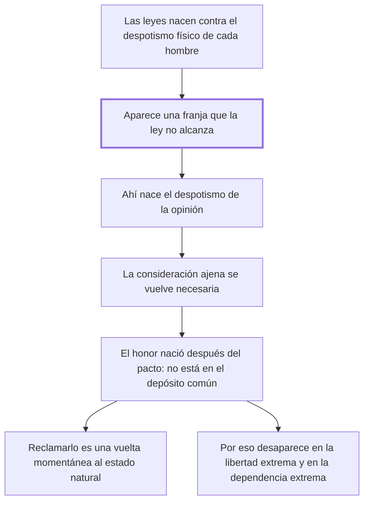

# 9. Del honor

## 1. Idea principal

El honor nació después del pacto, cuando las leyes ya no alcanzaron a proteger todo, así que no está en el depósito común: es una vuelta momentánea al estado natural y por eso choca con las leyes civiles.

Contesta por qué existe un código de honor que compite con la ley. Es el capítulo más conceptual del libro y la clave para entender los dos siguientes, sobre duelos y tranquilidad pública.

## 2. Lo esencial del capítulo

El punto de partida es una contradicción observable: las leyes civiles vigilan celosamente el cuerpo y los bienes de cada ciudadano y las leyes del honor dan preferencia a la opinión (cap. 9), y "honor" es una de esas palabras que sostuvieron razonamientos brillantes sin tener significado estable —las nociones morales se confunden, explica, porque la mucha inmediación de las ideas mezcla las ideas simples que las componen, como pasa con los objetos muy cercanos a los ojos—. Para hallar su "común divisor" hay que mirar cómo se formaron las sociedades. Las primeras leyes nacieron para reparar los desórdenes del **despotismo físico** de cada hombre, pero el acercamiento de los hombres y el progreso de sus conocimientos generaron una serie infinita de acciones y necesidades recíprocas "siempre superiores a la providencia de las leyes e inferiores al actual poder de cada uno": en esa franja intermedia nace el **despotismo de la opinión**, único medio de obtener de los demás los bienes que la ley no garantiza.

La opinión atormenta al sabio y al ignorante, da crédito a la apariencia de la virtud más que a la virtud misma y vuelve la consideración ajena no solo útil sino necesaria para no quedar por debajo del nivel común. De ahí la tesis decisiva: como el honor **nació después de la formación de la sociedad, no pudo ser puesto en el depósito común**, y por eso reclamarlo es una vuelta instantánea al estado natural, una sustracción momentánea de la propia persona respecto de unas leyes que en ese caso no la defienden (cap. 9). El cierre confirma la tesis por los extremos: en la libertad política extrema el despotismo de las leyes hace inútil buscar la consideración ajena, y en la dependencia extrema el despotismo de los hombres anula la existencia civil, de modo que el honor es principio de las monarquías, que son "un despotismo disminuido", donde funciona como las revoluciones en los Estados despóticos, recordándole al señor la igualdad antigua.

## 3. Mapa

## 4. Vocabulario clave

- **Honor** — la consideración ajena buscada como necesaria; una idea compleja sin significado estable y nacida después del pacto.
- **Despotismo físico** — el poder de hecho de cada hombre sobre los demás, que las primeras leyes vinieron a reparar.
- **Despotismo de la opinión** — el poder que ejerce el juicio ajeno donde la ley no llega.
- **Despotismo disminuido** — la monarquía, régimen intermedio donde el honor funciona como principio.

## 5. Distinciones que se confunden

- **Honor vs. seguridad** — la seguridad entró en el depósito común al formarse la sociedad; el honor nació después y quedó afuera.
  - Se confunden porque: las dos se defienden como algo propio que otros pueden atacar.
  - Criterio para decidir: ¿estaba eso entre lo que las partes cedieron y garantizaron al pactar? El honor no, y por eso la ley no lo protege.
  - Dónde se cae: se exige a la ley que defienda el honor como defiende la vida, cuando para el capítulo esa exigencia es lo que devuelve al estado natural.

- **Virtud vs. apariencia de virtud** — la opinión premia la segunda y por eso hace parecer misionero al más malvado.
  - Se confunden porque: en el trato social las dos producen el mismo efecto: la consideración ajena.
  - Criterio para decidir: ¿quién es el juez? Si lo es la opinión, basta con parecer; solo la ley puede juzgar el hecho.
  - Dónde se cae: se toma el prestigio social como prueba de mérito, que es exactamente el crédito que Beccaria denuncia.

## 6. Autoevaluación

1. ¿Qué se entiende por honor en este capítulo? Explique cómo se originó y por qué choca con las leyes civiles.
2. El capítulo explica el honor por su origen histórico. ¿Alcanza una explicación genética para descalificar una institución?

--- No mires esto hasta responder ---

1. El honor es la consideración ajena vuelta necesaria: el poder que ejerce el juicio de los demás allí donde la ley no llega, y que Beccaria llama despotismo de la opinión (cap. 9). Su origen es histórico y explica todo lo demás: las primeras leyes nacieron para reparar los desórdenes del despotismo físico de cada hombre, pero el trato entre los hombres generó necesidades recíprocas superiores a la providencia de las leyes e inferiores al poder de cada uno, y en esa franja intermedia apareció el honor. De ahí la tesis central: como nació después de la formación de la sociedad, no pudo ser puesto en el depósito común. Por eso choca con las leyes civiles, que guardan el cuerpo y los bienes mientras las del honor dan preferencia a la opinión: reclamarlo es una instantánea vuelta al estado natural, una sustracción momentánea a unas leyes que en ese caso no defienden a quien lo invoca. Y por eso desaparece tanto en la libertad política extrema como en la dependencia extrema, y queda como principio de las monarquías, que son un despotismo disminuido.
2. No por sí sola: mostrar que algo nació en cierto momento no dice que sea injusto. Pero acá el origen sí importa, porque el criterio de legitimidad del libro es el pacto, y lo que quedó fuera del depósito no tiene título para exigir protección ni para autorizar violencia. Discutible: podría replicarse que las necesidades sociales nuevas piden derecho nuevo, y no la remisión al estado natural.

## Flashcards

Por qué el honor no está en el depósito común | Porque nació después de la formación de la sociedad, cuando las leyes ya no alcanzaban a cubrirlo todo
Dónde nace el despotismo de la opinión | En las necesidades superiores a la providencia de las leyes e inferiores al poder de cada uno
Qué es reclamar el honor según Beccaria | Una instantánea vuelta al estado natural y una sustracción momentánea a las leyes
Cómo distingo el honor de la seguridad | La seguridad entró en el depósito común al pactar; el honor nació después y quedó fuera
