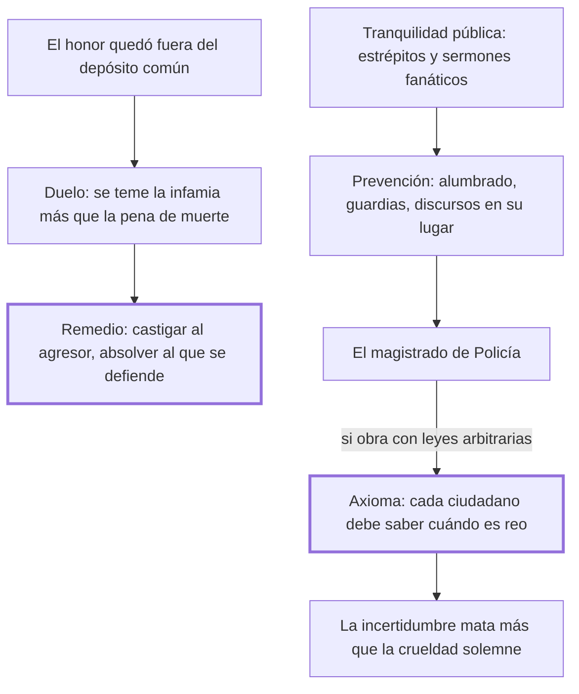

# 10. De los duelos + 11. De la tranquilidad pública

## 1. Idea principal

El duelo no se extirpa con penas de muerte sino castigando al agresor que lo provocó, y la tranquilidad pública no se guarda con magistrados arbitrarios sino con un código que todos puedan leer.

Contestan qué hacer con dos clases de desorden que la ley no llegaba a tocar. Cierran la primera parte del libro y anuncian las preguntas que ocupan el resto.

## 2. Lo esencial del capítulo

Los duelos privados nacieron de la necesidad del favor ajeno y tuvieron su origen "en la anarquía de las leyes" (cap. 10). Beccaria conjetura por qué los antiguos no los conocían: el duelo era el espectáculo que daban gladiadores esclavos y envilecidos, así que un hombre libre se desdeñaba de parecerse a ellos. Lo importante es el diagnóstico de por qué la amenaza de muerte fracasó: la costumbre se funda en algo que ciertos hombres temen más que a la muerte. Al hombre de honor, perder el favor ajeno lo expone a una vida solitaria —insufrible para un ser sociable— o a insultos y a una infamia que, por repetidos, exceden al peligro de la pena. Y el vulgo no se bate no solo por estar desarmado, sino porque necesita menos la consideración ajena que los nobles, que al estar más arriba se miran con más celos.

De ahí el remedio, que Beccaria presenta como ajeno y no como propio: castigar **al agresor**, es decir a quien dio ocasión al duelo, y declarar inocente a quien sin culpa suya se vio precisado a defender lo que las leyes no aseguran, que es la opinión. Si el honor quedó fuera del depósito común, la solución no es reprimir al que se defiende sino que el Estado muestre "que él teme solo las leyes, no los hombres".

El cap. 11 pasa a la tercera clase de delitos, los que turban la tranquilidad pública: estrépitos en los caminos destinados al comercio y sermones fanáticos, que excitan a la muchedumbre y toman fuerza más del entusiasmo oscuro que de la razón clara, porque esta "nunca obra sobre una gran masa de hombres". Los medios que propone son de prevención y no de castigo: la noche iluminada a expensas públicas, las guardias por cuarteles, los discursos religiosos reservados al silencio de los templos. De eso debe cuidar el magistrado "que los franceses llaman Policía".

Y ahí llega el límite que da valor al capítulo. Si ese magistrado obrara con leyes arbitrarias y no establecidas en un código que circule entre las manos de todos, se abre una puerta a la tiranía. Beccaria formula el axioma sin excepciones: **cada ciudadano debe saber cuándo es reo y cuándo es inocente**. Si hacen falta magistrados arbitrarios, eso nace de la flaqueza de la constitución. Y agrega una observación empírica fuerte: la incertidumbre de la propia suerte ha sacrificado más víctimas que la crueldad pública y solemne, porque el verdadero tirano empieza reinando sobre la opinión, que previene al coraje. El tramo final enumera las preguntas del resto del libro y cierra diciendo que le bastaría arrancar a una sola víctima de la angustia de la muerte.

## 3. Mapa

## 4. Qué releer del original

1. (cap. 10) El párrafo del remedio al duelo — son cuatro líneas que contienen toda la propuesta, y conviene tener la fórmula "teme solo las leyes, no los hombres".
2. (cap. 11) "cada ciudadano debe saber cuándo es reo y cuándo es inocente" — es el axioma más citado de esta parte y Beccaria dice expresamente que no admite excepción.
3. (cap. 11) El párrafo final con las cinco preguntas — funciona como índice del resto del libro y conviene leerlo antes de seguir.

## 5. Vocabulario clave

- **Duelo privado** — el desafío entre particulares, nacido de la anarquía de las leyes y de la necesidad del favor ajeno.
- **Agresor** — quien dio ocasión al duelo; para Beccaria, el único que debe ser castigado.
- **Tranquilidad pública** — la quietud de los ciudadanos en los espacios comunes; objeto de la tercera clase de delitos.
- **Policía** — el magistrado encargado de prevenir la fermentación de las pasiones populares.
- **Leyes arbitrarias** — las no establecidas en un código que circule entre todos; puerta abierta a la tiranía.

## 6. Distinciones que se confunden

- **Castigar al agresor vs. castigar al duelista** — la ley debe alcanzar a quien provocó, no a quien se vio obligado a responder.
  - Se confunden porque: los dos participaron en el mismo hecho y la ley solía castigar a ambos con la muerte.
  - Criterio para decidir: ¿quién puso al otro en la situación? El que defiende lo que las leyes no aseguran no eligió.
  - Dónde se cae: se agrava la pena del duelo para disuadir, cuando el capítulo muestra que la infamia pesa más que la muerte.

- **Prevenir el desorden vs. reprimirlo** — el cap. 11 propone alumbrado, guardias y encauzar los discursos, no penas nuevas.
  - Se confunden porque: las dos son tareas del magistrado y se ejercen sobre las mismas conductas.
  - Criterio para decidir: ¿la medida evita que la situación se produzca, o castiga después? Solo la primera cabe en la policía.
  - Dónde se cae: se le dan al magistrado de policía facultades punitivas sin ley previa, que es la puerta a la tiranía que el capítulo señala.

## 7. Autoevaluación

1. Un Estado decreta la muerte para quien acepte un duelo y la costumbre sigue. Según el cap. 10, ¿por qué falla la amenaza?
2. Beccaria propone declarar inocente al que se batió sin haber provocado. ¿No es eso premiar la violencia privada?
3. ¿Por qué dice que la incertidumbre de la propia suerte hizo más víctimas que la crueldad pública y solemne?
4. Admite que en algunos gobiernos los magistrados arbitrarios son necesarios. ¿Debilita eso su axioma?

--- No mires esto hasta responder ---

1. Porque la costumbre se funda en lo que algunos temen más que a la muerte: quedar sin el favor ajeno, expuestos a la soledad o a una infamia que por repetida excede al peligro de la pena. Una amenaza solo disuade si supera al mal que evita (cap. 10).
2. No, porque el remedio no deja el hecho sin consecuencia: la traslada al agresor, que es quien puso al otro en esa situación. Y el objetivo declarado es que el Estado muestre que teme solo a las leyes, es decir que se haga cargo de proteger la opinión en lugar de dejar el vacío que el duelo llena.
3. Porque la crueldad conocida amotina los ánimos, pero no los envilece: se sabe qué esperar. La incertidumbre, en cambio, deja al ciudadano sin defensa y sin coraje, y el tirano empieza reinando sobre la opinión. Es la misma tesis del cap. 5 sobre la ley oscura, ahora aplicada a la policía.
4. La matiza sin cederla. Dice que esa necesidad nace de la flaqueza de la constitución y no de la naturaleza de un gobierno bien organizado, así que la trata como un síntoma y no como una excepción legítima. Queda igual una tensión: reconoce que en la práctica existen, y el capítulo no dice cómo limitarlos mientras existan.

## Flashcards

De dónde tuvieron origen los duelos privados según Beccaria | De la anarquía de las leyes y de la necesidad del favor ajeno
Por qué fracasan los decretos de muerte contra el duelo | Porque la infamia y la soledad se temen más que la muerte
Por qué el vulgo se bate menos que la nobleza | Porque necesita menos la consideración ajena, además de estar desarmado
Cuál es el mejor método de precaver el duelo | Castigar al agresor que dio la ocasión y declarar inocente al que se vio precisado a defenderse
Qué debe mostrar el Estado a sus ciudadanos según el cap. 10 | Que teme solo las leyes, no los hombres
Qué delitos entran en la tranquilidad pública | Los estrépitos en los caminos y los sermones fanáticos que excitan a la muchedumbre
Cuál es el axioma sin excepciones del cap. 11 | Que cada ciudadano debe saber cuándo es reo y cuándo es inocente
Qué ha sacrificado más víctimas que la crueldad pública y solemne | La incertidumbre de la propia suerte
