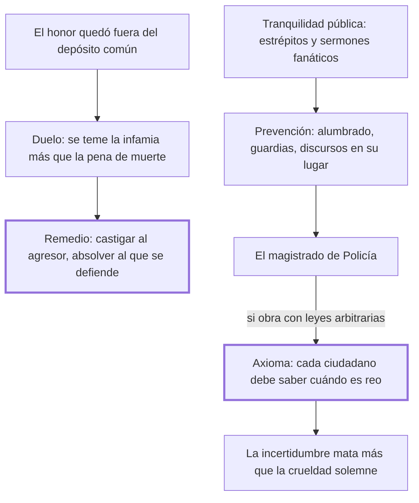

# 10. De los duelos + 11. De la tranquilidad pública

## 1. Idea principal

El duelo no se extirpa con penas de muerte sino castigando al agresor que lo provocó, y la tranquilidad pública no se guarda con magistrados arbitrarios sino con un código que todos puedan leer.

Contestan qué hacer con dos clases de desorden que la ley no llegaba a tocar. Cierran la primera parte del libro y anuncian las preguntas que ocupan el resto.

## 2. Lo esencial del capítulo

Los duelos privados nacieron de la necesidad del favor ajeno y tuvieron su origen "en la anarquía de las leyes" (cap. 10). Lo decisivo es por qué la amenaza de muerte fracasó: la costumbre se funda en algo que ciertos hombres temen más que a la muerte, porque al hombre de honor perder el favor ajeno lo expone a la soledad o a una infamia que por repetida excede al peligro de la pena. De ahí el remedio, que Beccaria presenta como ajeno: castigar **al agresor**, quien dio ocasión al duelo, y declarar inocente a quien sin culpa suya se vio precisado a defender lo que las leyes no aseguran, para que el Estado muestre "que él teme solo las leyes, no los hombres".

El cap. 11 pasa a la tercera clase de delitos, los que turban la tranquilidad pública: estrépitos en los caminos destinados al comercio y sermones fanáticos, que excitan a la muchedumbre y toman fuerza más del entusiasmo oscuro que de la razón clara, porque esta "nunca obra sobre una gran masa de hombres". Los medios que propone son de prevención y no de castigo —la noche iluminada a expensas públicas, las guardias por cuarteles, los discursos religiosos reservados al silencio de los templos—, y de eso debe cuidar el magistrado "que los franceses llaman Policía" (cap. 11).

Ahí llega el límite que da valor al capítulo. Si ese magistrado obrara con leyes arbitrarias y no establecidas en un código que circule entre las manos de todos, se abre una puerta a la tiranía; el axioma, que Beccaria da sin excepciones, es que **cada ciudadano debe saber cuándo es reo y cuándo es inocente**, y si hacen falta magistrados arbitrarios eso nace de la flaqueza de la constitución (cap. 11). A eso suma una observación empírica fuerte: la incertidumbre de la propia suerte ha sacrificado más víctimas que la crueldad pública y solemne, porque el verdadero tirano empieza reinando sobre la opinión, que previene al coraje. El tramo final enumera las preguntas del resto del libro.

## 3. Mapa

## 4. Vocabulario clave

- **Duelo privado** — el desafío entre particulares, nacido de la anarquía de las leyes y de la necesidad del favor ajeno.
- **Agresor** — quien dio ocasión al duelo; para Beccaria, el único que debe ser castigado.
- **Tranquilidad pública** — la quietud de los ciudadanos en los espacios comunes; objeto de la tercera clase de delitos.
- **Policía** — el magistrado encargado de prevenir la fermentación de las pasiones populares.
- **Leyes arbitrarias** — las no establecidas en un código que circule entre todos; puerta abierta a la tiranía.

## 5. Distinciones que se confunden

- **Castigar al agresor vs. castigar al duelista** — la ley debe alcanzar a quien provocó, no a quien se vio obligado a responder.
  - Se confunden porque: los dos participaron en el mismo hecho y la ley solía castigar a ambos con la muerte.
  - Criterio para decidir: ¿quién puso al otro en la situación? El que defiende lo que las leyes no aseguran no eligió.
  - Dónde se cae: se agrava la pena del duelo para disuadir, cuando el capítulo muestra que la infamia pesa más que la muerte.

- **Prevenir el desorden vs. reprimirlo** — el cap. 11 propone alumbrado, guardias y encauzar los discursos, no penas nuevas.
  - Se confunden porque: las dos son tareas del magistrado y se ejercen sobre las mismas conductas.
  - Criterio para decidir: ¿la medida evita que la situación se produzca, o castiga después? Solo la primera cabe en la policía.
  - Dónde se cae: se le dan al magistrado de policía facultades punitivas sin ley previa, que es la puerta a la tiranía que el capítulo señala.

## 6. Autoevaluación

1. ¿Qué se entiende por el axioma de que cada ciudadano debe saber cuándo es reo y cuándo es inocente? Explique sus implicaciones para el magistrado que guarda la tranquilidad pública.
2. Un Estado decreta la muerte para quien acepte un duelo y la costumbre sigue. Según el cap. 10, ¿por qué falla la amenaza y qué remedio corresponde?

--- No mires esto hasta responder ---

1. Es la regla, que Beccaria da sin excepciones, de que cada ciudadano pueda conocer de antemano qué lo hace reo y qué lo deja inocente, y para eso las leyes tienen que estar establecidas en un código que circule entre las manos de todos (cap. 11). Su implicación inmediata es un límite al magistrado de policía: puede prevenir el desorden con la noche iluminada, las guardias por cuarteles y los discursos religiosos reservados a los templos, pero si obrase con leyes arbitrarias abriría una puerta a la tiranía. Cuando esos magistrados arbitrarios parecen necesarios, la necesidad nace de la flaqueza de la constitución y no de la naturaleza de un gobierno bien organizado. El fundamento último es empírico: la incertidumbre de la propia suerte ha sacrificado más víctimas que la crueldad pública y solemne, porque el verdadero tirano empieza reinando sobre la opinión, que previene al coraje.
2. Falla porque la costumbre se funda en lo que algunos temen más que a la muerte: quedar sin el favor ajeno, expuestos a la soledad o a una infamia que por repetida excede al peligro de la pena, y una amenaza solo disuade si supera al mal que evita (cap. 10). El remedio es castigar al agresor que dio la ocasión y declarar inocente a quien se vio precisado a defender lo que las leyes no aseguran, que es la opinión. Como el honor quedó fuera del depósito común (cap. 9), la salida no es reprimir al que se defiende sino que el Estado muestre que teme solo las leyes, y se haga cargo del vacío que el duelo llena.

## Flashcards

Cuál es el axioma sin excepciones del cap. 11 | Que cada ciudadano debe saber cuándo es reo y cuándo es inocente
Por qué fracasan los decretos de muerte contra el duelo | Porque la infamia y la soledad se temen más que la muerte
Cuál es el mejor método de precaver el duelo | Castigar al agresor que dio la ocasión y declarar inocente al que se vio precisado a defenderse
Qué ha sacrificado más víctimas que la crueldad pública y solemne | La incertidumbre de la propia suerte
