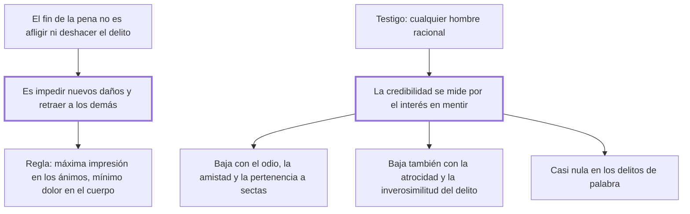

# 12. Fin de las penas + 13. De los testigos

## 1. Idea principal

La pena no existe para afligir ni para deshacer el delito, sino para impedir nuevos daños; y la credibilidad de un testigo se mide por su interés en mentir, no por su sexo, su condición ni la atrocidad del delito.

Contestan para qué se castiga y en qué se apoya la condena. El cap. 12 es de una página y contiene la definición que gobierna todo el resto del libro.

## 2. Lo esencial del capítulo

El cap. 12 descarta dos finalidades y afirma una. La pena no es atormentar a un ser sensible ni deshacer un delito ya cometido: un cuerpo político que es "el tranquilo moderador de las pasiones particulares" no puede abrigar esa crueldad inútil, y los alaridos de un infeliz no revocan del tiempo las acciones consumadas (cap. 12). El fin es doble y mira solo al futuro: impedir que el reo cause nuevos daños y retraer a los demás de cometer otros iguales. De ahí la regla de selección, que tiene tres condiciones a la vez: guardada la proporción, hay que escoger las penas y el modo de imponerlas que hagan la impresión **más eficaz y más durable** sobre los ánimos y la **menos dolorosa** sobre el cuerpo del reo.

El cap. 13 pasa a la prueba. Puede ser testigo cualquier hombre racional, y la verdadera graduación de la credibilidad está en el interés que tenga en decir o no la verdad; de ese solo criterio derivan tres demoliciones —vuelve frívolo el argumento de la flaqueza de las mujeres, pueril aplicar al condenado los efectos de la muerte civil e incoherente la nota de infamia cuando el infame no tiene interés en mentir—. La credibilidad disminuye con el odio, la amistad o las relaciones estrechas con el reo, y con la pertenencia a una sociedad de máximas propias, porque ese hombre "no solo tiene sus pasiones propias, tiene también las de los otros"; y hace falta siempre más de un testigo (cap. 13).

La inversión más importante es que la credibilidad **disminuye** cuanto más atroz o inverosímil sea el delito, por probabilidad comparada: es más fácil que muchos coincidan en la ilusión de la ignorancia o en el odio perseguidor que un hombre ejerza un poder que Dios no dio a criatura alguna. En la nota al pie cita el axioma contrario de los criminalistas y lo llama dictado por la imbecilidad más cruel; conviene advertir un defecto de la edición, porque esa nota quedó intercalada **en medio de la frase** sobre la atrocidad. El cierre trata los delitos de palabra, donde la credibilidad es casi nula: el tono y el gesto las alteran de modo que es imposible repetirlas como fueron dichas, y solo quedan en una memoria infiel y a menudo seducida, mientras las acciones dejan señales en la muchedumbre de circunstancias (cap. 13).

## 3. Mapa

## 4. Vocabulario clave

- **Fin de las penas** — impedir que el reo cause nuevos daños y retraer a los demás de imitarlo; nunca afligir ni reparar el pasado.
- **Credibilidad del testigo** — su graduación depende del interés que tenga en decir o no la verdad.
- **Nota de infamia** — el descrédito legal del infame, incoherente como causa de exclusión cuando no hay interés en mentir.

## 5. Distinciones que se confunden

- **Delito atroz vs. delito probable** — para Beccaria la atrocidad **baja** la credibilidad del testimonio en vez de subirla.
  - Se confunden porque: la gravedad del hecho parece exigir más severidad también en la prueba.
  - Criterio para decidir: ¿qué es más fácil, que el hecho excepcional haya ocurrido o que varios se equivoquen u odien? La probabilidad decide.
  - Dónde se cae: se acepta la máxima de los criminalistas —en los delitos atroces bastan conjeturas ligeras—, que es justo lo que el capítulo llama imbecilidad cruel.

- **Delito de palabra vs. delito de acción** — el segundo deja señales en las circunstancias; el primero solo queda en la memoria de los oyentes.
  - Se confunden porque: los dos se prueban con testigos y los dos pueden hacer daño real.
  - Criterio para decidir: ¿queda algún rastro fuera del recuerdo? Si no, la calumnia es fácil y la defensa casi imposible.
  - Dónde se cae: se condena por lo dicho con el mismo estándar de prueba que por lo hecho, sin notar que el reo pierde sus medios de justificarse.

## 6. Autoevaluación

1. ¿Qué se entiende por fin de las penas? Explique qué finalidades descarta Beccaria y cuáles son las implicaciones de esa definición al elegir el castigo.
2. Un tribunal admite pruebas más débiles porque el delito imputado es especialmente horrendo. ¿Qué le objeta el cap. 13?

--- No mires esto hasta responder ---

1. El fin de la pena es impedir que el reo cause nuevos daños a sus conciudadanos y retraer a los demás de cometer otros iguales (cap. 12). Descarta expresamente dos finalidades: no es atormentar a un ser sensible, porque el cuerpo político, tranquilo moderador de las pasiones particulares, no puede abrigar esa crueldad inútil, ni deshacer un delito ya cometido, porque los alaridos de un infeliz no revocan del tiempo las acciones consumadas. La definición mira entonces solo al futuro, y de ahí sale la regla de selección: guardada la proporción, hay que escoger las penas y el modo de imponerlas que hagan la impresión más eficaz y más durable sobre los ánimos y la menos dolorosa sobre el cuerpo del reo. La implicación decisiva es que lo que previene no es la intensidad del castigo sino su certeza y su duración, y sobre esa diferencia se apoya después el ataque a la pena de muerte. El merecimiento sobrevive solo como límite, por vía de la proporción del cap. 6.
2. Que invierte el cálculo. Cuanto más atroz o inverosímil es el hecho, menos probable es, y más probable resulta que los testigos se equivoquen o mientan por odio. Aceptar conjeturas ligeras en esos casos es garantizar condenas erróneas justo donde el error cuesta más; al axioma contrario de los criminalistas Beccaria lo llama dictado por la imbecilidad más cruel (cap. 13).

## Flashcards

Cuál es el fin de las penas según el cap. 12 | Impedir que el reo cause nuevos daños y retraer a los demás de cometer otros iguales
Qué dos fines descarta expresamente | Atormentar a un ser sensible y deshacer un delito ya cometido
Qué penas deben escogerse según ese capítulo | Las que, guardada la proporción, más impresionen los ánimos y menos duelan al cuerpo del reo
En qué está la verdadera graduación de la credibilidad de un testigo | En el interés que tenga en decir o no la verdad
