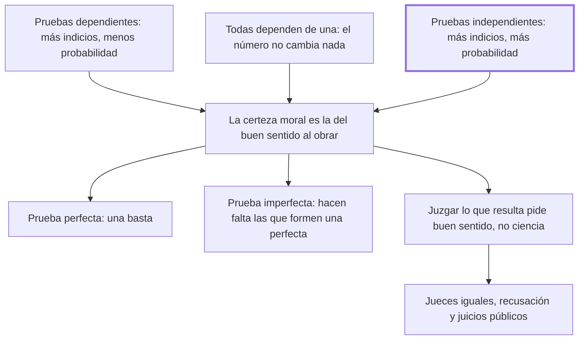

# 14. Indicios y formas de juicios

## 1. Idea principal

Las pruebas independientes suman certeza y las dependientes la restan, y como juzgar lo que resulta pide buen sentido y no ciencia, el reo debe ser juzgado por sus iguales, en público y pudiendo recusar.

Contesta cómo se valora la prueba y quién debe hacerlo. Es el capítulo procesal más denso del libro: un teorema de probabilidad y, a partir de él, el diseño del tribunal.

## 2. Lo esencial del capítulo

El teorema tiene tres casos (cap. 14). Si las pruebas son **dependientes** unas de otras, cuantas más se traen, menor es la probabilidad del hecho, porque los accidentes que harían fallar las anteriores hacen fallar las siguientes. Si todas dependen **de una sola**, su número no cambia nada, porque todo su valor se resuelve en el de aquella. Si son **independientes** —cada indicio se prueba por otra vía—, cuantas más, mayor es la probabilidad. Conviene ver lo que esto ataca: la práctica de acumular indicios encadenados como si sumaran.

Sigue una aclaración sobre qué certeza hace falta. Beccaria admite hablar de probabilidad donde los delitos, para merecer pena, deben ser ciertos, y resuelve la paradoja: rigurosamente la **certeza moral** no es más que una probabilidad, pero una tal que todo hombre de buen sentido consiente en ella por una costumbre nacida "de la precisión de obrar". La vara es la que cualquiera usa en las operaciones más importantes de su vida. Sobre esa base distingue pruebas **perfectas**, que excluyen la posibilidad de que el hombre no sea reo —una sola basta para condenar— e **imperfectas**, de las que hacen falta tantas cuantas basten para formar una perfecta. Y agrega una regla discutible: las imperfectas de las que el reo podía justificarse y no lo hace se vuelven perfectas.

De la dificultad de definir esa certeza saca la conclusión institucional, y es un giro que sorprende. Como es más fácil conocerla que definirla, prefiere la ley que da al juez principal **asesores sacados por suerte y no por elección**, porque "es más segura la ignorancia que juzga por dictamen que la ciencia que juzga por opinión". Donde las leyes son claras el oficio del juez se reduce a comprobar un hecho: buscar las pruebas pide habilidad y presentarlas pide claridad, pero juzgar lo que resulta no requiere más que un simple y ordinario buen sentido, menos falaz que el saber de un juez acostumbrado a querer encontrar reos.

El resto son cuatro garantías. Que cada uno sea juzgado por sus **iguales**, porque donde se juega la libertad de un ciudadano deben callar los sentimientos de la desigualdad. Que cuando el delito ofende a un tercero los jueces sean mitad iguales del reo y mitad del ofendido, para que "hablan solo las leyes y la verdad". Que el reo pueda **recusar** hasta cierto número de sospechosos sin dar razones, porque si se le niega parecerá que se condena a sí mismo. Y que los juicios y las pruebas sean **públicos**, para que la opinión —"acaso el solo cimiento de la sociedad"— imponga freno a la fuerza y el pueblo pueda decir que no es esclavo y está defendido.

## 3. Mapa

## 4. Qué releer del original

1. (cap. 14) Los tres casos del teorema — están en las primeras diez líneas y la formulación exacta importa, porque el orden de los casos es el argumento.
2. (cap. 14) "es más segura la ignorancia que juzga por dictamen que la ciencia que juzga por opinión" — es la frase que funda el jurado y la más provocadora del capítulo.
3. (cap. 14) El párrafo final sobre la publicidad de los juicios — resumí su función, pero la razón que da sobre la opinión como cimiento de la sociedad merece leerse literal.

## 5. Vocabulario clave

- **Indicio** — la prueba que apunta al hecho sin demostrarlo por sí sola; su fuerza depende de si es independiente de las otras.
- **Certeza moral** — la probabilidad que todo hombre de buen sentido acepta por la necesidad de obrar; es la vara para condenar.
- **Prueba perfecta** — la que excluye la posibilidad de que el acusado no sea reo; una sola basta.
- **Prueba imperfecta** — la que no la excluye; hacen falta tantas como para formar una perfecta.
- **Recusación** — la facultad del reo de excluir sin dar razones a cierto número de jueces sospechosos.

## 6. Distinciones que se confunden

- **Pruebas independientes vs. dependientes** — las primeras suman probabilidad; las segundas la restan a medida que se acumulan.
  - Se confunden porque: en el expediente las dos aparecen como una lista de indicios que parece robustecerse.
  - Criterio para decidir: ¿cada indicio se prueba por una vía propia? Si un solo accidente los tumba a todos, no suman.
  - Dónde se cae: se condena por el peso de muchos indicios encadenados, que es exactamente el caso donde la probabilidad baja.

- **Buscar las pruebas vs. juzgarlas** — lo primero pide habilidad y destreza; lo segundo, solo buen sentido.
  - Se confunden porque: las dos tareas parecen exigir la misma pericia jurídica y suelen recaer en el mismo cuerpo de expertos.
  - Criterio para decidir: ¿la operación produce el material o lo aprecia? Apreciarlo es lo que Beccaria confía a los iguales del reo.
  - Dónde se cae: se defiende el juicio por técnicos con el argumento de la complejidad probatoria, cuando el capítulo separa las dos etapas.

## 7. Autoevaluación

1. Una acusación reúne ocho indicios, todos derivados de un mismo testimonio. Según el teorema, ¿cuánta certeza aportan los ocho?
2. Beccaria prefiere asesores sacados por suerte antes que por elección. ¿Cómo puede ser más segura la ignorancia que la ciencia?
3. Sostiene que la prueba imperfecta de la que el reo podía justificarse y no lo hizo se vuelve perfecta. ¿Es compatible con la presunción de inocencia?
4. ¿Por qué la publicidad del juicio no es solo una garantía del acusado?

--- No mires esto hasta responder ---

1. La de uno solo. Cuando todas las pruebas dependen igualmente de una, su número no aumenta ni disminuye la probabilidad, porque todo su valor se resuelve en el valor de aquella de la que dependen (cap. 14).
2. Porque el peligro no es la falta de saber sino el sesgo. El juez de oficio está acostumbrado a querer encontrar reos y reduce todo a un sistema artificial recibido de sus estudios; el lego juzga por dictamen, es decir aplicando el buen sentido al hecho. La suerte, además, quita la elección, que es por donde entra la influencia.
3. Está en tensión, y es el punto más débil del capítulo. Si prevalece el derecho a ser creído inocente, el silencio no debería completar la prueba. Beccaria lo condiciona a que el reo esté obligado a justificarse, pero no dice de dónde nace esa obligación ni cómo se concilia con lo que él mismo afirma en el cap. 13.
4. Porque tiene una función política: hace que la opinión —que llama acaso el solo cimiento de la sociedad— imponga un freno a la fuerza y a las pasiones, y que el pueblo pueda decir que no es esclavo y está defendido. Ese sentimiento, dice, equivale a un tributo para el soberano que entiende sus intereses.

## Flashcards

Qué pasa cuando las pruebas de un hecho son dependientes entre sí | Cuantas más se traen, menor es la probabilidad del hecho
Qué pasa cuando todas las pruebas dependen de una sola | Su número no cambia la probabilidad: todo su valor se resuelve en el de aquella
Qué pasa cuando las pruebas son independientes | Cuantas más se traen, más crece la probabilidad del hecho
Qué es la certeza moral según el cap. 14 | Una probabilidad que todo hombre de buen sentido acepta por la necesidad de obrar
Qué distingue a una prueba perfecta de una imperfecta | La perfecta excluye la posibilidad de que el acusado no sea reo; la imperfecta no
Por qué prefiere Beccaria asesores sacados por suerte | Porque es más segura la ignorancia que juzga por dictamen que la ciencia que juzga por opinión
Cómo deben componerse los jueces cuando el delito ofende a un tercero | Mitad iguales del reo y mitad del ofendido
Para qué deben ser públicos los juicios y las pruebas | Para que la opinión imponga un freno a la fuerza y a las pasiones
