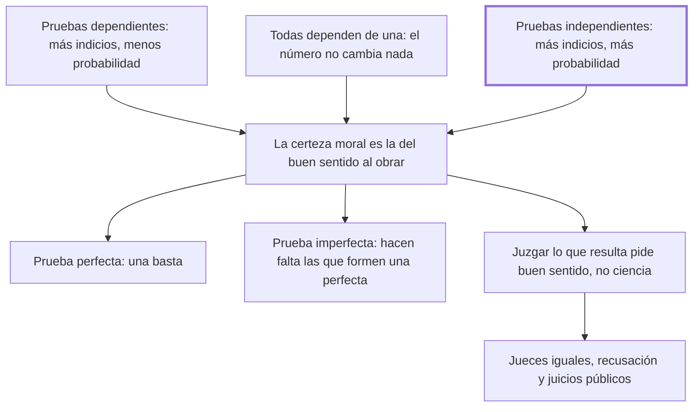

# 14. Indicios y formas de juicios

## 1. Idea principal

Las pruebas independientes suman certeza y las dependientes la restan, y como juzgar lo que resulta pide buen sentido y no ciencia, el reo debe ser juzgado por sus iguales, en público y pudiendo recusar.

Contesta cómo se valora la prueba y quién debe hacerlo. Es el capítulo procesal más denso del libro: un teorema de probabilidad y, a partir de él, el diseño del tribunal.

## 2. Lo esencial del capítulo

El teorema de la prueba tiene tres casos (cap. 14): si las pruebas son dependientes unas de otras, cuantas más se traen menor es la probabilidad del hecho, porque los accidentes que harían fallar las anteriores hacen fallar las siguientes; si todas dependen de una sola, su número no cambia nada, porque todo su valor se resuelve en el de aquella; y si son independientes, cuantas más, mayor la probabilidad. Queda así desarmada la práctica de acumular indicios encadenados como si sumaran. La certeza que hace falta es la certeza moral, que rigurosamente no es más que una probabilidad, pero una tal que todo hombre de buen sentido consiente en ella por una costumbre nacida "de la precisión de obrar": la vara de las operaciones más importantes de la vida.

Distingue sobre esa base pruebas perfectas, que excluyen la posibilidad de que el hombre no sea reo —basta una para condenar—, e imperfectas, de las que hacen falta tantas cuantas formen una perfecta; agrega una regla discutible, que las imperfectas de las que el reo podía justificarse y no lo hizo se vuelven perfectas. Como esa certeza es más fácil de conocer que de definir, prefiere la ley que da al juez principal asesores sacados por suerte y no por elección, porque "es más segura la ignorancia que juzga por dictamen que la ciencia que juzga por opinión". El oficio del juez se reduce entonces a comprobar un hecho: buscar las pruebas pide habilidad, pero juzgar lo que resulta no requiere más que un simple y ordinario buen sentido.

De ahí las cuatro garantías del cierre: que cada uno sea juzgado por sus iguales, porque ahí deben callar los sentimientos de la desigualdad; que cuando el delito ofende a un tercero los jueces sean mitad iguales del reo y mitad del ofendido; que el reo pueda recusar sin dar razones hasta cierto número de sospechosos; y que los juicios y las pruebas sean públicos, para que la opinión —"acaso el solo cimiento de la sociedad"— imponga freno a la fuerza y el pueblo pueda decir que no es esclavo (cap. 14).

## 3. Mapa

## 4. Vocabulario clave

- **Indicio** — la prueba que apunta al hecho sin demostrarlo por sí sola; su fuerza depende de si es independiente de las otras.
- **Certeza moral** — la probabilidad que todo hombre de buen sentido acepta por la necesidad de obrar; es la vara para condenar.
- **Prueba perfecta** — la que excluye la posibilidad de que el acusado no sea reo; una sola basta.
- **Prueba imperfecta** — la que no la excluye; hacen falta tantas como para formar una perfecta.
- **Recusación** — la facultad del reo de excluir sin dar razones a cierto número de jueces sospechosos.

## 5. Distinciones que se confunden

- **Pruebas independientes vs. dependientes** — las primeras suman probabilidad; las segundas la restan a medida que se acumulan.
  - Se confunden porque: en el expediente las dos aparecen como una lista de indicios que parece robustecerse.
  - Criterio para decidir: ¿cada indicio se prueba por una vía propia? Si un solo accidente los tumba a todos, no suman.
  - Dónde se cae: se condena por el peso de muchos indicios encadenados, que es exactamente el caso donde la probabilidad baja.

- **Buscar las pruebas vs. juzgarlas** — lo primero pide habilidad y destreza; lo segundo, solo buen sentido.
  - Se confunden porque: las dos tareas parecen exigir la misma pericia jurídica y suelen recaer en el mismo cuerpo de expertos.
  - Criterio para decidir: ¿la operación produce el material o lo aprecia? Apreciarlo es lo que Beccaria confía a los iguales del reo.
  - Dónde se cae: se defiende el juicio por técnicos con el argumento de la complejidad probatoria, cuando el capítulo separa las dos etapas.

## 6. Autoevaluación

1. ¿Qué se entiende por prueba perfecta e imperfecta, y cómo debe valorarse un conjunto de indicios? Explique la regla de Beccaria y sus implicaciones.
2. Una acusación reúne ocho indicios, todos derivados de un mismo testimonio. Según el teorema, ¿cuánta certeza aportan los ocho?

--- No mires esto hasta responder ---

1. Prueba perfecta es la que excluye la posibilidad de que el hombre no sea reo, y una sola basta para condenar; imperfecta es la que no la excluye, y hacen falta tantas cuantas basten para formar una perfecta (cap. 14). Un conjunto de indicios no se valora por su número sino por su dependencia: si las pruebas dependen unas de otras, cuantas más se traen menor es la probabilidad del hecho; si todas dependen de una sola, el número no cambia nada, porque todo su valor se resuelve en el de aquella; y solo si son independientes cada indicio nuevo aumenta la probabilidad. La vara para condenar es la certeza moral, que rigurosamente no es más que una probabilidad, pero una que todo hombre de buen sentido acepta por la necesidad de obrar. Las implicaciones son dos: se derrumba la condena fundada en indicios encadenados, y como juzgar lo que resulta pide buen sentido y no ciencia, el juicio corresponde a los iguales del reo, en público y con derecho a recusar. Queda en pie una regla discutible del propio capítulo: que la prueba imperfecta de la que el reo podía justificarse y no lo hizo se vuelva perfecta.
2. La de uno solo. Cuando todas las pruebas dependen igualmente de una, su número no aumenta ni disminuye la probabilidad, porque todo su valor se resuelve en el valor de aquella de la que dependen (cap. 14). Sumarlas como si se robustecieran es exactamente el error que el teorema señala.

## Flashcards

Cuáles son los tres casos del teorema de las pruebas | Dependientes: cuantas más, menos probabilidad; todas derivadas de una: el número no cambia nada; independientes: cuantas más, más probabilidad
Qué es la certeza moral según el cap. 14 | Una probabilidad que todo hombre de buen sentido acepta por la necesidad de obrar
Qué distingue a una prueba perfecta de una imperfecta | La perfecta excluye la posibilidad de que el acusado no sea reo; la imperfecta no
Cuáles son las cuatro garantías del juicio en el cap. 14 | Jueces iguales del reo, mitad y mitad si hay ofendido, recusación sin dar razones y publicidad de juicios y pruebas
