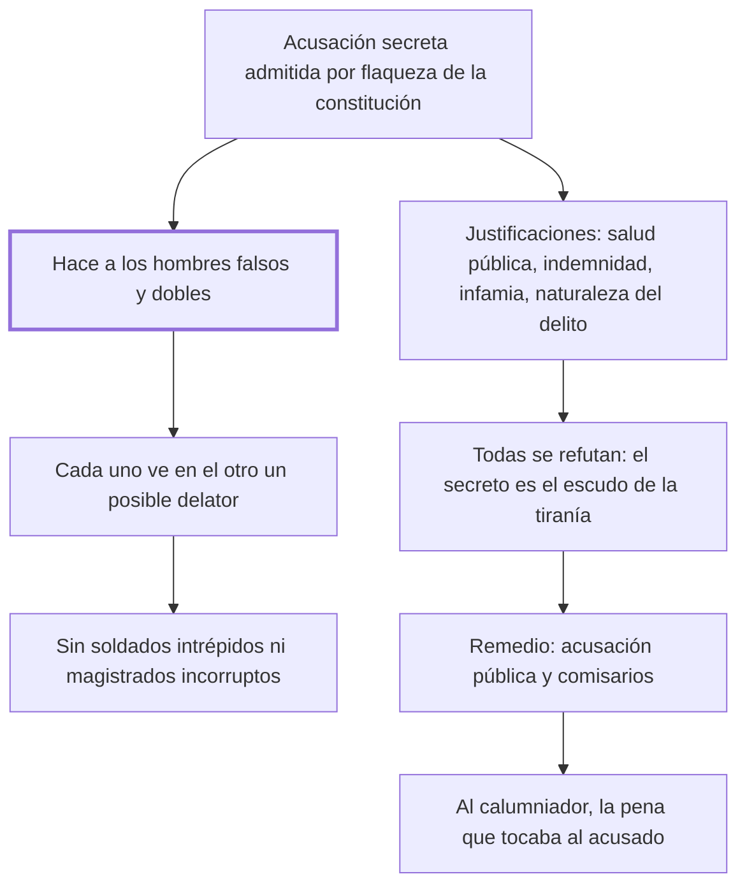

# 15. Acusaciones secretas

## 1. Idea principal

La acusación secreta corrompe el carácter de todo un pueblo —vuelve a los hombres falsos y dobles—, y su único remedio es la publicidad más la pena del talión para el calumniador.

Contesta qué pasa cuando denunciar no exige dar la cara. Es el capítulo más político del libro y donde Beccaria mide con más cuidado sus palabras, porque acusaba una práctica viva en Venecia.

## 2. Lo esencial del capítulo

Las acusaciones secretas son "evidentes, pero consagrados desórdenes", admitidos en muchas naciones como necesarios por la flaqueza de su constitución (cap. 15). El daño que Beccaria describe primero no es procesal sino moral y colectivo: la costumbre hace a los hombres falsos y dobles, porque quien puede sospechar en otro un delator ve en él a un enemigo, y con el hábito de enmascarar sus dictámenes ante los demás terminan escondiéndolos de sí mismos. De ahí el argumento dirigido al soberano: de hombres así no salen ni soldados intrépidos ni magistrados incorruptos que lleven al trono, con los tributos, el amor de todos los estamentos. Contra la calumnia armada del secreto, "escudo el más fuerte de la tiranía", nadie puede defenderse, y el gobierno que sospecha en cada súbdito un enemigo se ve obligado, por el reposo público, a dejar sin reposo a los particulares.

Refuta después las cuatro justificaciones habituales —la salud pública, la indemnidad del acusador, la infamia que caería sobre el delator y la naturaleza del delito—, y conviene ver en el original cómo cierra cada una: si se llaman delitos a acciones indiferentes o incluso útiles ningún juicio será bastante secreto, y si el delito es una ofensa pública la publicidad del ejemplo, "fin único del juicio", interesa a todos (cap. 15). El final junta prudencia y propuesta: dice respetar todo gobierno y no hablar de ninguno en particular, y admite que quitar un mal inherente al sistema de una nación puede ser ruina extrema, pero si hubiera de dictar leyes nuevas "en algún rincón perdido del universo", antes de autorizar esta costumbre le temblaría la mano. Recoge de Montesquieu la acusación pública y los comisarios que acusen en nombre público, y agrega su propia regla: al calumniador debe darse la pena que tocaría al acusado.

## 3. Mapa

## 4. Vocabulario clave

- **Acusación secreta** — la denuncia cuyo autor permanece oculto al acusado; para Beccaria, un desorden consagrado por el uso.
- **Delator** — quien acusa sin dar la cara; su existencia convierte a cada conciudadano en sospechoso.
- **Calumniador** — quien acusa en falso; debe recibir la pena que le habría tocado al acusado.
- **Publicidad del ejemplo** — el fin único del juicio, que el secreto anula.
- **Comisario** — funcionario que acusa en nombre público; el recurso que Montesquieu propone para las monarquías.

## 5. Distinciones que se confunden

- **Proteger al acusador vs. ocultarlo** — la protección es una tarea de las leyes; el ocultamiento traslada el riesgo al acusado.
  - Se confunden porque: los dos se presentan como el modo de que la gente se anime a denunciar.
  - Criterio para decidir: ¿puede el acusado saber quién lo acusa y por qué? Si no, no hay defensa posible frente a la calumnia.
  - Dónde se cae: se justifica el anonimato por la seguridad del denunciante, y Beccaria responde que entonces habría súbditos más fuertes que el soberano.

- **Calumnia secreta vs. calumnia pública** — el sistema del secreto castiga la segunda y autoriza la primera.
  - Se confunden porque: las dos son acusaciones falsas y parecen merecer el mismo trato.
  - Criterio para decidir: ¿el que acusa responde con algo si miente? Solo responde el que da la cara.
  - Dónde se cae: se admite la denuncia anónima para evitar la infamia del delator, sin ver que se está premiando la versión menos controlable.

## 6. Autoevaluación

1. ¿Qué se entiende por acusación secreta y cuáles son sus implicaciones? Explique el daño que le atribuye Beccaria y el remedio que propone.
2. Propone dar al calumniador la pena que tocaría al acusado. ¿Por qué esa regla y no una pena fija?

--- No mires esto hasta responder ---

1. Acusación secreta es aquella cuyo autor permanece oculto al acusado, y Beccaria la trata como un desorden consagrado por el uso, admitido en muchas naciones por la flaqueza de su constitución (cap. 15). Su implicación principal no es procesal sino moral y colectiva: hace a los hombres falsos y dobles, porque cada uno ve en el otro un posible delator, y con el hábito de enmascarar sus dictámenes ante los demás terminan escondiéndolos de sí mismos. De ahí se sigue la implicación política, dirigida al soberano por interés propio: de un pueblo así no salen soldados intrépidos ni magistrados incorruptos, y el trono pierde el amor de los estamentos junto con los tributos. Las cuatro justificaciones habituales —salud pública, indemnidad del acusador, infamia del delator y naturaleza del delito— caen una por una, y la más aguda es la última: si el delito es una ofensa pública, la publicidad del ejemplo, fin único del juicio, interesa a todos. El remedio es la acusación pública, con comisarios en las monarquías según Montesquieu, más la regla de dar al calumniador la pena que tocaría al acusado.
2. Porque hace que el riesgo de acusar sea exactamente igual al riesgo que se le impone al acusado. Una pena fija no disuadiría de calumniar en los delitos más graves, que es justo donde la calumnia hace más daño; la regla del talión escala sola con la gravedad. Beccaria la afirma sin discutir qué pasa cuando la acusación falsa es de buena fe.

## Flashcards

Qué efecto tienen las acusaciones secretas sobre los hombres | Los hacen falsos y dobles, y les enseñan a esconder sus dictámenes hasta de sí mismos
Cuáles son las cuatro justificaciones del secreto que refuta el cap. 15 | La salud pública, la indemnidad del acusador, la infamia del delator y la naturaleza del delito
Qué pena propone Beccaria para el calumniador | La que le habría tocado al acusado
