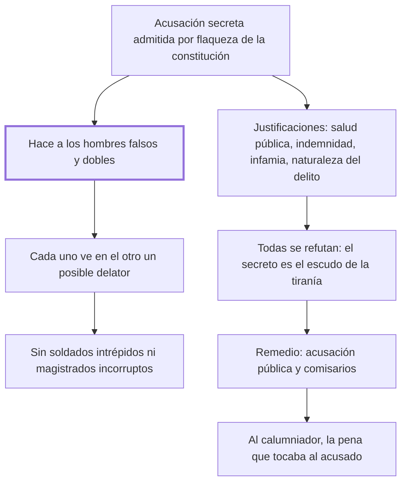

# 15. Acusaciones secretas

## 1. Idea principal

La acusación secreta corrompe el carácter de todo un pueblo —vuelve a los hombres falsos y dobles—, y su único remedio es la publicidad más la pena del talión para el calumniador.

Contesta qué pasa cuando denunciar no exige dar la cara. Es el capítulo más político del libro y donde Beccaria mide con más cuidado sus palabras, porque acusaba una práctica viva en Venecia.

## 2. Lo esencial del capítulo

Las acusaciones secretas son "evidentes, pero consagrados desórdenes", admitidos en muchas naciones como necesarios por la flaqueza de su constitución (cap. 15). El daño que Beccaria describe primero no es procesal sino moral y colectivo: la costumbre hace a los hombres falsos y dobles, porque quien puede sospechar en otro un delator ve en él a un enemigo. Así se acostumbran a enmascarar sus dictámenes y, con el hábito de esconderlos a los demás, terminan escondiéndolos de sí mismos. El retrato del resultado importa: hombres sin principios claros, que vagan por el vasto mar de las opiniones y pasan el presente en la amargura que da la incertidumbre del futuro. La pregunta que sigue es el argumento dirigido al soberano: de esos hombres no salen ni soldados intrépidos ni magistrados incorruptos que lleven al trono, con los tributos, el amor de todos los estamentos.

Después vienen las preguntas breves que condensan la crítica. Quién puede defenderse de la calumnia cuando está armada del secreto, "escudo el más fuerte de la tiranía"; y qué género de gobierno es aquel donde quien manda sospecha en cada súbdito un enemigo y se ve obligado, por el reposo público, a dejar sin reposo a los particulares. Notar la inversión: el secreto se justifica por la seguridad y produce un Estado que vive en alarma permanente.

El tramo central refuta las cuatro justificaciones habituales. ¿La salud pública? Extraña constitución es aquella donde el que tiene la fuerza y además la opinión teme a cada ciudadano. ¿La indemnidad del acusador? Entonces las leyes no lo defienden lo bastante, y habría súbditos más fuertes que el soberano. ¿La infamia que caería sobre el delator? Entonces se autoriza la calumnia secreta y se castiga la pública. ¿La naturaleza del delito? Ahí está la respuesta más aguda: si se llaman delitos a las acciones indiferentes o incluso útiles, ningún juicio será bastante secreto; y si el delito es una ofensa pública, la publicidad del ejemplo —"fin único del juicio"— interesa a todos.

El capítulo cierra con dos gestos que conviene leer juntos. Uno es de prudencia: dice respetar todo gobierno y no hablar de ninguno en particular, y admite que quitar un mal inherente al sistema de una nación puede ser ruina extrema; pero si hubiera de dictar leyes nuevas "en algún rincón perdido del universo", antes de autorizar esta costumbre le temblaría la mano. El otro es la propuesta concreta: recoge de Montesquieu que la acusación pública conviene más a la república y que en la monarquía es buen recurso destinar comisarios que acusen en nombre público, y agrega su regla, válida para los dos regímenes: **al calumniador debe darse la pena que tocaría al acusado**.

## 3. Mapa

## 4. Vocabulario clave

- **Acusación secreta** — la denuncia cuyo autor permanece oculto al acusado; para Beccaria, un desorden consagrado por el uso.
- **Delator** — quien acusa sin dar la cara; su existencia convierte a cada conciudadano en sospechoso.
- **Calumniador** — quien acusa en falso; debe recibir la pena que le habría tocado al acusado.
- **Publicidad del ejemplo** — el fin único del juicio, que el secreto anula.
- **Comisario** — funcionario que acusa en nombre público; el recurso que Montesquieu propone para las monarquías.

## 5. Distinciones que se confunden

- **Proteger al acusador vs. ocultarlo** — la protección es una tarea de las leyes; el ocultamiento traslada el riesgo al acusado.
  - Se confunden porque: los dos se presentan como el modo de que la gente se anime a denunciar.
  - Criterio para decidir: ¿puede el acusado saber quién lo acusa y por qué? Si no, no hay defensa posible frente a la calumnia.
  - Dónde se cae: se justifica el anonimato por la seguridad del denunciante, y Beccaria responde que entonces habría súbditos más fuertes que el soberano.

- **Calumnia secreta vs. calumnia pública** — el sistema del secreto castiga la segunda y autoriza la primera.
  - Se confunden porque: las dos son acusaciones falsas y parecen merecer el mismo trato.
  - Criterio para decidir: ¿el que acusa responde con algo si miente? Solo responde el que da la cara.
  - Dónde se cae: se admite la denuncia anónima para evitar la infamia del delator, sin ver que se está premiando la versión menos controlable.

## 6. Autoevaluación

1. Un Estado admite denuncias anónimas para proteger a los denunciantes. Según el capítulo, ¿qué le pasa a la sociedad, no al proceso?
2. Beccaria pregunta qué gobierno es aquel donde quien manda sospecha en cada súbdito un enemigo. ¿A quién está dirigido ese argumento?
3. Propone dar al calumniador la pena que tocaría al acusado. ¿Por qué esa regla y no una pena fija?
4. Dice respetar todo gobierno y no hablar de ninguno en particular. ¿Es sinceridad o cautela?

--- No mires esto hasta responder ---

1. Que los hombres se vuelven falsos y dobles: se acostumbran a enmascarar sus dictámenes hasta esconderlos de sí mismos, y viven en la amargura de la incertidumbre. El daño no es que se condene a un inocente, sino que se degrada el carácter de todos (cap. 15).
2. Al soberano, y por interés propio. El argumento no apela a la compasión sino a la utilidad: de un pueblo así no salen soldados intrépidos ni magistrados incorruptos, y el trono pierde el amor de los estamentos junto con los tributos. Es la misma estrategia del cap. 8 con el dogma político.
3. Porque hace que el riesgo de acusar sea exactamente igual al riesgo que se le impone al acusado. Una pena fija no disuadiría de calumniar en los delitos más graves, que es justo donde la calumnia hace más daño; la regla del talión escala sola con la gravedad.
4. Las dos cosas, y él lo deja ver. Escribía sobre una práctica viva en su tiempo y la fórmula del "rincón perdido del universo" le permite condenarla sin señalar a nadie. También admite en serio que arrancar un mal inherente al sistema puede ser ruina extrema, lo que es coherente con su gradualismo, aunque debilita la exigencia.

## Flashcards

Qué efecto tienen las acusaciones secretas sobre los hombres | Los hacen falsos y dobles, y les enseñan a esconder sus dictámenes hasta de sí mismos
Cómo llama Beccaria al secreto en materia de acusaciones | El escudo más fuerte de la tiranía
Por qué no basta justificar el secreto con la indemnidad del acusador | Porque significaría que las leyes no lo defienden y que hay súbditos más fuertes que el soberano
Qué contradicción señala en el argumento de la infamia del delator | Que se autoriza la calumnia secreta y se castiga la pública
Cuál es el fin único del juicio según el cap. 15 | La publicidad del ejemplo
Qué diría Beccaria si tuviera que dictar leyes nuevas | Que antes de autorizar esa costumbre le temblaría la mano
Qué opina Montesquieu sobre las acusaciones públicas | Que convienen más al gobierno republicano que al monárquico
Qué pena propone Beccaria para el calumniador | La que le habría tocado al acusado
