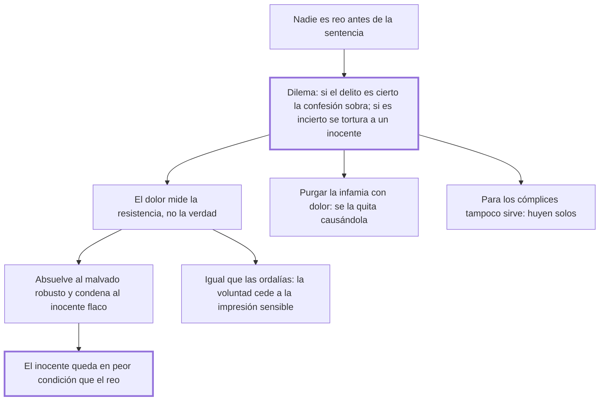

# 16. De la tortura

## 1. Idea principal

La tortura no descubre la verdad sino la resistencia física: absuelve a los malvados robustos y condena a los inocentes flacos, y deja al inocente en peor condición que al culpable.

Contesta si el dolor sirve como prueba. Es el capítulo más famoso del libro y el que produjo su efecto práctico más inmediato en la legislación europea.

## 2. Lo esencial del capítulo

Beccaria enumera los cinco motivos con que se justifica atormentar al reo —obtener la confesión, castigar sus contradicciones, descubrir cómplices, purgar la infamia y averiguar delitos de los que ni está acusado— y los desarma uno por uno.

El argumento matriz es una premisa y un dilema. La premisa: nadie puede ser llamado reo antes de la sentencia, así que atormentar mientras se duda no tiene otro título que la fuerza. El dilema: o el delito es cierto, y entonces solo cabe la pena legal y la confesión es inútil, o es incierto, y entonces se atormenta a un inocente, "porque tal es según las leyes un hombre cuyos delitos no están probados". Y agrega lo suyo: pretender que el dolor sea el crisol de la verdad es creer "que el juicio de ella residiese en los músculos y fibras de un miserable". De ahí la fórmula del capítulo: es el medio seguro de absolver a los robustos malvados y condenar a los flacos inocentes.

Sobre la **purgación de la infamia**, el error es confundir planos: se cree que el dolor, que es una sensación, borra la infamia, que es una relación moral. Beccaria rastrea el absurdo en las ideas religiosas y cierra con la contradicción práctica: la tortura misma infama, "así, con este método se quitará la infamia causando la infamia". Sobre las **contradicciones** del examen, responde que el temor de la pena y la majestad del juez bastan para provocarlas en el inocente tanto como en el reo.

El tramo más denso equipara la tortura a las ordalías. Parece que su resultado depende de la voluntad, pero todo acto de la voluntad es proporcionado a la impresión sensible que lo origina, y la sensibilidad es limitada: el dolor puede crecer hasta no dejar más libertad que la de tomar el camino más corto para hacerlo cesar, y entonces el inocente se llamará reo. De ahí la ironía de que el problema —hallar el grado de dolor que hará confesar a un inocente, dada la fuerza de sus músculos— lo resolvería mejor un matemático que un juez.

Se apoya después en la experiencia —Roma la reservaba a los esclavos, Inglaterra no la usa, Suecia la abolió— y termina con dos golpes. La consecuencia extraña: el inocente queda **de peor condición que el reo**, porque si confiesa es condenado y si resiste ha sufrido una pena que no debía, mientras el reo que resiste cambia una pena mayor por una menor. Y la paráfrasis de lo que la ley ordena: que los hombres opongan al amor propio "un odio heroico de vosotros mismos". Sobre los cómplices responde que si no sirve para la verdad tampoco sirve para hallarlos.

## 3. Mapa

## 4. Vocabulario clave

- **Tortura** — el tormento aplicado durante el proceso para obtener confesión, cómplices o purgar la infamia.
- **Crisol de la verdad** — el nombre que la tradición daba al dolor como método de prueba; Beccaria lo llama infame.
- **Purgación de la infamia** — la idea de que el tormento borra la mancha civil, tomada por analogía de las ideas religiosas.
- **Juicios de Dios** — las pruebas del fuego y del agua hirviendo, con las que Beccaria equipara la tortura.
- **Cómplice** — el partícipe del delito; el capítulo niega que el tormento sirva para descubrirlo.

## 5. Distinciones que se confunden

- **Confesión libre vs. arrancada** — la segunda no es un acto de voluntad, porque el dolor puede crecer hasta no dejar otra salida.
  - Se confunden porque: en las dos el reo pronuncia las mismas palabras y el acta las registra igual.
  - Criterio para decidir: ¿había otra conducta posible en ese momento? Si la única salida era hacer cesar el tormento, la respuesta es tan necesaria como el efecto del fuego.
  - Dónde se cae: se valida la confesión pidiendo que se ratifique después, cuando la ratificación se obtiene amenazando con repetir el tormento.

- **Verdad vs. resistencia física** — el tormento mide la segunda y se la presenta como la primera.
  - Se confunden porque: el que resiste parece firme en su inocencia y el que cede parece descubierto.
  - Criterio para decidir: ¿qué variable cambia el resultado? La robustez del cuerpo, no la calidad de los hechos.
  - Dónde se cae: se atribuye valor probatorio a que el acusado "se quebró", que es exactamente el dato sin valor.

## 6. Autoevaluación

1. ¿Por qué dice Beccaria que la tortura deja al inocente en peor condición que al culpable?
2. Una ley exige que la confesión bajo tormento se ratifique después, sin tormento, para valer. ¿Resuelve eso el problema?
3. Equipara la tortura a las ordalías del fuego y del agua. ¿Es una comparación retórica o un argumento?
4. Se apoya en que Roma, Inglaterra y Suecia no la usan. ¿Qué peso tiene ese tipo de prueba?

--- No mires esto hasta responder ---

1. Porque el inocente tiene todas las combinaciones en contra: si confiesa lo condenan y si resiste igual ha sufrido una pena que no debía. El reo, en cambio, tiene un caso favorable: si resiste es absuelto y habrá cambiado una pena mayor por una menor. El inocente siempre pierde y el culpable puede ganar (cap. 16).
2. No, y el capítulo lo muestra con la práctica real: si el reo no confirma lo que dijo, es atormentado de nuevo, y algunas naciones lo dejan al arbitrio del juez. La ratificación obtenida bajo esa amenaza es tan poco libre como la confesión original.
3. Es un argumento, y descansa en su psicología. Parece que el resultado del tormento depende de la voluntad y el de la ordalía no, pero todo acto de la voluntad es proporcionado a la impresión sensible que lo causa, y la sensibilidad es limitada. Cuando el dolor la ocupa toda, la respuesta del reo es tan necesaria como el efecto del agua hirviendo.
4. Es prueba de posibilidad, no de justicia: muestra que un Estado puede juzgar sin tortura y prosperar, con lo que cae la defensa por necesidad. No demuestra por sí sola que sea injusta —eso lo hacen el dilema y la consecuencia extraña—, pero desactiva la única objeción práctica.

## Flashcards

Cuál es el dilema con que Beccaria refuta la tortura | Si el delito es cierto la confesión es inútil; si es incierto se atormenta a un inocente
Por qué nadie puede ser tratado como reo durante el proceso | Porque no lo es antes de la sentencia y conserva la protección pública
A quiénes absuelve y a quiénes condena la tortura | Absuelve a los robustos malvados y condena a los flacos inocentes
Por qué no puede el dolor purgar la infamia | Porque el dolor es una sensación y la infamia una mera relación moral sujeta a la opinión
Qué contradicción hay en purgar la infamia con tormento | Que la tortura misma infama: se quita la infamia causándola
Por qué equipara la tortura a los juicios de Dios | Porque la voluntad cede a la impresión sensible, igual que el cuerpo al fuego o al agua
Por qué el inocente está en peor condición que el reo | Porque siempre pierde, mientras el reo que resiste cambia una pena mayor por una menor
Por qué no sirve la tortura para descubrir cómplices | Porque si no sirve para hallar la verdad tampoco sirve para eso, y los cómplices suelen huir solos
