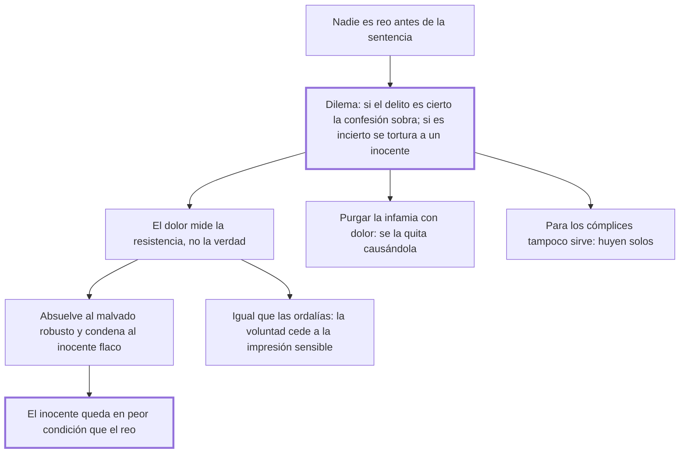

# 16. De la tortura

## 1. Idea principal

La tortura no descubre la verdad sino la resistencia física: absuelve a los malvados robustos y condena a los inocentes flacos, y deja al inocente en peor condición que al culpable.

Contesta si el dolor sirve como prueba. Es el capítulo más famoso del libro y el que produjo su efecto práctico más inmediato en la legislación europea.

## 2. Lo esencial del capítulo

Beccaria enumera los cinco motivos con que se justifica atormentar al reo —obtener la confesión, castigar sus contradicciones, descubrir cómplices, purgar la infamia y averiguar delitos de los que ni está acusado— y los desarma uno por uno (cap. 16). El argumento matriz es una premisa y un dilema: nadie puede ser llamado reo antes de la sentencia, así que atormentar mientras se duda no tiene otro título que la fuerza; y o el delito es cierto, y entonces solo cabe la pena legal y la confesión es inútil, o es incierto, y entonces se atormenta a un inocente, "porque tal es según las leyes un hombre cuyos delitos no están probados". Pretender que el dolor sea el crisol de la verdad es creer que el juicio de ella residiese "en los músculos y fibras de un miserable": es el medio seguro de absolver a los robustos malvados y condenar a los flacos inocentes.

Sobre la purgación de la infamia el error es confundir planos —el dolor es una sensación y la infamia una relación moral—, y la práctica se contradice sola: "con este método se quitará la infamia causando la infamia". A las contradicciones del examen responde que el temor de la pena y la majestad del juez bastan para provocarlas en el inocente tanto como en el reo. El tramo más denso equipara el tormento a las ordalías: parece que su resultado depende de la voluntad, pero todo acto de la voluntad es proporcionado a la impresión sensible que lo origina, y la sensibilidad es limitada, de modo que el dolor puede crecer hasta no dejar más libertad que la de tomar el camino más corto para hacerlo cesar, y entonces el inocente se llamará reo.

Se apoya después en la experiencia de las naciones que la abandonaron —la lista, en el original— y termina con la consecuencia extraña: el inocente queda de peor condición que el reo, porque si confiesa es condenado y si resiste ha sufrido una pena que no debía, mientras el reo que resiste cambia una pena mayor por una menor. La ley, parafraseada, le pide oponer al amor propio "un odio heroico de vosotros mismos"; y sobre los cómplices, que si no sirve para hallar la verdad tampoco sirve para eso (cap. 16).

## 3. Mapa

## 4. Vocabulario clave

- **Tortura** — el tormento aplicado durante el proceso para obtener confesión, cómplices o purgar la infamia.
- **Crisol de la verdad** — el nombre que la tradición daba al dolor como método de prueba; Beccaria lo llama infame.
- **Purgación de la infamia** — la idea de que el tormento borra la mancha civil, tomada por analogía de las ideas religiosas.
- **Juicios de Dios** — las pruebas del fuego y del agua hirviendo, con las que Beccaria equipara la tortura.
- **Cómplice** — el partícipe del delito; el capítulo niega que el tormento sirva para descubrirlo.

## 5. Distinciones que se confunden

- **Confesión libre vs. arrancada** — la segunda no es un acto de voluntad, porque el dolor puede crecer hasta no dejar otra salida.
  - Se confunden porque: en las dos el reo pronuncia las mismas palabras y el acta las registra igual.
  - Criterio para decidir: ¿había otra conducta posible en ese momento? Si la única salida era hacer cesar el tormento, la respuesta es tan necesaria como el efecto del fuego.
  - Dónde se cae: se valida la confesión pidiendo que se ratifique después, cuando la ratificación se obtiene amenazando con repetir el tormento.

- **Verdad vs. resistencia física** — el tormento mide la segunda y se la presenta como la primera.
  - Se confunden porque: el que resiste parece firme en su inocencia y el que cede parece descubierto.
  - Criterio para decidir: ¿qué variable cambia el resultado? La robustez del cuerpo, no la calidad de los hechos.
  - Dónde se cae: se atribuye valor probatorio a que el acusado "se quebró", que es exactamente el dato sin valor.

## 6. Autoevaluación

1. ¿Qué se entiende por tortura judicial y cuáles son sus implicaciones? Explique el dilema con que Beccaria la refuta.
2. Una ley exige que la confesión bajo tormento se ratifique después, sin tormento, para valer. ¿Resuelve eso el problema?

--- No mires esto hasta responder ---

1. La tortura es el tormento aplicado durante el proceso para obtener la confesión, castigar las contradicciones del examen, descubrir cómplices, purgar la infamia o averiguar delitos de los que el acusado ni está acusado (cap. 16). Su premisa es inadmisible: nadie puede ser llamado reo antes de la sentencia, así que atormentar mientras se duda no tiene otro título que la fuerza. De ahí el dilema que la refuta: o el delito es cierto, y entonces solo cabe la pena que la ley señala y la confesión es inútil, o es incierto, y entonces se atormenta a un inocente, porque tal es según las leyes el hombre cuyos delitos no están probados. Las implicaciones son tres: el dolor no mide la verdad sino la resistencia física, con lo que la tortura absuelve a los robustos malvados y condena a los flacos inocentes; equivale a las ordalías, porque la voluntad cede a la impresión sensible hasta que la única salida es hacer cesar el tormento; y deja al inocente en peor condición que al reo, ya que si confiesa lo condenan y si resiste ha sufrido igual una pena que no debía.
2. No, y el capítulo lo muestra con la práctica real: si el reo no confirma lo que dijo, es atormentado de nuevo, y algunas naciones lo dejan al arbitrio del juez. La ratificación obtenida bajo esa amenaza es tan poco libre como la confesión original.

## Flashcards

Cuál es el dilema con que Beccaria refuta la tortura | Si el delito es cierto la confesión es inútil; si es incierto se atormenta a un inocente
Cuáles son los cinco motivos con que se justifica atormentar al reo | Obtener la confesión, castigar sus contradicciones, descubrir cómplices, purgar la infamia y averiguar otros delitos
A quiénes absuelve y a quiénes condena la tortura | Absuelve a los robustos malvados y condena a los flacos inocentes
Por qué el inocente está en peor condición que el reo | Porque siempre pierde, mientras el reo que resiste cambia una pena mayor por una menor
