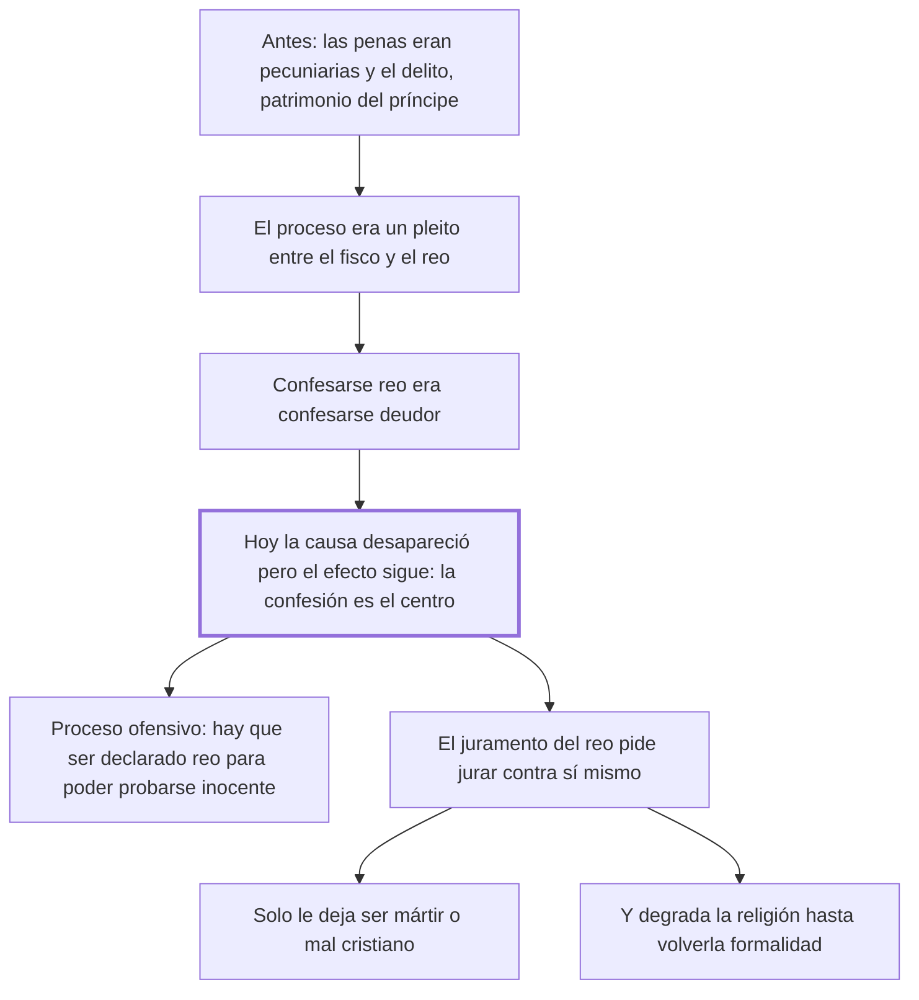

# 17. Del fisco + 18. De los juramentos

## 1. Idea principal

El proceso penal europeo conserva la forma de un pleito fiscal aunque su causa desapareció, y por eso gira en torno a la confesión; el juramento del reo, además, lo obliga a elegir entre ser mártir o mal cristiano.

Contestan por qué el proceso está diseñado como está. Son los dos capítulos que explican de dónde viene la obsesión con la confesión que el capítulo de la tortura acababa de atacar.

## 2. Lo esencial del capítulo

El cap. 17 hace historia para explicar el presente. Hubo un tiempo en que casi todas las penas eran pecuniarias y "los delitos de los hombres eran el patrimonio del príncipe": los atentados contra la seguridad eran objeto de lucro y quien debía defenderla tenía interés en verla ofendida. El proceso era un pleito entre el fisco y el reo, y el juez "un abogado del fisco más que un indiferente investigador de la verdad" (cap. 17). Ahí confesarse delincuente era confesarse deudor, así que la confesión ocupó el centro. Y esa es la tesis: la confesión sigue siendo hoy el centro de los ordenamientos criminales porque "continúan siempre los efectos después de haber faltado sus causas".

Las consecuencias son concretas. Sin confesión, un reo convicto por pruebas indudables recibe pena menor que la establecida; con ella, el juez "toma posesión del cuerpo del reo". Se la busca por el tormento, mientras se rechaza como insuficiente una deposición extrajudicial tranquila, que es la más confiable. Se excluyen las pruebas que aclaran el hecho pero debilitan las razones del fisco, "este ente imaginario e inconcebible". El juez se vuelve enemigo del reo y se siente desairado si no logra su intento. De ahí la fórmula que resume el vicio: para que un hombre esté en la precisión de probar su inocencia debe antes ser declarado reo. Eso es el **proceso ofensivo**, opuesto al **informativo**, que manda la razón y usan hasta las leyes militares.

El cap. 18 ataca el juramento del reo. Es una contradicción entre las leyes y los sentimientos naturales pedirle que jure decir verdad cuando tiene el mayor interés en encubrirla, "como si el hombre pudiese jurar de contribuir seguramente a su destrucción". El argumento es a la vez piadoso y demoledor: los motivos que la religión opone al deseo de vivir son flacos porque están remotos de los sentidos, y los negocios del Cielo se rigen por leyes distintas de las humanas. Comprometer unos con otros pone al hombre ante la elección de ser mártir o mal cristiano.

El daño no recae solo sobre el reo. El juramento se vuelve poco a poco una simple formalidad, y con eso se destruye la fuerza de los principios religiosos, "única garantía de honestidad en la mayor parte de los hombres": el capítulo defiende la religión del uso que la ley hace de ella. Su inutilidad la muestran la experiencia y la razón, que declara inútiles y por eso dañosas todas las leyes opuestas a los sentimientos naturales. El cierre es la imagen del dique puesto contra la corriente de un río: o lo derriba el agua de golpe, o el esfuerzo lento y repetido lo roe y lo mina.

## 3. Mapa

## 4. Qué releer del original

1. (cap. 17) "continuando siempre los efectos después de haber faltado sus causas" — es la tesis del capítulo y explica por qué el proceso conserva una forma que ya nada justifica.
2. (cap. 17) El retrato del juez que pone lazos al encarcelado — resumí sus rasgos, pero el pasaje completo es el mejor argumento contra el proceso ofensivo.
3. (cap. 18) La imagen final del dique contra la corriente del río — condensa la tesis del libro sobre las leyes que contrarían la naturaleza humana.

## 5. Vocabulario clave

- **Fisco** — el erario que cobraba las penas pecuniarias; el capítulo lo llama un ente imaginario e inconcebible.
- **Proceso ofensivo** — aquel en que se declara reo al acusado para obligarlo a probar su inocencia.
- **Proceso informativo** — el que manda la razón: se investiga el hecho antes de imputar.
- **Confesión** — la admisión del propio delito; centro heredado de los ordenamientos criminales.
- **Juramento del reo** — la promesa de decir verdad exigida a quien más interés tiene en callarla.

## 6. Distinciones que se confunden

- **Proceso ofensivo vs. informativo** — el primero parte de la imputación; el segundo, de la averiguación del hecho.
  - Se confunden porque: los dos terminan en una sentencia y los dos recogen pruebas.
  - Criterio para decidir: ¿en qué momento el hombre queda obligado a defenderse? Si es antes de que haya prueba, el proceso es ofensivo.
  - Dónde se cae: se toma la prisión preventiva y la imputación temprana como el modo normal de investigar, que es exactamente el vicio heredado del fisco.

- **Confesión judicial vs. deposición extrajudicial** — el sistema desconfía de la segunda, obtenida en calma, y exige la primera, obtenida bajo temor.
  - Se confunden porque: en las dos el acusado dice lo mismo sobre los hechos.
  - Criterio para decidir: ¿en qué condiciones se habló? Beccaria señala que se prefiere justo la menos confiable.
  - Dónde se cae: se descarta lo dicho fuera del juicio por falta de garantías, sin notar que las garantías del juicio son las que producen el miedo.

## 7. Autoevaluación

1. Beccaria dice que la confesión sigue siendo el centro del proceso aunque su causa desapareció. ¿Qué tipo de crítica es esa?
2. Si la confesión es tan valiosa, ¿por qué el sistema rechaza una declaración extrajudicial tranquila?
3. El cap. 18 defiende la religión mientras ataca el juramento. ¿Cómo compatibiliza las dos cosas?
4. Sostiene que toda ley opuesta a los sentimientos naturales es inútil y por eso dañosa. ¿Es un buen criterio general?

--- No mires esto hasta responder ---

1. Genealógica: no discute si la confesión es buena prueba, sino que muestra de dónde viene su prestigio. Nació cuando confesarse delincuente era confesarse deudor del fisco, y sobrevivió por inercia. Una institución que solo se explica por su origen ya perdido no tiene razón actual que la sostenga (cap. 17).
2. Porque lo que se busca no es la verdad sino una prueba que no debilite las razones fiscales. La declaración tranquila aclara el hecho pero no somete al acusado; la arrancada en juicio, sí. Es la misma inversión que denuncia el cap. 16 al preferir el dolor a las señales del rostro.
3. Separando jurisdicciones, como en el cap. 7. No niega la fuerza de la religión: dice que es la única garantía de honestidad para la mayoría, y por eso denuncia el uso que la gasta. El juramento imposible la convierte en formalidad, y así el Estado destruye el recurso del que pretendía servirse.
4. Es fuerte pero peligroso, y él mismo lo modera con la imagen del dique: la ley que contraría la corriente será derribada o minada. El problema es que muchos deberes legítimos contrarían inclinaciones naturales —pagar impuestos, no vengarse—. El criterio funciona acá porque no pide vencer una inclinación sino producir un imposible: querer la propia ruina.

## Flashcards

Qué eran los delitos de los hombres cuando las penas eran pecuniarias | El patrimonio del príncipe, y los atentados un objeto de lucro
Qué era el juez en el sistema fiscal según el cap. 17 | Un abogado del fisco más que un indiferente investigador de la verdad
Por qué sigue la confesión en el centro del proceso | Porque continúan los efectos después de haber faltado sus causas
Qué es un proceso ofensivo | Aquel en que hay que ser declarado reo antes de poder probar la inocencia
Qué prueba rechaza el sistema aunque sea más confiable | La deposición extrajudicial tranquila, hecha sin los temores del juicio
Qué contradicción crea el juramento del reo | Faltar a Dios o concurrir a su propia ruina
Qué elección le deja al reo la ley que ordena jurar | Ser mártir o mal cristiano
Con qué imagen cierra Beccaria el cap. 18 | Con la del dique opuesto a la corriente, que el agua derriba o mina
