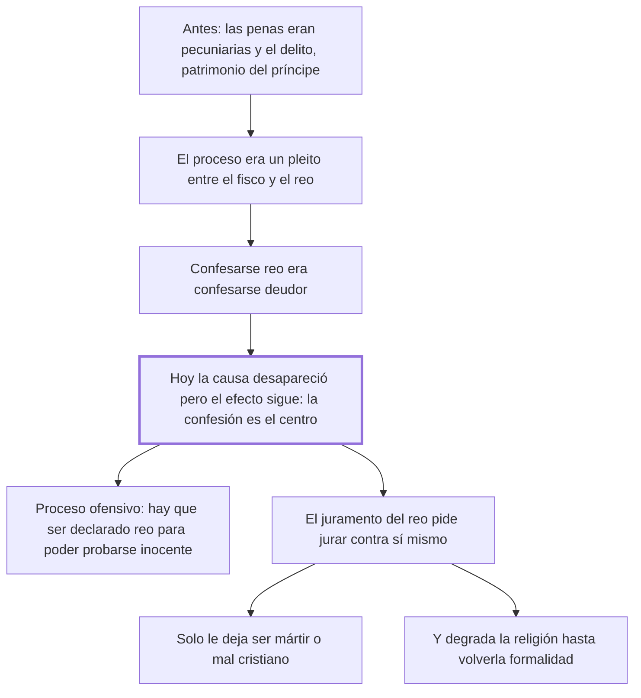

# 17. Del fisco + 18. De los juramentos

## 1. Idea principal

El proceso penal europeo conserva la forma de un pleito fiscal aunque su causa desapareció, y por eso gira en torno a la confesión; el juramento del reo, además, lo obliga a elegir entre ser mártir o mal cristiano.

Contestan por qué el proceso está diseñado como está. Son los dos capítulos que explican de dónde viene la obsesión con la confesión que el capítulo de la tortura acababa de atacar.

## 2. Lo esencial del capítulo

El cap. 17 hace historia para explicar el presente: hubo un tiempo en que casi todas las penas eran pecuniarias y "los delitos de los hombres eran el patrimonio del príncipe", de modo que los atentados contra la seguridad eran objeto de lucro y quien debía defenderla tenía interés en verla ofendida. El proceso era un pleito entre el fisco y el reo, y el juez "un abogado del fisco más que un indiferente investigador de la verdad" (cap. 17); ahí confesarse delincuente era confesarse deudor, y por eso la confesión ocupó el centro. La tesis es que lo sigue ocupando hoy, cuando la causa ya desapareció, porque "continúan siempre los efectos después de haber faltado sus causas".

Las consecuencias son concretas: sin confesión, un reo convicto por pruebas indudables recibe pena menor que la establecida; con ella el juez "toma posesión del cuerpo del reo"; se la busca por el tormento mientras se rechaza como insuficiente una deposición extrajudicial tranquila, que es la más confiable; y se excluyen las pruebas que aclaran el hecho pero debilitan las razones del fisco, "este ente imaginario e inconcebible". El vicio se resume en una fórmula: para que un hombre esté en la precisión de probar su inocencia debe antes ser declarado reo. Eso es el proceso ofensivo, opuesto al informativo, que manda la razón y usan hasta las leyes militares.

El cap. 18 ataca el juramento del reo como contradicción entre las leyes y los sentimientos naturales: se le pide jurar decir verdad cuando tiene el mayor interés en encubrirla, "como si el hombre pudiese jurar de contribuir seguramente a su destrucción". Los motivos que la religión opone al deseo de vivir son flacos porque están remotos de los sentidos, y comprometer los negocios del Cielo con los humanos deja al hombre la sola elección de ser mártir o mal cristiano. El daño no recae solo sobre él: el juramento se vuelve poco a poco una simple formalidad y con eso se destruye la fuerza de los principios religiosos, "única garantía de honestidad en la mayor parte de los hombres", de manera que el capítulo defiende la religión del uso que la ley hace de ella. Cierra con la imagen del dique puesto contra la corriente de un río, que el agua derriba de golpe o roe y mina con esfuerzo lento (cap. 18).

## 3. Mapa

## 4. Vocabulario clave

- **Fisco** — el erario que cobraba las penas pecuniarias; el capítulo lo llama un ente imaginario e inconcebible.
- **Proceso ofensivo** — aquel en que se declara reo al acusado para obligarlo a probar su inocencia.
- **Proceso informativo** — el que manda la razón: se investiga el hecho antes de imputar.
- **Confesión** — la admisión del propio delito; centro heredado de los ordenamientos criminales.
- **Juramento del reo** — la promesa de decir verdad exigida a quien más interés tiene en callarla.

## 5. Distinciones que se confunden

- **Proceso ofensivo vs. informativo** — el primero parte de la imputación; el segundo, de la averiguación del hecho.
  - Se confunden porque: los dos terminan en una sentencia y los dos recogen pruebas.
  - Criterio para decidir: ¿en qué momento el hombre queda obligado a defenderse? Si es antes de que haya prueba, el proceso es ofensivo.
  - Dónde se cae: se toma la prisión preventiva y la imputación temprana como el modo normal de investigar, que es exactamente el vicio heredado del fisco.

- **Confesión judicial vs. deposición extrajudicial** — el sistema desconfía de la segunda, obtenida en calma, y exige la primera, obtenida bajo temor.
  - Se confunden porque: en las dos el acusado dice lo mismo sobre los hechos.
  - Criterio para decidir: ¿en qué condiciones se habló? Beccaria señala que se prefiere justo la menos confiable.
  - Dónde se cae: se descarta lo dicho fuera del juicio por falta de garantías, sin notar que las garantías del juicio son las que producen el miedo.

## 6. Autoevaluación

1. ¿Qué se entiende por proceso ofensivo y qué lo distingue del informativo? Explique de dónde viene, según el cap. 17, el lugar central de la confesión.
2. Sostiene que toda ley opuesta a los sentimientos naturales es inútil y por eso dañosa. ¿Es un buen criterio general?

--- No mires esto hasta responder ---

1. Proceso ofensivo es aquel en que el hombre debe ser declarado reo antes de quedar en la precisión de probar su inocencia; el informativo, el que manda la razón y usan hasta las leyes militares, averigua el hecho antes de imputarlo (cap. 17). El lugar central de la confesión es una herencia fiscal: cuando casi todas las penas eran pecuniarias, los delitos eran el patrimonio del príncipe, el proceso era un pleito entre el fisco y el reo y el juez un abogado del fisco más que un indiferente investigador de la verdad, de modo que confesarse delincuente era confesarse deudor. La causa desapareció y el efecto quedó, porque continúan siempre los efectos después de haber faltado sus causas. De ahí las consecuencias que Beccaria enumera: pena menor al convicto que no confiesa, tormento para arrancar la confesión, rechazo de la deposición extrajudicial tranquila y exclusión de las pruebas que debilitan las razones del fisco. La crítica es genealógica: una institución que solo se explica por un origen ya perdido no tiene razón actual que la sostenga.
2. Es fuerte pero peligroso, y él mismo lo modera con la imagen del dique: la ley que contraría la corriente será derribada o minada. El problema es que muchos deberes legítimos contrarían inclinaciones naturales —pagar impuestos, no vengarse—. El criterio funciona en el caso del juramento porque ahí la ley no pide vencer una inclinación sino producir un imposible: querer la propia ruina.

## Flashcards

Por qué sigue la confesión en el centro del proceso | Porque continúan los efectos después de haber faltado sus causas
Qué es un proceso ofensivo | Aquel en que hay que ser declarado reo antes de poder probar la inocencia
Qué elección le deja al reo la ley que ordena jurar | Ser mártir o mal cristiano
