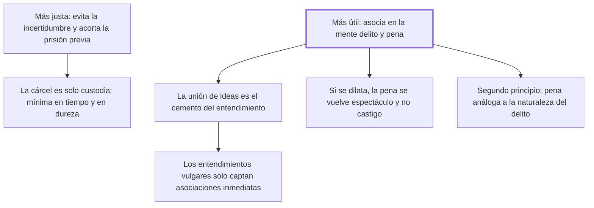

# 19. Prontitud de la pena

## 1. Idea principal

Cuanto más pronta es la pena, más justa y más útil: justa porque acorta la incertidumbre y la prisión previa, y útil porque solo la cercanía en el tiempo asocia en la mente las ideas de delito y de pena.

Contesta cuándo hay que castigar. Es el capítulo donde Beccaria funda la eficacia de la pena en una teoría del entendimiento, y de donde salen sus reglas sobre la cárcel preventiva.

## 2. Lo esencial del capítulo

La prontitud es más justa por dos razones: evita al reo "los inútiles y fieros tormentos de la incertidumbre", que crecen con el vigor de la imaginación, y acorta una privación de libertad que ya es una especie de pena y por eso no puede preceder a la sentencia sino en cuanto la necesidad obligue (cap. 19). De ahí las tres reglas sobre la cárcel: es solo la custodia de un ciudadano hasta que se lo declare reo; debe durar el menor tiempo posible, medido por la duración necesaria del proceso y la antigüedad de las causas que esperan turno; y su estrechez no puede exceder de lo necesario para impedir la fuga o que se oculten las pruebas. La pena debe ser la más eficaz para los otros y la menos dura para quien la sufre, porque no hay sociedad legítima donde no rija que los hombres quisieron sujetarse a los menores males posibles.

La utilidad se apoya en una tesis psicológica: cuanto menor es la distancia de tiempo entre delito y pena, más fuerte y durable es en el ánimo la asociación de esas dos ideas, hasta considerarse una como causa y la otra como efecto necesario, y esa unión "es el cemento sobre que se forma toda la fábrica del entendimiento humano". La pena no funciona por su contenido sino por el vínculo mental que crea, y por eso importa sobre todo en los entendimientos rudos, que obran por asociaciones inmediatas y descuidan las remotas. Cuando el castigo se dilata las dos ideas se desunen: la pena igual impresiona, pero "la hace menos como castigo que como espectáculo", y llega cuando ya se desvaneció el horror de aquel delito particular, que era lo que reforzaba el temor. Agrega entonces un segundo principio, que la pena sea conforme a la naturaleza del delito, porque esa analogía facilita el choque entre el estímulo que impele al delito y la repercusión de la pena (cap. 19).

## 3. Mapa

## 4. Vocabulario clave

- **Prontitud de la pena** — su cercanía temporal al delito; para Beccaria, condición de su justicia y de su utilidad.
- **Cárcel** — la simple custodia del ciudadano hasta que sea declarado reo, no una pena anticipada.
- **Asociación de ideas** — la unión mental entre delito y pena que la cercanía en el tiempo produce.
- **Analogía de la pena** — que se parezca a la naturaleza del delito, para reforzar esa unión.

## 5. Distinciones que se confunden

- **Custodia vs. pena anticipada** — la prisión antes de la sentencia solo se justifica por la fuga o el ocultamiento de pruebas.
  - Se confunden porque: en las dos el ciudadano está encerrado y sufre lo mismo.
  - Criterio para decidir: ¿qué la hace necesaria hoy? Si la razón no es asegurar el proceso, ya se está penando sin sentencia.
  - Dónde se cae: se prolonga la prisión preventiva por la gravedad del delito imputado, que es una razón de pena y no de custodia.

- **Severidad vs. prontitud** — lo que graba la asociación en el ánimo es el poco tiempo transcurrido, no la dureza del castigo.
  - Se confunden porque: las dos se presentan como formas de "tomarse en serio" el delito.
  - Criterio para decidir: ¿qué se está reforzando, el dolor o el vínculo entre las dos ideas? Solo el segundo previene.
  - Dónde se cae: se compensa un proceso lento con una pena más dura, y el capítulo muestra que eso no repone la asociación perdida.

## 6. Autoevaluación

1. ¿Qué se entiende por prontitud de la pena y cuáles son sus implicaciones? Explique por qué la hace a la vez más justa y más útil.
2. En un país los procesos penales duran años y la respuesta política es endurecer las penas. ¿Qué diría el cap. 19?

--- No mires esto hasta responder ---

1. La prontitud es la cercanía en el tiempo entre el delito y la pena, y para Beccaria es a la vez condición de su justicia y de su utilidad (cap. 19). Es más justa por dos razones: evita al reo los inútiles y fieros tormentos de la incertidumbre, que crecen con el vigor de la imaginación, y acorta una privación de libertad que ya es una especie de pena y no puede preceder a la sentencia sino en cuanto la necesidad obligue. Es más útil porque cuanto menor es la distancia de tiempo, más fuerte y durable resulta la asociación entre las ideas de delito y de pena, hasta considerarse una como causa y la otra como efecto necesario; y esa unión de ideas es el cemento sobre el que se forma toda la fábrica del entendimiento humano. Sus implicaciones son concretas: la cárcel antes de la sentencia es solo custodia, con duración mínima y estrechez limitada a impedir la fuga o el ocultamiento de pruebas; y una pena muy dilatada se vuelve espectáculo más que castigo, porque cuando llega ya se desvaneció el horror de aquel delito particular.
2. Que el problema no se arregla por ahí. Un sistema lento rompe el vínculo que hace prevenir a la pena, así que su efecto disuasivo cae por más severo que sea el castigo final: lo que graba la asociación es el poco tiempo transcurrido, no la dureza. El argumento vale para cualquier demora, aunque el capítulo no discute qué hacer cuando la complejidad de la causa exige tiempo.

## Flashcards

Por qué es más justa una pena pronta | Porque evita al reo los tormentos de la incertidumbre y acorta la prisión antes de la sentencia
Por qué es más útil una pena pronta | Porque hace más fuerte y durable la asociación entre las ideas de delito y de pena
Cuáles son las tres reglas de la cárcel preventiva | Es solo custodia hasta que se declare reo, dura el menor tiempo posible y su estrechez solo impide la fuga o el ocultamiento de pruebas
En qué se convierte una pena muy dilatada | En espectáculo más que en castigo
