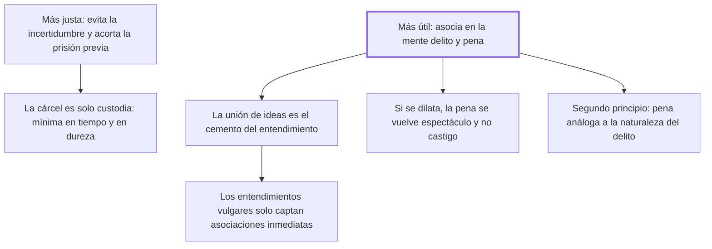

# 19. Prontitud de la pena

## 1. Idea principal

Cuanto más pronta es la pena, más justa y más útil: justa porque acorta la incertidumbre y la prisión previa, y útil porque solo la cercanía en el tiempo asocia en la mente las ideas de delito y de pena.

Contesta cuándo hay que castigar. Es el capítulo donde Beccaria funda la eficacia de la pena en una teoría del entendimiento, y de donde salen sus reglas sobre la cárcel preventiva.

## 2. Lo esencial del capítulo

La justicia de la prontitud tiene dos razones. La primera es que evita al reo "los inútiles y fieros tormentos de la incertidumbre", que crecen con el vigor de la imaginación (cap. 19). La segunda es que la privación de la libertad ya es una especie de pena, y como tal no puede preceder a la sentencia sino en cuanto la necesidad obligue. De ahí las tres reglas sobre la cárcel: es solo la custodia de un ciudadano hasta que se lo declare reo; debe durar el menor tiempo posible, medido por la duración necesaria del proceso y la antigüedad de las causas que esperan turno; y su estrechez no puede exceder de lo necesario para impedir la fuga o que se oculten las pruebas. Beccaria remata con el contraste entre las comodidades de un magistrado insensible y las lágrimas de un encarcelado, y con la regla de que la pena debe ser la más eficaz para los otros y la menos dura para quien la sufre, porque no hay sociedad legítima donde no rija que los hombres quisieron sujetarse a los menores males posibles.

La utilidad se apoya en una tesis psicológica que es lo más original del capítulo. Cuanto menor es la distancia de tiempo entre delito y pena, más fuerte y durable es en el ánimo la **asociación** de esas dos ideas, hasta que se consideran una como causa y la otra como efecto necesario. Y esa asociación no es un detalle: "la unión de las ideas es el cemento sobre que se forma toda la fábrica del entendimiento humano", sin el cual el placer y el dolor serían impulsos sin efecto. La pena no funciona por su contenido sino por el vínculo mental que crea.

Sigue una observación sobre a quién afecta más la demora. Cuanto más se alejan los hombres de las ideas generales, más obran por asociaciones inmediatas y descuidan las remotas, que solo sirven a los fuertemente apasionados por un objeto y a los entendimientos más elevados. Por eso importa tanto la proximidad: para que en los entendimientos rudos, junto a la pintura seductora de un delito ventajoso, asome de inmediato la idea asociada de la pena.

El cierre trata de qué pasa cuando se dilata. La retardación desune las dos ideas, y aunque el castigo tardío igual impresiona, "la hace menos como castigo que como espectáculo", y llega cuando ya se desvaneció el horror del delito particular, que era lo que reforzaba el temor de la pena. Beccaria agrega un segundo principio: que la pena sea **conforme a la naturaleza del delito**, porque esa analogía facilita el choque entre el estímulo que impele al delito y la repercusión de la pena.

## 3. Mapa

## 4. Vocabulario clave

- **Prontitud de la pena** — su cercanía temporal al delito; para Beccaria, condición de su justicia y de su utilidad.
- **Cárcel** — la simple custodia del ciudadano hasta que sea declarado reo, no una pena anticipada.
- **Asociación de ideas** — la unión mental entre delito y pena que la cercanía en el tiempo produce.
- **Analogía de la pena** — que se parezca a la naturaleza del delito, para reforzar esa unión.

## 5. Distinciones que se confunden

- **Custodia vs. pena anticipada** — la prisión antes de la sentencia solo se justifica por la fuga o el ocultamiento de pruebas.
  - Se confunden porque: en las dos el ciudadano está encerrado y sufre lo mismo.
  - Criterio para decidir: ¿qué la hace necesaria hoy? Si la razón no es asegurar el proceso, ya se está penando sin sentencia.
  - Dónde se cae: se prolonga la prisión preventiva por la gravedad del delito imputado, que es una razón de pena y no de custodia.

- **Severidad vs. prontitud** — lo que graba la asociación en el ánimo es el poco tiempo transcurrido, no la dureza del castigo.
  - Se confunden porque: las dos se presentan como formas de "tomarse en serio" el delito.
  - Criterio para decidir: ¿qué se está reforzando, el dolor o el vínculo entre las dos ideas? Solo el segundo previene.
  - Dónde se cae: se compensa un proceso lento con una pena más dura, y el capítulo muestra que eso no repone la asociación perdida.

## 6. Autoevaluación

1. ¿Por qué una pena tardía "hace menos impresión como castigo que como espectáculo"?
2. Beccaria dice que la prontitud importa sobre todo para los entendimientos vulgares. ¿Es un argumento clasista?
3. La cárcel preventiva es "por su naturaleza penosa" y no es una pena. ¿Cómo se sostiene esa doble afirmación?
4. El capítulo funda la eficacia penal en la asociación de ideas. ¿Qué se sigue de ahí para un sistema con procesos de años?

--- No mires esto hasta responder ---

1. Porque la retardación desune las ideas de delito y pena, y cuando el castigo llega ya se desvaneció en los espectadores el horror de aquel delito particular, que era lo que reforzaba el temor. Sin esa conexión queda la escena, no la lección (cap. 19).
2. Es una observación psicológica y no una jerarquía moral: dice que quien está más lejos de las ideas generales obra por asociaciones inmediatas, y que las remotas solo las manejan los apasionados y los entendimientos elevados. La usa además a favor de los primeros: el sistema debe adaptarse a cómo la gente razona de hecho, no exigirle lo que no hace.
3. Reconociendo que produce un mal sin ser un castigo. Por eso la somete a necesidad estricta —fuga u ocultamiento de pruebas— y a la duración mínima: si el mal es inevitable para asegurar el proceso, hay que reducirlo al mínimo; si no lo es, es pena sin sentencia, que ninguna ley autorizó.
4. Que el problema no se arregla endureciendo penas. Un sistema lento rompe el vínculo que hace prevenir a la pena, así que su efecto disuasivo cae por más severo que sea el castigo final. Beccaria lo dice para el proceso de su época; el argumento vale igual para cualquier demora, aunque el capítulo no discute qué hacer cuando la complejidad de la causa exige tiempo.

## Flashcards

Por qué es más justa una pena pronta | Porque evita al reo los tormentos de la incertidumbre y acorta la prisión antes de la sentencia
Qué es la cárcel según el cap. 19 | La simple custodia de un ciudadano hasta que sea declarado reo
Con qué se mide el tiempo mínimo de esa custodia | Con la duración necesaria del proceso y la antigüedad de las causas pendientes
Qué justifica la estrechez de la cárcel | Solo impedir la fuga o que se oculten las pruebas
Por qué es más útil una pena pronta | Porque hace más fuerte y durable la asociación entre las ideas de delito y de pena
Qué es la unión de las ideas para Beccaria | El cemento sobre el que se forma toda la fábrica del entendimiento humano
En qué se convierte una pena muy dilatada | En espectáculo más que en castigo
Cuál es el segundo principio que refuerza la conexión delito-pena | Que la pena sea conforme a la naturaleza del mismo delito
