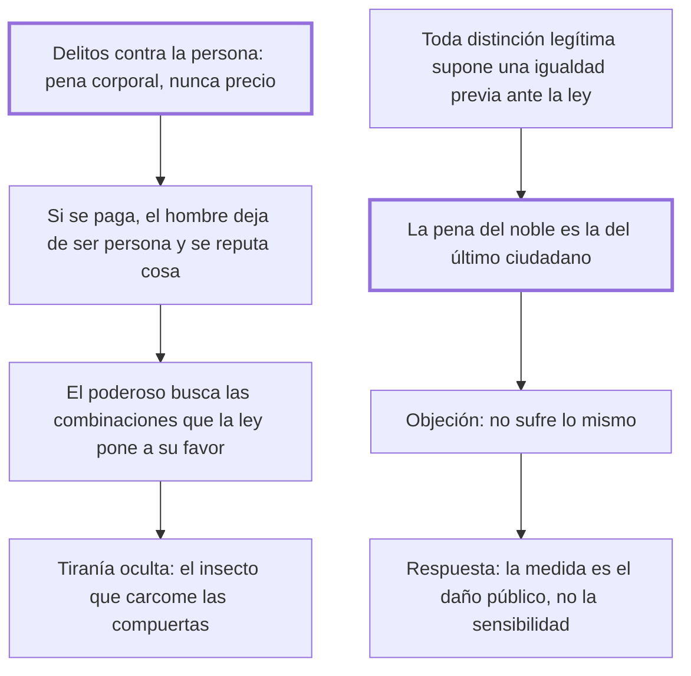

# 20. Violencias + 21. Penas de los nobles

## 1. Idea principal

La violencia contra la persona debe castigarse siempre con pena corporal y nunca con dinero, y la pena del noble debe ser la misma que la del último ciudadano, porque toda distinción legítima supone una igualdad previa ante la ley.

Contestan si el poder o el rango pueden alterar la pena. Son los dos capítulos donde el libro enfrenta el privilegio de manera más directa.

## 2. Lo esencial del capítulo

El cap. 20 parte de la división entre delitos contra la persona y contra los bienes y saca una regla tajante: los primeros deben castigarse infaliblemente con penas corporales, porque ni el grande ni el rico deben poder "satisfacer por precio" los atentados contra el débil (cap. 20). Si pudieran, las riquezas, que bajo la tutela de las leyes son el premio de la industria, se volverían alimento de la tiranía. El fundamento es que no hay libertad cuando las leyes permiten que en ciertos casos el hombre deje de ser persona y se repute como cosa: la objeción no va al monto sino a la conversión. Advierte que en los gobiernos con apariencia de libertad la tiranía está escondida: se oponen compuertas a la descubierta, pero no se ve "el insecto imperceptible que las carcome".

El cap. 21 empieza declarando lo que no va a discutir: si la distinción hereditaria entre nobles y plebeyos es útil o si forma un poder intermedio; deja abierta la posibilidad de que la desigualdad sea inevitable, aunque sugiere que debería estar en los estamentos y no en los individuos. Se limita a las penas, que deben ser las mismas para el primero que para el último ciudadano. El argumento es contractual: toda distinción, en honores o riquezas, supone para ser legítima una igualdad anterior fundada en las leyes, y pone en boca de los hombres el pacto de que el más respetado "espere más, y no tema menos que los otros" al violar los pactos que lo elevaron.

El cierre responde la objeción previsible —que la misma pena no pesa igual sobre el noble— con tres respuestas: que la sensibilidad del reo no es la medida de las penas sino el daño público, tanto mayor cuanto más favorecido esté quien lo causa; que la igualdad de las penas solo puede ser extrínseca, porque realmente es diversa en cada individuo; y que la infamia de la familia inocente puede desvanecerla el soberano con demostraciones públicas de benevolencia, porque "las formalidades sensibles ocupan el lugar de las razones en el pueblo crédulo y admirador" (cap. 21).

## 3. Mapa

## 4. Vocabulario clave

- **Pena corporal** — la que recae sobre el cuerpo; obligatoria, según el cap. 20, para los atentados contra la persona.
- **Satisfacer por precio** — pagar en dinero un atentado personal; para Beccaria, convertir al hombre en cosa.
- **Poder intermedio** — la función que se atribuye a la nobleza entre el soberano y el pueblo; el capítulo no la discute.
- **Igualdad anterior** — la sujeción de todos a las leyes, sin la cual ninguna distinción de honores o riquezas es legítima.

## 5. Distinciones que se confunden

- **Igualdad extrínseca vs. igualdad de sufrimiento** — la ley solo puede igualar la pena impuesta, no lo que cada uno padece.
  - Se confunden porque: parece injusto que la misma pena pese distinto según la persona.
  - Criterio para decidir: ¿qué se está midiendo, el daño público o la sensibilidad del reo? Beccaria responde que solo el primero es medida.
  - Dónde se cae: se atenúa la pena del poderoso porque "para él es peor", que es exactamente el privilegio disfrazado de equidad.

- **Delito contra la persona vs. contra los bienes** — solo el segundo admite pena pecuniaria.
  - Se confunden porque: los dos producen un daño que puede tasarse en dinero.
  - Criterio para decidir: ¿lo atacado fue la persona o su patrimonio? Poner precio a lo primero la convierte en cosa.
  - Dónde se cae: se acepta una compensación económica por una agresión física como si reparase, cuando el capítulo lo trata como alimento de la tiranía.

## 6. Autoevaluación

1. ¿Qué se entiende por igualdad ante la pena? Explique por qué, según Beccaria, toda distinción de honores o riquezas la presupone, y cuáles son sus implicaciones.
2. Un noble alega que la misma pena lo daña más por su educación y por la infamia familiar. ¿Cómo responde el cap. 21?

--- No mires esto hasta responder ---

1. Igualdad ante la pena significa que las penas deben ser las mismas para el primero que para el último ciudadano, cualquiera sea su rango (cap. 21). Beccaria la funda en un argumento contractual: toda distinción, en honores o en riquezas, supone para ser legítima una igualdad anterior fundada sobre las leyes, porque los hombres que consintieron que el más industrioso tuviera mayores honores pactaron también que el más respetado espere más y no tema menos que los otros al violar los pactos que lo elevaron. De ahí que la regla no destruya las ventajas de la nobleza: impide sus inconvenientes y hace formidables las leyes al cerrar todo camino a la impunidad. Su implicación más incómoda está en el cap. 20: los atentados contra la persona deben castigarse infaliblemente con penas corporales, porque si el grande o el rico pueden satisfacerlos por precio el hombre deja de ser persona y se reputa como cosa, y las riquezas pasan de premio de la industria a alimento de la tiranía. Y explica por qué el privilegio sobrevive en los gobiernos que parecen libres: se levantan compuertas contra la tiranía descubierta y no se ve el insecto imperceptible que las carcome.
2. Con tres argumentos: que la medida de las penas es el daño público y no la sensibilidad del reo; que la igualdad de las penas solo puede ser extrínseca, porque el padecimiento real difiere en cada individuo; y que la infamia de la parentela inocente puede desvanecerla el soberano con demostraciones públicas de benevolencia. Además, el daño es mayor justamente por venir de quien está más favorecido. La tercera respuesta es la más débil, y él lo admite al apoyarla en que las formalidades sensibles ocupan el lugar de las razones en el pueblo crédulo.

## Flashcards

Cómo deben castigarse los atentados contra la persona | Infaliblemente con penas corporales, nunca con dinero
Qué supone toda distinción legítima en honores o riquezas | Una igualdad anterior fundada sobre las leyes
Cuál es la medida de las penas y cuál no lo es | La medida es el daño público; no lo es la sensibilidad del reo
