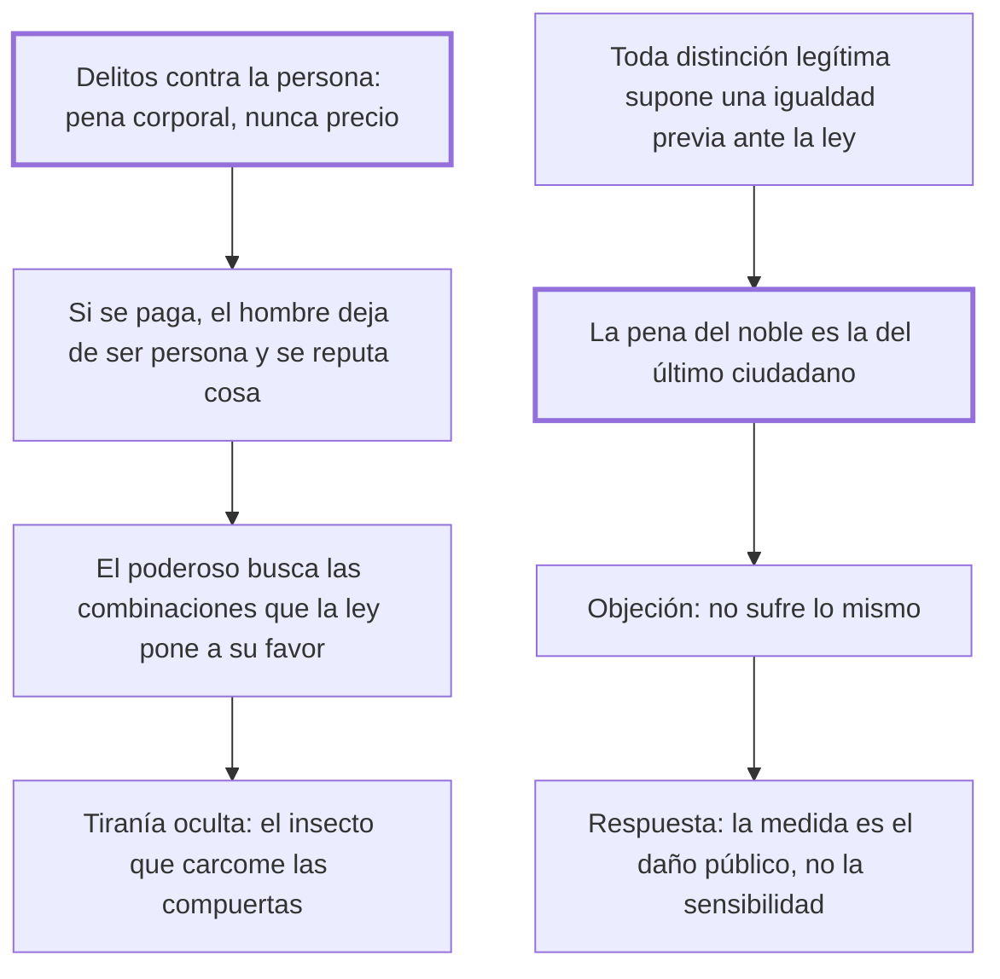

# 20. Violencias + 21. Penas de los nobles

## 1. Idea principal

La violencia contra la persona debe castigarse siempre con pena corporal y nunca con dinero, y la pena del noble debe ser la misma que la del último ciudadano, porque toda distinción legítima supone una igualdad previa ante la ley.

Contestan si el poder o el rango pueden alterar la pena. Son los dos capítulos donde el libro enfrenta el privilegio de manera más directa.

## 2. Lo esencial del capítulo

El cap. 20 parte de una división simple —delitos contra la persona y contra los bienes— y saca una regla tajante: los primeros deben castigarse infaliblemente con penas corporales, porque ni el grande ni el rico deben poder "satisfacer por precio" los atentados contra el débil (cap. 20). Si pudieran, las riquezas, que bajo la tutela de las leyes son el premio de la industria, se volverían alimento de la tiranía. El fundamento sigue enseguida: no hay libertad cuando las leyes permiten que en ciertos casos el hombre deje de ser persona y se repute como cosa. La objeción no es al monto de la multa sino a la conversión: admitir el precio ya trata a la víctima como valor patrimonial.

Sigue una advertencia sobre cómo opera el privilegio. El poderoso pone su industria en "hacer salir del tropel de combinaciones civiles" aquellas que la ley determina a su favor, y ese es el secreto mágico que cambia a los ciudadanos en animales de servicio. Por eso en gobiernos con apariencia de libertad la tiranía está escondida: los hombres oponen fuertes compuertas a la tiranía descubierta, pero no ven "el insecto imperceptible que las carcome".

El cap. 21 empieza declarando lo que no va a discutir: si la distinción hereditaria entre nobles y plebeyos es útil, si forma un poder intermedio o un estamento cerrado que corta la circulación del crédito. Deja abierta la posibilidad de que la desigualdad sea inevitable, aunque sugiere que debería estar en los estamentos y no en los individuos. Y se limita a las penas: deben ser **las mismas para el primero que para el último ciudadano**.

El argumento es contractual. Toda distinción, en honores o riquezas, supone para ser legítima una igualdad anterior fundada en las leyes. Beccaria pone en boca de los hombres el pacto: que el más industrioso tenga mayores honores, pero que el más respetado "espere más, y no tema menos que los otros" al violar los pactos que lo elevaron. Y la regla no destruye las ventajas atribuidas a la nobleza: impide sus inconvenientes y hace formidables las leyes al cerrar todo camino a la impunidad.

El cierre responde la objeción previsible —que la misma pena no es la misma para el noble— con tres respuestas. Que **la sensibilidad del reo no es la medida de las penas** sino el daño público, tanto mayor cuanto más favorecido esté quien lo causa. Que la igualdad de las penas solo puede ser extrínseca, porque realmente es diversa en cada individuo. Y que la infamia de una familia puede desvanecerla el soberano con demostraciones públicas de benevolencia, porque "las formalidades sensibles ocupan el lugar de las razones en el pueblo crédulo y admirador".

## 3. Mapa

## 4. Qué releer del original

1. (cap. 20) "el insecto imperceptible que las carcome" — cierra el capítulo con la mejor imagen del libro sobre cómo la tiranía entra en un régimen libre.
2. (cap. 21) El párrafo del pacto imaginario, desde "quien fuere más industrioso tenga mayores honores" — es la fundamentación de la igualdad penal y conviene tenerla literal.
3. (cap. 21) Las tres respuestas a la objeción de la sensibilidad — están comprimidas en pocas líneas y cada una es un argumento distinto.

## 5. Vocabulario clave

- **Pena corporal** — la que recae sobre el cuerpo; obligatoria, según el cap. 20, para los atentados contra la persona.
- **Satisfacer por precio** — pagar en dinero un atentado personal; para Beccaria, convertir al hombre en cosa.
- **Poder intermedio** — la función que se atribuye a la nobleza entre el soberano y el pueblo; el capítulo no la discute.
- **Igualdad anterior** — la sujeción de todos a las leyes, sin la cual ninguna distinción de honores o riquezas es legítima.

## 6. Distinciones que se confunden

- **Igualdad extrínseca vs. igualdad de sufrimiento** — la ley solo puede igualar la pena impuesta, no lo que cada uno padece.
  - Se confunden porque: parece injusto que la misma pena pese distinto según la persona.
  - Criterio para decidir: ¿qué se está midiendo, el daño público o la sensibilidad del reo? Beccaria responde que solo el primero es medida.
  - Dónde se cae: se atenúa la pena del poderoso porque "para él es peor", que es exactamente el privilegio disfrazado de equidad.

- **Delito contra la persona vs. contra los bienes** — solo el segundo admite pena pecuniaria.
  - Se confunden porque: los dos producen un daño que puede tasarse en dinero.
  - Criterio para decidir: ¿lo atacado fue la persona o su patrimonio? Poner precio a lo primero la convierte en cosa.
  - Dónde se cae: se acepta una compensación económica por una agresión física como si reparase, cuando el capítulo lo trata como alimento de la tiranía.

## 7. Autoevaluación

1. ¿Por qué prohíbe Beccaria la pena pecuniaria para los atentados contra la persona, si la multa puede ser altísima?
2. Un noble alega que la misma pena lo daña más por su educación y por la infamia familiar. ¿Cómo responde el cap. 21?
3. Beccaria evita pronunciarse sobre si la nobleza hereditaria es útil. ¿Le conviene esa abstención?
4. Dice que la infamia de la familia puede desvanecerla el soberano con gestos públicos. ¿Es una solución seria?

--- No mires esto hasta responder ---

1. Porque el problema no es la cuantía sino la conversión: si el atentado puede satisfacerse por precio, el hombre deja de ser persona y se reputa como cosa, y las riquezas pasan de premio de la industria a alimento de la tiranía. Una multa altísima seguiría fijando un precio (cap. 20).
2. Con tres argumentos: que la medida de las penas es el daño público y no la sensibilidad del reo; que la igualdad de las penas solo puede ser extrínseca, porque el sufrimiento real difiere en cada individuo; y que la infamia de la parentela inocente puede repararla el soberano. Además, el daño es mayor justamente por venir de quien está más favorecido.
3. Sí, y es una decisión táctica visible. Discutir la nobleza en sí lo habría enfrentado a todo el orden político; limitarse a las penas le permite exigir la igualdad más incómoda —la penal— sin atacar los honores. Y deja dicho lo esencial: la distinción solo es legítima si descansa en una igualdad previa ante la ley.
4. Es débil como reparación y él lo sabe: la sostiene admitiendo que "las formalidades sensibles ocupan el lugar de las razones en el pueblo crédulo". No demuestra que la infamia se borre; muestra que puede contrarrestarse con el mismo material del que está hecha, que es la opinión. Coherente con el cap. 9, aunque poco garantizador.

## Flashcards

Cómo deben castigarse los atentados contra la persona | Infaliblemente con penas corporales, nunca con dinero
Qué pasa si el rico puede satisfacer por precio un atentado | Las riquezas dejan de ser premio de la industria y se vuelven alimento de la tiranía
Cuándo dice Beccaria que no hay libertad | Cuando las leyes permiten que el hombre deje de ser persona y se repute como cosa
Con qué imagen describe la tiranía en un gobierno aparentemente libre | Con el insecto imperceptible que carcome las compuertas
Cuál debe ser la pena del noble | La misma que la del primero y el último ciudadano
Qué supone toda distinción legítima en honores o riquezas | Una igualdad anterior fundada sobre las leyes
Cuál es la medida de las penas y cuál no lo es | La medida es el daño público; no lo es la sensibilidad del reo
Por qué la igualdad de las penas solo puede ser extrínseca | Porque el padecimiento real es diverso en cada individuo
