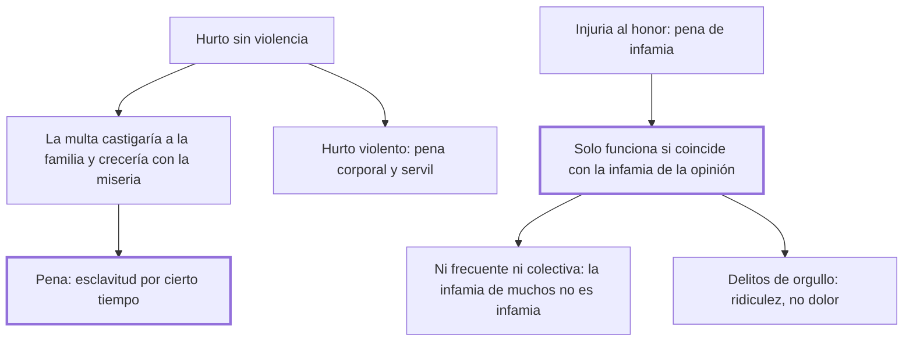

# 22. Hurtos + 23. Infamia

## 1. Idea principal

Al hurto sin violencia no le conviene la multa —el ladrón suele ser un miserable— sino la esclavitud temporal, y la infamia legal solo funciona si coincide con la que ya siente la opinión.

Contestan cómo castigar dos cosas muy distintas: el delito de los pobres y las ofensas al honor. El cap. 22 contiene la frase más audaz del libro sobre la propiedad.

## 2. Lo esencial del capítulo

En principio, dice el cap. 22, los hurtos sin violencia deberían castigarse con pena pecuniaria: "quien procura enriquecerse de lo ajeno, debiera ser empobrecido de lo propio". Pero se aparta enseguida de esa simetría: ordinariamente el hurto proviene de la miseria y lo comete la parte infeliz de los hombres a quien el derecho de propiedad —"terrible, y acaso no necesario derecho"— dejó solo la desnuda existencia. Conviene detenerse en ese paréntesis: es la única vez que el libro pone en duda la propiedad misma, y lo hace al pasar, sin sacar de ahí ninguna conclusión. Si la pena fuera pecuniaria, aumentaría el número de reos junto con el de necesitados y quitaría el pan a una familia inocente.

La pena que propone es la esclavitud por cierto tiempo, la única que puede llamarse justa: hace a la sociedad señora absoluta de la persona y el trabajo del reo, para resarcirse "con la propia y perfecta dependencia" del despotismo que él usurpó contra el pacto social. Cuando el hurto es violento, la pena debe ser mezcla de corporal y servil, y subraya un error corriente: no distinguir el hurto violento del doloso iguala con absurdo una gruesa cantidad de dinero a la vida de un hombre. Repetirlo no le parece superfluo, porque "las máquinas políticas conservan más que cualesquiera otras el movimiento que reciben" (cap. 22).

El cap. 23 trata la infamia como pena de las injurias contra el honor, entendido como "la justa porción de consideración que un ciudadano puede exigir con derecho de los otros": una señal de desaprobación pública que priva al reo de los votos públicos y de la confianza de la patria. Su rasgo decisivo es que no depende solo de la ley, porque la infamia legal tiene que coincidir con la que nace de la moral que rige en esa nación; si difieren, o la ley pierde la veneración pública o las ideas de probidad se desvanecen. De ahí tres reglas de uso —no declarar infames acciones indiferentes, no abusar de esta pena, no imponerla a muchos a la vez, ya que "la infamia de muchos se resuelve en no ser infame ninguno"— y un hallazgo más fino: a los delitos fundados en el orgullo no les conviene el dolor, que les da gloria, sino la ridiculez.

## 3. Mapa

## 4. Vocabulario clave

- **Hurto doloso** — el cometido sin violencia; para Beccaria, casi siempre hijo de la miseria.
- **Esclavitud temporal** — la pena que propone para el hurto: la sociedad se hace señora de la persona y el trabajo del reo por cierto tiempo.
- **Infamia** — señal de desaprobación pública que priva al reo de la confianza de la patria; pena de las injurias al honor.
- **Delitos fundados en el orgullo** — aquellos en que el dolor de la pena da gloria al reo, y que por eso piden ridiculez.

## 5. Distinciones que se confunden

- **Hurto violento vs. hurto doloso** — son de naturaleza distinta y confundirlos iguala una suma de dinero a la vida de un hombre.
  - Se confunden porque: en los dos se toma lo ajeno y la pérdida patrimonial puede ser idéntica.
  - Criterio para decidir: ¿hubo ataque a la persona? Si lo hubo, la pena lleva componente corporal; si no, es servil.
  - Dónde se cae: se gradúa la pena del hurto por el valor de lo sustraído, cuando lo que cambia la naturaleza del delito es la violencia.

- **Infamia legal vs. infamia de la opinión** — la primera solo tiene efecto si la segunda la acompaña.
  - Se confunden porque: la sentencia declara infame y parece que con eso basta.
  - Criterio para decidir: ¿la sociedad ya desaprueba esa conducta? Si no, la ley pierde veneración en vez de ganarla.
  - Dónde se cae: se declara infame una acción indiferente, y el efecto es rebajar la infamia de las que sí lo son.

## 6. Autoevaluación

1. Ubique el hurto dentro del sistema de penas de Beccaria: ¿por qué descarta la pena pecuniaria, que parece la más proporcionada, y qué propone en su lugar?
2. Un legislador declara infame el incumplimiento de una deuda pequeña, conducta que en esa sociedad nadie reprueba. ¿Qué predice el cap. 23 que va a pasar?

--- No mires esto hasta responder ---

1. El hurto sin violencia es, para Beccaria, el delito de la miseria, y por eso la pena que en abstracto le correspondería —empobrecer a quien quiso enriquecerse de lo ajeno— no sirve. La multa falla contra quien no tiene de qué ser empobrecido: aumentaría el número de reos al ritmo del número de necesitados y quitaría el pan a una familia inocente. Propone en cambio la esclavitud por cierto tiempo, única suerte de esclavitud que puede llamarse justa, porque hace a la sociedad señora de la persona y el trabajo del reo y la resarce con la dependencia del despotismo que él usurpó contra el pacto. Cuando el hurto es violento la pena debe ser mezcla de corporal y servil, y no distinguir los dos casos iguala con absurdo una suma de dinero a la vida de un hombre (cap. 22).
2. Que la ley pierda veneración, o que se desvanezcan las ideas de probidad. La infamia es cosa de opinión y la ley no la crea: la registra, así que declarar infame una acción indiferente no le agrega desprecio, sino que rebaja el que pesa sobre las conductas verdaderamente infames (cap. 23). Las declamaciones, dice, jamás resisten a los ejemplos.

## Flashcards

Qué pena propone Beccaria para el hurto sin violencia | La esclavitud por cierto tiempo, única suerte de esclavitud que puede llamarse justa
Por qué descarta la pena pecuniaria para el hurto | Porque nace de la miseria: aumentaría los reos al ritmo de los necesitados y quitaría el pan a una familia inocente
Qué es la infamia según el cap. 23 | Una señal de desaprobación pública que priva al reo de los votos públicos y de la confianza de la patria
De qué depende que la infamia legal tenga efecto | De que coincida con la infamia que nace de la moral que rige en esa nación
