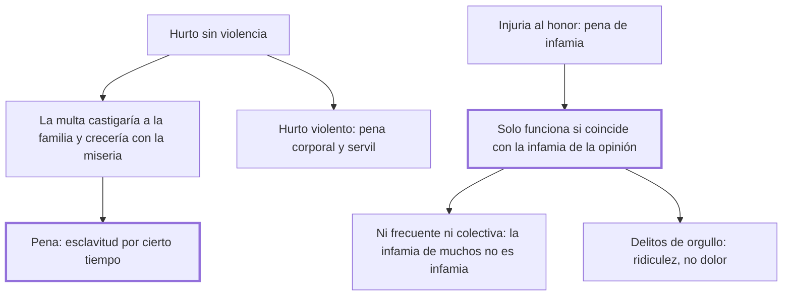

# 22. Hurtos + 23. Infamia

## 1. Idea principal

Al hurto sin violencia no le conviene la multa —el ladrón suele ser un miserable— sino la esclavitud temporal, y la infamia legal solo funciona si coincide con la que ya siente la opinión.

Contestan cómo castigar dos cosas muy distintas: el delito de los pobres y las ofensas al honor. El cap. 22 contiene la frase más audaz del libro sobre la propiedad.

## 2. Lo esencial del capítulo

En principio, dice el cap. 22, los hurtos sin violencia deberían castigarse con pena pecuniaria: "quien procura enriquecerse de lo ajeno, debiera ser empobrecido de lo propio". Pero el capítulo se aparta enseguida de esa simetría. Ordinariamente el hurto proviene de la miseria y la desesperación, y lo comete la parte infeliz de los hombres a quien el derecho de propiedad —"terrible, y acaso no necesario derecho"— dejó solo la desnuda existencia. Conviene detenerse en ese paréntesis: es la única vez que el libro pone en duda la propiedad misma, y lo hace al pasar. Si la pena fuera pecuniaria, aumentaría el número de reos junto con el de necesitados y quitaría el pan a una familia inocente.

La pena que propone es la **esclavitud por cierto tiempo**, la única que puede llamarse justa: hace a la sociedad señora absoluta de la persona y el trabajo del reo, para resarcirse "con la propia y perfecta dependencia" del despotismo que él usurpó contra el pacto social. Cuando el hurto es violento, la pena debe ser mezcla de corporal y servil. Y subraya un error corriente: no distinguir el hurto violento del doloso iguala con absurdo una gruesa cantidad de dinero a la vida de un hombre; repetirlo no es superfluo, porque "las máquinas políticas conservan más que cualesquiera otras el movimiento que reciben".

El cap. 23 trata la infamia como pena de las injurias contra el honor, entendido acá como "la justa porción de consideración que un ciudadano puede exigir con derecho de los otros". Es una señal de desaprobación pública que priva al reo de los votos públicos, de la confianza de la patria y de esa casi fraternidad que la sociedad inspira. Y su rasgo decisivo es que **no depende solo de la ley**: hace falta que la infamia legal coincida con la que nace de la moral que rige en esa nación. Si difieren, o la ley pierde la veneración pública o las ideas de probidad se desvanecen, porque las declamaciones jamás resisten a los ejemplos.

De ahí tres reglas de uso. Quien declara infames acciones de suyo indiferentes disminuye la infamia de las verdaderamente infames. Las penas de infamia no deben ser muy frecuentes, porque los efectos demasiado continuos de una cosa de opinión debilitan la opinión misma. Y no deben recaer sobre muchos a la vez, porque "la infamia de muchos se resuelve en no ser infame ninguno". El capítulo agrega su hallazgo más fino: a los delitos fundados en el orgullo no conviene la pena corporal, porque el dolor mismo les da gloria; les convienen la ridiculez y la infamia, que enfrenan el orgullo de los fanáticos con el de los espectadores.

## 3. Mapa

## 4. Vocabulario clave

- **Hurto doloso** — el cometido sin violencia; para Beccaria, casi siempre hijo de la miseria.
- **Esclavitud temporal** — la pena que propone para el hurto: la sociedad se hace señora de la persona y el trabajo del reo por cierto tiempo.
- **Infamia** — señal de desaprobación pública que priva al reo de la confianza de la patria; pena de las injurias al honor.
- **Delitos fundados en el orgullo** — aquellos en que el dolor de la pena da gloria al reo, y que por eso piden ridiculez.

## 5. Distinciones que se confunden

- **Hurto violento vs. hurto doloso** — son de naturaleza distinta y confundirlos iguala una suma de dinero a la vida de un hombre.
  - Se confunden porque: en los dos se toma lo ajeno y la pérdida patrimonial puede ser idéntica.
  - Criterio para decidir: ¿hubo ataque a la persona? Si lo hubo, la pena lleva componente corporal; si no, es servil.
  - Dónde se cae: se gradúa la pena del hurto por el valor de lo sustraído, cuando lo que cambia la naturaleza del delito es la violencia.

- **Infamia legal vs. infamia de la opinión** — la primera solo tiene efecto si la segunda la acompaña.
  - Se confunden porque: la sentencia declara infame y parece que con eso basta.
  - Criterio para decidir: ¿la sociedad ya desaprueba esa conducta? Si no, la ley pierde veneración en vez de ganarla.
  - Dónde se cae: se declara infame una acción indiferente, y el efecto es rebajar la infamia de las que sí lo son.

## 6. Autoevaluación

1. ¿Por qué rechaza Beccaria la pena pecuniaria para el hurto, si parece la más proporcionada?
2. Llama al derecho de propiedad "terrible, y acaso no necesario". ¿Qué hace con esa idea en el resto del capítulo?
3. ¿Por qué la infamia legal no puede apartarse de la infamia que siente la opinión?
4. Propone la ridiculez para los delitos fundados en el orgullo. ¿Es un castigo o una técnica?

--- No mires esto hasta responder ---

1. Porque el hurto suele nacer de la miseria: la multa aumentaría el número de reos al ritmo del número de necesitados y quitaría el pan a una familia inocente. La proporción abstracta —empobrecer a quien quiso enriquecerse— falla contra quien no tiene de qué ser empobrecido (cap. 22).
2. Nada: la deja entre paréntesis y sigue. Le sirve para explicar por qué el ladrón suele ser un desesperado y para descargar sobre el sistema parte de la responsabilidad, pero no saca de ahí ninguna conclusión institucional. Es la mayor audacia del libro y también su mayor cabo suelto.
3. Porque la infamia es una cosa de opinión y la ley no la crea: la registra. Si difieren, o la ley pierde la veneración pública o las ideas de probidad se desvanecen, ya que las declamaciones jamás resisten a los ejemplos. Es el mismo límite del cap. 9: hay un terreno donde la ley no manda sola.
4. Las dos cosas, y esa es su gracia. Es pena porque priva de la consideración ajena, y es técnica porque elige el instrumento según cómo reacciona el reo: al fanático el dolor lo alimenta, la burla lo desarma. Beccaria lo presenta como oponer opiniones a opiniones, que es la forma de romper la admiración del pueblo por un falso principio.

## Flashcards

Con qué deberían castigarse en principio los hurtos sin violencia | Con pena pecuniaria: quien se enriquece de lo ajeno debe ser empobrecido de lo propio
Por qué descarta Beccaria esa pena en la práctica | Porque el hurto nace de la miseria y la multa castigaría a familias inocentes
Cómo llama al derecho de propiedad en el cap. 22 | Terrible, y acaso no necesario derecho
Qué pena propone para el hurto sin violencia | La esclavitud por cierto tiempo, única suerte de esclavitud que puede llamarse justa
Qué absurdo denuncia al no distinguir hurto violento de doloso | Igualar una gruesa cantidad de dinero a la vida de un hombre
Qué es la infamia según el cap. 23 | Una señal de desaprobación pública que priva de la confianza de la patria
Por qué no deben ser frecuentes ni colectivas las penas de infamia | Porque su exceso debilita la opinión y la infamia de muchos se resuelve en no ser infame ninguno
Qué pena conviene a los delitos fundados en el orgullo | La ridiculez y la infamia, no el dolor, que les da gloria y alimento
