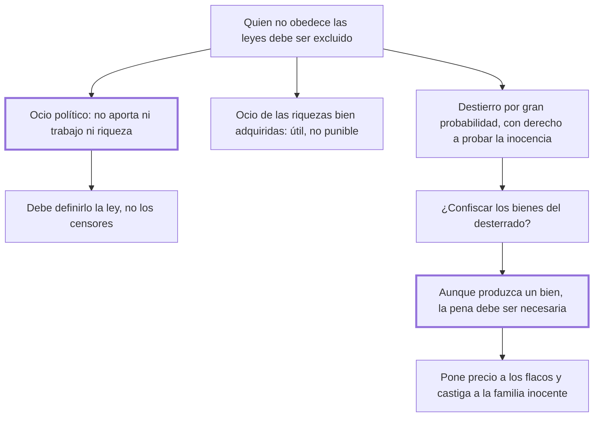

# 24. Ociosos + 25. Destierros y confiscaciones

## 1. Idea principal

Solo el ocio político —el que no aporta ni trabajo ni riqueza— puede castigarse, y las confiscaciones deben rechazarse aunque produjeran algún bien, porque una injusticia útil no puede tolerarse.

Contestan a quién se puede excluir de la sociedad y con qué consecuencias patrimoniales. El cap. 25 contiene la formulación más clara del libro sobre por qué la utilidad no basta para justificar una pena.

## 2. Lo esencial del capítulo

El cap. 24 empieza con la regla general: quien turba la tranquilidad pública y no obedece las leyes debe ser excluido de la sociedad, es decir desterrado. Pero enseguida introduce la distinción que da nombre al capítulo, porque los "austeros declamadores" confunden dos ocios distintos. El **ocio político** es el que no contribuye a la sociedad ni con trabajo ni con riquezas, "que adquiere sin perder nunca", venerado por el vulgo con estúpida admiración y mirado por el sabio con compasión desdeñosa hacia las víctimas que lo alimentan. En cambio no es ocioso políticamente quien goza el fruto de los vicios o virtudes de sus mayores y vende por placeres actuales el pan y la existencia a la industriosa pobreza, que así ejercita "la tácita guerra de industria" en vez de la sanguinaria con la fuerza. Lo importante es la conclusión práctica: deben ser **las leyes** las que definan cuál ocio merece castigo, y no la virtud austera de algunos censores.

La segunda parte trata un caso difícil: el acusado de delito atroz sobre el que no hay certidumbre pero sí gran probabilidad. Parece que debería decretarse el destierro, dice, pero con tres condiciones: un estatuto lo menos arbitrario posible; el sagrado derecho de probar su inocencia; y motivos mayores contra un nacional que contra un forastero. Notar que admite acá una pena sin certeza, en tensión con el cap. 16.

El cap. 25 pregunta si al desterrado hay que quitarle además los bienes. Empieza por analogía: perder los bienes es pena mayor que el destierro, así que debe haber casos de confiscación total, parcial y nula. Cuando el destierro anonada las relaciones entre la sociedad y el reo, "muere entonces el ciudadano y queda el hombre", y los bienes deberían tocar a los sucesores y no al príncipe.

Pero abandona esa sutileza para dar un argumento más fuerte. A quienes sostienen que las confiscaciones frenan las venganzas privadas les responde con el principio que vale para todo el libro: aunque las penas produzcan un bien, no por eso son justas, porque para serlo deben ser **necesarias**, y "una injusticia útil no puede ser tolerada" por un legislador que quiere cerrar las puertas a la tiranía, esa que halaga con el bien de un momento y desprecia "el exterminio futuro y las lágrimas de infinitos oscuros". Los males concretos son tres: ponen precio a las cabezas de los flacos, hacen sufrir al inocente la pena del reo y lo empujan a la necesidad desesperada de delinquir. El cierre es la imagen de la familia arrastrada a la infamia por los delitos de su jefe, a la que la sumisión que ordenan las leyes le impedía prevenirlos.

## 3. Mapa

## 4. Qué releer del original

1. (cap. 25) "una injusticia útil no puede ser tolerada de un legislador" — es el límite que Beccaria pone a su propio utilitarismo y conviene tenerlo textual.
2. (cap. 24) La definición completa del ocio político — resumí sus rasgos, pero el original los encadena en una sola frase larga que muestra por qué es dañino.
3. (cap. 24) Las condiciones del destierro por gran probabilidad — son tres y están comprimidas en pocas líneas; es el pasaje más discutible del capítulo.

## 5. Vocabulario clave

- **Ocio político** — el que no contribuye a la sociedad ni con trabajo ni con riquezas; el único punible.
- **Destierro** — la exclusión del reo de la sociedad de que era miembro.
- **Confiscación** — el perdimiento de los bienes del condenado en favor del príncipe.
- **Injusticia útil** — la pena que produce algún bien sin ser necesaria; para Beccaria, intolerable.

## 6. Distinciones que se confunden

- **Ocio político vs. ocio de las riquezas bien adquiridas** — el primero no aporta nada; el segundo sostiene a la industriosa pobreza.
  - Se confunden porque: en los dos casos hay alguien que vive sin trabajar.
  - Criterio para decidir: ¿ese patrimonio circula y da de vivir a otros? Si sí, es útil y hasta necesario a medida que la sociedad se dilata.
  - Dónde se cae: se persigue la ociosidad como vicio moral, que es lo que Beccaria deja en manos de la ley y no de los censores.

- **Pena útil vs. pena necesaria** — la utilidad no basta: solo la necesidad hace justa a una pena.
  - Se confunden porque: todo el libro argumenta por consecuencias, y parece que un buen efecto debería alcanzar.
  - Criterio para decidir: ¿sin esta pena se derrumba la seguridad común? Si no, el bien que produzca no la legitima.
  - Dónde se cae: se defiende la confiscación porque frena venganzas privadas, que es el caso que el capítulo usa para trazar el límite.

## 7. Autoevaluación

1. ¿Por qué insiste Beccaria en que la ley, y no los censores, defina cuál ocio es punible?
2. El cap. 25 rechaza una pena que produce un bien. ¿Contradice eso el utilitarismo del resto del libro?
3. Admite el destierro cuando hay gran probabilidad pero no certeza. ¿Es compatible con el cap. 16 sobre la tortura?
4. ¿Por qué la confiscación "pone precio a las cabezas de los flacos"?

--- No mires esto hasta responder ---

1. Porque la virtud austera y limitada de un censor juzga por moral privada y sin regla previa, y así el ciudadano no puede saber cuándo es reo. Es el mismo axioma del cap. 11 aplicado a un delito de contornos borrosos, donde el riesgo de arbitrariedad es máximo (cap. 24).
2. No lo contradice: lo limita. El libro mide las penas por sus efectos, pero exige además que sean necesarias, y esa exigencia viene del pacto: lo que no era indispensable para la seguridad no fue cedido. La utilidad puede justificar una pena necesaria; nunca crear el título para una que no lo es.
3. Está en tensión y es el punto flojo del capítulo. En el cap. 16 sostiene que quien no tiene delito probado es inocente según las leyes; acá acepta desterrar por probabilidad, apoyándose en que la nación quedó en la alternativa de temerlo o de ofenderlo. Lo compensa con garantías —estatuto preciso, derecho a probar la inocencia— pero no resuelve la contradicción de fondo.
4. Porque el patrimonio del condenado se vuelve un botín que alguien puede perseguir, y quien no tiene poder para defenderse queda expuesto a que lo acusen por lo que tiene. Suma a eso que la pena recae sobre una familia inocente que ni siquiera podía prevenir el delito, dada la sumisión que las leyes le imponían.

## Flashcards

Qué es el ocio político según Beccaria | El que no contribuye a la sociedad ni con el trabajo ni con las riquezas
Por qué no es ocioso políticamente quien vive de bienes heredados | Porque vende por placeres actuales el pan y la existencia a la industriosa pobreza
Quién debe definir cuál ocio merece castigo | Las leyes, y no la austera y limitada virtud de algunos censores
Qué pena propone para el acusado de delito atroz con gran probabilidad pero sin certeza | El destierro, con estatuto preciso y reservándole el derecho de probar su inocencia
Qué efecto tiene en el cuerpo político un destierro definitivo | El mismo que la muerte natural: muere el ciudadano y queda el hombre
Por qué no basta que una pena produzca un bien | Porque para ser justa debe además ser necesaria
Qué frase resume el límite del cap. 25 | Que una injusticia útil no puede ser tolerada por el legislador
Cuáles son los tres males de la confiscación | Pone precio a las cabezas de los flacos, castiga al inocente y lo empuja a delinquir
