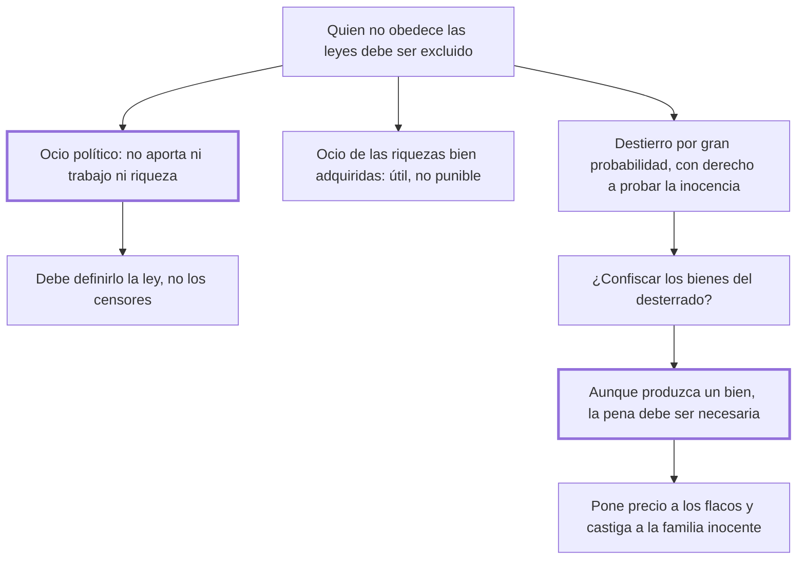

# 24. Ociosos + 25. Destierros y confiscaciones

## 1. Idea principal

Solo el ocio político —el que no aporta ni trabajo ni riqueza— puede castigarse, y las confiscaciones deben rechazarse aunque produjeran algún bien, porque una injusticia útil no puede tolerarse.

Contestan a quién se puede excluir de la sociedad y con qué consecuencias patrimoniales. El cap. 25 contiene la formulación más clara del libro sobre por qué la utilidad no basta para justificar una pena.

## 2. Lo esencial del capítulo

El cap. 24 empieza con la regla general: quien turba la tranquilidad pública y no obedece las leyes debe ser excluido de la sociedad, es decir desterrado. Enseguida introduce la distinción que da nombre al capítulo, porque los "austeros declamadores" confunden dos ocios distintos. El ocio político es el que no contribuye a la sociedad ni con trabajo ni con riquezas, "que adquiere sin perder nunca"; no lo es, en cambio, quien goza el fruto de los vicios o virtudes de sus mayores y vende por placeres actuales el pan y la existencia a la industriosa pobreza. La conclusión práctica es lo que importa: deben ser las leyes, y no la virtud austera de algunos censores, las que definan cuál ocio merece castigo.

La segunda parte admite un caso difícil: al acusado de delito atroz sobre el que no hay certidumbre pero sí gran probabilidad podría decretársele el destierro, con un estatuto lo menos arbitrario posible, el sagrado derecho de probar su inocencia y motivos mayores contra un nacional que contra un forastero. Admite así una pena sin certeza, en tensión con el cap. 16. El cap. 25 pregunta entonces si al desterrado hay que quitarle además los bienes, y empieza por analogía: perder los bienes es pena mayor que el destierro, de modo que habrá casos de confiscación total, parcial y nula, y cuando el destierro anonada las relaciones entre la sociedad y el reo "muere entonces el ciudadano y queda el hombre".

Pero abandona esa sutileza por un argumento más fuerte. A quienes sostienen que las confiscaciones frenan las venganzas privadas les responde con el principio que vale para todo el libro: aunque las penas produzcan un bien, no por eso son justas, porque para serlo deben ser necesarias, y "una injusticia útil no puede ser tolerada" por un legislador que quiere cerrar las puertas a la tiranía. Los males concretos son tres: la confiscación pone precio a las cabezas de los flacos, hace sufrir al inocente la pena del reo y lo empuja a la necesidad desesperada de delinquir. Cierra con la familia arrastrada a la infamia por los delitos de su jefe, a la que la sumisión que ordenan las leyes le impedía prevenirlos (cap. 25).

## 3. Mapa

## 4. Vocabulario clave

- **Ocio político** — el que no contribuye a la sociedad ni con trabajo ni con riquezas; el único punible.
- **Destierro** — la exclusión del reo de la sociedad de que era miembro.
- **Confiscación** — el perdimiento de los bienes del condenado en favor del príncipe.
- **Injusticia útil** — la pena que produce algún bien sin ser necesaria; para Beccaria, intolerable.

## 5. Distinciones que se confunden

- **Ocio político vs. ocio de las riquezas bien adquiridas** — el primero no aporta nada; el segundo sostiene a la industriosa pobreza.
  - Se confunden porque: en los dos casos hay alguien que vive sin trabajar.
  - Criterio para decidir: ¿ese patrimonio circula y da de vivir a otros? Si sí, es útil y hasta necesario a medida que la sociedad se dilata.
  - Dónde se cae: se persigue la ociosidad como vicio moral, que es lo que Beccaria deja en manos de la ley y no de los censores.

- **Pena útil vs. pena necesaria** — la utilidad no basta: solo la necesidad hace justa a una pena.
  - Se confunden porque: todo el libro argumenta por consecuencias, y parece que un buen efecto debería alcanzar.
  - Criterio para decidir: ¿sin esta pena se derrumba la seguridad común? Si no, el bien que produzca no la legitima.
  - Dónde se cae: se defiende la confiscación porque frena venganzas privadas, que es el caso que el capítulo usa para trazar el límite.

## 6. Autoevaluación

1. ¿Qué se entiende por "injusticia útil"? Explique el principio del cap. 25 y sus implicaciones para justificar cualquier pena.
2. Beccaria admite el destierro cuando hay gran probabilidad pero no certeza. ¿Es compatible con lo que sostiene el cap. 16 sobre el acusado no convicto?

--- No mires esto hasta responder ---

1. Injusticia útil es la pena que produce algún bien sin ser necesaria, y para Beccaria una pena así no puede tolerarse. El principio corrige el criterio con que se venía midiendo todo el libro: aunque las penas produzcan un bien, no por eso son justas, porque para serlo deben además ser necesarias, y esa exigencia viene del pacto, ya que lo que no era indispensable para la seguridad común nunca fue cedido. La implicación es que la utilidad puede justificar una pena necesaria pero jamás crear el título de una que no lo es, y por eso rechaza la confiscación aunque frene las venganzas privadas (cap. 25). El legislador que la acepta le abre la puerta a la tiranía, que halaga con el bien de un momento.
2. Está en tensión, y es el punto flojo del capítulo. En el cap. 16 sostiene que quien no tiene delito probado es inocente según las leyes; acá acepta desterrar por probabilidad, apoyándose en que la nación quedó en la alternativa de temerlo o de ofenderlo. Lo compensa con garantías —estatuto lo menos arbitrario posible, derecho de probar la inocencia—, pero no resuelve la contradicción de fondo (cap. 24).

## Flashcards

Qué es el ocio político según Beccaria | El que no contribuye a la sociedad ni con el trabajo ni con las riquezas
Quién debe definir cuál ocio merece castigo | Las leyes, y no la austera y limitada virtud de algunos censores
Por qué no basta que una pena produzca un bien | Porque para ser justa debe además ser necesaria: una injusticia útil no puede ser tolerada
Cuáles son los tres males de la confiscación | Pone precio a las cabezas de los flacos, castiga al inocente y lo empuja a delinquir
