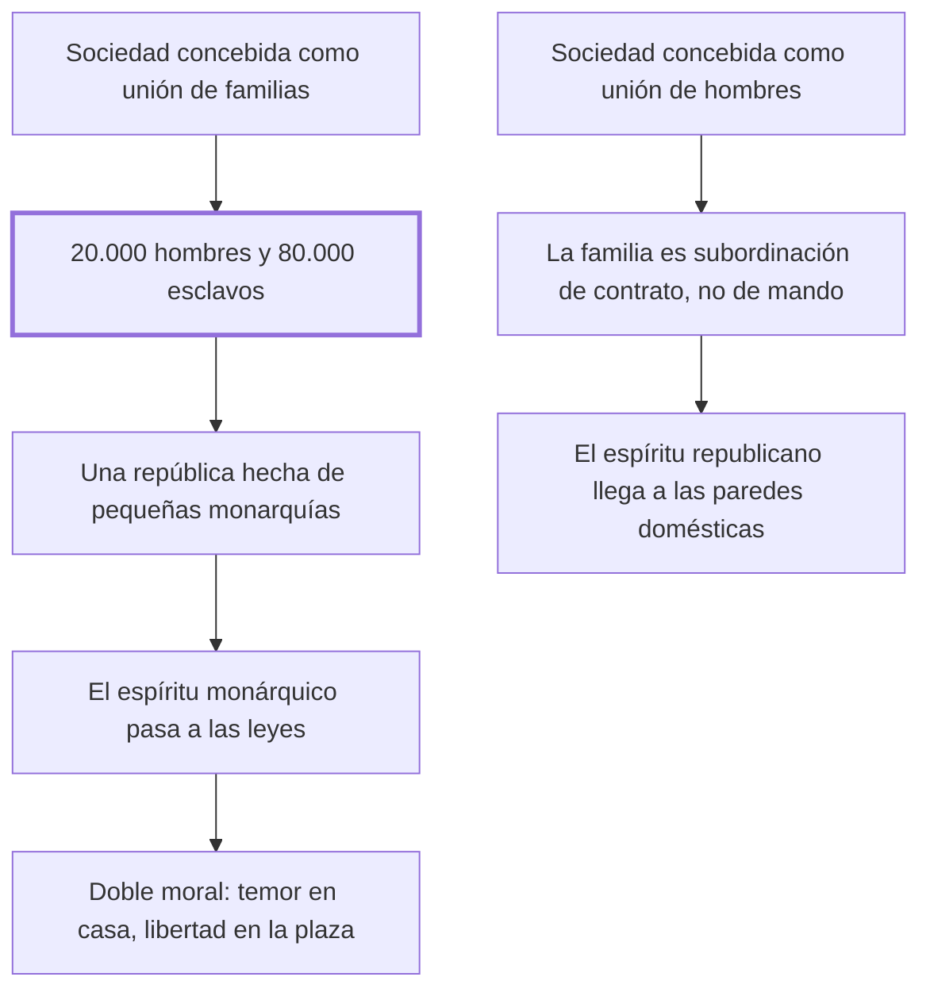

# 26. Del espíritu de familia

## 1. Idea principal

Si la república se compone de familias y no de hombres, hay veinte mil ciudadanos y ochenta mil esclavos: el espíritu monárquico entra por la puerta doméstica y contamina las leyes.

Contesta por qué existían las injusticias de los capítulos anteriores. Es el capítulo más ambicioso del libro: pasa del derecho penal a la estructura misma de la sociedad.

## 2. Lo esencial del capítulo

Las injusticias autorizadas —abre Beccaria, pensando sobre todo en la confiscación— fueron aprobadas incluso por hombres iluminados y practicadas en las repúblicas más libres por una razón de fondo: se consideró a la sociedad no como unión de hombres sino como **unión de familias**. La demostración es aritmética: cien mil personas, veinte mil familias de cinco, cada una con su cabeza. Si la sociedad se compone de familias, habrá veinte mil hombres y ochenta mil esclavos; si se compone de hombres, cien mil ciudadanos y ninguno. En el primer caso hay una república formada por veinte mil pequeñas monarquías; en el segundo, el espíritu republicano respira también "entre las paredes domésticas, donde se encierra gran parte de la felicidad o de la miseria de los hombres" (cap. 26).

El mecanismo de contagio es lo importante. Como las leyes y las costumbres son efecto de los sentimientos habituales de quienes componen la república —los cabezas de familia—, el espíritu monárquico se introduce poco a poco en ella. Contrapone además dos maneras de mirar: el espíritu de familia es "un espíritu de detalle y limitado a los hechos pequeños"; el regulador de las repúblicas, dueño de los principios generales, distribuye los hechos según el bien de la mayor parte.

Después describe qué le pasa a la persona. En la república de familias los hijos permanecen bajo la potestad del padre mientras viva y deben esperar su muerte para tener una existencia que dependa solo de las leyes; acostumbrados a temer y rogar en la edad más vigorosa, no resistirán al vicio en la edad cansada. En la república de hombres la familia no es subordinación de mando sino **de contrato**: los hijos pasan a ser miembros libres de la ciudad y se sujetan al cabeza de familia por participar de sus ventajas. No queda otro vínculo que el socorro recíproco y la gratitud.

El tramo final saca las consecuencias. La contradicción entre las leyes de familia y las de la república produce otra entre la moral doméstica y la pública: una inspira sujeción y temor, la otra valor y libertad; una limita la beneficencia a un corto número de personas no elegidas, la otra la dilata sobre toda clase de hombres; una manda sacrificarse a "un ídolo vano que se llama bien de familia", que muchas veces no es el bien de ninguno. Agrega que el sentimiento republicano se debilita a medida que la sociedad crece. Una república muy vasta solo se libra del despotismo subdividiéndose en repúblicas federativas, y su respuesta sobre cómo lograrlo —un dictador con el valor de Sila y tanto genio para edificar como él tuvo para destruir— es más un deseo que una propuesta.

## 3. Mapa

## 4. Qué releer del original

1. (cap. 26) El cálculo de los cien mil hombres — es el argumento entero en cinco líneas y conviene tener los números exactos.
2. (cap. 26) El párrafo de las contradicciones entre moral doméstica y pública — es una enumeración de oposiciones que pierde fuerza resumida.
3. (cap. 26) "un ídolo vano que se llama bien de familia" — es la frase más dura del capítulo y explica por qué el interés familiar no equivale al de sus miembros.

## 5. Vocabulario clave

- **Espíritu de familia** — modo de mirar limitado al detalle y a los hechos pequeños, que inspira sujeción y temor.
- **Espíritu republicano** — el que maneja principios generales y distribuye los hechos según el bien de la mayor parte.
- **Subordinación de contrato** — el vínculo familiar cuando los hijos adultos se sujetan por participar de las ventajas, no por mando.
- **Repúblicas federativas** — la subdivisión con que una república muy vasta puede librarse del despotismo.

## 6. Distinciones que se confunden

- **República de familias vs. de hombres** — la primera cuenta a los cabezas; la segunda, a las personas.
  - Se confunden porque: las dos tienen leyes, asambleas y ciudadanos, y la diferencia no se ve en las instituciones públicas.
  - Criterio para decidir: ¿quién queda representado por otro? Los que no son cabeza de familia, en la primera, no cuentan.
  - Dónde se cae: se juzga republicano a un régimen por sus instituciones, sin mirar lo que ocurre entre las paredes domésticas.

- **Bien de familia vs. bien de sus miembros** — Beccaria niega que coincidan y llama ídolo vano al primero.
  - Se confunden porque: el interés familiar se enuncia siempre en nombre de todos los que la componen.
  - Criterio para decidir: ¿alguien concreto vive mejor por ese sacrificio? Muchas veces, dice, no es el bien de ninguno.
  - Dónde se cae: se justifica la autoridad doméstica por el bien común de la casa, que es el mecanismo por el que el temor entra en la moral pública.

## 7. Autoevaluación

1. ¿Cómo llega el espíritu monárquico a las leyes de una república, según este capítulo?
2. Beccaria opone subordinación de mando a subordinación de contrato. ¿Qué cambia para el hijo adulto?
3. Dice que bajo el despotismo más fuerte las amistades son más durables y las virtudes de familia, las únicas. ¿Es un elogio?
4. Propone que una república vasta se subdivida en federativas, y confía la tarea a un dictador. ¿Se sostiene esa salida?

--- No mires esto hasta responder ---

1. Porque las leyes y las costumbres son efecto de los sentimientos habituales de quienes componen la república. Si esos son los cabezas de familia —cada uno soberano en su casa—, el hábito de mandar y ser obedecido se traslada a la legislación, y lo único que contiene sus efectos son los intereses opuestos entre ellos, no un sentimiento de igualdad (cap. 26).
2. Que deja de esperar la muerte del padre para tener una existencia que dependa solo de las leyes. En la subordinación de contrato es miembro libre de la ciudad y se sujeta por participar de las ventajas; el único vínculo restante es el socorro recíproco y la gratitud, que Beccaria dice destruida más por la sujeción legal que por la malicia.
3. No: es un diagnóstico. A medida que se debilitan los sentimientos que nos unen a la nación se refuerzan los que nos atan a lo cercano, así que la intensidad de la vida privada es un síntoma de la ausencia de vida pública. Y aclara que esas virtudes son "siempre medianas".
4. La primera mitad sí, y anticipa un argumento que tendría larga vida: la extensión favorece al despotismo porque cada miembro es una fracción menor del todo. La segunda es su punto más débil: confiar la fundación de la libertad a un dictador contradice todo el libro, que desconfía por sistema del poder sin ley. Beccaria mismo lo formula como aspiración, no como diseño.

## Flashcards

Cuántos ciudadanos y cuántos esclavos hay si la sociedad se compone de familias | Veinte mil hombres y ochenta mil esclavos, en el ejemplo de cien mil personas
Qué es una república formada por familias según el cap. 26 | Una república compuesta de veinte mil pequeñas monarquías
Cómo llega el espíritu monárquico a las leyes de una república | Porque las leyes son efecto de los sentimientos habituales de los cabezas de familia
Cómo describe Beccaria el espíritu de familia | Como un espíritu de detalle, limitado a los hechos pequeños
Qué hace en cambio el espíritu regulador de las repúblicas | Distribuye los hechos en las clases importantes al bien de la mayor parte
Qué tipo de subordinación es la familia en una república de hombres | Una subordinación de contrato, no de mando
Cómo llama al bien de familia | Un ídolo vano, que muchas veces no es el bien de ninguno de sus miembros
Cómo puede una república muy vasta librarse del despotismo | Subdividiéndose y uniéndose en muchas repúblicas federativas
