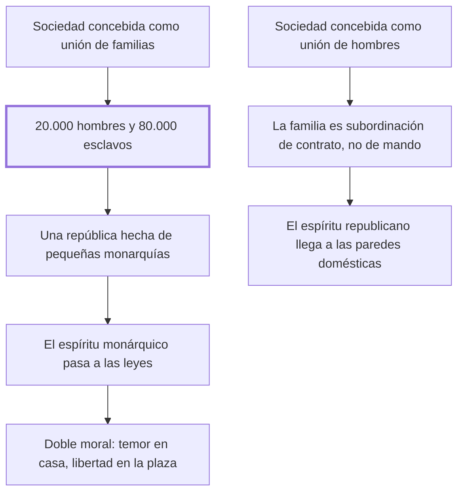

# 26. Del espíritu de familia

## 1. Idea principal

Si la república se compone de familias y no de hombres, hay veinte mil ciudadanos y ochenta mil esclavos: el espíritu monárquico entra por la puerta doméstica y contamina las leyes.

Contesta por qué existían las injusticias de los capítulos anteriores. Es el capítulo más ambicioso del libro: pasa del derecho penal a la estructura misma de la sociedad.

## 2. Lo esencial del capítulo

Las injusticias autorizadas —abre Beccaria, pensando sobre todo en la confiscación— fueron aprobadas incluso por hombres iluminados y practicadas en las repúblicas más libres por una razón de fondo: se consideró a la sociedad no como unión de hombres sino como unión de familias. La demostración es aritmética: en cien mil personas repartidas en veinte mil familias, si la sociedad se compone de familias habrá veinte mil hombres y ochenta mil esclavos; si se compone de hombres, cien mil ciudadanos y ninguno. La primera es una república formada por veinte mil pequeñas monarquías; en la segunda el espíritu republicano respira también "entre las paredes domésticas, donde se encierra gran parte de la felicidad o de la miseria de los hombres" (cap. 26). El contagio es lo importante: como las leyes y las costumbres son efecto de los sentimientos habituales de quienes componen la república, y esos son los cabezas de familia, el espíritu monárquico se introduce poco a poco en la legislación.

De ahí las consecuencias sobre la persona y sobre la moral. En la república de familias los hijos permanecen bajo la potestad del padre mientras viva y deben esperar su muerte para tener una existencia que dependa solo de las leyes; en la de hombres la familia no es subordinación de mando sino de contrato, y no queda otro vínculo que el socorro recíproco y la gratitud. La contradicción entre unas leyes y otras produce una moral doble: una inspira sujeción y temor, la otra valor y libertad; una manda sacrificarse a "un ídolo vano que se llama bien de familia", que muchas veces no es el bien de ninguno. El cierre agrega que el sentimiento republicano se debilita a medida que la sociedad crece, y que una república muy vasta solo se libra del despotismo subdividiéndose en repúblicas federativas —aunque confiar esa tarea a un dictador con el genio de Sila es más un deseo que una propuesta.

## 3. Mapa

## 4. Vocabulario clave

- **Espíritu de familia** — modo de mirar limitado al detalle y a los hechos pequeños, que inspira sujeción y temor.
- **Espíritu republicano** — el que maneja principios generales y distribuye los hechos según el bien de la mayor parte.
- **Subordinación de contrato** — el vínculo familiar cuando los hijos adultos se sujetan por participar de las ventajas, no por mando.
- **Repúblicas federativas** — la subdivisión con que una república muy vasta puede librarse del despotismo.

## 5. Distinciones que se confunden

- **República de familias vs. de hombres** — la primera cuenta a los cabezas; la segunda, a las personas.
  - Se confunden porque: las dos tienen leyes, asambleas y ciudadanos, y la diferencia no se ve en las instituciones públicas.
  - Criterio para decidir: ¿quién queda representado por otro? Los que no son cabeza de familia, en la primera, no cuentan.
  - Dónde se cae: se juzga republicano a un régimen por sus instituciones, sin mirar lo que ocurre entre las paredes domésticas.

- **Bien de familia vs. bien de sus miembros** — Beccaria niega que coincidan y llama ídolo vano al primero.
  - Se confunden porque: el interés familiar se enuncia siempre en nombre de todos los que la componen.
  - Criterio para decidir: ¿alguien concreto vive mejor por ese sacrificio? Muchas veces, dice, no es el bien de ninguno.
  - Dónde se cae: se justifica la autoridad doméstica por el bien común de la casa, que es el mecanismo por el que el temor entra en la moral pública.

## 6. Autoevaluación

1. ¿Qué se entiende por espíritu de familia y cuáles son sus implicaciones para las leyes y la moral de una república?
2. Beccaria propone que una república vasta se subdivida en federativas, y confía la tarea a un dictador con el genio de Sila. ¿Se sostiene esa salida?

--- No mires esto hasta responder ---

1. El espíritu de familia es, en la definición del capítulo, "un espíritu de detalle y limitado a los hechos pequeños", opuesto al espíritu regulador de las repúblicas, que maneja principios generales y distribuye los hechos según el bien de la mayor parte. Nace de concebir la sociedad como unión de familias y no de hombres: en cien mil personas repartidas en veinte mil familias eso da veinte mil ciudadanos y ochenta mil esclavos, es decir una república formada por veinte mil pequeñas monarquías. Sus implicaciones son dos. Sobre las leyes, que al ser efecto de los sentimientos habituales de los cabezas de familia se les cuela el espíritu monárquico. Sobre la moral, que se vuelve doble: una inspira sujeción y temor en la casa y otra valor y libertad en la plaza, y la primera manda sacrificarse a un ídolo vano que muchas veces no es el bien de ninguno (cap. 26).
2. La primera mitad se sostiene y anticipa un argumento de larga vida: la extensión favorece al despotismo porque cada miembro es una fracción menor del todo. La segunda es el punto más débil del capítulo, porque confiar la fundación de la libertad a un poder sin ley contradice todo el libro. Beccaria mismo lo formula como aspiración y no como diseño institucional.

## Flashcards

Cómo describe Beccaria el espíritu de familia | Como un espíritu de detalle, limitado a los hechos pequeños
Cuántos ciudadanos y cuántos esclavos hay si la sociedad se compone de familias | Veinte mil hombres y ochenta mil esclavos, en el ejemplo de cien mil personas
Cómo llega el espíritu monárquico a las leyes de una república | Porque las leyes son efecto de los sentimientos habituales de los cabezas de familia
