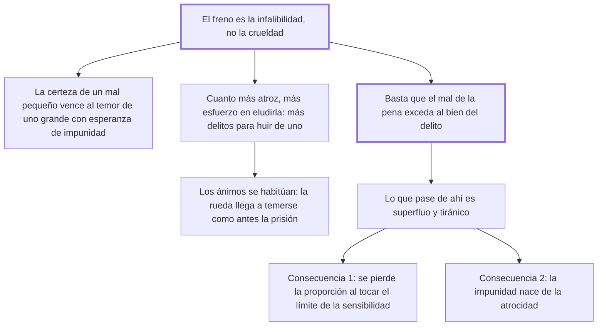

# 27. Dulzura de las penas

## 1. Idea principal

Lo que frena el delito no es la crueldad de la pena sino su infalibilidad: basta con que el mal de la pena exceda al bien del delito, y todo lo que pase de ahí es superfluo y por eso tiránico.

Contesta cuánto castigo hace falta. Es el capítulo bisagra del libro: prepara el argumento contra la pena de muerte y contiene la fórmula que resume su doctrina entera.

## 2. Lo esencial del capítulo

La tesis se enuncia de entrada: el freno de los delitos no es la crueldad sino la infalibilidad, y en consecuencia la vigilancia de los magistrados y la severidad inexorable del juez, que para ser virtud útil "debe estar acompañada de una legislación suave" (cap. 27). El argumento es psicológico: la certidumbre de un castigo moderado impresiona más que el temor de otro terrible unido a la esperanza de impunidad, porque los males pequeños pero ciertos amedrentan siempre, mientras la esperanza —"don celestial"— aparta la idea de los mayores. Y hay un efecto perverso: cuanto más atroz es la pena, más esfuerzo se pone en eludirla, de modo que **se cometen muchos delitos para huir de la pena de uno solo**.

Sigue una observación histórica: los tiempos de castigos más atroces fueron siempre los de acciones más sanguinarias, porque el mismo espíritu de ferocidad que guiaba la mano del legislador regía la del parricida. Y una de habituación: los ánimos, "que como los fluidos se ponen a nivel con los objetos que los rodean", se endurecen, y al cabo de cien años la rueda se teme tanto como antes la prisión. De ahí la fórmula central del libro: para que una pena obtenga su efecto basta que el mal exceda al bien que nace del delito, contando en ese exceso la infalibilidad de la pena; **todo lo demás es superfluo y por tanto tiránico**.

El experimento mental de las dos naciones cierra el punto. Si en una la pena mayor es la esclavitud perpetua y en la otra la rueda, la primera temerá su pena máxima tanto como la segunda la suya, porque los hombres se regulan por los males que conocen. Y la advertencia es de método: la razón que sirviera para trasladar a la primera las penas de la segunda serviría también para aumentar las de la segunda, pasando de la rueda a los tormentos más lentos, hasta los últimos refinamientos "de la ciencia demasiado conocida por los tiranos".

Las dos consecuencias funestas que agrega son decisivas. La primera: con penas crueles se pierde la proporción, porque la sensibilidad tiene un límite último y, alcanzado ese extremo, ya no queda pena mayor para los delitos más dañosos. La segunda es una paradoja: **la impunidad nace de la atrocidad de los castigos**, porque un espectáculo demasiado atroz podrá ser un furor pasajero pero nunca un sistema constante como deben ser las leyes. El capítulo termina con un pasaje de indignación sobre los tormentos inventados con ánimo frío por hombres que se llamaban sabios, y sobre los infelices a quienes "la miseria, o querida o tolerada de las leyes", empujó al retroceso desesperado hacia el estado de naturaleza.

## 3. Mapa

## 4. Qué releer del original

1. (cap. 27) "basta que el mal de ella exceda al bien que nace del delito… todo lo demás es superfluo y, por tanto, tiránico" — es la fórmula que resume el libro entero.
2. (cap. 27) El experimento de las dos naciones, la de la esclavitud perpetua y la de la rueda — conviene seguir el razonamiento completo, porque el argumento del deslizamiento es lo que lo cierra.
3. (cap. 27) El párrafo final sobre los infelices empujados por la miseria — es la página más indignada del libro y la resumí en dos líneas.

## 5. Vocabulario clave

- **Infalibilidad de la pena** — la certeza de que se aplicará; el verdadero freno del delito según este capítulo.
- **Legislación suave** — la que acompaña necesariamente a la severidad inexorable del juez para que esta sea virtud útil.
- **Pena superflua** — la que excede lo necesario para que el mal supere al bien del delito; Beccaria la llama tiránica.
- **Habituación** — el endurecimiento de los ánimos frente a castigos repetidos, que anula el efecto de la severidad.

## 6. Distinciones que se confunden

- **Infalibilidad vs. severidad** — la primera previene; la segunda se neutraliza con la esperanza de impunidad.
  - Se confunden porque: las dos se presentan como "mano dura" y suelen invocarse juntas.
  - Criterio para decidir: ¿qué se está aumentando, la probabilidad de ser castigado o la intensidad del castigo? Solo la primera cambia el cálculo del que delinque.
  - Dónde se cae: se responde a un aumento de delitos elevando las penas, cuando el problema es que la mayoría queda sin castigo.

- **Pena necesaria vs. pena superflua** — el límite es el punto donde el mal de la pena supera al bien del delito.
  - Se confunden porque: parece que más castigo siempre disuade más.
  - Criterio para decidir: ¿el tramo adicional agrega disuasión, contando ya la infalibilidad? Si no, es superfluo y por eso tiránico.
  - Dónde se cae: se agrava una pena "por las dudas", sin advertir que el mismo razonamiento no tiene punto de detención.

## 7. Autoevaluación

1. ¿Cómo puede la atrocidad de las penas producir impunidad?
2. Beccaria dice que se cometen muchos delitos para huir de la pena de uno solo. ¿Cómo funciona ese mecanismo?
3. El experimento de las dos naciones, ¿qué prueba exactamente?
4. Sostiene que la severidad inexorable del juez solo es virtud útil con una legislación suave. ¿No son cosas opuestas?

--- No mires esto hasta responder ---

1. Porque un espectáculo demasiado atroz puede sostener un furor pasajero pero no un sistema constante, que es lo que deben ser las leyes. Si la ley es verdaderamente cruel, o se cambia o deja de aplicarse: en ambos casos, la impunidad nace de las leyes mismas (cap. 27).
2. Cuanto mayor es el mal que amenaza, mayor es el esfuerzo por eludirlo. Quien ya arriesga la horca por un delito no tiene nada que perder si comete otros para no ser descubierto: eliminar testigos, resistir la captura. La severidad extrema borra el escalón entre el primer delito y los siguientes.
3. Que el efecto disuasivo depende del punto más alto de la escala **conocida**, no de su magnitud absoluta: los hombres se regulan por los males que conocen. Y agrega el argumento decisivo: cualquier razón para trasladar la pena mayor de una nación a la otra serviría igual para seguir subiendo sin límite.
4. No: son complementarias y esa es la síntesis del capítulo. La ley debe ser suave para que aplicarla siempre sea posible; el juez debe ser inexorable para que aplicarla sea seguro. Una legislación dura vuelve inevitable la excepción, y con la excepción vuelve la esperanza de impunidad, que es lo único que desactiva el freno.

## Flashcards

Cuál es el mayor freno de los delitos según el cap. 27 | La infalibilidad de las penas, no su crueldad
Con qué debe acompañarse la severidad inexorable del juez | Con una legislación suave
Por qué un mal pequeño pero cierto amedrenta más que uno grande e incierto | Porque la esperanza de impunidad aparta siempre la idea de los males mayores
Qué efecto perverso tiene la atrocidad de la pena | Que se cometan muchos delitos para huir de la pena de uno solo
Qué pasa con los ánimos tras cien años de castigos crueles | Se endurecen, y la rueda se teme tanto como antes la prisión
Cuánto debe durar la pena para obtener su efecto | Lo que baste para que su mal exceda al bien que nace del delito
Cómo llama Beccaria a todo castigo que exceda esa medida | Superfluo y por tanto tiránico
Por qué la atrocidad de los castigos produce impunidad | Porque una ley demasiado cruel no puede ser un sistema constante: o se muda o no se aplica
