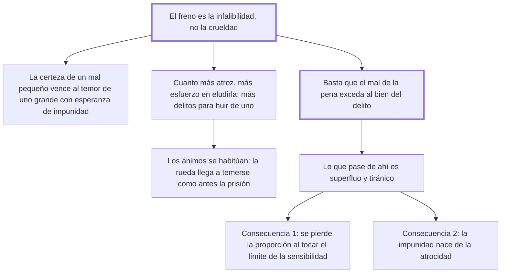

# 27. Dulzura de las penas

## 1. Idea principal

Lo que frena el delito no es la crueldad de la pena sino su infalibilidad: basta con que el mal de la pena exceda al bien del delito, y todo lo que pase de ahí es superfluo y por eso tiránico.

Contesta cuánto castigo hace falta. Es el capítulo bisagra del libro: prepara el argumento contra la pena de muerte y contiene la fórmula que resume su doctrina entera.

## 2. Lo esencial del capítulo

La tesis se enuncia de entrada: el freno de los delitos no es la crueldad sino la infalibilidad, y por eso la severidad inexorable del juez, para ser virtud útil, "debe estar acompañada de una legislación suave" (cap. 27). El argumento es psicológico: la certidumbre de un castigo moderado impresiona más que el temor de otro terrible unido a la esperanza de impunidad, porque los males pequeños pero ciertos amedrentan siempre, mientras la esperanza aparta la idea de los mayores. De ahí un efecto perverso: cuanto más atroz es la pena, más esfuerzo se pone en eludirla, y se cometen muchos delitos para huir de la pena de uno solo. Suma una observación histórica —los tiempos de castigos más atroces fueron los de acciones más sanguinarias— y otra de habituación: los ánimos se ponen a nivel con los objetos que los rodean, y al cabo de cien años la rueda se teme tanto como antes la prisión.

La fórmula central del libro sale de ahí: para que una pena obtenga su efecto basta que su mal exceda al bien que nace del delito, contando en ese exceso la infalibilidad, y todo lo demás es superfluo y por tanto tiránico. El experimento mental de las dos naciones lo confirma —la que tiene por pena máxima la esclavitud perpetua la teme tanto como la otra la rueda, porque los hombres se regulan por los males que conocen— y trae una advertencia de método: la razón que sirviera para trasladar a la primera las penas de la segunda serviría igual para subir las de la segunda hasta los últimos refinamientos "de la ciencia demasiado conocida por los tiranos". Las dos consecuencias funestas cierran el capítulo: con penas crueles se pierde la proporción, porque la sensibilidad tiene un límite y después no queda pena mayor para los delitos más dañosos; y la impunidad nace de la atrocidad, porque un espectáculo demasiado atroz podrá ser un furor pasajero pero nunca el sistema constante que las leyes deben ser.

## 3. Mapa

## 4. Vocabulario clave

- **Infalibilidad de la pena** — la certeza de que se aplicará; el verdadero freno del delito según este capítulo.
- **Legislación suave** — la que acompaña necesariamente a la severidad inexorable del juez para que esta sea virtud útil.
- **Pena superflua** — la que excede lo necesario para que el mal supere al bien del delito; Beccaria la llama tiránica.
- **Habituación** — el endurecimiento de los ánimos frente a castigos repetidos, que anula el efecto de la severidad.

## 5. Distinciones que se confunden

- **Infalibilidad vs. severidad** — la primera previene; la segunda se neutraliza con la esperanza de impunidad.
  - Se confunden porque: las dos se presentan como "mano dura" y suelen invocarse juntas.
  - Criterio para decidir: ¿qué se está aumentando, la probabilidad de ser castigado o la intensidad del castigo? Solo la primera cambia el cálculo del que delinque.
  - Dónde se cae: se responde a un aumento de delitos elevando las penas, cuando el problema es que la mayoría queda sin castigo.

- **Pena necesaria vs. pena superflua** — el límite es el punto donde el mal de la pena supera al bien del delito.
  - Se confunden porque: parece que más castigo siempre disuade más.
  - Criterio para decidir: ¿el tramo adicional agrega disuasión, contando ya la infalibilidad? Si no, es superfluo y por eso tiránico.
  - Dónde se cae: se agrava una pena "por las dudas", sin advertir que el mismo razonamiento no tiene punto de detención.

## 6. Autoevaluación

1. ¿Qué se entiende por dulzura de las penas? Explique con qué regla fija Beccaria la medida del castigo y cuáles son sus implicaciones.
2. Ante un aumento de los robos, un gobierno duplica las condenas y no toca el número de casos que llegan a ser juzgados. ¿Qué le respondería el cap. 27?

--- No mires esto hasta responder ---

1. La dulzura de las penas es la tesis de que el freno de los delitos no está en la crueldad del castigo sino en su infalibilidad, de modo que la severidad inexorable del juez solo es virtud útil acompañada de una legislación suave (cap. 27). La regla que fija la medida es esta: basta que el mal de la pena exceda al bien que nace del delito, contando en ese exceso la certeza de que se aplicará; todo lo que pase de ahí es superfluo y por tanto tiránico. Tiene tres implicaciones. Que la escala se mide por los males conocidos, así que una nación teme su pena máxima cualquiera sea, como muestra el experimento de las dos naciones. Que con penas crueles se pierde la proporción, porque la sensibilidad tiene un límite y no queda nada mayor para los delitos más dañosos. Y que la impunidad nace de la atrocidad, porque una ley demasiado cruel no puede sostenerse como sistema constante.
2. Que está actuando sobre la variable equivocada. Aumentar la intensidad de la pena sin aumentar la probabilidad de sufrirla deja intacta la esperanza de impunidad, que es lo único que desactiva el freno, y encima empuja al reo a cometer más delitos para huir de la pena de uno solo. El capítulo predice además que la ley agravada terminará por no aplicarse, con lo que el resultado sería más impunidad y no menos.

## Flashcards

Cuál es el mayor freno de los delitos según el cap. 27 | La infalibilidad de las penas, no su crueldad
Cuánto debe castigar una pena para obtener su efecto | Lo que baste para que su mal exceda al bien que nace del delito; lo demás es superfluo y por tanto tiránico
Por qué la atrocidad de los castigos produce impunidad | Porque una ley demasiado cruel no puede ser un sistema constante: o se muda o no se aplica
