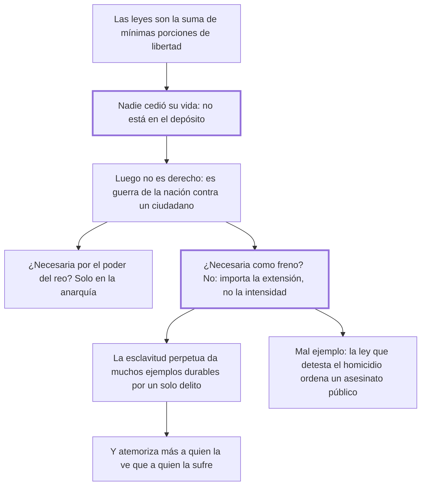

# 28. De la pena de muerte

## 1. Idea principal

Nadie pudo ceder en el pacto un derecho sobre su propia vida, así que la pena de muerte no es derecho sino guerra de la nación contra un ciudadano; y tampoco es útil, porque no es la intensidad de la pena sino su extensión lo que impresiona.

Contesta si el Estado puede matar. Es el capítulo más célebre del libro y el que le dio su lugar en la historia del derecho penal.

## 2. Lo esencial del capítulo

El primer argumento es contractual: si las leyes son una suma de mínimas porciones de libertad, ¿quién quiso dejar a otros el arbitrio de hacerlo morir? No puede ser que en ese mínimo sacrificio esté incluida la vida, "grandísimo entre todos los bienes" (cap. 28), y hay además una incoherencia en el adversario, porque si el hombre pudo dar ese dominio sería dueño de matarse, cosa que la misma doctrina niega. De ahí la fórmula: la pena de muerte no es derecho, sino una guerra de la nación contra un ciudadano cuya destrucción juzga útil. Queda entonces defenderla por necesidad, y concede dos motivos: que el reo preso conserve poder capaz de producir una revolución, cosa de la anarquía y no del reino tranquilo de las leyes, y que su muerte sea el único freno, donde responde con su tesis psicológica: no es lo intenso de la pena sino su extensión lo que produce mayor efecto, porque mueven más las impresiones continuas y pequeñas que una fuerte y pasajera.

El freno más eficaz no es entonces el espectáculo momentáneo de una ejecución —curiosidad para la mayoría y compasión para algunos— sino el ejemplo dilatado del hombre convertido en bestia de servicio que recompensa con sus fatigas a la sociedad que ofendió. La esclavitud perpetua basta para disuadir, porque nadie con reflexión escoge la pérdida total de su libertad, y tiene más fuerza, porque muchos miran la muerte con vista tranquila por fanatismo o vanidad, "pero ni el fanatismo ni la vanidad están entre los cepos y las cadenas". Cada ejemplo dado con la muerte supone además un delito, mientras un solo delito castigado con esclavitud da muchos ejemplos durables: para ser útil el suplicio tendría que ser frecuente, "esto es, que sea útil e inútil al mismo tiempo". Cierra con el mal ejemplo —es absurdo que las leyes, que detestan el homicidio, ordenen "un público asesinato"— y con el desprecio hacia el verdugo, ciudadano útil, como rastro de que nadie cree en lo secreto de su ánimo que exista potestad sobre la vida ajena.

## 3. Mapa

## 4. Vocabulario clave

- **Pena de muerte** — para Beccaria no una pena de derecho, sino un acto de guerra de la nación contra un ciudadano.
- **Esclavitud perpetua** — la pena que propone en su lugar: privación total y vitalicia de la libertad con trabajo para la sociedad.
- **Extensión de la pena** — su duración y repetición en el tiempo, que impresiona más que su intensidad.
- **Verdugo** — el ejecutor de la voluntad pública; el desprecio que se le tiene revela lo que los hombres creen sobre la vida.

## 5. Distinciones que se confunden

- **Intensidad vs. extensión de la pena** — la primera se agota en un momento; la segunda actúa por repetición.
  - Se confunden porque: las dos se leen como "cuán grave" es el castigo y se comparan en una sola escala.
  - Criterio para decidir: ¿qué queda en el ánimo del espectador a los seis meses? El ejemplo continuo, no el instante.
  - Dónde se cae: se afirma que la muerte disuade más porque es lo peor que puede pasarle a alguien, sin considerar cómo funciona la memoria.

- **Pena justa por derecho vs. pena tolerada por necesidad** — Beccaria niega el título y solo discute la necesidad.
  - Se confunden porque: una pena aplicada por la ley parece por eso mismo un derecho del Estado.
  - Criterio para decidir: ¿estaba ese poder entre lo que se cedió al pactar? Si no, lo que quede será necesidad, nunca derecho.
  - Dónde se cae: se defiende la ejecución diciendo que el reo "perdió su derecho a la vida", cuando el punto es que la sociedad nunca lo adquirió.

## 6. Autoevaluación

1. Explique cómo fundamenta Beccaria el rechazo de la pena de muerte y cuáles son las implicaciones de sostener que no es un derecho.
2. Sostiene que la esclavitud perpetua es en conjunto más dolorosa que la muerte, y aun así la prefiere. ¿Es coherente?

--- No mires esto hasta responder ---

1. Beccaria la rechaza en dos planos, y el primero es de título. Las leyes son la suma de las mínimas porciones de libertad que cada uno cedió al pactar, y nadie pudo poner en ese depósito la vida, "grandísimo entre todos los bienes"; si hubiera podido cederla sería dueño de matarse, cosa que la misma doctrina niega (cap. 28). De ahí que la pena de muerte no sea derecho sino una guerra de la nación contra un ciudadano, lo que desplaza toda la discusión al terreno de la necesidad. El segundo plano es ese: la muerte tampoco es necesaria, porque no es la intensidad de la pena sino su extensión lo que impresiona, y la esclavitud perpetua da un ejemplo durable que la ejecución agota en un instante. La implicación mayor es que el reo no "pierde su derecho a la vida": la sociedad nunca lo adquirió, y por eso la ley que ordena ejecutar cae en el absurdo de detestar el homicidio y mandar un asesinato público.
2. Sí, y el argumento es fino. La esclavitud perpetua suma más momentos infelices, pero repartidos en toda una vida, mientras la muerte ejerce toda su fuerza en un instante; por eso atemoriza más a quien la ve —que suma el conjunto— que a quien la sufre, distraído por el presente. Lo que Beccaria busca no es el mayor dolor sino la mayor impresión duradera, así que la mayor crueldad total no contradice su tesis: la sostiene.

## Flashcards

Por qué no puede ser derecho la pena de muerte según Beccaria | Porque nadie pudo ceder en el pacto un poder sobre su propia vida
Qué es entonces la pena de muerte | Una guerra de la nación contra un ciudadano cuya destrucción juzga útil o necesaria
Qué produce mayor efecto sobre el ánimo: la intensidad o la extensión de la pena | La extensión: las impresiones continuas y pequeñas vencen a la fuerte y pasajera
Qué pena propone en su lugar y por qué basta | La esclavitud perpetua: nadie con reflexión escoge la pérdida total de su libertad
