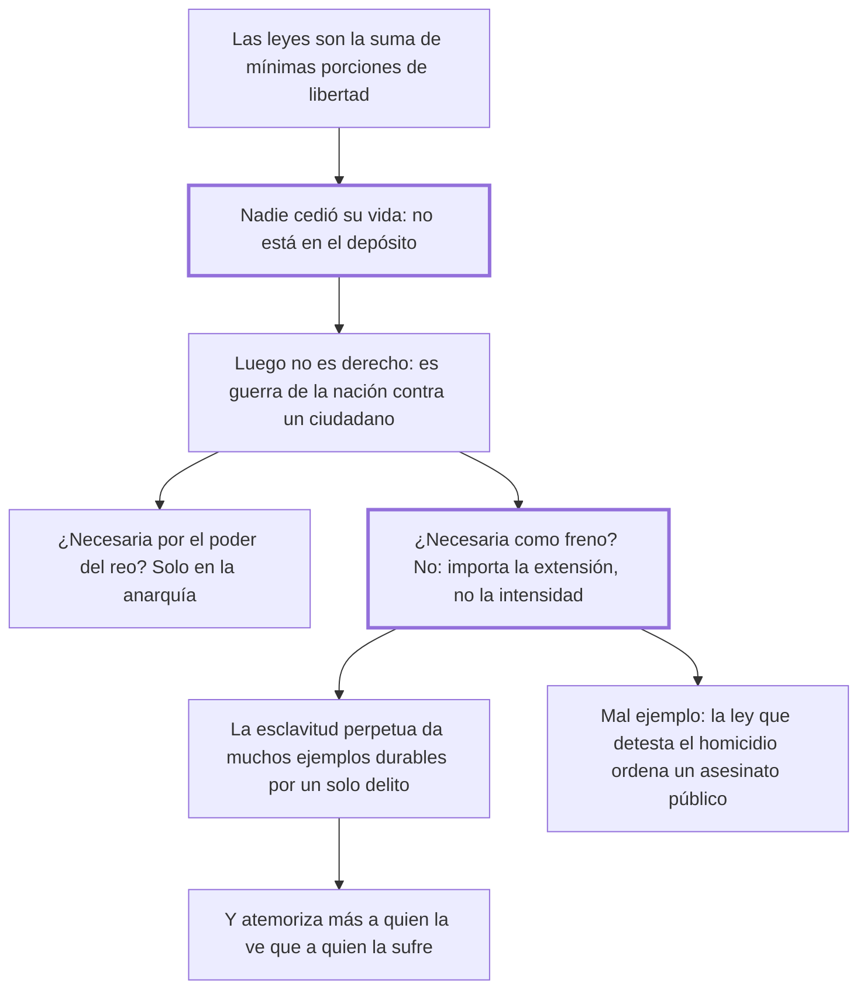

# 28. De la pena de muerte

## 1. Idea principal

Nadie pudo ceder en el pacto un derecho sobre su propia vida, así que la pena de muerte no es derecho sino guerra de la nación contra un ciudadano; y tampoco es útil, porque no es la intensidad de la pena sino su extensión lo que impresiona.

Contesta si el Estado puede matar. Es el capítulo más célebre del libro y el que le dio su lugar en la historia del derecho penal.

## 2. Lo esencial del capítulo

El primer argumento es contractual. Las leyes son una suma de mínimas porciones de libertad y representan la voluntad general; entonces, ¿quién quiso dejar a otros el arbitrio de hacerlo morir? No puede ser que en ese mínimo sacrificio esté incluida la vida, "grandísimo entre todos los bienes" (cap. 28). Y refuerza con una incoherencia del adversario: si el hombre pudo dar ese dominio, sería dueño de matarse, cosa que la misma doctrina niega. De ahí la fórmula: la pena de muerte **no es derecho**, es solo una guerra de la nación contra un ciudadano cuya destrucción juzga útil. Si no es derecho, solo queda defenderla por necesidad, y a eso dedica el resto.

Concede dos motivos posibles. El primero, que el reo preso conserve poder capaz de producir una revolución: eso pasa en la anarquía, no bajo el reino tranquilo de las leyes. El segundo, que su muerte sea el único freno, y ahí ataca con su tesis psicológica: **no es lo intenso de la pena sino su extensión** lo que produce mayor efecto, porque mueven más las impresiones continuas y pequeñas que una fuerte y pasajera. El freno más eficaz no es el espectáculo momentáneo de una ejecución sino el ejemplo dilatado de un hombre convertido en bestia de servicio que recompensa con sus fatigas a la sociedad que ofendió.

De ahí varios argumentos encadenados. La ejecución es espectáculo para la mayoría y objeto de compasión para algunos, y esas reacciones ocupan más el ánimo que el terror que la ley pretende. La esclavitud perpetua basta para disuadir, porque nadie con reflexión escoge la pérdida total de su libertad, y tiene más fuerza, porque muchos miran la muerte con vista tranquila por fanatismo o vanidad, "pero ni el fanatismo ni la vanidad están entre los cepos y las cadenas". Además, cada ejemplo dado con la muerte supone un delito, mientras un solo delito castigado con esclavitud da muchos ejemplos durables: para que el suplicio fuera útil tendría que ser frecuente, "esto es, que sea útil e inútil al mismo tiempo". Y si se objeta que es más cruel, responde que sus males están repartidos en toda una vida: **atemoriza más a quien la ve que a quien la sufre**.

Incluye después dos piezas notables. El monólogo del ladrón, que pregunta quién hizo esas leyes que dejan tanta diferencia entre él y el rico. Y el argumento del mal ejemplo: es absurdo que las leyes, que detestan el homicidio, ordenen "un público asesinato". Su prueba es el desprecio con que la gente mira al verdugo, que en realidad es un ciudadano útil: nadie cree en lo secreto de su ánimo que exista potestad sobre la vida ajena.

## 3. Mapa

## 4. Vocabulario clave

- **Pena de muerte** — para Beccaria no una pena de derecho, sino un acto de guerra de la nación contra un ciudadano.
- **Esclavitud perpetua** — la pena que propone en su lugar: privación total y vitalicia de la libertad con trabajo para la sociedad.
- **Extensión de la pena** — su duración y repetición en el tiempo, que impresiona más que su intensidad.
- **Verdugo** — el ejecutor de la voluntad pública; el desprecio que se le tiene revela lo que los hombres creen sobre la vida.

## 5. Distinciones que se confunden

- **Intensidad vs. extensión de la pena** — la primera se agota en un momento; la segunda actúa por repetición.
  - Se confunden porque: las dos se leen como "cuán grave" es el castigo y se comparan en una sola escala.
  - Criterio para decidir: ¿qué queda en el ánimo del espectador a los seis meses? El ejemplo continuo, no el instante.
  - Dónde se cae: se afirma que la muerte disuade más porque es lo peor que puede pasarle a alguien, sin considerar cómo funciona la memoria.

- **Pena justa por derecho vs. pena tolerada por necesidad** — Beccaria niega el título y solo discute la necesidad.
  - Se confunden porque: una pena aplicada por la ley parece por eso mismo un derecho del Estado.
  - Criterio para decidir: ¿estaba ese poder entre lo que se cedió al pactar? Si no, lo que quede será necesidad, nunca derecho.
  - Dónde se cae: se defiende la ejecución diciendo que el reo "perdió su derecho a la vida", cuando el punto es que la sociedad nunca lo adquirió.

## 6. Autoevaluación

1. ¿Por qué el argumento del suicidio refuerza la tesis contractual del capítulo?
2. Beccaria dice que la pena de muerte sería "útil e inútil al mismo tiempo". ¿Cuál es la paradoja?
3. Sostiene que la esclavitud perpetua es en conjunto más dolorosa que la muerte, y aun así la prefiere. ¿Es coherente?
4. Usa el desprecio popular hacia el verdugo como prueba. ¿Qué fuerza tiene ese argumento?

--- No mires esto hasta responder ---

1. Porque muestra una incoherencia en la doctrina que defiende la pena de muerte: si cada uno pudo ceder a la sociedad el poder sobre su vida, entonces era dueño de ella y podría matarse, cosa que esa misma doctrina niega. Nadie puede transferir un derecho que no tiene (cap. 28).
2. Que su efecto de ejemplo requiere repetición —cada ejecución supone un delito, y para que los hombres vean de continuo el poder de las leyes tendrían que ser frecuentes—, pero la frecuencia de ejecuciones prueba que no está previniendo. Solo sería útil en las condiciones que demuestran su inutilidad.
3. Sí, y el argumento es fino. La esclavitud perpetua suma más momentos infelices, pero repartidos en toda una vida, mientras la muerte ejerce toda su fuerza en un instante. Por eso atemoriza más a quien la ve —que suma el conjunto— que a quien la sufre, distraído por el presente. Lo que busca no es el mayor dolor sino la mayor impresión duradera.
4. Es indirecto pero eficaz: el verdugo es un buen ciudadano que ejecuta la voluntad pública, así que el desprecio universal hacia él no se explica por razones. Beccaria lo lee como el rastro de una convicción anterior a toda doctrina: que nadie tiene potestad sobre la vida ajena. Como prueba es endeble —un sentimiento común puede ser un prejuicio—, pero funciona contra quien defiende la institución y a la vez desprecia a quien la ejecuta.

## Flashcards

Por qué no puede ser derecho la pena de muerte según Beccaria | Porque nadie pudo ceder en el pacto un poder sobre su propia vida
Qué es entonces la pena de muerte | Una guerra de la nación contra un ciudadano cuya destrucción juzga útil o necesaria
Cómo refuerza el argumento con el suicidio | Si se pudo ceder ese dominio, el hombre sería dueño de matarse, cosa que la misma doctrina niega
En qué dos casos admite que podría ser necesaria | Cuando el reo preso puede provocar una revolución, y si fuera el único freno para los demás
Qué produce mayor efecto sobre el ánimo: la intensidad o la extensión | La extensión: las impresiones continuas y pequeñas vencen a la fuerte y pasajera
Qué pena propone en su lugar | La esclavitud perpetua, con el reo trabajando a la vista de sus conciudadanos
Por qué la esclavitud perpetua atemoriza más a quien la ve que a quien la sufre | Porque el espectador suma todos los momentos infelices y el condenado solo vive el presente
Qué contradicción señala en la ley que ordena ejecutar | Que detesta y castiga el homicidio y a la vez ordena un asesinato público
