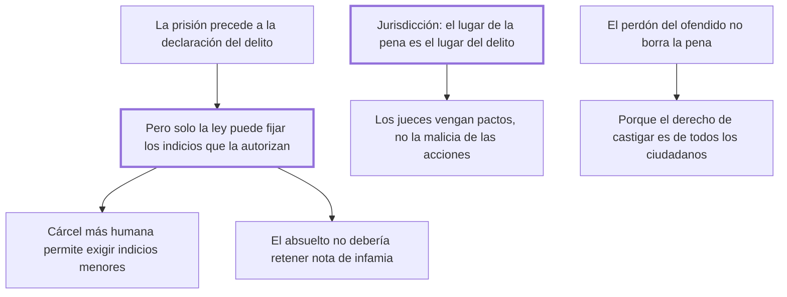

# 29. De la prisión

## 1. Idea principal

Solo la ley, y nunca el juez, puede fijar los indicios que autorizan encarcelar; el lugar de la pena es el lugar del delito; y el perdón del ofendido no borra la pena, porque el derecho de castigar es de todos.

Contesta cuándo puede el Estado encerrar a alguien antes de juzgarlo, y hasta dónde llega su jurisdicción. Reúne tres cuestiones que hoy se estudian por separado.

## 2. Lo esencial del capítulo

El primer problema es el arbitrio: dejar al magistrado la facultad de encarcelar le permite quitar la libertad a un enemigo con pretextos frívolos y dejar libre a un amigo pese a los indicios más fuertes (cap. 29). Beccaria reconoce el rasgo peculiar de esta pena —es la única que por necesidad precede a la declaración del delito—, pero eso no le quita lo esencial: que solo la ley determine los casos, con una lista previa de indicios suficientes que va de la fama pública al cuerpo del delito. Lo decisivo es quién los fija, porque los decretos de los jueces "siempre se oponen a la libertad política" si no aplican una máxima general del código; y a medida que se moderen las penas y se quiten de las cárceles la suciedad y el hambre, la ley podrá contentarse con indicios menores. De ahí que la infamia del absuelto no debería existir, y prueba que depende del modo y no de la cosa el que las prisiones militares no infamen como las judiciales.

El segundo tema es la jurisdicción. Contra quienes creen que una crueldad cometida en Constantinopla puede castigarse en París, responde que los jueces no son vengadores de la sensibilidad de los hombres sino "de los pactos que los ligan entre sí"; tratar el carácter de súbdito como indeleble sería peor que la esclavitud. La regla queda: el lugar de la pena es el lugar del delito, y al malvado que no rompió los pactos de una sociedad de la que no era miembro se lo puede temer y excluir, pero no castigar. El cierre reúne otras dos observaciones: castigar los delitos leves en la oscuridad de una prisión o en una esclavitud distante desperdicia el caso más útil, porque son los delitos vecinos al ánimo los que impresionan y apartan también de los graves; y liberar de la pena por la remisión del ofendido es humano pero contrario al bien público, porque el derecho de hacer castigar no es de uno solo sino de todos.

## 3. Mapa

## 4. Vocabulario clave

- **Prisión** — única pena que por necesidad precede a la declaración del delito, y que por eso exige indicios fijados por ley.
- **Indicio suficiente** — el hecho que la ley señala como bastante para encarcelar: fama pública, fuga, confesión extrajudicial, cuerpo del delito.
- **Lugar del delito** — el único lugar donde puede imponerse la pena, porque allí están los pactos violados.
- **Remisión del ofendido** — el perdón de la víctima, que alcanza a su porción del derecho pero no a la de los demás.

## 5. Distinciones que se confunden

- **Vengar pactos vs. vengar la malicia de las acciones** — los jueces hacen lo primero; lo segundo justificaría castigar cualquier crueldad en cualquier parte.
  - Se confunden porque: en el caso normal el hecho es malo y además rompe el pacto local, así que las dos razones coinciden.
  - Criterio para decidir: ¿el autor era miembro de esta sociedad al obrar? Si no, cabe temerlo y excluirlo, no castigarlo.
  - Dónde se cae: se justifica juzgar un hecho ajeno por su atrocidad, que es la razón abstracta que el capítulo rechaza.

- **Renunciar a la propia porción vs. anular el derecho de todos** — el ofendido puede perdonar el resarcimiento, no la necesidad del ejemplo.
  - Se confunden porque: la víctima es quien sufrió el daño y parece la dueña del reclamo.
  - Criterio para decidir: ¿de quién es el derecho de hacer castigar? De todos los ciudadanos o del soberano.
  - Dónde se cae: se extingue la pena por acuerdo entre las partes, acto humano pero contrario al bien público según el capítulo.

## 6. Autoevaluación

1. Ubique la prisión dentro del sistema de penas del libro: ¿qué la distingue de todas las demás y qué exigencias le impone Beccaria por eso?
2. Una víctima perdona a su agresor y pide que la causa se archive. ¿Qué contesta el cap. 29 y qué le queda a la víctima?

--- No mires esto hasta responder ---

1. La prisión es la única pena que por necesidad precede a la declaración del delito: se aplica antes de saber si hay reo, y esa anomalía es lo que la define (cap. 29). De ahí la exigencia central, que solo la ley —nunca el juez— determine los casos en que se encarcela, con una lista previa de indicios suficientes: la fama pública, la fuga, la confesión extrajudicial, la de un cómplice, las amenazas y el cuerpo del delito. La razón es que los decretos de los jueces siempre se oponen a la libertad política si no aplican una máxima general del código, porque permiten encerrar a un enemigo con pretextos frívolos y soltar a un amigo pese a los indicios más fuertes. Beccaria agrega dos cosas: el umbral de indicios puede bajar a medida que se moderen las penas y se quiten de las cárceles la suciedad y el hambre, y el absuelto no debería conservar nota de infamia, como prueban las prisiones militares, que no infaman.
2. Que la remisión no extingue la pena, aunque sea humana y conforme a la beneficencia: el derecho de hacer castigar no es de uno solo sino de todos los ciudadanos o del soberano, así que perdonar en nombre propio y disponer de la necesidad del ejemplo son cosas distintas. A la víctima le quedan la iniciativa de la acusación y el resarcimiento, que sí puede perdonar. Beccaria no condena el impulso: lo excluye como efecto jurídico.

## Flashcards

Qué rasgo distingue a la prisión de las demás penas, y quién debe fijar sus indicios | Que por necesidad precede a la declaración del delito, y por eso los fija la ley y nunca los jueces
Qué indicios enumera el cap. 29 como suficientes | La fama pública, la fuga, la confesión extrajudicial, la de un cómplice, las amenazas y el cuerpo del delito
Dónde debe imponerse la pena de un delito, y con qué razón | En el lugar del delito: los jueces son vengadores de los pactos, no de la malicia de las acciones
Por qué el perdón del ofendido no extingue la pena | Porque el derecho de hacer castigar es de todos los ciudadanos o del soberano
