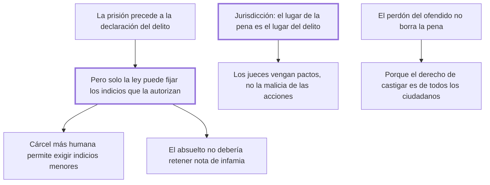

# 29. De la prisión

## 1. Idea principal

Solo la ley, y nunca el juez, puede fijar los indicios que autorizan encarcelar; el lugar de la pena es el lugar del delito; y el perdón del ofendido no borra la pena, porque el derecho de castigar es de todos.

Contesta cuándo puede el Estado encerrar a alguien antes de juzgarlo, y hasta dónde llega su jurisdicción. Reúne tres cuestiones que hoy se estudian por separado.

## 2. Lo esencial del capítulo

El primer problema es el arbitrio. Dejar al magistrado la facultad de encarcelar le permite quitar la libertad a un enemigo con pretextos frívolos y dejar libre a un amigo pese a los indicios más fuertes (cap. 29). Beccaria reconoce el rasgo peculiar de esta pena: es la única que por necesidad precede a la declaración del delito. Pero eso no le quita lo esencial, que solo la ley determine los casos. Y da la lista de indicios suficientes: la fama pública, la fuga, la confesión extrajudicial, la de un cómplice, las amenazas y el cuerpo del delito. Lo decisivo es quién los fija: los decretos de los jueces "siempre se oponen a la libertad política" si no aplican una máxima general del código. Y agrega una relación que conviene ver: a medida que se moderen las penas y se quiten de las cárceles la suciedad y el hambre, la ley podrá pedir indicios menores.

De ahí pasa a la infamia del absuelto, que no debería existir: cuántos romanos acusados de gravísimos delitos fueron después honrados con magistraturas. Da cuatro causas: prevalece la idea de la fuerza sobre la de la justicia; se arroja a acusados y convictos "confundidos en una misma caverna"; la prisión es más castigo que custodia; y la fuerza que defiende las leyes está separada de la que defiende el trono. Su prueba de que la infamia depende del modo y no de la cosa es que las prisiones militares no infaman como las judiciales.

El segundo tema es la jurisdicción. Contra quienes sostienen que un delito puede castigarse en cualquier parte, responde que eso trata el carácter de súbdito como indeleble y peor que el de esclavo. Contra quienes creen que una crueldad cometida en Constantinopla puede castigarse en París, responde que los jueces no son vengadores de la sensibilidad de los hombres sino "de los pactos que los ligan entre sí". La regla queda: **el lugar de la pena es el lugar del delito**. Al malvado que no rompió los pactos de una sociedad de la que no era miembro se lo puede temer y excluir, pero no castigar.

El cierre reúne dos observaciones. Una sobre los reos de delitos leves, castigados en la oscuridad de una prisión o en una esclavitud distante: la pena pública de una gran maldad se percibe como ajena e imposible, mientras que la de los delitos ligeros —a los que el ánimo está más vecino— impresiona y aparta también de los graves. La otra es sobre el perdón del ofendido: liberar de la pena por su remisión es humano pero contrario al bien público, porque **el derecho de hacer castigar no es de uno solo sino de todos**.

## 3. Mapa

## 4. Qué releer del original

1. (cap. 29) La lista de indicios que autorizan la prisión — conviene tenerla completa, porque el punto del capítulo es que sea la ley y no el juez quien la fije.
2. (cap. 29) "vengadoras de los pactos, no de la malicia intrínseca de las acciones" — es la clave de todo el argumento sobre jurisdicción.
3. (cap. 29) Las cuatro causas de que el absuelto quede infamado — están enumeradas seguidas y cada una identifica un defecto distinto del sistema.

## 5. Vocabulario clave

- **Prisión** — única pena que por necesidad precede a la declaración del delito, y que por eso exige indicios fijados por ley.
- **Indicio suficiente** — el hecho que la ley señala como bastante para encarcelar: fama pública, fuga, confesión extrajudicial, cuerpo del delito.
- **Lugar del delito** — el único lugar donde puede imponerse la pena, porque allí están los pactos violados.
- **Remisión del ofendido** — el perdón de la víctima, que alcanza a su porción del derecho pero no a la de los demás.

## 6. Distinciones que se confunden

- **Vengar pactos vs. vengar la malicia de las acciones** — los jueces hacen lo primero; lo segundo justificaría castigar cualquier crueldad en cualquier parte.
  - Se confunden porque: en el caso normal el hecho es malo y además rompe el pacto local, así que las dos razones coinciden.
  - Criterio para decidir: ¿el autor era miembro de esta sociedad al obrar? Si no, cabe temerlo y excluirlo, no castigarlo.
  - Dónde se cae: se justifica juzgar un hecho ajeno por su atrocidad, que es la razón abstracta que el capítulo rechaza.

- **Renunciar a la propia porción vs. anular el derecho de todos** — el ofendido puede perdonar el resarcimiento, no la necesidad del ejemplo.
  - Se confunden porque: la víctima es quien sufrió el daño y parece la dueña del reclamo.
  - Criterio para decidir: ¿de quién es el derecho de hacer castigar? De todos los ciudadanos o del soberano.
  - Dónde se cae: se extingue la pena por acuerdo entre las partes, acto humano pero contrario al bien público según el capítulo.

## 7. Autoevaluación

1. ¿Por qué la moderación de las penas y la limpieza de las cárceles permitirían encarcelar con indicios menores?
2. Beccaria niega que un crimen cometido en Constantinopla pueda castigarse en París. ¿Qué concepto de delito hay detrás?
3. ¿Por qué es contraproducente castigar los delitos leves en la oscuridad de la prisión o en una esclavitud lejana?
4. El perdón del ofendido no extingue la pena. ¿Qué queda del papel de la víctima?

--- No mires esto hasta responder ---

1. Porque lo que hace grave un encarcelamiento erróneo es el mal que produce. Si la prisión es limpia, corta y no infamante, el costo de encerrar a quien luego resulta inocente baja, y la ley puede permitirse un umbral menor. Al revés, mientras la cárcel sea suciedad, hambre e infamia, el umbral tiene que ser alto (cap. 29).
2. Uno enteramente contractual: el delito es la violación de un pacto, no una acción mala en sí. Por eso los jueces no son vengadores de la sensibilidad humana, y quien no era miembro de esa sociedad no rompió nada que ella pueda castigar. Puede temerlo y excluirlo por la fuerza, que es otra cosa.
3. Porque la pena solo previene si el público la ve y la siente cercana. La pena pública de una gran maldad se percibe como ajena e imposible; la de un delito ligero, al que el ánimo está más vecino, impresiona y aparta también de los graves. Castigar en la oscuridad o a distancia desperdicia justamente el caso más útil.
4. Le queda el resarcimiento, que sí puede perdonar, y la iniciativa de la acusación. Lo que no puede es disponer de la necesidad del ejemplo, que pertenece a todos. Beccaria reconoce que la remisión es conforme a la beneficencia, así que no la condena como impulso: la excluye como efecto jurídico.

## Flashcards

Qué rasgo distingue a la prisión de las demás penas | Que por necesidad precede a la declaración del delito
Quién debe fijar los indicios que autorizan encarcelar | La ley, nunca los jueces
Qué indicios enumera el cap. 29 como suficientes | La fama pública, la fuga, la confesión extrajudicial, la de un cómplice, las amenazas y el cuerpo del delito
Cuándo podrán las leyes contentarse con indicios menores | Cuando las penas se moderen y se quiten de las cárceles la suciedad y el hambre
Por qué las prisiones militares infaman menos que las judiciales | Porque la infamia vulgar se fija más en el modo que en la cosa
Dónde debe imponerse la pena de un delito | En el lugar del delito
De qué son vengadores los jueces según Beccaria | De los pactos que ligan a los hombres, no de la malicia intrínseca de las acciones
Por qué el perdón del ofendido no extingue la pena | Porque el derecho de hacer castigar es de todos los ciudadanos o del soberano
